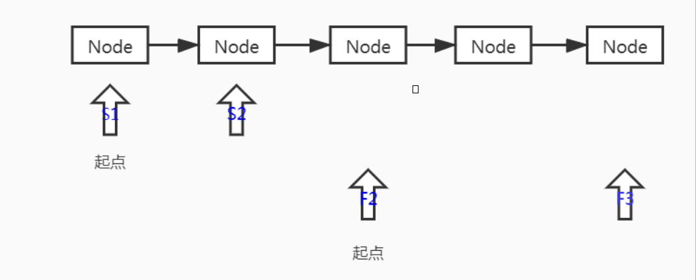

## 快慢指针

快慢指针中的快慢指的是移动的步长，即每次向前移动速度的快慢。例如可以让快指针每次沿链表向前移动2，慢指针每次向前移动1次。

### 快慢指针的应用

以下为基础代码

```java
  // 基础代码
  public static class SingleLinkedList {
    private Node head = null;

    class Node {
      private Node next;
      private Double data;

      public Node(Double data) {
        this.data = data;
      }
    }

    public void addNode(Double data) {
      if (head == null) {
        head = new Node(data);
        return;
      }
      Node temp = head;
      while (temp.next != null) {
        temp = temp.next;
      }
      temp.next = new Node(data);
    }

    public void makeLoop(){
      if (head == null) {
        return;
      }
      Node temp = head;
      while (temp.next != null) {
        temp = temp.next;
      }
      temp.next = head;
    }
 
  }
```

#### 判断单链表是否为循环链表

原理：由于快指针比慢指针总是快，所以如果单链表无循环，则快指针先跑到尾部，如果单链表有循环，则快指针总会追上慢指针。

```java
    public boolean hasLoop() {
      Node fast = head, slow = head;
      while (fast != null && fast.next != null) {
        fast = fast.next.next;
        slow = slow.next;
        if (slow.equals(fast)) {
          return true;
        }
      }
      return false;
    }
```

#### 在有序链表中寻找中位数

原理：利用快慢指针的特性，设定慢指针步长为2，慢指针步长为1，这样，当快指针走到尾部的时候，慢指针正好走到中部。此处需要注意的是，单链表长度的奇偶情况。

下面我们以图来表示下奇偶情况：

第一种情况，同时从Head节点起步


第二种情况，快指针从第三个节点起步




代码实现：

```java
    public Double findMiddle() {
      if (head == null) {
        return null;
      }
      if (head.next == null) {
        return head.data;
      }
      Node slow = head, fast = head.next.next;
      while (fast != null && fast.next != null) {
        slow = slow.next;
        fast = fast.next.next;
      }
      if (fast == null) {
        return (slow.data + slow.next.data) / 2;
      }
      return slow.next.data;
    }
```


附件

测试代码：

```java
    SingleLinkedList singleLinkedList = new SingleLinkedList();
    singleLinkedList.addNode(1.0);
    singleLinkedList.addNode(2.0);
    singleLinkedList.addNode(3.0);
    singleLinkedList.addNode(4.0);
    singleLinkedList.addNode(5.0);
    System.out.println("findMiddle:" + singleLinkedList.findMiddle());
    System.out.println("hasLoop:" + singleLinkedList.hasLoop());
    singleLinkedList.makeCircle();
    System.out.println("hasLoop:" + singleLinkedList.hasLoop());
```

