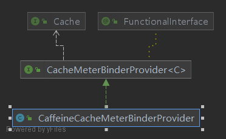
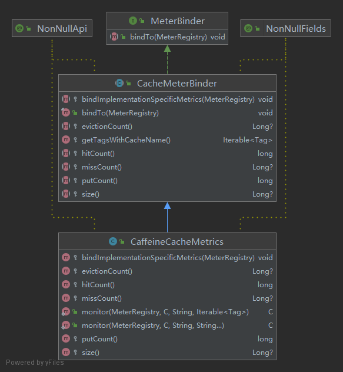

[TOC]


# Caffeine

## Caches

### 介绍

各位移步项目Github，查阅即可，有中文版和英文版。

> Github：https://github.com/ben-manes/caffeine/wiki

## 实现

### SpringBoot整合

#### 自动配置整合

添加依赖：

```xml
<?xml version="1.0" encoding="UTF-8"?>
<project xmlns="http://maven.apache.org/POM/4.0.0" xmlns:xsi="http://www.w3.org/2001/XMLSchema-instance"
         xsi:schemaLocation="http://maven.apache.org/POM/4.0.0 https://maven.apache.org/xsd/maven-4.0.0.xsd">
    <modelVersion>4.0.0</modelVersion>
    <parent>
        <groupId>org.springframework.boot</groupId>
        <artifactId>spring-boot-starter-parent</artifactId>
        <version>2.6.3</version>
        <relativePath/> 
    </parent>
   
     <!-- ... --> 

    <dependencies>
        <dependency>
            <groupId>org.springframework.boot</groupId>
            <artifactId>spring-boot-starter-web</artifactId>
        </dependency>
        <!-- Cache -->
        <dependency>
            <groupId>org.springframework.boot</groupId>
            <artifactId>spring-boot-starter-cache</artifactId>
        </dependency>
        <dependency>
            <groupId>com.github.ben-manes.caffeine</groupId>
            <artifactId>caffeine</artifactId>
            <version>2.9.3</version>
        </dependency>
    </dependencies>

     <!-- ... --> 

</project>

```

启动类加上`@EnableCaching`注解，此注解的含义是开启Cache相关的注解：

```java
import org.springframework.boot.SpringApplication;
import org.springframework.boot.autoconfigure.SpringBootApplication;
import org.springframework.cache.annotation.EnableCaching;

@EnableCaching
@SpringBootApplication
public class CacheCaffeineApplication {

  public static void main(String[] args) {
    SpringApplication.run(CacheCaffeineApplication.class, args);
  }
}
```

配置文件:

```yml
spring:
  cache:
    caffeine:
      # 提供的是示例参数配置，具体参数含义可以参照Caffeine官方文档
      spec: initialCapacity=50,maximumSize=500,expireAfterAccess=10s,recordStats

```

到此，自动配置整合完毕，后续使用如下：

```java
  @CachePut(cacheNames = "userInfo", key = "#userInfo.id")
  public UserInfo addUserInfo(UserInfo userInfo) {
    // ...
  }

  @Cacheable(cacheNames = "userInfo", key = "#id")
  public UserInfo getById(Integer id) {
    // ...
  }

  @CacheEvict(cacheNames = "userInfo", key = "#id")
  public void deleteById(Integer id) {
    // ...
  }
```

#### 手动配置整合

添加依赖：

```xml
<?xml version="1.0" encoding="UTF-8"?>
<project xmlns="http://maven.apache.org/POM/4.0.0" xmlns:xsi="http://www.w3.org/2001/XMLSchema-instance"
         xsi:schemaLocation="http://maven.apache.org/POM/4.0.0 https://maven.apache.org/xsd/maven-4.0.0.xsd">
    <modelVersion>4.0.0</modelVersion>
    <parent>
        <groupId>org.springframework.boot</groupId>
        <artifactId>spring-boot-starter-parent</artifactId>
        <version>2.6.3</version>
        <relativePath/> 
    </parent>
   
     <!-- ... --> 

    <dependencies>
        <dependency>
            <groupId>org.springframework.boot</groupId>
            <artifactId>spring-boot-starter-web</artifactId>
        </dependency>
        <!-- Cache -->
        <dependency>
            <groupId>com.github.ben-manes.caffeine</groupId>
            <artifactId>caffeine</artifactId>
            <version>2.9.3</version>
        </dependency>
    </dependencies>

     <!-- ... --> 

</project>

```

缓存配置类：

```java
import com.github.benmanes.caffeine.cache.Cache;
import com.github.benmanes.caffeine.cache.Caffeine;
import org.springframework.context.annotation.Bean;
import org.springframework.context.annotation.Configuration;
import java.util.concurrent.TimeUnit;

@Configuration
public class CacheConfig {

  @Bean
  public Cache<String, Object> caffeineCache() {
    return Caffeine.newBuilder()
        .initialCapacity(50)
        .maximumSize(500)
        .recordStats()
        .expireAfterAccess(10, TimeUnit.SECONDS)
        .build();
  }

}
```


到此，手动配置整合完毕，后续使用如下：

```java
  @Resource Cache<String, Object> caffeineCache;

  public void addUserInfo(UserInfo userInfo) {
    caffeineCache.put(String.valueOf(userInfo.getId()), userInfo);
    // ...
  }

  public UserInfo getByName(Integer id) {
    UserInfo userInfo = (UserInfo) caffeineCache.asMap().get(String.valueOf(id));
    // ...
  }

  public void deleteById(Integer id) {
    caffeineCache.asMap().remove(String.valueOf(id));
    // ...
  }
```

### SpringBoot健康检查

官方文档：https://docs.spring.io/spring-boot/docs/2.5.4/reference/htmlsingle/#actuator.metrics.supported.cache

**重要**：下方是官方的原话，大致的意思就是，Caffeine Metrics 已经支持自动配置，但是只能在启动的时候绑定。如果有一些Cache是动态生成的，则需要手动结合CacheMetricsRegistrar实现。

> ##### Cache Metrics
>
> Auto-configuration enables the instrumentation of all available `Cache`s on startup with metrics prefixed with `cache`. Cache instrumentation is standardized for a basic set of metrics. Additional, cache-specific metrics are also available.
>
> The following cache libraries are supported:
>
> - Caffeine
> - EhCache 2
> - Hazelcast
> - Any compliant JCache (JSR-107) implementation
> - Redis
>
> Metrics are tagged by the name of the cache and by the name of the `CacheManager` that is derived from the bean name.
>
> 
>
> **Note**
>
> > Only caches that are configured on startup are bound to the registry. For caches not defined in the cache’s configuration, e.g. caches created on-the-fly or programmatically after the startup phase, an explicit registration is required. A `CacheMetricsRegistrar` bean is made available to make that process easier.

#### SpringBoot实现

版本：

```xml
<dependency>
  <groupId>org.springframework.boot</groupId>
  <artifactId>spring-boot-starter-actuator</artifactId>
  <version>2.5.4</version>
</dependency>
```

自动配置：

`MetricsAutoConfiguration`

Cache相关实现：

`CacheMetricsRegistrarConfiguration`

`CacheMeterBinderProvidersConfiguration`
`CaffeineCacheMeterBinderProvider`


我们直接看Registrar是如何注册Cache监控指标的，入口：`org.springframework.boot.actuate.autoconfigure.metrics.cache.CacheMetricsRegistrarConfiguration`

核心方法：

```java
private final CacheMetricsRegistrar cacheMetricsRegistrar;

private void bindCachesToRegistry() {
  this.cacheManagers.forEach(this::bindCacheManagerToRegistry);
}

private void bindCacheManagerToRegistry(String beanName, CacheManager cacheManager) {
  cacheManager.getCacheNames()
    .forEach((cacheName) -> bindCacheToRegistry(beanName, cacheManager.getCache(cacheName)));
}

private void bindCacheToRegistry(String beanName, Cache cache) {
  Tag cacheManagerTag = Tag.of("cacheManager", getCacheManagerName(beanName));
  // 此处进行Cache绑定到MetricsRegistrar
  this.cacheMetricsRegistrar.bindCacheToRegistry(cache, cacheManagerTag);
}
```

MetricsRegistrar：`org.springframework.boot.actuate.metrics.cache.CacheMetricsRegistrar`

核心方法：

```java
/**
 * Attempt to bind the specified {@link Cache} to the registry. Return {@code true} if
 * the cache is supported and was bound to the registry, {@code false} otherwise.
 * @param cache the cache to handle
 * @param tags the tags to associate with the metrics of that cache
 * @return {@code true} if the {@code cache} is supported and was registered
 */
public boolean bindCacheToRegistry(Cache cache, Tag... tags) {
  // 此处完成Cache绑定到Registry的功能，即 [Micrometer]（https://micrometer.io/）的Api使用方式
  MeterBinder meterBinder = getMeterBinder(unwrapIfNecessary(cache), Tags.of(tags));
  if (meterBinder != null) {
    meterBinder.bindTo(this.registry);
    return true;
  }
  return false;
}

@SuppressWarnings({ "unchecked" })
private MeterBinder getMeterBinder(Cache cache, Tags tags) {
  // 自定义Tags
  Tags cacheTags = tags.and(getAdditionalTags(cache));
  // 调用binderProviders#getMeterBinder获取MeterBinder
  return LambdaSafe.callbacks(CacheMeterBinderProvider.class, this.binderProviders, cache)
    .withLogger(CacheMetricsRegistrar.class)
    .invokeAnd((binderProvider) -> binderProvider.getMeterBinder(cache, cacheTags)).filter(Objects::nonNull)
    .findFirst().orElse(null);
}

/**
 * Return additional {@link Tag tags} to be associated with the given {@link Cache}.
 * @param cache the cache
 * @return a list of additional tags to associate to that {@code cache}.
 */
protected Iterable<Tag> getAdditionalTags(Cache cache) {
  // 自定义标签
  return Tags.of("name", cache.getName());
}

private Cache unwrapIfNecessary(Cache cache) {
  // 针对事务感知缓存装饰器做处理
  if (ClassUtils.isPresent("org.springframework.cache.transaction.TransactionAwareCacheDecorator",
                           getClass().getClassLoader())) {
    return TransactionAwareCacheDecoratorHandler.unwrapIfNecessary(cache);
  }
  return cache;
}

private static class TransactionAwareCacheDecoratorHandler {

  private static Cache unwrapIfNecessary(Cache cache) {
    try {
      if (cache instanceof TransactionAwareCacheDecorator) {
        // 事务感知缓存装饰器，主要将Cache包了一层
        return ((TransactionAwareCacheDecorator) cache).getTargetCache();
      }
    }
    catch (NoClassDefFoundError ex) {
      // Ignore
    }
    return cache;
  }

}
```

CacheMeterBinderProvider：`org.springframework.boot.actuate.metrics.cache.CaffeineCacheMeterBinderProvider`，实现了接口`org.springframework.boot.actuate.metrics.cache.CacheMeterBinderProvider`，下方为两者的类图：




核心方法：

```java
// CaffeineCacheMeterBinderProvider.class
@Override
public MeterBinder getMeterBinder(CaffeineCache cache, Iterable<Tag> tags) {
  // 这里直接依赖Micrometer中的Metrics实现
  return new CaffeineCacheMetrics(cache.getNativeCache(), cache.getName(), tags);
}
```

#### Micrometer实现

版本：

```xml
<!-- micrometer -->
<dependency>
  <groupId>io.micrometer</groupId>
  <artifactId>micrometer-registry-prometheus</artifactId>
  <version>1.7.3</version>
</dependency>
```

MeterBinder：`io.micrometer.core.instrument.binder.cache.CaffeineCacheMetrics`，继承`io.micrometer.core.instrument.binder.cache.CacheMeterBinder`，下方为两者的类图：





核心方法：

```java
// CacheMeterBinder.class
public final void bindTo(MeterRegistry registry) {
  // 显而易见，这里是绑定各种指标
  if (this.size() != null) {
    Gauge.builder("cache.size", this.cache.get(), (c) -> {
      Long size = this.size();
      return size == null ? 0.0D : (double)size;
    }).tags(this.tags).description("The number of entries in this cache. This may be an approximation, depending on the type of cache.").register(registry);
  }

  if (this.missCount() != null) {
    FunctionCounter.builder("cache.gets", this.cache.get(), (c) -> {
      Long misses = this.missCount();
      return misses == null ? 0.0D : (double)misses;
    }).tags(this.tags).tag("result", "miss").description("the number of times cache lookup methods have returned an uncached (newly loaded) value, or null").register(registry);
  }

  FunctionCounter.builder("cache.gets", this.cache.get(), (c) -> {
    return (double)this.hitCount();
  }).tags(this.tags).tag("result", "hit").description("The number of times cache lookup methods have returned a cached value.").register(registry);
  FunctionCounter.builder("cache.puts", this.cache.get(), (c) -> {
    return (double)this.putCount();
  }).tags(this.tags).description("The number of entries added to the cache").register(registry);
  if (this.evictionCount() != null) {
    FunctionCounter.builder("cache.evictions", this.cache.get(), (c) -> {
      Long evictions = this.evictionCount();
      return evictions == null ? 0.0D : (double)evictions;
    }).tags(this.tags).description("cache evictions").register(registry);
  }

  this.bindImplementationSpecificMetrics(registry);
}

// CaffeineCacheMetrics.class
protected void bindImplementationSpecificMetrics(MeterRegistry registry) {
  // 这里是一些Caffeine提供的额外指标
  FunctionCounter.builder("cache.eviction.weight", this.cache, (c) -> {
    return (double)c.stats().evictionWeight();
  }).tags(this.getTagsWithCacheName()).description("The sum of weights of evicted entries. This total does not include manual invalidations.").register(registry);
  if (this.cache instanceof LoadingCache) {
    TimeGauge.builder("cache.load.duration", this.cache, TimeUnit.NANOSECONDS, (c) -> {
      return (double)c.stats().totalLoadTime();
    }).tags(this.getTagsWithCacheName()).description("The time the cache has spent loading new values").register(registry);
    FunctionCounter.builder("cache.load", this.cache, (c) -> {
      return (double)c.stats().loadSuccessCount();
    }).tags(this.getTagsWithCacheName()).tags(new String[]{"result", "success"}).description("The number of times cache lookup methods have successfully loaded a new value").register(registry);
    FunctionCounter.builder("cache.load", this.cache, (c) -> {
      return (double)c.stats().loadFailureCount();
    }).tags(this.getTagsWithCacheName()).tags(new String[]{"result", "failure"}).description("The number of times {@link Cache} lookup methods failed to load a new value, either because no value was found or an exception was thrown while loading").register(registry);
  }

}
```


## 原理

### 淘汰策略

#### W-Tiny LFU


#### Segmented LRU (SLRU)

从维基百科摘抄：

> SLRU cache is divided into two segments, a probationary segment and a protected segment. Lines in each segment are ordered from the most to the least recently accessed. Data from misses is added to the cache at the most recently accessed end of the probationary segment. Hits are removed from wherever they currently reside and added to the most recently accessed end of the protected segment. Lines in the protected segment have thus been accessed at least twice. The protected segment is finite, so migration of a line from the probationary segment to the protected segment may force the migration of the LRU line in the protected segment to the most recently used (MRU) end of the probationary segment, giving this line another chance to be accessed before being replaced. The size limit on the protected segment is an SLRU parameter that varies according to the I/O workload patterns. Whenever data must be discarded from the cache, lines are obtained from the LRU end of the probationary segment
> SLRU缓存分为两个段，一个试用段和一个保护段。 每个段中的行按最近访问次数最多到最少访问的顺序排列。 未命中的数据被添加到试用段最近访问端的缓存中。 命中将从它们当前所在的任何位置删除，并添加到受保护段的最近访问端。 因此，受保护段中的行至少被访问了两次。 受保护段是有限的，因此将一条线路从试用段迁移到受保护段可能会迫使受保护段中的 LRU 线路迁移到试用段的最近使用 (MRU) 端，从而给这条线路另一个机会 在被替换之前访问。 受保护段的大小限制是根据 I/O 工作负载模式而变化的 SLRU 参数。 每当必须从缓存中丢弃数据时，都会从试用段的 LRU 端获取行

