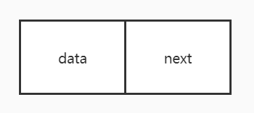

# 单链表

单链表是一种链式存取的数据结构，用一组地址任意的[存储单元](https://baike.baidu.com/item/存储单元/8727749)存放线性表中的[数据元素](https://baike.baidu.com/item/数据元素/715313)。链表中的数据是以结点来表示的，每个结点的构成：元素([数据元素](https://baike.baidu.com/item/数据元素/715313)的映象) + [指针](https://baike.baidu.com/item/指针/2878304)(指示后继元素存储位置)，元素就是存储数据的存储单元，指针就是连接每个结点的地址数据。




## 头插法

固定头部，从头部往左添加节点。

## 尾插法

固定尾部，从头部往右添加节点。

# 优缺点

## 优点

1. 适合增加、删除的场景

## 缺点

1. 查询较慢，需要从头结点或者尾节点开始遍历查询

# 实现


```java
import java.util.LinkedList;
import java.util.List;

/**
 * SingleLinkedList
 * 
 * @author atsjp
 */
public class SingleLinkedList<K> {

  private Node head = null;

  class Node {
    private Node next;
    private K k;

    public Node(K k) {
      this.k = k;
    }
  }

  public void addNode(K k) {
    if (head == null) {
      head = new Node(k);
      return;
    }
    Node temp = head;
    while (temp.next != null) {
      temp = temp.next;
    }
    temp.next = new Node(k);
  }

  public void deleteNode(K k) {
    if (head == null) {
      return;
    }
    if (k.equals(head.k)) {
      head = head.next;
      return;
    }
    Node prevNode = head, currentNode = head.next;
    while (currentNode != null) {
      if (k.equals(currentNode.k)) {
        if (currentNode.next == null) {
          prevNode.next = null;
        } else {
          prevNode.next = currentNode.next;
        }
        break;
      }
      prevNode = currentNode;
      currentNode = currentNode.next;
    }
  }

  public void deleteNodeAll(K k) {
    if (head == null) {
      return;
    }
    if (k.equals(head.k)) {
      head = head.next;
      return;
    }
    Node prevNode = head, currentNode = head.next;
    while (currentNode != null) {
      if (k.equals(currentNode.k)) {
        if (currentNode.next == null) {
          prevNode.next = null;
        } else {
          prevNode.next = currentNode.next;
          currentNode = currentNode.next;
          continue;
        }
      }
      prevNode = currentNode;
      currentNode = currentNode.next;
    }
  }

  public boolean delete(int index) {
    if (index < 0 || index > length()) {
      return false;
    }
    if (index == 0) {
      head = head.next;
      return true;
    }
    int i = 0;
    Node preNode = null;
    Node curNode = head;
    while (curNode != null) {
      if (i == index) {
        preNode.next = curNode.next;
        return true;
      }
      preNode = curNode;
      curNode = curNode.next;
      i++;
    }
    return false;
  }

  public int length() {
    int i = 0;
    Node temp = head;
    while (temp != null) {
      temp = temp.next;
      ++i;
    }
    return i;
  }

  public void reversal() {
    // 用于指向反转链表
    Node pReversedHead = head;
    // 用于指向当前处理的节点
    Node pNode = head;
    // 用于暂存已经处理过的上一节点
    Node pPrev = null;
    while (pNode != null) {
      // 暂存next
      Node pNext = pNode.next;
      // next为空，即表示到达了链表最后一个节点
      if (pNext == null) {
        // pNode即是反转链表的首节点
        pReversedHead = pNode;
      }
      // 将上一个节点 赋值给 反转链表的下一个节点
      pNode.next = pPrev;
      // 将当前指向节点 赋值给 上一个节点
      pPrev = pNode;
      // 将下一个节点 赋值给 当前指向节点
      pNode = pNext;
    }
    this.head = pReversedHead;
  }

  public List<K> findMiddle1() {
    if (head == null) {
      return null;
    }
    List<K> kList = new LinkedList<>();
    if (head.next == null) {
      kList.add(head.k);
      return kList;
    }
    Node preNode = head, slow = head, fast = head;
    while (fast != null && fast.next != null) {
      preNode = slow;
      slow = slow.next;
      fast = fast.next.next;
    }
    if (fast == null) {
      kList.add(preNode.k);
    }
    kList.add(slow.k);
    return kList;
  }

  public List<K> findMiddle2() {
    if (head == null) {
      return null;
    }
    if (head.next == null) {
      List<K> kList = new LinkedList<>();
      kList.add(head.k);
      return kList;
    }
    Node slow = head, fast = head.next.next;
    while (fast != null && fast.next != null) {
      slow = slow.next;
      fast = fast.next.next;
    }
    List<K> kList = new LinkedList<>();
    if (fast == null) {
      kList.add(slow.k);
    }
    kList.add(slow.next.k);
    return kList;
  }

  public boolean hasLoop() {
    Node fast = head, slow = head;
    while (fast != null && fast.next != null) {
      fast = fast.next.next;
      slow = slow.next;
      if (slow.equals(fast)) {
        return true;
      }
    }
    return false;
  }

  public String toString() {
    StringBuilder temp = new StringBuilder();
    temp.append("[");
    Node tmp = head;
    while (tmp != null) {
      temp.append(tmp.k).append(",");
      tmp = tmp.next;
    }
    if (temp.length() >= 3) {
      temp.deleteCharAt(temp.length() - 1);
    }
    temp.append("]");
    return temp.toString();
  }

}

```

测试代码：

```java
 public static void main(String[] args) {
    SingleLinkedList<Integer> singleLinkedList = new SingleLinkedList<>();
    singleLinkedList.addNode(1);
    singleLinkedList.addNode(2);
    singleLinkedList.addNode(2);
    singleLinkedList.addNode(3);
    singleLinkedList.addNode(3);
    singleLinkedList.addNode(4);
    singleLinkedList.addNode(5);
    singleLinkedList.addNode(5);
    singleLinkedList.addNode(6);

    System.out.println("toString:" + singleLinkedList.toString());
    System.out.println("length:" + singleLinkedList.length());
    System.out.println("findMiddle1:" + singleLinkedList.findMiddle1());
    System.out.println("findMiddle2:" + singleLinkedList.findMiddle2());
    System.out.println("hasLoop:" + singleLinkedList.hasLoop());

    singleLinkedList.reversal();
    System.out.println("reversal toString:" + singleLinkedList.toString());
    int target = 5;
    singleLinkedList.delete(target);
    System.out.println("delete index " + target + " toString:" + singleLinkedList.toString());
    target = 5;
    singleLinkedList.deleteNode(target);
    System.out.println("deleteNode " + target + " toString:" + singleLinkedList.toString());
    target = 2;
    singleLinkedList.deleteNodeAll(target);
    System.out.println("deleteNodeAll " + target + " toString:" + singleLinkedList.toString());
  }
```

