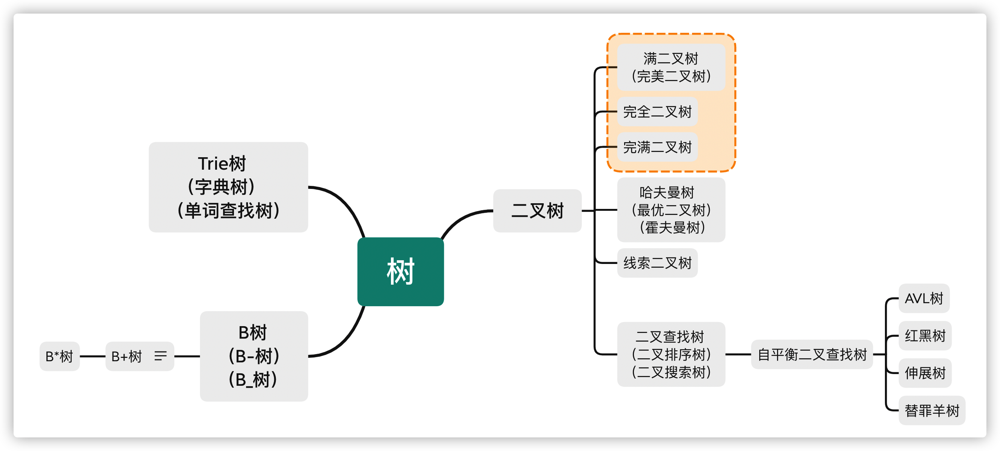
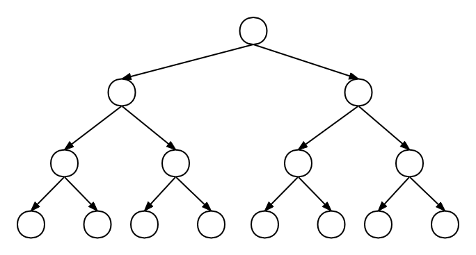
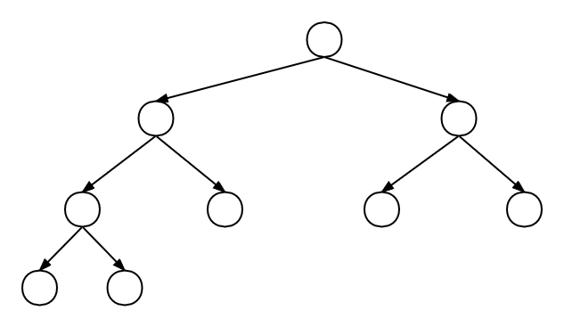
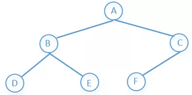
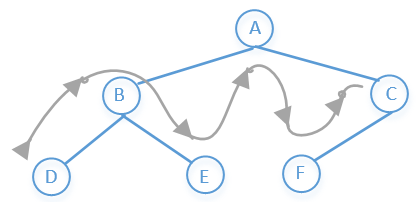
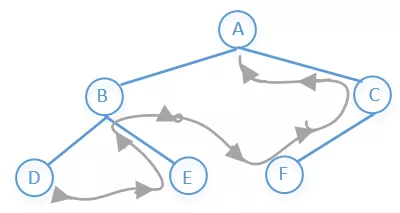
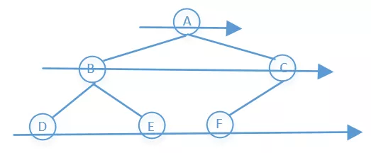
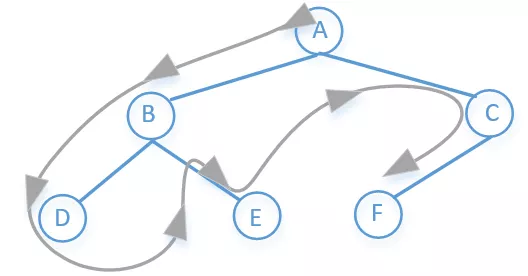

[TOC]


# Tree(树)

## 基础知识

树是一个有n个有限节点组成一个具有层次关系的集合，每个节点有0个或者多个子节点，没有父节点的节点称为根节点，也就是说除了根节点以外每个节点都有父节点，并且有且只有一个。

树的种类比较多，有二叉树，红黑树，平衡二叉树，B树，哈夫曼树，字典树等等。

### 概念定义

| Name               | Define                                                       | 名称                 | 定义                                                         |
| ------------------ | ------------------------------------------------------------ | -------------------- | ------------------------------------------------------------ |
| **Root**           | The top node in a tree.                                      | **根**               | 树的顶端节点                                                 |
| **Child**          | A node directly connected to another node when moving away from the Root. | **孩子**             | 当远离根(Root)的时候，直接连接到另外一个节点的节点被称之为孩子(Child); |
| **Parent**         | The converse notion of a child.                              | **双亲**             | 相应地，另外一个节点称为孩子(child)的双亲(parent)。          |
| **Siblings**       | A group of nodes with the same parent.                       | **兄弟**             | 具有同一个双亲(Parent)的孩子(Child)之间互称为兄弟(Sibling)。 |
| **Ancestor**       | A node reachable by repeated proceeding from child to parent. | **祖先**             | 节点的祖先(Ancestor)是从根（Root）到该节点所经分支(Branch)上的所有节点。 |
| **Descendant**     | A node reachable by repeated proceeding from parent to child. | **子孙**             | 以某节点为根的子树中的任一节点都称为该节点的子孙(后代)。     |
| **Leaf**           | A node with no children.                                     | **叶子（终端节点）** | 没有孩子的节点(也就是度为0的节点)称为叶子(Leaf)或终端节点。  |
| **Branch**         | A node with at least one child.                              | **分支(非终端节点)** | 至少有一个孩子的节点称为分支(Branch)或非终端节点。           |
| **Degree**         | The number of sub trees of a node.                           | **度**               | 节点所拥有的子树个数称为节点的度(Degree)。                   |
| **Edge**           | The connection between one node and another.                 | **边**               | 一个节点和另一个节点之间的连接被称之为边(Edge)。             |
| **Path**           | A sequence of nodes and edges connecting a node with a descendant. | **路径**             | 连接节点和其后代的节点之间的(节点,边)的序列。                |
| **Level**          | The level of a node is defined by ０ + (the number of connections between the node and the root). | **层次**             | 节点的层次(Level)从根(Root)开始定义起，根为第0层，根的孩子为第1层。以此类推，若某节点在第i层，那么其子树的根就在第i+1层。 |
| **Height of node** | The height of a node is the number of edges on the longest path between that node and a leaf. | **节点的高度**       | 节点的高度是该节点和某个叶子之间存在的最长路径上的边的个数。 |
| **Height of tree** | The height of a tree is the height of its root node.         | **树的高度**         | 树的高度是其根节点的高度。                                   |
| **Depth of node ** | The depth of a node is the number of edges from the tree's root node to the node. | **节点的深度**       | 节点的深度是从树的根节点到该节点的边的个数。 （注：树的深度指的是树中节点的最大层次。） |
| **Forest**         | A forest is a set of n ≥ 0 disjoint trees.                   | **森林**             | 森林是n(>=0)棵互不相交的树的集合。                           |
|                    |                                                              | **无序树**           | 树中任意节点的子节点之间没有顺序关系，这种树也称为自由树。   |
|                    |                                                              | **有序树**           | 树中任意节点的子节点之间有顺序关系。                         |

### 树的种类

#### 总览

下图从百度百科摘抄，可见树的种类及其多，本文将主要介绍几种常见的树。

| 名称             | 种类                                                         |
| ---------------- | :----------------------------------------------------------- |
| 二叉树           | ▪ [二叉树](https://baike.baidu.com/item/二叉树) ▪ [二叉查找树](http://baike.baidu.com/view/389459.htm)▪ [笛卡尔树](http://baike.baidu.com/view/6667519.htm)▪ [Top tree](http://baike.baidu.com/searchword/?word=Top tree&pic=1&sug=1&enc=utf8)▪ [T树](http://baike.baidu.com/searchword/?word=T树&pic=1&sug=1&enc=utf8) |
| 自平衡二叉查找树 | ▪ [AA树](http://baike.baidu.com/searchword/?word=AA树&pic=1&sug=1&enc=utf8)▪ [AVL树](http://baike.baidu.com/view/671745.htm)▪ [红黑树](http://baike.baidu.com/view/133754.htm)▪ [伸展树](http://baike.baidu.com/view/1118088.htm)▪ [树堆](http://baike.baidu.com/searchword/?word=树堆&pic=1&sug=1&enc=utf8)▪ [节点大小平衡树](http://baike.baidu.com/searchword/?word=节点大小平衡树&pic=1&sug=1&enc=utf8) |
| B树              | ▪ [B树](http://baike.baidu.com/view/298408.htm)▪ [B+树](http://baike.baidu.com/view/1168762.htm)▪ [B*树](http://baike.baidu.com/view/1605516.htm)▪ [Bx树](http://baike.baidu.com/searchword/?word=Bx树&pic=1&sug=1&enc=utf8)▪ [UB树](http://baike.baidu.com/searchword/?word=UB树&pic=1&sug=1&enc=utf8)▪ [2-3树](http://baike.baidu.com/view/1668085.htm)▪ [2-3-4树](http://baike.baidu.com/view/1995382.htm)▪ [(a,b)-树](http://baike.baidu.com/searchword/?word=(a%2Cb)-树&pic=1&sug=1&enc=utf8)▪ [Dancing tree](http://baike.baidu.com/searchword/?word=Dancing tree&pic=1&sug=1&enc=utf8)▪ [H树](http://baike.baidu.com/searchword/?word=H树&pic=1&sug=1&enc=utf8) |
| Trie             | ▪ [前缀树](http://baike.baidu.com/searchword/?word=前缀树&pic=1&sug=1&enc=utf8)▪ [后缀树](http://baike.baidu.com/view/117678.htm)▪ [基数树](http://baike.baidu.com/searchword/?word=基数树&pic=1&sug=1&enc=utf8) |
| 非二叉树         | ▪ [Exponential tree](http://baike.baidu.com/searchword/?word=Exponential tree&pic=1&sug=1&enc=utf8)▪ [Fusion tree](http://baike.baidu.com/searchword/?word=Fusion tree&pic=1&sug=1&enc=utf8)▪ [区间树](http://baike.baidu.com/searchword/?word=区间树&pic=1&sug=1&enc=utf8)▪ [PQ tree](http://baike.baidu.com/searchword/?word=PQ tree&pic=1&sug=1&enc=utf8)▪ [Range tree](http://baike.baidu.com/searchword/?word=Range tree&pic=1&sug=1&enc=utf8)▪ [SPQR tree](http://baike.baidu.com/searchword/?word=SPQR tree&pic=1&sug=1&enc=utf8)▪ [Van Emde Boas tree](http://baike.baidu.com/searchword/?word=Van Emde Boas tree&pic=1&sug=1&enc=utf8) |
| 其他类型         | ▪ [堆](http://baike.baidu.com/view/249120.htm)▪ [散列树](http://baike.baidu.com/searchword/?word=散列树&pic=1&sug=1&enc=utf8)▪ [Finger tree](http://baike.baidu.com/searchword/?word=Finger tree&pic=1&sug=1&enc=utf8)▪ [Metric tree](http://baike.baidu.com/searchword/?word=Metric tree&pic=1&sug=1&enc=utf8)▪ [Cover tree](http://baike.baidu.com/searchword/?word=Cover tree&pic=1&sug=1&enc=utf8)▪ [BK-tree](http://baike.baidu.com/searchword/?word=BK-tree&pic=1&sug=1&enc=utf8)▪ [Doubly-chained tree](http://baike.baidu.com/searchword/?word=Doubly-chained tree&pic=1&sug=1&enc=utf8)▪ [iDistance](http://baike.baidu.com/searchword/?word=iDistance&pic=1&sug=1&enc=utf8)▪ [Link-cut tree](http://baike.baidu.com/searchword/?word=Link-cut tree&pic=1&sug=1&enc=utf8)▪ [树状数组](http://baike.baidu.com/view/1420784.htm) |



#### 二叉树（Binary Tree)

**定义**

每个节点最多含有两个子树的树称为二叉树，二叉树的子树有左右之分，次序不能颠倒。


**特点**

- 二叉树的第i层至多有2<sup>i-1</sup>（i≥1）个节点

- [深度](#deep)为k的二叉树至多有2<sup>k-1</sup>个节点

- 若在任意一棵二叉树中，有n<sub>0</sub>个叶子节点，有n<sub>2</sub>个度为2的节点，则必有n<sub>0</sub>=n<sub>2</sub>+1

- 具有n个节点的满二叉树深为log2n+1

- 若对一棵有n个节点的完全二叉树进行顺序编号（1≤i≤n），那么，对于编号为i（i≥1）的节点：

  当i=1时，该节点为根，它无双亲节点。

  当i>1时，该节点的双亲节点的编号为i/2。

  若2i≤n，则有编号为2i的左节点，否则没有左节点。

  若2i+1≤n，则有编号为2i+1的右节点，否则没有右节点。


##### 满二叉树(Perfect Binary Tree)

**定义**

除最后一层无任何子节点外，每一层上的所有节点都有两个子节点的二叉树，又称完美二叉树。


**特点**

- 一颗树深度为h，最大层数为k，深度与最大层数相同，k=h
- 叶子数为2<sup>h</sup>
- 第k层的节点数是：2<sup>k-1</sup>
- 总节点数是：2<sup>k-1</sup>，且总节点数一定是奇数



##### 完全二叉树(Complete Binary Tree)

**定义**

若设二叉树的深度为h，除第h层外，其它各层(1～h-1) 的节点数都达到最大个数，第h层所有节点从左向右连续地紧密排列，这就是完全二叉树。


##### 完满二叉树（Full/Strictly Binary Tree）

**定义**

换句话说，**所有非叶子结点的度都是2**。（只要你有孩子，你就必然是有两个孩子） 



##### 哈夫曼树（Huffman Tree）

**定义**

给定N个权值作为N个叶子结点，构造一棵二叉树，若该树的带权路径长度达到最小，称这样的二叉树为最优二叉树，也称为哈夫曼树(Huffman Tree)。哈夫曼树是带权路径长度最短的树，权值较大的结点离根较近。

##### 二叉查找树（Binary Search Tree）

**定义**

又称为是二叉排序树（Binary Sort Tree）或二叉搜索树。二叉排序树或者是一棵空树，或者是具有下列性质的二叉树：

- 若左子树不空，则左子树上所有节点的值均小于它的根节点的值；

- 若右子树不空，则右子树上所有节点的值均大于或等于它的根节点的值；

- 左、右子树也分别为二叉排序树；

- 没有键值相等的节点。


**特点**

- 对二叉查找树进行中序遍历，即可得到有序的数列。

#### 自平衡二叉查找树

##### AVL树

**定义**

具有以下性质：它是一棵空树或它的左右两个子树的高度差的绝对值不超过1，并且左右两个子树都是一棵平衡二叉树。

增加和删除可能需要通过一次或多次**树旋转**来重新平衡这个树。

这个方案很好的解决了二叉查找树退化成链表的问题，把插入，查找，删除的时间复杂度最好情况和最坏情况都维持在O(logN)。但是频繁旋转会使插入和删除牺牲掉O(logN)左右的时间，不过相对二叉查找树来说，时间上稳定了很多。


**特点**

平衡二叉树本质上还是一棵二叉查找树，它的特点是：

- 本身首先是一棵二叉查找树。
- 带有平衡条件：每个结点的左右子树的高度之差的绝对值（平衡因子）最多为1。也就是说，平衡二叉树，本质上是带了平衡功能的二叉查找树。


**使用场景**
平衡二叉树适合用于插入删除次数比较少，但查找多的情况。也在`Windows`进程地址空间管理中得到了使用旋转的目的是为了降低树的高度，使其平衡。

##### 红黑树（Red Black Tree） 

**定义**

红黑树是一种自平衡二叉查找树，是在计算机科学中用到的一种数据结构，典型的用途是实现关联数组。**它是复杂的，但它的操作有着良好的最坏情况运行时间，并且在实践中是高效的: 它可以在O(logN)时间内做查找，插入和删除，这里的n是树中元素的数目。**

红黑树和平衡二叉树一样都对插入时间、删除时间和查找时间提供了最好可能的最坏情况担保。这不只是使它们在时间敏感的应用如实时应用（real time application）中有价值，而且使它们有在提供最坏情况担保的其他数据结构中作为建造板块的价值；例如，在计算几何中使用的很多数据结构都可以基于红黑树。此外，红黑树还是2-3-4树的一种等同，它们的思想是一样的，只不过红黑树是2-3-4树用二叉树的形式表示的。


**特点**

红黑树是每个节点都带有颜色属性的二叉查找树，颜色为红色或黑色。在二叉查找树强制的一般要求以外，对于任何有效的红黑树我们增加了如下的额外要求:

- 节点是红色或黑色。

- 根是黑色。

- 所有叶子都是黑色（叶子是NIL节点）。

- 每个红色节点必须有两个黑色的子节点。(从每个叶子到根的所有路径上不能有两个连续的红色节点)

- 从任一节点到其每个叶子的所有简单路径都包含相同数目的黑色节点。


**使用场景**

红黑树多用于搜索,插入,删除操作多的情况下
- 广泛用在C++的STL中。map和set都是用红黑树实现的。

- 著名的linux进程调度Completely Fair Scheduler,用红黑树管理进程控制块。
- epoll在内核中的实现，用红黑树管理事件块
- Ninx中，用红黑树管理timer等

#### B树

**定义**

B树（B-tree）是一种自平衡的树，它是一种多路搜索树（并不是二叉的），能够用来存储排序后的数据。这种数据结构能够让查找数据、循序存取、插入数据及删除的动作，都在对数时间内完成。B树，概括来说是一个一般化的二叉查找树，可以拥有多于2个子节点。与自平衡二叉查找树不同，B-tree为系统最优化大块数据的读和写操作。B-tree算法减少定位记录时所经历的中间过程，从而加快存取速度。这种数据结构常被应用在数据库和文件系统的实作上。

##### B+树

**定义**

B+树是B树的变体，也是一种多路搜索树。B+树上的叶子结点存储关键字以及相应记录的地址，叶子结点以上各层作为索引使用。一棵m阶的B+树定义如下:

- 每个结点至多有m个子女

- 除根结点外，每个结点至少有[m/2]个子女，根结点至少有两个子女

- 有k个子女的结点必有k个关键字

B+树的查找与B树不同，当索引部分某个结点的关键字与所查的关键字相等时，并不停止查找，应继续沿着这个关键字左边的指针向下，一直查到该关键字所在的叶子结点为止。


**特点**

- 所有关键字都出现在叶子节点的链表中（稠密索引），且链表中的关键字恰好是有序的；

- 不可能在非叶子节点命中；

- 非叶子节点相当于是叶子节点的索引（稀疏索引），叶子节点相当于是存储（关键字）数据的数据层；

- 更适合文件索引系统。

##### B*树

**定义**

B*树是B+树的变体，在B+树的非根和非叶子结点再增加指向兄弟的指针；B*树定义了非叶子结点关键字个数至少为(2/3)*M，即块的最低使用率为2/3（代替B+树的1/2）。

B+树的分裂：当一个节点满时，分配一个新的节点，并将原节点中1/2的数据复制到新节点，最后在父节点中增加新节点的指针；B+树的分裂只影响原节点和父节点，而不会影响兄弟节点，所以它不需要指向兄弟的指针；

B*树的分裂：当一个节点满时，如果它的下一个兄弟节点未满，那么将一部分数据移到兄弟节点中，再在原节点插入关键字，最后修改父节点中兄弟节点的关键字（因为兄弟节点的关键字范围改变了）；如果兄弟也满了，则在原节点与兄弟节点之间增加新节点，并各复制1/3的数据到新节点，最后在父节点增加新节点的指针；

所以，B*树分配新节点的概率比B+树要低，空间使用率更高。

#### Trie树

**定义**

Tire树称为字典树，又称单词查找树，Trie树，是一种树形结构，是一种哈希树的变种。典型应用是用于统计，排序和保存大量的字符串（但不仅限于字符串），所以经常被搜索引擎系统用于文本词频统计。**它的优点是：利用字符串的公共前缀来减少查询时间，最大限度地减少无谓的字符串比较，查询效率比哈希树高。**


**特点**

- 根节点不包含字符，除根节点外每一个节点都只包含一个字符；

- 从根节点到某一节点，路径上经过的字符连接起来，为该节点对应的字符串；

- 每个节点的所有子节点包含的字符都不相同。

## 应用

树的种类实在是太多，关于树的算法题也是贼多，这一篇文章不可能全部介绍完，我们需要具体问题再具体分析。这里主要介绍的是二叉树，并且只介绍树的一些最基础的几个算法。我们先来看个图:



```java
public class TreeNode {
    public int val;
    public TreeNode left;
    public TreeNode right;

    public TreeNode(int x) {
        val = x;
    }

    public TreeNode() {
    }

    @Override
    public String toString() {
        return "[" + val + "]";
    }
}
```

#### 树遍历

##### 前序遍历

他的访问顺序是：根节点→左子树→右子树

所以上图前序遍历的结果是：A→B→D→E→C→F

访问顺序如下:


代码如下：

```java
public static void preOrder(TreeNode tree) {
    if (tree == null)
        return;
    System.out.printf(tree.val + "");
    preOrder(tree.left);
    preOrder(tree.right);
}
```

非递归的写法：

```java
public static void preOrder(TreeNode tree) {
    if (tree == null)
        return;
    Stack<TreeNode> q1 = new Stack<>();
    q1.push(tree);//压栈
    while (!q1.empty()) {
        TreeNode t1 = q1.pop();//出栈
        System.out.println(t1.val);
        if (t1.right != null) {
            q1.push(t1.right);
        }
        if (t1.left != null) {
            q1.push(t1.left);
        }
    }
}
```

##### 中序遍历

他的访问顺序是：左子树→根节点→右子树

所以上图前序遍历的结果是：D→B→E→A→F→C

访问顺序如下：



代码如下：

```java
public static void inOrderTraversal(TreeNode node) {
    if (node == null)
        return;
    inOrderTraversal(node.left);
    System.out.println(node.val);
    inOrderTraversal(node.right);
}
```

非递归的写法：

```java
public static void inOrderTraversal(TreeNode tree) {
    Stack<TreeNode> stack = new Stack<>();
    while (tree != null || !stack.isEmpty()) {
        while (tree != null) {
            stack.push(tree);
            tree = tree.left;
        }
        if (!stack.isEmpty()) {
            tree = stack.pop();
            System.out.println(tree.val);
            tree = tree.right;
        }
    }
}
```

##### 后续遍历

他的访问顺序是：左子树→右子树→根节点

所以上图前序遍历的结果是：D→E→B→F→C→A

访问顺序如下：



代码如下：

```java
public static void postOrder(TreeNode tree) {
    if (tree == null)
        return;
    postOrder(tree.left);
    postOrder(tree.right);
    System.out.println(tree.val);
}
```

非递归的写法：

```java
public static void postOrder(TreeNode tree) {
    if (tree == null)
        return;
    Stack<TreeNode> s1 = new Stack<>();
    Stack<TreeNode> s2 = new Stack<>();
    s1.push(tree);
    while (!s1.isEmpty()) {
        tree = s1.pop();
        s2.push(tree);
        if (tree.left != null) {
            s1.push(tree.left);
        }
        if (tree.right != null) {
            s1.push(tree.right);
        }
    }
    while (!s2.isEmpty()) {
        System.out.print(s2.pop().val + " ");
    }
}
```

或者:

````java
public static void postOrder(TreeNode tree) {
    if (tree == null)
        return;
    Stack<TreeNode> stack = new Stack<>();
    stack.push(tree);
    TreeNode c;
    while (!stack.isEmpty()) {
        c = stack.peek();
        if (c.left != null && tree != c.left && tree != c.right) {
            stack.push(c.left);
        } else if (c.right != null && tree != c.right) {
            stack.push(c.right);
        } else {
            System.out.print(stack.pop().val + " ");
            tree = c;
        }
    }
}
````

##### 层次遍历

同BFS（广度优先搜索）

#### BFS(广度优先搜索)

他的访问顺序是：先访问上一层，在访问下一层，一层一层的往下访问

所以上图前序遍历的结果是：A→B→C→D→E→F

访问顺序如下：



代码如下：

```java
public static void levelOrder(TreeNode tree) {
    if (tree == null)
        return;
    LinkedList<TreeNode> list = new LinkedList<>();//链表，这里我们可以把它看做队列
    list.add(tree);//相当于把数据加入到队列尾部
    while (!list.isEmpty()) {
        TreeNode node = list.poll();//poll方法相当于移除队列头部的元素
        System.out.println(node.val);
        if (node.left != null)
            list.add(node.left);
        if (node.right != null)
            list.add(node.right);
    }
}
```

递归的写法：

```java
public static void levelOrder(TreeNode tree) {
    int depth = depth(tree);
    for (int level = 0; level < depth; level++) {
        printLevel(tree, level);
    }
}

private static int depth(TreeNode tree) {
    if (tree == null)
        return 0;
    int leftDepth = depth(tree.left);
    int rightDepth = depth(tree.right);
    return Math.max(leftDepth, rightDepth) + 1;
}


private static void printLevel(TreeNode tree, int level) {
    if (tree == null)
        return;
    if (level == 0) {
        System.out.print(" " + tree.val);
    } else {
        printLevel(tree.left, level - 1);
        printLevel(tree.right, level - 1);
    }
}
```

**如果想把遍历的结果存放到list中，我们还可以这样写**

```java
public static List<List<Integer>> levelOrder(TreeNode tree) {
    if (tree == null)
        return null;
    List<List<Integer>> list = new ArrayList<>();
    bfs(tree, 0, list);
    return list;
}

private static void bfs(TreeNode tree, int level, List<List<Integer>> list) {
    if (tree == null)
        return;
    if (level >= list.size()) {
        List<Integer> subList = new ArrayList<>();
        subList.add(tree.val);
        list.add(subList);
    } else {
        list.get(level).add(tree.val);
    }
    bfs(tree.left, level + 1, list);
    bfs(tree.right, level + 1, list);
}
```

#### DFS(深度优先搜索)

他的访问顺序是：先访根节点，然后左节点，一直往下，直到最左节点没有子节点的时候然后往上退一步到父节点，然后父节点的右子节点在重复上面步骤……

所以上图前序遍历的结果是：A→B→D→E→C→F

访问顺序如下：



代码如下：

```java
public static void treeDFS(TreeNode root) {
    Stack<TreeNode> stack = new Stack<>();
    stack.add(root);
    while (!stack.empty()) {
        TreeNode node = stack.pop();
        System.out.println(node.val);
        if (node.right != null) {
            stack.push(node.right);
        }
        if (node.left != null) {
            stack.push(node.left);
        }
    }
}
```

递归的写法：

```java
public static void treeDFS(TreeNode root) {
    if (root == null)
        return;
    System.out.println(root.val);
    treeDFS(root.left);
    treeDFS(root.right);
}
```


