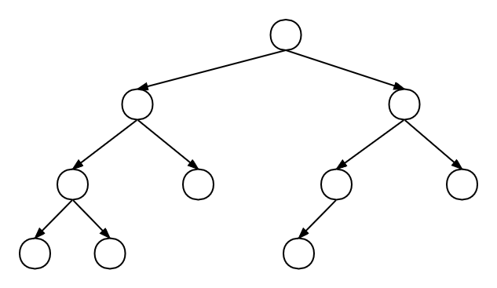
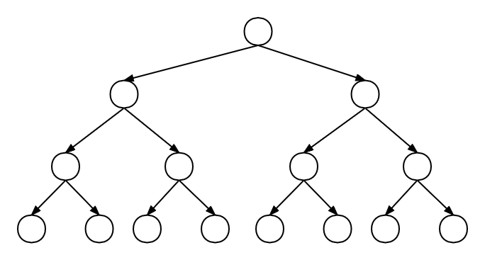
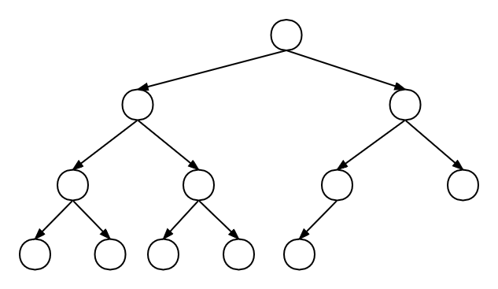
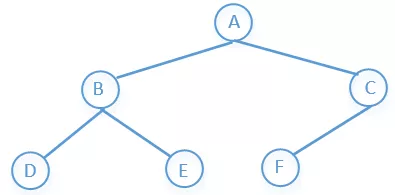
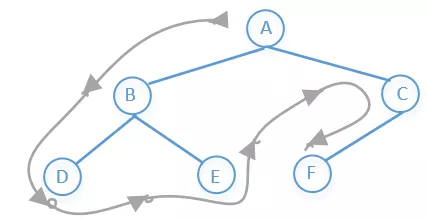
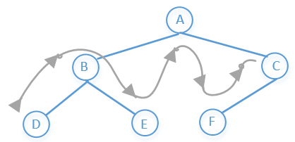
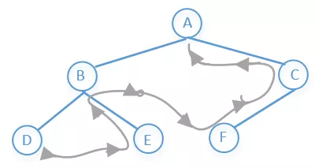
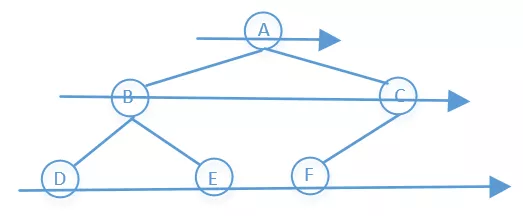
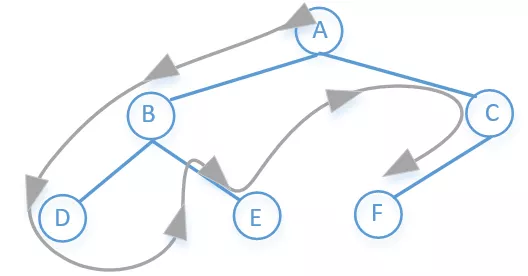

[TOC]


# TreeNode(树)

## 基础知识

树是一个有n个有限节点组成一个具有层次关系的集合，每个节点有0个或者多个子节点，没有父节点的节点称为根节点，也就是说除了根节点以外每个节点都有父节点，并且有且只有一个。

树的种类比较多，有二叉树，红黑树，AVL树，B树，哈夫曼树，字典树等等。

### 概念定义

| Name               | Define                                                       | 名称                 | 定义                                                         |
| ------------------ | ------------------------------------------------------------ | -------------------- | ------------------------------------------------------------ |
| **Root**           | The top node in a tree.                                      | **根**               | 树的顶端节点                                                 |
| **Child**          | A node directly connected to another node when moving away from the Root. | **孩子**             | 当远离根(Root)的时候，直接连接到另外一个节点的节点被称之为孩子(Child); |
| **Parent**         | The converse notion of a child.                              | **双亲**             | 相应地，另外一个节点称为孩子(child)的双亲(parent)。          |
| **Siblings**       | A group of nodes with the same parent.                       | **兄弟**             | 具有同一个双亲(Parent)的孩子(Child)之间互称为兄弟(Sibling)。 |
| **Ancestor**       | A node reachable by repeated proceeding from child to parent. | **祖先**             | 节点的祖先(Ancestor)是从根（Root）到该节点所经分支(Branch)上的所有节点。 |
| **Descendant**     | A node reachable by repeated proceeding from parent to child. | **子孙**             | 以某节点为根的子树中的任一节点都称为该节点的子孙(后代)。     |
| **Leaf**           | A node with no children.                                     | **叶子（终端节点）** | 没有孩子的节点(也就是度为0的节点)称为叶子(Leaf)或终端节点。  |
| **Branch**         | A node with at least one child.                              | **分支(非终端节点)** | 至少有一个孩子的节点称为分支(Branch)或非终端节点。           |
| **Degree**         | The number of sub trees of a node.                           | **度**               | 节点所拥有的子树个数称为节点的度(Degree)。                   |
| **Edge**           | The connection between one node and another.                 | **边**               | 一个节点和另一个节点之间的连接被称之为边(Edge)。             |
| **Path**           | A sequence of nodes and edges connecting a node with a descendant. | **路径**             | 连接节点和其后代的节点之间的(节点,边)的序列。                |
| **Level**          | The level of a node is defined by ０ + (the number of connections between the node and the root). | **层次**             | 节点的层次(Level)从根(Root)开始定义起，根为第0层，根的孩子为第1层。以此类推，若某节点在第i层，那么其子树的根就在第i+1层。 |
| **Height of node** | The height of a node is the number of edges on the longest path between that node and a leaf. | **节点的高度**       | 节点的高度是该节点和某个叶子之间存在的最长路径上的边的个数。 |
| **Height of tree** | The height of a tree is the height of its root node.         | **树的高度**         | 树的高度是其根节点的高度。                                   |
| **Depth of node ** | The depth of a node is the number of edges from the tree's root node to the node. | **节点的深度**       | 节点的深度是从树的根节点到该节点的边的个数。 （注：树的深度指的是树中节点的最大层次。） |
| **Forest**         | A forest is a set of n ≥ 0 disjoint trees.                   | **森林**             | 森林是n(>=0)棵互不相交的树的集合。                           |

### 树的种类

#### 无序树

树中任意节点的子节点之间没有顺序关系，这种树也称为自由树。

#### 有序树

树中任意节点的子节点之间有顺序关系。

#### 二叉树

**定义**

每个节点最多含有两个子树的树称为二叉树，二叉树的子树有左右之分，次序不能颠倒。


**特点**

- 二叉树的第i层至多有2<sup>i-1</sup>个节点
- [深度](#deep)为k的二叉树至多有2<sup>k-1</sup>个节点
- 对任何一棵二叉树，如果其[终端节点](#叶节点或终端节点)数为n<sub>0</sub>，度为2的节点数为n<sub>2</sub>，则n<sub>0</sub>=n<sub>2</sub>+1。



##### 满二叉树

**定义**

除最后一层无任何子节点外，每一层上的所有节点都有两个子节点的二叉树。


**特点**

- 一颗树深度为h，最大层数为k，深度与最大层数相同，k=h
- 叶子数为2<sup>h</sup>
- 第k层的节点数是：2<sup>k-1</sup>
- 总节点数是：2<sup>k-1</sup>，且总节点数一定是奇数



##### 完全二叉树

若设二叉树的深度为h，除第h层外，其它各层(1～h-1) 的节点数都达到最大个数，第h层所有节点从左向右连续地紧密排列，这就是完全二叉树。



##### 完满二叉树


##### 二叉查找树

**定义**

又称为是二叉排序树（Binary Sort Tree）或二叉搜索树。二叉排序树或者是一棵空树，或者是具有下列性质的二叉树：

　　1) 若左子树不空，则左子树上所有节点的值均小于它的根节点的值；

　　2) 若右子树不空，则右子树上所有节点的值均大于或等于它的根节点的值；

　　3) 左、右子树也分别为二叉排序树；

　　4) 没有键值相等的节点。

**特点**

- 对二叉查找树进行中序遍历，即可得到有序的数列。

##### 平衡二叉树

**定义**

平衡二叉树（Balanced Binary Tree）又被称为AVL树（有别于AVL算法），且具有以下性质：它是一 棵空树或它的左右两个子树的高度差的绝对值不超过1，并且左右两个子树都是一棵平衡二叉树。平衡二叉树的常用算法有红黑树、AVL树等。在平衡二叉搜索树中，我们可以看到，其高度一般都良好地维持在O(log2n)，大大降低了操作的时间复杂度。

###### 平衡查找树之AVL树

**定义**

AVL树是最先发明的自平衡二叉查找树。AVL树得名于它的发明者 G.M. Adelson-Velsky 和 E.M. Landis，他们在 1962 年的论文 "An algorithm for the organization of information" 中发表了它。在AVL中任何节点的两个儿子子树的高度最大差别为1，所以它也被称为高度平衡树，n个节点的AVL树最大深度约1.44log2n。查找、插入和删除在平均和最坏情况下都是O(logn)。增加和删除可能需要通过一次或多次树旋转来重新平衡这个树。**这个方案很好的解决了二叉查找树退化成链表的问题，把插入，查找，删除的时间复杂度最好情况和最坏情况都维持在O(logN)。但是频繁旋转会使插入和删除牺牲掉O(logN)左右的时间，不过相对二叉查找树来说，时间上稳定了很多。**

###### 平衡二叉树之红黑树

**定义**

红黑树是一种自平衡二叉查找树，是在计算机科学中用到的一种数据结构，典型的用途是实现关联数组。它是在1972年由鲁道夫·贝尔发明的，称之为"对称二叉B树"，它现代的名字是在 Leo J. Guibas 和 Robert Sedgewick 于1978年写的一篇论文中获得的。**它是复杂的，但它的操作有着良好的最坏情况运行时间，并且在实践中是高效的: 它可以在O(logn)时间内做查找，插入和删除，这里的n是树中元素的数目。**

　　红黑树和AVL树一样都对插入时间、删除时间和查找时间提供了最好可能的最坏情况担保。这不只是使它们在时间敏感的应用如实时应用（real time application）中有价值，而且使它们有在提供最坏情况担保的其他数据结构中作为建造板块的价值；例如，在计算几何中使用的很多数据结构都可以基于红黑树。此外，红黑树还是2-3-4树的一种等同，它们的思想是一样的，只不过红黑树是2-3-4树用二叉树的形式表示的。

**特点**

　红黑树是每个节点都带有颜色属性的二叉查找树，颜色为红色或黑色。在二叉查找树强制的一般要求以外，对于任何有效的红黑树我们增加了如下的额外要求:

　　性质1. 节点是红色或黑色。

　　性质2. 根是黑色。

　　性质3. 所有叶子都是黑色（叶子是NIL节点）。

　　性质4. 每个红色节点必须有两个黑色的子节点。(从每个叶子到根的所有路径上不能有两个连续的红色节点。)

　　性质5. 从任一节点到其每个叶子的所有简单路径都包含相同数目的黑色节点。

#### B树

**定义**

B树（B-tree）是一种树状数据结构，能够用来存储排序后的数据。这种数据结构能够让查找数据、循序存取、插入数据及删除的动作，都在对数时间内完成。B树，概括来说是一个一般化的二叉查找树，可以拥有多于2个子节点。与自平衡二叉查找树不同，B-tree为系统最优化大块数据的读和写操作。B-tree算法减少定位记录时所经历的中间过程，从而加快存取速度。这种数据结构常被应用在数据库和文件系统的实作上。

##### B+树

**定义**

B+树是B树的变体，也是一种多路搜索树。其定义基本与B-树相同，除了：

- 非叶子节点的子树指针与关键字个数相同；

- 非叶子节点的子树指针P[i]，指向关键字值属于[K[i], K[i+1])的子树（B-树是开区间）；

- 为所有叶子节点增加一个链指针；

- 所有关键字都在叶子节点出现；

B+树的搜索与B树也基本相同，区别是B+树只有达到叶子节点才命中（B树可以在非叶子节点命中），其性能也等价于在关键字全集做一次二分查找；

**特点**

- 所有关键字都出现在叶子节点的链表中（稠密索引），且链表中的关键字恰好是有序的；

- 不可能在非叶子节点命中；

- 非叶子节点相当于是叶子节点的索引（稀疏索引），叶子节点相当于是存储（关键字）数据的数据层；

- 更适合文件索引系统。

##### B*树

**定义**

B*树是B+树的变体，在B+树的非根和非叶子节点再增加指向兄弟的指针，将节点的最低利用率从1/2提高到2/3。　　

B*树定义了非叶子节点关键字个数至少为(2/3)*M，即块的最低使用率为2/3（代替B+树的1/2）；

B+树的分裂：当一个节点满时，分配一个新的节点，并将原节点中1/2的数据复制到新节点，最后在父节点中增加新节点的指针；B+树的分裂只影响原节点和父节点，而不会影响兄弟节点，所以它不需要指向兄弟的指针；

B*树的分裂：当一个节点满时，如果它的下一个兄弟节点未满，那么将一部分数据移到兄弟节点中，再在原节点插入关键字，最后修改父节点中兄弟节点的关键字（因为兄弟节点的关键字范围改变了）；如果兄弟也满了，则在原节点与兄弟节点之间增加新节点，并各复制1/3的数据到新节点，最后在父节点增加新节点的指针；

所以，B*树分配新节点的概率比B+树要低，空间使用率更高。

#### Trie树

**定义**

Tire树称为字典树，又称单词查找树，Trie树，是一种树形结构，是一种哈希树的变种。典型应用是用于统计，排序和保存大量的字符串（但不仅限于字符串），所以经常被搜索引擎系统用于文本词频统计。**它的优点是：利用字符串的公共前缀来减少查询时间，最大限度地减少无谓的字符串比较，查询效率比哈希树高。**

**特点**

- 根节点不包含字符，除根节点外每一个节点都只包含一个字符；

- 从根节点到某一节点，路径上经过的字符连接起来，为该节点对应的字符串；

- 

  每个节点的所有子节点包含的字符都不相同。

#### 哈夫曼树

带权路径最短的二叉树称为哈夫曼树或最优二叉树；

## 应用

树的种类实在是太多，关于树的算法题也是贼多，这一篇文章不可能全部介绍完，我们需要具体问题再具体分析。这里主要介绍的是二叉树，并且只介绍树的一些最基础的几个算法。我们先来看个图:



```java
public class TreeNode {
    public int val;
    public TreeNode left;
    public TreeNode right;

    public TreeNode(int x) {
        val = x;
    }

    public TreeNode() {
    }

    @Override
    public String toString() {
        return "[" + val + "]";
    }
}
```

#### 二叉树遍历

##### 前序遍历

他的访问顺序是：根节点→左子树→右子树

所以上图前序遍历的结果是：A→B→D→E→C→F

访问顺序如下:



代码如下：

```java
public static void preOrder(TreeNode tree) {
    if (tree == null)
        return;
    System.out.printf(tree.val + "");
    preOrder(tree.left);
    preOrder(tree.right);
}
```

非递归的写法：

```java
public static void preOrder(TreeNode tree) {
    if (tree == null)
        return;
    Stack<TreeNode> q1 = new Stack<>();
    q1.push(tree);//压栈
    while (!q1.empty()) {
        TreeNode t1 = q1.pop();//出栈
        System.out.println(t1.val);
        if (t1.right != null) {
            q1.push(t1.right);
        }
        if (t1.left != null) {
            q1.push(t1.left);
        }
    }
}
```

##### 中序遍历

他的访问顺序是：左子树→根节点→右子树

所以上图前序遍历的结果是：D→B→E→A→F→C

访问顺序如下：



代码如下：

```java
public static void inOrderTraversal(TreeNode node) {
    if (node == null)
        return;
    inOrderTraversal(node.left);
    System.out.println(node.val);
    inOrderTraversal(node.right);
}
```

非递归的写法：

```java
public static void inOrderTraversal(TreeNode tree) {
    Stack<TreeNode> stack = new Stack<>();
    while (tree != null || !stack.isEmpty()) {
        while (tree != null) {
            stack.push(tree);
            tree = tree.left;
        }
        if (!stack.isEmpty()) {
            tree = stack.pop();
            System.out.println(tree.val);
            tree = tree.right;
        }
    }
}
```

##### 后续遍历

他的访问顺序是：左子树→右子树→根节点

所以上图前序遍历的结果是：D→E→B→F→C→A

访问顺序如下：



代码如下：

```java
public static void postOrder(TreeNode tree) {
    if (tree == null)
        return;
    postOrder(tree.left);
    postOrder(tree.right);
    System.out.println(tree.val);
}
```

非递归的写法：

```java
public static void postOrder(TreeNode tree) {
    if (tree == null)
        return;
    Stack<TreeNode> s1 = new Stack<>();
    Stack<TreeNode> s2 = new Stack<>();
    s1.push(tree);
    while (!s1.isEmpty()) {
        tree = s1.pop();
        s2.push(tree);
        if (tree.left != null) {
            s1.push(tree.left);
        }
        if (tree.right != null) {
            s1.push(tree.right);
        }
    }
    while (!s2.isEmpty()) {
        System.out.print(s2.pop().val + " ");
    }
}
```

或者:

````java
public static void postOrder(TreeNode tree) {
    if (tree == null)
        return;
    Stack<TreeNode> stack = new Stack<>();
    stack.push(tree);
    TreeNode c;
    while (!stack.isEmpty()) {
        c = stack.peek();
        if (c.left != null && tree != c.left && tree != c.right) {
            stack.push(c.left);
        } else if (c.right != null && tree != c.right) {
            stack.push(c.right);
        } else {
            System.out.print(stack.pop().val + " ");
            tree = c;
        }
    }
}
````

#### BFS(广度优先搜索)

他的访问顺序是：先访问上一层，在访问下一层，一层一层的往下访问

所以上图前序遍历的结果是：A→B→C→D→E→F

访问顺序如下：



代码如下：

```java
public static void levelOrder(TreeNode tree) {
    if (tree == null)
        return;
    LinkedList<TreeNode> list = new LinkedList<>();//链表，这里我们可以把它看做队列
    list.add(tree);//相当于把数据加入到队列尾部
    while (!list.isEmpty()) {
        TreeNode node = list.poll();//poll方法相当于移除队列头部的元素
        System.out.println(node.val);
        if (node.left != null)
            list.add(node.left);
        if (node.right != null)
            list.add(node.right);
    }
}
```

递归的写法：

```java
public static void levelOrder(TreeNode tree) {
    int depth = depth(tree);
    for (int level = 0; level < depth; level++) {
        printLevel(tree, level);
    }
}

private static int depth(TreeNode tree) {
    if (tree == null)
        return 0;
    int leftDepth = depth(tree.left);
    int rightDepth = depth(tree.right);
    return Math.max(leftDepth, rightDepth) + 1;
}


private static void printLevel(TreeNode tree, int level) {
    if (tree == null)
        return;
    if (level == 0) {
        System.out.print(" " + tree.val);
    } else {
        printLevel(tree.left, level - 1);
        printLevel(tree.right, level - 1);
    }
}
```

**如果想把遍历的结果存放到list中，我们还可以这样写**

```java
public static List<List<Integer>> levelOrder(TreeNode tree) {
    if (tree == null)
        return null;
    List<List<Integer>> list = new ArrayList<>();
    bfs(tree, 0, list);
    return list;
}

private static void bfs(TreeNode tree, int level, List<List<Integer>> list) {
    if (tree == null)
        return;
    if (level >= list.size()) {
        List<Integer> subList = new ArrayList<>();
        subList.add(tree.val);
        list.add(subList);
    } else {
        list.get(level).add(tree.val);
    }
    bfs(tree.left, level + 1, list);
    bfs(tree.right, level + 1, list);
}
```

#### DFS(深度优先搜索)

他的访问顺序是：先访根节点，然后左节点，一直往下，直到最左节点没有子节点的时候然后往上退一步到父节点，然后父节点的右子节点在重复上面步骤……

所以上图前序遍历的结果是：A→B→D→E→C→F

访问顺序如下：



代码如下：

```java
public static void treeDFS(TreeNode root) {
    Stack<TreeNode> stack = new Stack<>();
    stack.add(root);
    while (!stack.empty()) {
        TreeNode node = stack.pop();
        System.out.println(node.val);
        if (node.right != null) {
            stack.push(node.right);
        }
        if (node.left != null) {
            stack.push(node.left);
        }
    }
}
```

递归的写法：

```java
public static void treeDFS(TreeNode root) {
    if (root == null)
        return;
    System.out.println(root.val);
    treeDFS(root.left);
    treeDFS(root.right);
}
```


