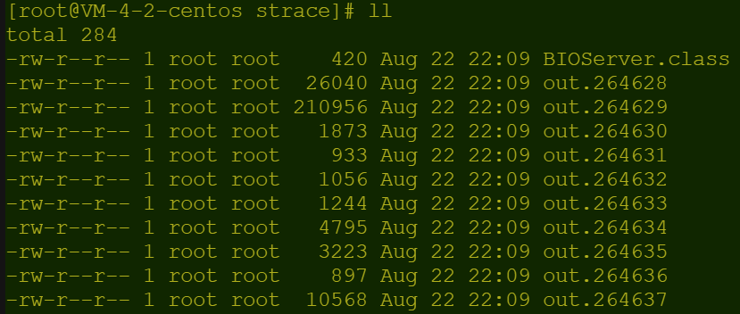
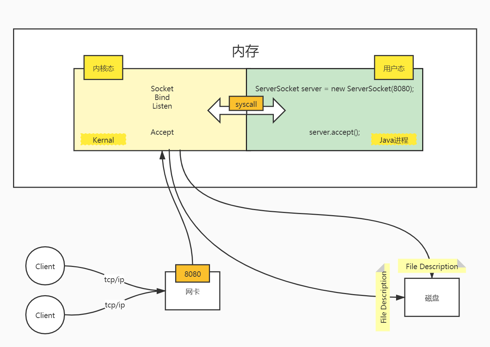

[TOC]


## IO介绍

> IO为何涉及Linux，请移步>>[IO原理](#IO原理)

### 概念

#### 阻塞与非阻塞

描述的是用户线程调用内核I/O操作的方式

- 阻塞(Blocking) ：I/O 操作需要彻底完成后才返回到用户空间
- 非阻塞(Non-Blocking)：I/O 操作被调用后立即返回给用户一个状态值，无需等到 I/O 操作彻底完成

#### 同步与异步

描述的是用户线程与内核的交互方式

- 同步(Synchronous)：用户线程发起 I/O 请求后需要等待或者轮询内核 I/O 操作完成后才能继续执行
- 异步(Asynchronous)：用户线程发起 I/O 请求后仍继续执行，当内核 I/O 操作完成后会通知用户线程，或者调用用户线程注册的回调函数

#### Linux

##### 文件描述符

> 以下来自百度百科：
>
> [内核](https://baike.baidu.com/item/内核/108410)（kernel）利用文件描述符（file descriptor）来访问文件。
>
> 文件描述符是[非负整数](https://baike.baidu.com/item/非负整数/2951833)。
>
> 打开现存文件或新建文件时，内核会返回一个文件描述符。读写文件也需要使用文件描述符来指定待读写的文件。

Linux中一切类型都被抽象成文件，如：普通文件、目录、字符设备、块设备、套接字等。

##### 用户空间与内核空间

现在操作系统都是采用虚拟存储器，那么对 32 位操作系统而言，它的寻址空间 (虚拟存储空间)为 4G (2的32次方)。操作系统的核心是内核（kernel ），独立于普通的应用程序，可以访问受保护的内存空间，也有访问底层硬件设备的所有权限。为了保证用户进程不能直接操作内核 (kernel)，保证内核的安全，操作系统将虚拟空间划分为两部分，一部分为内核空间，一部分为用户空间。针对 Linux 操作系统而言，将最高的 1G 字节 (从虚拟地址 0xC0000000 到 0xFFFFFFFF)，供内核使用，称为内核空间，而将较低的3G字节 (从虚拟地址 0x00000000 到 0xBFFFFFFF)，供各个进程使用，称为用户空间。

特点：

- 内存被划分为内核态和用户态，数据在用户态和内核态之间拷贝。
- 内核态可以访问用户态数据，反之不可以。
- 只有内核可以操作硬件资源（网卡、磁盘等），内核提供syscall函数。

### I/O 模型

#### Linux

- Blocking IO（阻塞 I/O）
- Non-Blocking IO（非阻塞 I/O）
- IO multiplexing（I/O 复用）
- Signal driven IO（信号驱动 I/O）
- Asynchronous IO（异步 I/O）

##### 阻塞 I/O

请求无法立即完成则保持阻塞。

- 阶段1：等待数据就绪。网络 I/O 的情况就是等待远端数据陆续抵达；磁盘I/O的情况就是等待磁盘数据从磁盘上读取到内核态内存中。
- 阶段2：数据从内核拷贝到进程。出于系统安全，用户态的程序没有权限直接读取内核态内存，因此内核负责把内核态内存中的数据拷贝一份到用户态内存中，然后内核返回结果，用户进程才解除 block 的状态，重新运行起来。

阻塞 I/O的特点就是在 IO 执行的两个阶段都被 block 了。


#####  非阻塞 I/O 

- 阶段1：Socket 设置为 NONBLOCK（非阻塞）就是告诉内核，当所请求的 I/O 操作无法完成时，不要将用户进程睡眠，而是返回一个错误码(EWOULDBLOCK) ，这样用户进程就不会阻塞，在空余时间可以干其他的事情。

- 阶段2：用户进程将不断的测试数据是否已经准备好，如果没有准备好，继续测试，直到数据准备好为止。整个 I/O 请求的过程中，虽然用户线程每次发起 I/O 请求后可以立即返回，但是为了等到数据，仍需要不断地轮询、重复请求，消耗了大量的 CPU 的资源
- 阶段3：数据准备好了，内核负责将数据从内核拷贝到用户空间，拷贝完成后，告知用户进程OK。


#####  I/O多路复用

I/O 多路复用会用到 UNIX/Linux 下的 select、poll、epoll（epoll 比 poll、select 效率高，做的事情是一样的）。这几个函数也会使进程阻塞，但是和阻塞 I/O 所不同的的，这两个函数可以同时阻塞多个 I/O 操作，而且可以同时对多个读操作，多个写操作的 I/O 函数进行检测，直到有数据可读或可写时，才真正调用 I/O 操作函数。


从流程上来看，使用 select 函数进行 I/O 请求和同步阻塞模型没有太大的区别，甚至还多了添加监视 socket，以及调用 select 函数的额外操作，效率更差。但是，使用 select 以后最大的优势是用户可以在一个线程内同时处理多个 socket 的 I/O 请求。用户可以注册多个 socket，然后不断地调用 select 读取被激活的 socket，即可达到在同一个线程内同时处理多个 I/O 请求的目的。而在同步阻塞模型中，必须通过多线程的方式才能达到这个目的。

I/O 多路复用模型使用了 Reactor 设计模式实现了这一机制。

调用 select / poll 该方法由一个用户态线程负责轮询多个 socket，直到某个阶段1的数据就绪，再通知实际的用户线程执行阶段2的拷贝。通过一个专职的用户态线程执行非阻塞I/O轮询，模拟实现了阶段一的异步化。

在 IO多路复用模型中，对于每一个 socket，一般都设置成为 non-blocking，但是，如上图所示，整个用户的 process 其实是一直被 block 的。只不过 process 是被 select 这个函数 block，而不是被 socket IO 给 block。所以 IO 多路复用是阻塞在 select，epoll 这样的系统调用之上，而没有阻塞在真正的 I/O 系统调用如 recvfrom 之上。

#####  信号驱动 I/O

首先我们允许 socket 进行信号驱动 I/O，并安装一个信号处理函数，进程继续运行并不阻塞。当数据准备好时，进程会收到一个 SIGIO 信号，可以在信号处理函数中调用 I/O 操作函数处理数据。


#####  异步 I/O

相对于同步 IO，异步 IO 不是顺序执行。用户进程进行 aio_read 系统调用之后，无论内核数据是否准备好，都会直接返回给用户进程，然后用户态进程可以去做别的事情。等到 socket 数据准备好了，内核直接复制数据给进程，然后从内核向进程发送通知。IO 两个阶段，进程都是非阻塞的。

从前面 IO 模型的分类中，我们可以看出 AIO 的动机：

- 同步阻塞模型需要在 IO 操作开始时阻塞应用程序。这意味着不可能同时重叠进行处理和 IO 操作。
- 同步非阻塞模型允许处理和 IO 操作重叠进行，但是这需要应用程序根据重现的规则来检查 IO 操作的状态。
- 这样就剩下异步非阻塞 IO 了，它允许处理和 IO 操作重叠进行，包括 IO 操作完成的通知。


异步 I/O 模型使用了 Proactor 设计模式实现了这一机制。

告知内核，当整个过程(包括阶段1和阶段2)全部完成时，通知应用程序来读数据。

##### 各种IO模型对比


#### Java

 以Java的角度，理解如下：

- BIO，同步阻塞式IO，简单理解：一个线程处理一个连接，发起和处理IO请求都是同步的
- NIO，同步非阻塞IO，简单理解：一个线程处理多个连接，发起IO请求是非阻塞的，但处理IO请求是同步的
- AIO，异步非阻塞IO，简单理解：一个有效请求一个线程，发起和处理IO请求都是异步的

##### BIO

在JDK1.4之前，用Java编写网络请求，都是建立一个ServerSocket，然后，客户端建立Socket时就会询问是否有线程可以处理，如果没有，要么等待，要么被拒绝。即：一个连接，要求Server对应一个处理线程。

##### NIO

NIO（JDK1.4及以后）模型是一种同步非阻塞IO，服务器实现模式为一个请求一个线程，即客户端发送的连接请求都会注册到多路复用器上，多路复用器轮询到连接有I/O请求时才启动一个线程进行处理。

NIO中的N可以理解为Non-blocking，不单纯是New。它支持面向缓冲的，基于通道的I/O操作方法。 NIO提供了与传统BIO模型中的 Socket 和 ServerSocket 相对应的 SocketChannel 和 ServerSocketChannel 两种不同的套接字通道实现，两种通道都支持阻塞和非阻塞两种模式。阻塞模式使用就像传统中的支持一样，比较简单，但是性能和可靠性都不好；非阻塞模式正好与之相反。对于低负载、低并发的应用程序，可以使用同步阻塞I/O来提升开发速率和更好的维护性；对于高负载、高并发的（网络）应用，应使用 NIO 的非阻塞模式来开发。

##### AIO

AIO 也就是 NIO 2。在 Java 7 中引入了 NIO 的改进版 NIO 2，它是异步非阻塞的IO模型。异步 IO 是基于事件和回调机制实现的，也就是应用操作之后会直接返回，不会堵塞在那里，当后台处理完成，操作系统会通知相应的线程进行后续的操作。

AIO 是异步IO的缩写，虽然 NIO 在网络操作中，提供了非阻塞的方法，但是 NIO 的 IO 行为还是同步的。对于 NIO 来说，我们的业务线程是在 IO 操作准备好时，得到通知，接着就由这个线程自行进行 IO 操作，IO操作本身是同步的。

##### 对比

###### IO与NIO对比

|            IO             |              NIO              |
| :-----------------------: | :---------------------------: |
| 面向流（Stream Oriented） | 面向缓冲区（Buffer Oriented） |
|   阻塞IO（Blocking IO）   |  非阻塞IO（Non Blocking IO）  |
|            无             |      选择器（Selectors）      |

###### BIO与NIO对比

BIO是一个连接一个线程，NIO是一个请求一个线程。（AIO是一个有效请求一个线程）


###### BIO、NIO、AIO适用场景

- BIO方式适用于连接数目比较小且固定的架构，这种方式对服务器资源要求比较高，并发局限于应用中，JDK1.4以前的唯一选择
- NIO方式适用于连接数目多且连接比较短（轻操作）的架构，比如聊天服务器，并发局限于应用中，编程比较复杂
- AIO方式使用于连接数目多且连接比较长（重操作）的架构，比如相册服务器，充分调用OS参与并发操作，编程比较复杂，JDK7开始支持

## <span id='IO原理'>IO原理</span>

### 前言

常常在Java里写各种IO，例如文件IO，网络IO等，却没有问一问Java的IO是怎么实现的，她与系统到底有什么样的交互？

### 分析

带着这样的疑问，我们来写一段代码：

```java
import java.io.IOException;
import java.net.ServerSocket;

public class BIOServer {

    public static void main(String[] args) throws IOException {
        ServerSocket server = new ServerSocket(8080);
        server.accept();
    }

}
```

没错，普普通通的一个Socket编程，那么咱们怎么知道这段代码跟操作系统有什么交互呢？需要借助外部的工具——Strace，何为Strace？Strace是一个可用于诊断、调试和教学的Linux用户空间跟踪器。我们用它来监控用户空间进程和内核的交互，比如系统调用、信号传递、进程状态变更等。

接下来，咱们直接试一试：`strace -ff -o out java BIOServer`（PS:我在想会不会有人好奇哈，为啥敲了这个命令后，迟迟没有结束，那就劳烦您回到上述Demo看一下，server.accept()，也就是说主线程会阻塞在这里，直到一次请求完成。搞一次请求？拿去不谢`curl -l http://127.0.0.1:8080`，实在不行Ctrl+C干掉进程也行哈。）

然后咱们看一下文件输出：



有点小多，毕竟是跟踪进程干了啥嘛，多是必然的，那么博主充当了工具人，一个个文件、一行行看过去的。但是你可以不用，所以咱们直奔主题：

```shell
// ...
socket(AF_INET6, SOCK_STREAM, IPPROTO_IP) = 8
// ...
bind(8, {sa_family=AF_INET6, sin6_port=htons(8080), sin6_flowinfo=htonl(0), inet_pton(AF_INET6, "::", &sin6_addr), sin6_scope_id=0}, 28) = 0
// ...
listen(8, 50)
```

分析了所有日志后，咱们只要知道这三个系统函数：socket，bind，listen。

分别查看Linux手册：

- socket

  > NAME
  >
  >  socket - create an endpoint for communication
  >
  > DESCRIPTION
  >
  >  socket() creates an endpoint for communication and returns a descriptor.
  >
  > RETURN VALUE
  >
  >  On  success,  a  file  descriptor for the new socket is returned.  On error, -1 is returned, and errno is set appropri-
  >
  >  ately.

- bind

> NAME
>
>  bind - bind a name to a socket
>
> SYNOPSIS
>
>  #include <sys/types.h>          /* See NOTES */
>
>  #include <sys/socket.h>
>
>  int bind(int sockfd, const struct sockaddr *addr,
>
>  socklen_t addrlen);
>
> DESCRIPTION
>
>  When  a socket is created with socket(2), it exists in a name space (address family) but has no address assigned to it.
>
>  bind() assigns the address specified by addr to the socket referred to by the file descriptor sockfd.   addrlen  speci-
>
>  fies the size, in bytes, of the address structure pointed to by addr.  Traditionally, this operation is called "assign-
>
>  ing a name to a socket".
>
> RETURN VALUE
>
>  On success, zero is returned.  On error, -1 is returned, and errno is set appropriately.

- listen

> NAME
>
>  listen - listen for connections on a socket
>
> SYNOPSIS
>
>  #include <sys/types.h>          /* See NOTES */
>
>  #include <sys/socket.h>
>
>  int listen(int sockfd, int backlog);
>
> DESCRIPTION
>
>  listen()  marks  the socket referred to by sockfd as a passive socket, that is, as a socket that will be used to accept
>
>  incoming connection requests using accept(2).
>
>  The sockfd argument is a file descriptor that refers to a socket of type SOCK_STREAM or SOCK_SEQPACKET.
>
>  The backlog argument defines the maximum length to which the queue of pending connections for sockfd may  grow.   If  a
>
>  connection  request  arrives when the queue is full, the client may receive an error with an indication of ECONNREFUSED
>
>  or, if the underlying protocol supports retransmission, the request may be ignored so that a later reattempt at connec-
>
>  tion succeeds.
>
> RETURN VALUE
>
>  On success, zero is returned.  On error, -1 is returned, and errno is set appropriately.

即使不查手册，相信大家也能通过其命名知道其含义，查完手册主要加深我们对Linux IO的其他相关概念更深刻的了解。

带着对函数的理解，我们一起重新梳理一下调用流程：

```
// ...
// 创建Socket，文件描述符为5
socket(AF_INET6, SOCK_STREAM, IPPROTO_IP) = 8
// ...
// 将文件描述符和8080端口进行绑定
bind(8, {sa_family=AF_INET6, sin6_port=htons(8080), sin6_flowinfo=htonl(0), inet_pton(AF_INET6, "::", &sin6_addr), sin6_scope_id=0}, 28) = 0
// ...
// 监听文件描述符的输入输出状态
listen(8, 50)
```



看完了调用关系图，最后，来个总结：

- Java中通过对系统的调用来实现网络IO

​       ServerSocket server = new ServerSocket(8080); 一行Java代码的背后，经过了多个系统函数调用

- 实现网络IO，不是Java的能力，是操作系统内核提供的能力


