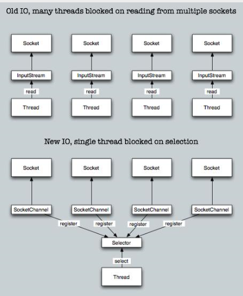

## IO介绍

### 概念

#### 阻塞与非阻塞

描述的是用户线程调用内核 I/O 操作的方式

- 阻塞(Blocking) ：I/O 操作需要彻底完成后才返回到用户空间
- 非阻塞(Non-Blocking)：I/O 操作被调用后立即返回给用户一个状态值，无需等到 I/O 操作彻底完成

#### 同步与异步

描述的是用户线程与内核的交互方式

- 同步(Synchronous)：用户线程发起 I/O 请求后需要等待或者轮询内核 I/O 操作完成后才能继续执行
- 异步(Asynchronous)：用户线程发起 I/O 请求后仍继续执行，当内核 I/O 操作完成后会通知用户线程，或者调用用户线程注册的回调函数

### Unix

####  I/O 模型

- Blocking IO（阻塞 I/O）
- Non-Blocking IO（非阻塞 I/O）
- IO multiplexing（I/O 复用）
- Signal driven IO（信号驱动 I/O）
- Asynchronous IO（异步 I/O）

##### 阻塞 I/O

请求无法立即完成则保持阻塞。

- 阶段1：等待数据就绪。网络 I/O 的情况就是等待远端数据陆续抵达；磁盘I/O的情况就是等待磁盘数据从磁盘上读取到内核态内存中。
- 阶段2：数据从内核拷贝到进程。出于系统安全,用户态的程序没有权限直接读取内核态内存,因此内核负责把内核态内存中的数据拷贝一份到用户态内存中。

#####  非阻塞 I/O

- socket 设置为 NONBLOCK（非阻塞）就是告诉内核，当所请求的 I/O 操作无法完成时，不要将进程睡眠，而是返回一个错误码(EWOULDBLOCK) ，这样请求就不会阻塞
- I/O 操作函数将不断的测试数据是否已经准备好，如果没有准备好，继续测试，直到数据准备好为止。整个 I/O 请求的过程中，虽然用户线程每次发起 I/O 请求后可以立即返回，但是为了等到数据，仍需要不断地轮询、重复请求，消耗了大量的 CPU 的资源
- 数据准备好了，从内核拷贝到用户空间。

一般很少直接使用这种模型，而是在其他 I/O 模型中使用非阻塞 I/O 这一特性。这种方式对单个 I/O 请求意义不大,但给 I/O 多路复用铺平了道路。

#####  I/O 复用

I/O 多路复用会用到 select 或者 poll 函数，这两个函数也会使进程阻塞，但是和阻塞 I/O 所不同的的，这两个函数可以同时阻塞多个 I/O 操作。而且可以同时对多个读操作，多个写操作的 I/O 函数进行检测，直到有数据可读或可写时，才真正调用 I/O 操作函数。

从流程上来看，使用 select 函数进行 I/O 请求和同步阻塞模型没有太大的区别，甚至还多了添加监视 socket，以及调用 select 函数的额外操作，效率更差。但是，使用 select 以后最大的优势是用户可以在一个线程内同时处理多个 socket 的 I/O 请求。用户可以注册多个 socket，然后不断地调用 select 读取被激活的 socket，即可达到在同一个线程内同时处理多个 I/O 请求的目的。而在同步阻塞模型中，必须通过多线程的方式才能达到这个目的。

I/O 多路复用模型使用了 Reactor 设计模式实现了这一机制。

调用 select / poll 该方法由一个用户态线程负责轮询多个 socket，直到某个阶段1的数据就绪,再通知实际的用户线程执行阶段2的拷贝。通过一个专职的用户态线程执行非阻塞I/O轮询，模拟实现了阶段一的异步化。

#####  信号驱动 I/O

首先我们允许 socket 进行信号驱动 I/O，并安装一个信号处理函数，进程继续运行并不阻塞。当数据准备好时，进程会收到一个 SIGIO 信号，可以在信号处理函数中调用 I/O 操作函数处理数据。

#####  异步 I/O

调用 aio_read 函数，告诉内核描述字，缓冲区指针，缓冲区大小，文件偏移以及通知的方式，然后立即返回。当内核将数据拷贝到缓冲区后，再通知应用程序。

异步 I/O 模型使用了 Proactor 设计模式实现了这一机制。

告知内核，当整个过程(包括阶段1和阶段2)全部完成时，通知应用程序来读数据。

#### 各种IO模型对比

### Java

#### IO模型

 以Java的角度，理解如下：

- BIO，同步阻塞式IO，简单理解：一个线程处理一个连接，发起和处理IO请求都是同步的
- NIO，同步非阻塞IO，简单理解：一个线程处理多个连接，发起IO请求是非阻塞的，但处理IO请求是同步的
- AIO，异步非阻塞IO，简单理解：一个有效请求一个线程，发起和处理IO请求都是异步的

##### BIO

在JDK1.4之前，用Java编写网络请求，都是建立一个ServerSocket，然后，客户端建立Socket时就会询问是否有线程可以处理，如果没有，要么等待，要么被拒绝。即：一个连接，要求Server对应一个处理线程。

##### NIO

NIO（JDK1.4及以后）模型是一种同步非阻塞IO，服务器实现模式为一个请求一个线程，即客户端发送的连接请求都会注册到多路复用器上，多路复用器轮询到连接有I/O请求时才启动一个线程进行处理。

NIO中的N可以理解为Non-blocking，不单纯是New。它支持面向缓冲的，基于通道的I/O操作方法。 NIO提供了与传统BIO模型中的 Socket 和 ServerSocket 相对应的 SocketChannel 和 ServerSocketChannel 两种不同的套接字通道实现，两种通道都支持阻塞和非阻塞两种模式。阻塞模式使用就像传统中的支持一样，比较简单，但是性能和可靠性都不好；非阻塞模式正好与之相反。对于低负载、低并发的应用程序，可以使用同步阻塞I/O来提升开发速率和更好的维护性；对于高负载、高并发的（网络）应用，应使用 NIO 的非阻塞模式来开发。

##### AIO

AIO 也就是 NIO 2。在 Java 7 中引入了 NIO 的改进版 NIO 2，它是异步非阻塞的IO模型。异步 IO 是基于事件和回调机制实现的，也就是应用操作之后会直接返回，不会堵塞在那里，当后台处理完成，操作系统会通知相应的线程进行后续的操作。

AIO 是异步IO的缩写，虽然 NIO 在网络操作中，提供了非阻塞的方法，但是 NIO 的 IO 行为还是同步的。对于 NIO 来说，我们的业务线程是在 IO 操作准备好时，得到通知，接着就由这个线程自行进行 IO 操作，IO操作本身是同步的。

#### 对比

##### IO与NIO对比

|            IO             |              NIO              |
| :-----------------------: | :---------------------------: |
| 面向流（Stream Oriented） | 面向缓冲区（Buffer Oriented） |
|   阻塞IO（Blocking IO）   |  非阻塞IO（Non Blocking IO）  |
|            无             |      选择器（Selectors）      |

##### BIO与NIO对比

BIO是一个连接一个线程，NIO是一个请求一个线程。（AIO是一个有效请求一个线程）

##### BIO、NIO、AIO适用场景

- BIO方式适用于连接数目比较小且固定的架构，这种方式对服务器资源要求比较高，并发局限于应用中，JDK1.4以前的唯一选择
- NIO方式适用于连接数目多且连接比较短（轻操作）的架构，比如聊天服务器，并发局限于应用中，编程比较复杂
- AIO方式使用于连接数目多且连接比较长（重操作）的架构，比如相册服务器，充分调用OS参与并发操作，编程比较复杂，JDK7开始支持
