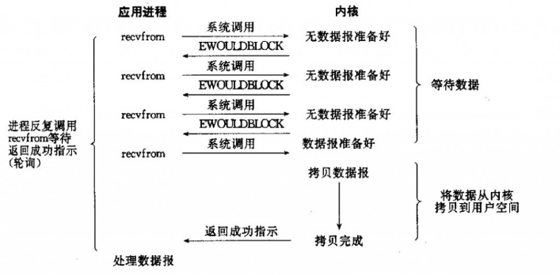
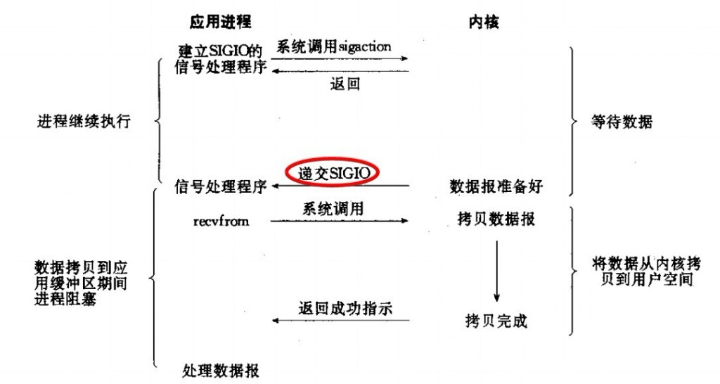

## IO介绍

### 概念

#### 阻塞与非阻塞

描述的是用户线程调用内核 I/O 操作的方式

- 阻塞(Blocking) ：I/O 操作需要彻底完成后才返回到用户空间
- 非阻塞(Non-Blocking)：I/O 操作被调用后立即返回给用户一个状态值，无需等到 I/O 操作彻底完成

#### 同步与异步

描述的是用户线程与内核的交互方式

- 同步(Synchronous)：用户线程发起 I/O 请求后需要等待或者轮询内核 I/O 操作完成后才能继续执行
- 异步(Asynchronous)：用户线程发起 I/O 请求后仍继续执行，当内核 I/O 操作完成后会通知用户线程，或者调用用户线程注册的回调函数

### Unix

####  I/O 模型

- Blocking IO（阻塞 I/O）
- Non-Blocking IO（非阻塞 I/O）
- IO multiplexing（I/O 复用）
- Signal driven IO（信号驱动 I/O）
- Asynchronous IO（异步 I/O）

##### 阻塞 I/O

请求无法立即完成则保持阻塞。

- 阶段1：等待数据就绪。网络 I/O 的情况就是等待远端数据陆续抵达；磁盘I/O的情况就是等待磁盘数据从磁盘上读取到内核态内存中。
- 阶段2：数据从内核拷贝到进程。出于系统安全,用户态的程序没有权限直接读取内核态内存,因此内核负责把内核态内存中的数据拷贝一份到用户态内存中。

#####  非阻塞 I/O

- socket 设置为 NONBLOCK（非阻塞）就是告诉内核，当所请求的 I/O 操作无法完成时，不要将进程睡眠，而是返回一个错误码(EWOULDBLOCK) ，这样请求就不会阻塞
- I/O 操作函数将不断的测试数据是否已经准备好，如果没有准备好，继续测试，直到数据准备好为止。整个 I/O 请求的过程中，虽然用户线程每次发起 I/O 请求后可以立即返回，但是为了等到数据，仍需要不断地轮询、重复请求，消耗了大量的 CPU 的资源
- 数据准备好了，从内核拷贝到用户空间。

一般很少直接使用这种模型，而是在其他 I/O 模型中使用非阻塞 I/O 这一特性。这种方式对单个 I/O 请求意义不大,但给 I/O 多路复用铺平了道路。

#####  I/O 复用

I/O 多路复用会用到 select 或者 poll 函数，这两个函数也会使进程阻塞，但是和阻塞 I/O 所不同的的，这两个函数可以同时阻塞多个 I/O 操作。而且可以同时对多个读操作，多个写操作的 I/O 函数进行检测，直到有数据可读或可写时，才真正调用 I/O 操作函数。

从流程上来看，使用 select 函数进行 I/O 请求和同步阻塞模型没有太大的区别，甚至还多了添加监视 socket，以及调用 select 函数的额外操作，效率更差。但是，使用 select 以后最大的优势是用户可以在一个线程内同时处理多个 socket 的 I/O 请求。用户可以注册多个 socket，然后不断地调用 select 读取被激活的 socket，即可达到在同一个线程内同时处理多个 I/O 请求的目的。而在同步阻塞模型中，必须通过多线程的方式才能达到这个目的。

I/O 多路复用模型使用了 Reactor 设计模式实现了这一机制。

调用 select / poll 该方法由一个用户态线程负责轮询多个 socket，直到某个阶段1的数据就绪,再通知实际的用户线程执行阶段2的拷贝。通过一个专职的用户态线程执行非阻塞I/O轮询，模拟实现了阶段一的异步化。

#####  信号驱动 I/O

首先我们允许 socket 进行信号驱动 I/O，并安装一个信号处理函数，进程继续运行并不阻塞。当数据准备好时，进程会收到一个 SIGIO 信号，可以在信号处理函数中调用 I/O 操作函数处理数据。

#####  异步 I/O

调用 aio_read 函数，告诉内核描述字，缓冲区指针，缓冲区大小，文件偏移以及通知的方式，然后立即返回。当内核将数据拷贝到缓冲区后，再通知应用程序。

异步 I/O 模型使用了 Proactor 设计模式实现了这一机制。

告知内核，当整个过程(包括阶段1和阶段2)全部完成时，通知应用程序来读数据。

#### 各种IO模型对比

### Java

#### IO模型

- 同步(synchronous) IO和异步(asynchronous) IO
- 阻塞(blocking) IO和非阻塞(non-blocking)IO
- 同步阻塞(blocking-IO)简称BIO
- 同步非阻塞(non-blocking-IO)简称NIO
- 异步非阻塞(synchronous-non-blocking-IO)简称AIO

##### BIO

BIO是一种同步的阻塞IO，IO在进行读写时，该线程将被阻塞，线程无法进行其它操作。
IO流在读取时，会阻塞。直到发生以下情况：1、有数据可以读取。2、数据读取完成。3、发生异常

在JDK1.4出来之前，我们建立网络连接的时候采用BIO模式，需要先在服务端启动一个ServerSocket，然后在客户端启动Socket来对服务端进行通信，默认情况下服务端需要对每个请求建立一堆线程等待请求，而客户端发送请求后，先咨询服务端是否有线程相应，如果没有则会一直等待或者遭到拒绝请求，如果有的话，客户端会线程会等待请求结束后才继续执行。

##### NIO

NIO（JDK1.4）模型是一种同步非阻塞IO

##### AIO

异步非阻塞与同步非阻塞的区别在哪里？异步非阻塞无需一个线程去轮询所有IO操作的状态改变，在相应的状态改变后，系统会通知对应的线程来处理。对应到烧开水中就是，为每个水壶上面装了一个开关，水烧开之后，水壶会自动通知我水烧开了

##### IO与NIO对比

|            IO             |              NIO              |
| :-----------------------: | :---------------------------: |
| 面向流（Stream Oriented） | 面向缓冲区（Buffer Oriented） |
|   阻塞IO（Blocking IO）   |  非阻塞IO（Non Blocking IO）  |
|            无             |      选择器（Selectors）      |

##### BIO与NIO对比

##### BIO、NIO、AIO适用场景

- BIO方式适用于连接数目比较小且固定的架构，这种方式对服务器资源要求比较高，并发局限于应用中，JDK1.4以前的唯一选择
- NIO方式适用于连接数目多且连接比较短（轻操作）的架构，比如聊天服务器，并发局限于应用中，编程比较复杂
- AIO方式使用于连接数目多且连接比较长（重操作）的架构，比如相册服务器，充分调用OS参与并发操作，编程比较复杂，JDK7开始支持

