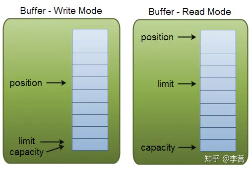
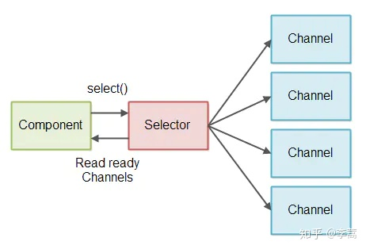

[TOC]


## NIO

在讲[IO](./IO.md)的那一篇笔记里，只是简简单单的提到了NIO，没有过多涉及，所以本篇笔记，咱们研究个透。

### 怎么用

#### 文件

##### 读

```java
    @Test
    public void readNIO() {
        String pathname = "C:\\test.txt";
        FileInputStream fin = null;
        try {
            fin = new FileInputStream(pathname);
            FileChannel channel = fin.getChannel();
            int capacity = 1024;
            ByteBuffer bf = ByteBuffer.allocate(capacity);
            System.out.println("限制是：" + bf.limit() + "容量是：" + bf.capacity() + "位置是：" + bf.position());
            int length;
            while ((length = channel.read(bf)) != -1) {
                bf.clear();
                byte[] bytes = bf.array();
                System.out.write(bytes, 0, length);
                System.out.println();
                System.out.println("限制是：" + bf.limit() + "容量是：" + bf.capacity() + "位置是：" + bf.position());
            }
            channel.close();
        } catch (IOException e) {
            e.printStackTrace();
        } finally {
            if (fin != null) {
                try {
                    fin.close();
                } catch (IOException e) {
                    e.printStackTrace();
                }
            }
        }
    }
```

##### 写

```java
    @Test
    public void writeNIO() {
        String pathname = "C:\\out.txt";
        FileOutputStream fos = null;
        try {
            fos = new FileOutputStream(pathname);
            FileChannel channel = fos.getChannel();
            ByteBuffer src = StandardCharsets.UTF_8.encode("你好你好你好你好你好");
            System.out.println("初始化容量和limit：" + src.capacity() + "," + src.limit());
            int length;
            while ((length = channel.write(src)) != 0) {
                System.out.println("写入长度:" + length);
            }
        } catch (IOException e) {
            e.printStackTrace();
        } finally {
            if (fos != null) {
                try {
                    fos.close();
                } catch (IOException e) {
                    e.printStackTrace();
                }
            }
        }
    }

```

##### 读和写

```java
    @Test
    public void testReadAndWriteNIO() {
        String pathname = "C:\\in.txt";
        FileInputStream fin = null;
        String filename = "C:\\out.txt";
        FileOutputStream fos = null;
        try {
            fin = new FileInputStream(pathname);
            FileChannel channel = fin.getChannel();
            // 字节
            int capacity = 100;
            ByteBuffer bf = ByteBuffer.allocate(capacity);
            System.out.println("限制是：" + bf.limit() + "容量是：" + bf.capacity() + "位置是：" + bf.position());
            int length;
            fos = new FileOutputStream(filename);
            FileChannel outchannel = fos.getChannel();
            while ((length = channel.read(bf)) != -1) {
                // 将当前位置置为limit，然后设置当前位置为0，也就是从0到limit这块，都写入到同道中
                bf.flip();
                int outlength = 0;
                while ((outlength = outchannel.write(bf)) != 0) {
                    System.out.println("读，" + length + "写," + outlength);
                }
                // 将当前位置置为0，然后设置limit为容量，也就是从0到limit（容量）这块，都可以利用，通道读取的数据存储到0到limit这块
                bf.clear();
            }
        } catch (IOException e) {
            e.printStackTrace();
        } finally {
            if (fin != null) {
                try {
                    fin.close();
                } catch (IOException e) {
                    e.printStackTrace();
                }
            }
            if (fos != null) {
                try {
                    fos.close();
                } catch (IOException e) {
                    e.printStackTrace();
                }
            }
        }
    }
```

#### 网络

相对于传统的Socket编程来说，NIO要完成网络编程，大致分为这几步骤：

1. 获取channel
2. 设置非阻塞
3. 创建多路复用器selector
4. channel和selector做关联
5. 根据selector返回的channel状态处理逻辑

直接上代码：

```java
// 开启一个channel
ServerSocketChannel serverSocketChannel = ServerSocketChannel.open();
// 设置为非阻塞
serverSocketChannel.configureBlocking(false);
// 绑定端口
serverSocketChannel.bind(new InetSocketAddress(PORT));
// 打开一个多路复用器
Selector selector = Selector.open();
// 绑定多路复用器和channel
serverSocketChannel.register(selector, SelectionKey.OP_ACCEPT);
// 获取到达的事件
while (selector.select() > 0) {
    Set<SelectionKey> keys = selector.keys();
    Iterator<SelectionKey> iterator = keys.iterator();
    while (iterator.hasNext()) {
        SelectionKey selectionKey = iterator.next();
        if (selectionKey.isAcceptable()) {
            // 处理逻辑
        }
        if (selectionKey.isReadable()) {
            // 处理逻辑
        }
    }
}
```

到此一个简单的NIO网络编程即完成。

### 概念

#### 三大组件

好了，相信到此，大家都会依葫芦画瓢了，但是你可能还没能知道NIO是个啥。接下来我们就来看看概念部分。NIO重点是把**Channel（通道）**，**Buffer（缓冲区）**，**Selector（选择器）**三个类之间的关系弄清楚。

##### Buffer

顾名思义，Buffer是一个缓存，用来缓存数据的地方。那么Buffer中是如何记录数据的呢？

**三个重要概念（参数）**

- 容量（Capacity）

- 界限（Limit）

- 位置（Position）

下图展示的读、写模式下的三个参数的值。



###### 写模式

Position：指向当前写入的位置

Limit等于Capacity，Limit表示写入最大位置，Capacity表示容量

###### 读模式

Position：指向当前读取的位置

Limit：可读的最大位置

Capacity：容量

###### 如何切换

Flip方法：将Buffer从写模式切换到读模式。具体操作是将Position值重置为0，Limit的值设置为之前Position的值；

```java
public final Buffer flip() {
    this.limit = this.position;
    this.position = 0;
    this.mark = -1;
    return this;
}
```

Clear方法：将Position置为0，Limit等于Capacity。

```java
public final Buffer clear() {
    this.position = 0;
    this.limit = this.capacity;
    this.mark = -1;
    return this;
}
```

**Clear方法 vs Compact方法：**
Clear方法清空缓冲区；Compact方法只会清空已读取的数据，而还未读取的数据继续保存在Buffer中；

Buffer的主要实现有：

- ByteBuffer
- CharBuffer
- DoubleBuffer
- FloatBuffer
- IntBuffer
- LongBuffer
- ShortBuffer
- MappedByteBuffer
- HeapByteBuffer
- DirectByteBuffer
- ...

##### Channel

特点：

- 通道可以同时进行读写，而流(InputStream/OutputStream)只能读或者只能写
- 通道可以从缓冲读数据，也可以写数据到缓冲:

Channel的主要实现有：

- FileChannel
- DatagramChannel
- SocketChannel
- ServerSocketChannel
- ...

##### Selector 

可以检测多个NIO Channel，看看读或者写事件是否就绪。多个Channel以事件的方式可以注册到同一个Selector，从而达到用一个线程处理多个请求成为可能。



###### 创建

通过调用Selector.open()方法创建一个Selector对象

###### 注册Channel

```java
channel.configureBlocking(false);
channel.register(selector, Selectionkey.OP_READ);
```

Channel必须是非阻塞的。所以FileChannel不适用Selector，因为FileChannel不能切换为非阻塞模式，更准确的来说是因为FileChannel没有继承SelectableChannel。Socket channel可以正常使用。

**register()** 方法的第二个参数。这是一个Interest集合，意思是在**通过Selector监听Channel时对什么事件感兴趣**。可以监听四种不同类型的事件：

- **Connect**
- **Accept**
- **Read**
- **Write**

**SelectionKey**

一个SelectionKey键表示了一个特定的通道对象和一个特定的选择器对象之间的注册关系。

```java
// 返回SelectionKey的attachment，attachment可以在注册channel的时候指定。
key.attachment(); 
// 返回该SelectionKey对应的channel。
key.channel(); 
// 返回该SelectionKey对应的Selector。
key.selector(); 
// 返回代表需要Selector监控的IO操作的bit mask
key.interestOps(); 
// 返回一个bit mask，代表在相应channel上可以进行的IO操作。
key.readyOps(); 
```

##### 总结

最后我们来总结一下，这三个组件：


#### 零拷贝

