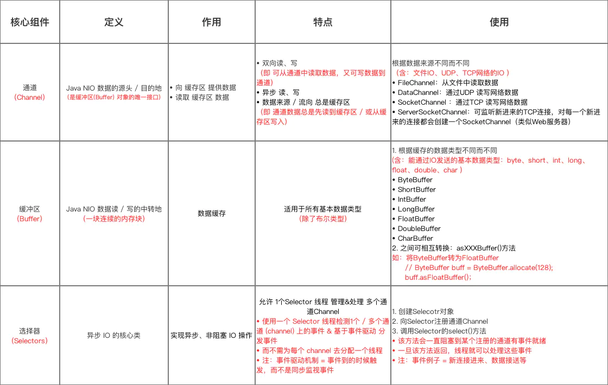

[TOC]


## NIO

在讲[IO](./IO.md)的那一篇笔记里，只是简简单单的提到了NIO，没有过多涉及，所以本篇笔记，咱们研究个透。

### 怎么用

#### 文件

##### 读

```java
    @Test
    public void readNIO() {
        String pathname = "C:\\test.txt";
        FileInputStream fin = null;
        try {
            fin = new FileInputStream(pathname);
            FileChannel channel = fin.getChannel();
            int capacity = 1024;
            ByteBuffer bf = ByteBuffer.allocate(capacity);
            System.out.println("限制是：" + bf.limit() + "容量是：" + bf.capacity() + "位置是：" + bf.position());
            int length;
            while ((length = channel.read(bf)) != -1) {
                bf.clear();
                byte[] bytes = bf.array();
                System.out.write(bytes, 0, length);
                System.out.println();
                System.out.println("限制是：" + bf.limit() + "容量是：" + bf.capacity() + "位置是：" + bf.position());
            }
            channel.close();
        } catch (IOException e) {
            e.printStackTrace();
        } finally {
            if (fin != null) {
                try {
                    fin.close();
                } catch (IOException e) {
                    e.printStackTrace();
                }
            }
        }
    }
```

##### 写

```java
    @Test
    public void writeNIO() {
        String pathname = "C:\\out.txt";
        FileOutputStream fos = null;
        try {
            fos = new FileOutputStream(pathname);
            FileChannel channel = fos.getChannel();
            ByteBuffer src = StandardCharsets.UTF_8.encode("你好你好你好你好你好");
            System.out.println("初始化容量和limit：" + src.capacity() + "," + src.limit());
            int length;
            while ((length = channel.write(src)) != 0) {
                System.out.println("写入长度:" + length);
            }
        } catch (IOException e) {
            e.printStackTrace();
        } finally {
            if (fos != null) {
                try {
                    fos.close();
                } catch (IOException e) {
                    e.printStackTrace();
                }
            }
        }
    }

```

##### 读和写

```java
    @Test
    public void testReadAndWriteNIO() {
        String pathname = "C:\\in.txt";
        FileInputStream fin = null;
        String filename = "C:\\out.txt";
        FileOutputStream fos = null;
        try {
            fin = new FileInputStream(pathname);
            FileChannel channel = fin.getChannel();
            // 字节
            int capacity = 100;
            ByteBuffer bf = ByteBuffer.allocate(capacity);
            System.out.println("限制是：" + bf.limit() + "容量是：" + bf.capacity() + "位置是：" + bf.position());
            int length;
            fos = new FileOutputStream(filename);
            FileChannel outchannel = fos.getChannel();
            while ((length = channel.read(bf)) != -1) {
                // 将当前位置置为limit，然后设置当前位置为0，也就是从0到limit这块，都写入到同道中
                bf.flip();
                int outlength = 0;
                while ((outlength = outchannel.write(bf)) != 0) {
                    System.out.println("读，" + length + "写," + outlength);
                }
                // 将当前位置置为0，然后设置limit为容量，也就是从0到limit（容量）这块，都可以利用，通道读取的数据存储到0到limit这块
                bf.clear();
            }
        } catch (IOException e) {
            e.printStackTrace();
        } finally {
            if (fin != null) {
                try {
                    fin.close();
                } catch (IOException e) {
                    e.printStackTrace();
                }
            }
            if (fos != null) {
                try {
                    fos.close();
                } catch (IOException e) {
                    e.printStackTrace();
                }
            }
        }
    }
```

#### 网络


相对于传统的Socket编程来说，NIO要完成网络编程，大致分为这几步骤：

1. 获取channel
2. 设置非阻塞
3. 创建多路复用器selector
4. channel和selector做关联
5. 根据selector返回的channel状态处理逻辑

直接上代码：

```java
// 开启一个channel
ServerSocketChannel serverSocketChannel = ServerSocketChannel.open();
// 设置为非阻塞
serverSocketChannel.configureBlocking(false);
// 绑定端口
serverSocketChannel.bind(new InetSocketAddress(PORT));
// 打开一个多路复用器
Selector selector = Selector.open();
// 绑定多路复用器和channel
serverSocketChannel.register(selector, SelectionKey.OP_ACCEPT);
// 获取到达的事件
while (selector.select() > 0) {
    Set<SelectionKey> keys = selector.keys();
    Iterator<SelectionKey> iterator = keys.iterator();
    while (iterator.hasNext()) {
        SelectionKey selectionKey = iterator.next();
        if (selectionKey.isAcceptable()) {
            // 处理逻辑
        }
        if (selectionKey.isReadable()) {
            // 处理逻辑
        }
    }
}
```

到此一个简单的NIO网络编程即完成。


NIO重点是把**Channel（通道）**，**Buffer（缓冲区）**，**Selector（选择器）**三个类之间的关系弄清楚。



### Buffer


### Channel


### Selector 
