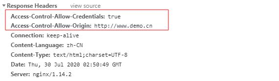

[TOC]


## CORS

### 一、是什么？

​    全称是"跨域资源共享"（Cross-origin resource sharing）。

​	A、引入概念

​	1、简单请求：
​    	1): 请求方式只能是：`head`，`get`，`post`
​    	2): 请求头允许的字段：`Accept`，`Accept-Language`，`Content-Language`，`Last-Event-ID`
​    	`Content-Type`：application/x-www-form-urlencoded、multipart/form-data、text/plain  三选一

​	2、复杂请求：不满足上面的的情况

### 二、为什么？

​    浏览器的同源安全策略：浏览器只允许请求当前域的资源，而对其他域的资源表示不信任。那怎么才算跨域呢？

​      1、请求协议`http,https`的不同

​      2、域`domain`的不同

​      3、端口`port`的不同

### 三、怎么避免

#### A、简单请求

​	浏览器：往请求头添加`origin`，请求头origin字段为当前域

​    服务器：查看请求头的origin，符合要求，放行，并在响应头中放入服务器的规则。




​	其中，最重要的就是`Access-Control-Allow-Origin`，标识允许哪个域的请求。当然，如果服务器不通过，根本没有这个字段，接着触发`XHR`的`onerror`，再接着你就看到浏览器的提示`xxx的服务器没有响应Access-Control-Allow-Origin字段`。

​	上面第一行说到的`Access-Control-Allow-Origin`有多种设置方法：

1. 设置`*`是最简单粗暴的，但是服务器出于安全考虑，肯定不会这么干，而且，如果是`*`的话，浏览器将不会发送`cookies`，即使你的`XHR`设置了`withCredentials`

   （PS：`withCredentials`：表示`XHR`是否接收cookies和发送cookies，也就是说如果该值是`false`，响应头的`Set-Cookie`，浏览器也不会理，并且即使有目标站点的cookies，浏览器也不会发送。）

2. 指定域，如上图中的`http://www.demo.cn`

3. 动态设置为请求域，多人协作时，多个前端对接一个后台，这样很方便

#### B、复杂请求:

​	最常见的情况，当我们使用`put`和`delete`请求时，浏览器会先发送`option`（预检）请求。

​	预检请求：与简单请求不同的是，option请求多了2个字段：

 	`Access-Control-Request-Method`：该次请求的请求方式
 	 `Access-Control-Request-Headers`：该次请求的自定义请求头字段

​	服务器检查通过后，做出响应：

​	// 指定允许其他域名访问
​	`Access-Control-Allow-Origin:http://www.demo.cn` 
​	// 是否允许后续请求携带认证信息（cookies），该值只能是`true`,否则不返回
​	`Access-Control-Allow-Credentials:true`
​	// 预检结果缓存时间，也就是上面说到的缓存啦
​	`Access-Control-Max-Age: 1800`
​	// 允许的请求类型
​	`Access-Control-Allow-Methods:GET,POST,PUT,POST`
​	// 允许的请求头字段
​	`Access-Control-Allow-Headers:x-requested-with,content-type`

​	这里有个注意点：`Access-Control-Request-Method`，`Access-Control-Request-Headers`返回的是满足服务器要求的所有请求方式，请求头，不限于该次请求。


## SpringMVC&CORS

> CORS 官方文档：https://spring.io/blog/2015/06/08/cors-support-in-spring-framework

### 一、源码分析

Web应用启动时候，注册`Handler`(即`Controller`)，会识别`method`上是否有对应的注解`CorsConfig`，如果有则注册到 `Map<HandlerMethod, CorsConfiguration> corsLookup` 中，具体维护方法：

- 注册—`org.springframework.web.servlet.handler.AbstractHandlerMethodMapping.MappingRegistry#register`

- 卸载—`org.springframework.web.servlet.handler.AbstractHandlerMethodMapping.MappingRegistry#unregister`

当外部请求请求Web应用时，请求经过一系列的处理，最终进入`SpringMVC`的`org.springframework.web.servlet.DispatcherServlet#doDispatch`进行处理，此方法会调用`org.springframework.web.servlet.DispatcherServlet#getHandler` 拿出和请求相匹配的对应的`HandlerExecutionChain`，拿出`HandlerExecutionChain`后，调用`org.springframework.web.servlet.HandlerExecutionChain#applyPreHandle `，方法内会获取所有`HandlerInterceptor`，并进行`HandlerInterceptor.preHandle`，当有一个拦截器没有校验通过时，则触发所有`HandlerInterceptor.afterCompletion`后，返回`false`，否则返回`true`

其中就包含 `org.springframework.web.servlet.handler.AbstractHandlerMapping.CorsInterceptor`，实际调用时序，如下图。


```sequence
    title: request到Handler
    participant ...
    participant DispatcherServlet as DS
    participant HandlerExecutionChain as HEC
    participant HandlerInterceptor as HI
    
    ...->DS:DispatcherServlet.doService
    DS->DS:doDispatch
    DS->DS:getHandler
    DS->HEC:HandlerExecutionChain.applyPreHandle
    HEC->HEC:getInterceptors
    HEC->HI:HandlerInterceptor.preHandle
    HEC->HI:IF preHandle = FALSE THEN triggerAfterCompletion HandlerInterceptor.afterCompletion
    
    HEC-->DS:Yes Or No?
    DS-->DS: Yes: do ModelAndView,No just return
	
```

下图是为了展示`org.springframework.web.servlet.handler.AbstractHandlerMapping.CorsInterceptor`的细节：

```sequence
title: HandlerInterceptor.preHandle细节
participant CorsInterceptor as CI
participant CorsProcessor as CP

note left of CI:CorsInterceptor是HandlerInterceptor的一个实现
CI->CP:CorsProcessor.processRequest

```


