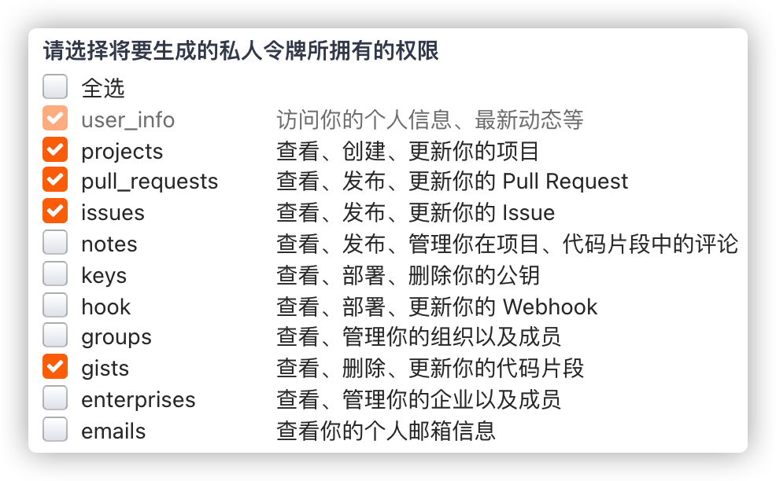

# Action

## 同步仓库

如题：假设我习惯于Github管理我的项目，但是往往由于国内Gitee热度越来越高，我也想在每次我编辑Github上的项目时候

，Gitee自动同步一下Github的项目。

答案：截止目前Gitee不支持自动同步（2021/12/22），仅能支持手动同步，即每次需要去Gitee项目上点击一下手动同步。


显然上述方式，不优雅，那么怎么办呢？我们有以下几种解决方案：

- 本地项目添加两个远程仓库的地址，Push时，分别手动Push到两个仓库。（博主由于日常使用的电脑较多，不可能每台电脑都配置一下）
- 利用Github的Action完成。

### Hub Mirror Action

这个插件是一个开源的项目：[Hub Mirror Action](https://github.com/marketplace/actions/hub-mirror-action)，使用起来很简单，几乎只需要配置Github的Workflow即可完成，废话不多说，我们开始正文。

第一步，你需要有一组SSH密钥对，使用以下命令即可，创建过程会有提示让你输入一些自定义的内容，建议全部默认即可，包括要求输入密码等，建议直接回车不设置，否则后续每次使用密钥都要输密码：

```shell
ssh-keygen -t rsa -C "your_name_or_others"
```

顺利的话，你将会得到两个文件：`id_rsa`、`id_rsa.pub`，分别是私钥、公钥。

第二步，将第一步生成的SSH密钥对的**公钥**配置在Gitee中，访问[这里](https://gitee.com/profile/sshkeys)。

第三步，获取Gitee的Api Token，访问[这里](https://gitee.com/profile/personal_access_tokens)，至于权限嘛，有项目相关权限即可，给多了，万一ApiToken不小心泄露了，就麻烦了。



第四步，将第一步生产的SSH的私钥、Gitee的Api Token都配置在Github的项目Settings中的Secret中，如下图：


最后一步，在项目路径下建立`.github/workflows/sync.yml`，至于`sync`可以换成其他名称也无所谓，内容如下（仅仅提供一个基本的配置，关于支持的其他特性配置，参照官方）：

```yml
# action名称
name: sync
# 触发条件
on:
  # 在Master分支Push的时候
  push:
    branches: master
# 任务
jobs:
  # 这个名称随意
  repo1-sync:
    # 在xx上运行
    runs-on: ubuntu-latest
    # 步骤
    steps:
      # 步骤名称
      - name: Mirror the Github organization repos to Gitee.
        # 使用什么镜像
        uses: Yikun/hub-mirror-action@master
        # 使用什么参数
        with:
          # 源
          src: 'github/ATSJP'
          # 目标
          dst: 'gitee/ATSJP'
          # 目标的SSH私钥，里面的名称就是你在secret里配置的Name
          dst_key: ${{ secrets.ATSJP_ID_RSA }}
          # 目标的Api Token
          dst_token:  ${{ secrets.ATSJP_TOKEN }}
          # 静态名单机制，可以用于更新某些指定库
          static_list: "note"
          # debug模式会打印所有执行的命令
          debug: true
```

不带注释版：

```yml
name: sync
on:
  push:
    branches: master
# 任务
jobs:
  repo1-sync:
    runs-on: ubuntu-latest
    steps:
      - name: Mirror the Github organization repos to Gitee.
        uses: Yikun/hub-mirror-action@master
        with:
          src: 'github/ATSJP'
          dst: 'gitee/ATSJP'
          dst_key: ${{ secrets.ATSJP_ID_RSA }}
          dst_token:  ${{ secrets.ATSJP_TOKEN }}
          static_list: "note"
          debug: true
```

最后，Push到Github即可。


如何查看Action执行日志？

如下图，点击任意workflows，即可看到对应workflows执行的日志等等。

