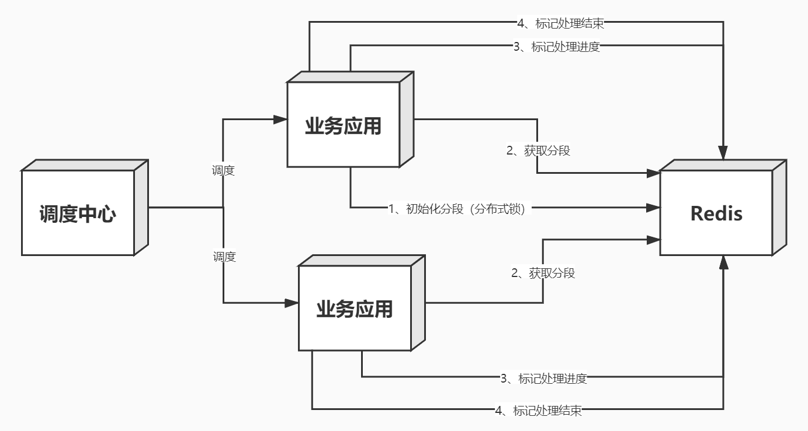
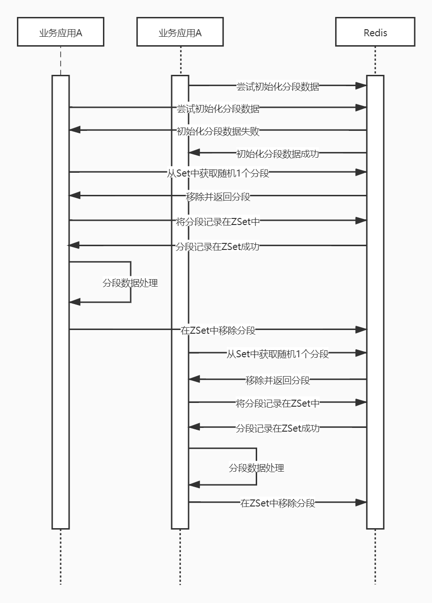

[TOC]


## 数据处理

### 预设场景一

#### 描述

应用情况：有N台应用，N<10，N台应用都有定时任务，且集成了分布式任务，但缺少分片中间件的支撑。

数据情况：有千万级数据需要被读，然后处理。

期望情况：尽可能的快速处理完数据。

#### 业内背景

除了大数据下的MapReduce编程模型（我认为，一家公司的大数据的生态需要强大的后备力量支撑，不然，作为一名业务的软件开发工程师，很难做到拿来即用，另外千万级数据量对于他真是大材小用），业内针对大数据的处理方式还有：多台应用进行分片处理，关于分片处理相关理论的内容很多，基本上是一看就懂，且分片处理大抵都是附在为解决某一领域问题而出现的开源框架上。比如为了解决大数据库集群库问题的MyCat，为了解决分布式数据库的ShardingSphere，为了解决分布式定时任务的Elastic-job等等。

#### 设计方案

在结合业内背景加现有业务的情况下，本场景决定最终采用分片处理的方式。其中采用缓存中间件Redis进行分片数据存储，系统交互形式如下图所示：



##### 细节

###### 如何调度？

调度中心按照指定的调度机制，调度业务应用，触发数据处理任务。

###### 如何分段？

下面引用一些本人从各路资源搜刮到的解决方案。

> 1. Hash
>
>    - 直接定址法： 是以数据元素关键字k本身或它的线性函数作为它的哈希地址，即：hash（k）=k 或 hash（k）=a*k+b ； (其中a,b为常数)。此法仅适合于：地址集合的大小 = = 关键字集合的大小，比如以年龄为key，以年龄对应的人数为value
>    - 数字分析法：假设关键字集合中的每个关键字都是由 s 位数字组成 (u1, u2, …, us)，分析关键字集中的全体，并从中提取分布均匀的若干位或它们的组合作为地址。它只适合于所有关键字值已知的情况。
>    - 折叠法： 将关键字分割成若干部分，然后取它们的叠加和，留下t位作为哈希地址。适用于关键字位数较多，而且关键字中每一位上数字分布大致均匀的情况。
>    - **平方取中法：** 这是一种常用的哈希函数构造方法。这个方法是先取关键字的平方，然后根据可使用空间的大小，选取平方数是中间几位为哈希地址。
>    - 减去法：数据的键值减去一个特定的数值以求得数据存储的位置。
>    - **除留余数法：**这是一种常用的哈希函数构造方法。假设哈希表长为m，p为小于等于m的最大素数，则哈希函数为hash（k）=k % p ，其中%为模p取余运算。
>
>    Hash处理冲突方法：
>
>    - 开放定址法：这种方法也称探测散列法，其基本思想是：当关键字key的哈希地址p=hash（key）出现冲突时，以p为基础，产生另一个哈希地址p1，如果p1仍然冲突，再以p1为基础，产生另一个哈希地址p2，…，直到找出一个不冲突的哈希地址pi ，将相应元素存入其中。这种方法有一个通用的再散列函数形式：
>      Hi=(hash(key)+f(i))% m i=1，2，…，n
>       　　其中hash（key）为关键字key的直接散列地址，m 为表长，f(i)称为增量序列，表示每次再探测试时的地址增量。
>
> 2. 数据分段
>
>    - 按照索引分段
>    - 按照某个业务属性分段
>
> 3. 布隆过滤器（Bloom filter）

考虑到不单独做一个分片应用，故考虑采用数据分段的方式，按照数据的行号或ID（假如ID为自增类型）进行分段。假设总数据量为N，每段大小为S，那么可以得到总段数=N/S+N%S>0?1:0，业务应用得到一个分段为n，根据分段为n又可以得到数据的开始=S\*n，结束= S\* (n + 1) - 1。于是，我们有了一个Utils，用于计算：

```java

	/**
	 * 分段工具
	 */
	private static class FragmentsUtils {
		/**
		 * 计算分段的开始,from Zero
		 *
		 * @param fragmentsSourceDto 分段源数据
		 * @param fragments 指定分段
		 * @return long 分段的开始
		 */
		public static long getFragmentsStart(FragmentsSourceDto fragmentsSourceDto, Long fragments) {
			Long fragmentsSize = fragmentsSourceDto.getFragmentsSize();
			return fragmentsSize * fragments;
		}

		/**
		 * 计算分段的结束,from Zero
		 *
		 * @param fragmentsSourceDto 分段源数据
		 * @param fragments 指定分段
		 * @return long 分段的结束
		 */
		public static long getFragmentsEnd(FragmentsSourceDto fragmentsSourceDto, Long fragments) {
			Long fragmentsSize = fragmentsSourceDto.getFragmentsSize();
			return fragmentsSize * (fragments + 1) - 1L;
		}

		/**
		 * 计算最大的分段,from Zero
		 *
		 * @param fragmentsSourceDto 分段源数据
		 * @return Long 最大的分段
		 */
		public static Long getFragmentsMax(FragmentsSourceDto fragmentsSourceDto) {
			Long fragmentsSize = fragmentsSourceDto.getFragmentsSize();
			Long fragmentsTotal = fragmentsSourceDto.getFragmentsTotal();
			long fragmentsMax = fragmentsTotal / fragmentsSize;
			return fragmentsTotal % fragmentsSize > 0 ? ++fragmentsMax : fragmentsMax;
		}

		/**
		 * 获取总段数,from Zero
		 *
		 * @param fragmentsSourceDto 分段源数据
		 * @return Set<Long>
		 */
		public static Set<Long> getFragments(FragmentsSourceDto fragmentsSourceDto) {
			long fragmentsMax = getFragmentsMax(fragmentsSourceDto);
			Set<Long> fragments = new HashSet<>();
			for (long i = 0L; i < fragmentsMax; i++) {
				fragments.add(i);
			}
			return fragments;
		}

	}

	/**
	 * 分段源数据
	 */
	private static class FragmentsSourceDto implements Serializable {
		private static final long	serialVersionUID	= -5139356577797822667L;
		/**
		 * 分段总量,from 0
		 */
		private final Long			fragmentsTotal;
		/**
		 * 分段大小,from 1
		 */
		private final Long			fragmentsSize;

		public FragmentsSourceDto(Long fragmentsTotal, Long fragmentsSize) {
			this.fragmentsTotal = fragmentsTotal;
			this.fragmentsSize = fragmentsSize;
		}

		public Long getFragmentsTotal() {
			return fragmentsTotal;
		}

		public Long getFragmentsSize() {
			return fragmentsSize;
		}

		@Override
		public String toString() {
			return "FragmentsSourceDto{" + "fragmentsTotal=" + fragmentsTotal + ", fragmentsSize=" + fragmentsSize
					+ '}';
		}
	}
```

有了Utils，还得考虑一下分布式问题，因为每个应用都可以进行分片，当首次初始化分片数据的时候，我们期望只有一个应用进行处理和存储，故此处应加上分布式锁进行控制。

###### 如何获取分段？

在将如何获取分段之前，我们要想一下以下几个点：

- 尽可能的保证获取分段不会因为竞争而导致多个应用获取到了同一个分段。因为谁也不想白白浪费资源，另外如果数据处理没有控制好幂等性，那后果是不堪设想的。
- 能不能不产生竞争，那就要求获取分段是一个原子操作。

结合以上几点，我们想到了一个完美的数据结构，Redis的Set，首先Redist的Set可以存储所有分段数据，且Set本身会去重，所以分段数据想重复是不可能的，另外Redis针对Set的操作提供了SPOP命令，该命令是随机获取N个元素，并且从Set中删除这N个元素。这个数据结构+操作命令，是不是恰好符合我们的要求。所以在分段初始化阶段，我们将分段数据存在在Redis的Set中，应用在执行时，使用SPOP命令获取1个分段即可。

下方是分段+获取分段+数据处理的完整时序图：



##### 问题

- 如何保证分段数据正常结束，而不是因为宕机、线程异常退出等原因造成分段实际处理失败？

  当应用获取分段后，立即将当前的分段存在在Redis的ZSet中，ZSet的Score用时间戳填充，可以利于分段处理的监控。

- 因为分段数据是每段的编号存在Redis中，如果分段数据过大，怎么合理处置？

  尽可能的优化每段大小，采用异步的方式将分段数据存储到Redis中，如果以上还不行，则需要考虑分段的方式是否适用，不适用的时，可以考虑采用Hash环等方式替代。

- 如果待处理数据量不在停的增加，分段数据如何做相应的调整？

  根据实际的业务增量，考虑手动增加N个分段来动态变化

#### 代码实现

```java
package com.focustech.ins.web.appinfo.service;

import org.apache.commons.lang3.StringUtils;
import org.redisson.api.RBucket;
import org.redisson.api.RFuture;
import org.redisson.api.RLock;
import org.redisson.api.RScoredSortedSet;
import org.redisson.api.RSet;
import org.redisson.api.RedissonClient;
import org.redisson.client.protocol.ScoredEntry;
import org.slf4j.Logger;
import org.slf4j.LoggerFactory;

import java.io.Serializable;
import java.math.BigDecimal;
import java.util.Collection;
import java.util.HashSet;
import java.util.Iterator;
import java.util.Set;
import java.util.concurrent.TimeUnit;

/**
 * 分段任务处理
 *
 * @author atsjp
 */
public abstract class AbstractFragmentsService {
	private final Logger logger = LoggerFactory.getLogger(this.getClass());

	/**
	 * 任务处理开始
	 */
	public void start() {
		// 获取prefixCacheKey
		String prefixCacheKey = this.getPrefixCacheKeyNotBlank();
		// 尝试初始化分段预备数据
		if (!this.tryInitFragmentsPrepareData()) {
			logger.info("tryInitFragmentsData fail,prefixCacheKey:{}", prefixCacheKey);
			return;
		}
		// 获取随机一个分段
		Long currentFragments = this.randomOneFragments();
		if (currentFragments == null) {
			logger.info("cannot get fragments,maybe done?,prefixCacheKey:{}", prefixCacheKey);
			return;
		}
		boolean executeResult = false;
		try {
			// 存储当前处理中分段
			if (!this.addFragmentsInProgressCache(currentFragments)) {
				throw new RuntimeException("cannot add fragments in progress cache:" + currentFragments);
			}
			// 执行任务
			executeResult = this.execute(currentFragments);
		} catch (Exception e) {
			logger.error("exception,prefixCacheKey:{},currentFragments:{}", prefixCacheKey, currentFragments, e);
		} finally {
			// 处理失败或者出现异常情况时，回滚数据
			if (!executeResult) {
				// 回滚分段数据
				boolean rollbackFragmentsResult = this.rollbackFragments(currentFragments);
				logger.info("rollbackFragments,prefixCacheKey:{},currentFragments:{},result:{}", prefixCacheKey,
						currentFragments, rollbackFragmentsResult);
			}
			// 删除分段处理中数据-如果处理成功，则删除分段处理中标记；如果处理失败，则删除分段处理中标记。
			boolean removeFragmentsInProgressResult = this.removeFragmentsInProgressCache(currentFragments);
			logger.info("prefixCacheKey:{},currentFragments:{},removeFragmentsInProgressResult:{},executeResult:{}",
					prefixCacheKey, currentFragments, removeFragmentsInProgressResult, executeResult);
		}
	}

	/**
	 * 获取进度
	 */
	public Progress getProgress() {
		RBucket<FragmentsSourceDto> fragmentsSourceBucketCache = this.getFragmentsSourceBucketCache();
		if (!fragmentsSourceBucketCache.isExists()) {
			return null;
		}
		RSet<Long> fragmentsSetCache = this.getFragmentsSetCache();
		if (!fragmentsSetCache.isExists()) {
			return null;
		}
		FragmentsSourceDto fragmentsSourceDto = fragmentsSourceBucketCache.get();
		int remainFragmentSize = fragmentsSetCache.size();
		// 计算进度百分比
		Long fragmentsMax = FragmentsUtils.getFragmentsMax(fragmentsSourceDto);
		BigDecimal progressBar = new BigDecimal(fragmentsMax - remainFragmentSize)
				.divide(new BigDecimal(fragmentsMax), 6, BigDecimal.ROUND_DOWN).multiply(new BigDecimal("100"));
		String progressBarStr = progressBar.setScale(4, BigDecimal.ROUND_DOWN) + "%";
		// 计算当前已处理总数
		long progressNum = (fragmentsMax - remainFragmentSize) * fragmentsSourceDto.getFragmentsSize();
		return new Progress(progressBarStr, progressNum);
	}

	/**
	 * 获取缓存数据
	 *
	 * @return CacheDetail
	 */
	public CacheDetail getCacheDetail() {
		RBucket<FragmentsSourceDto> fragmentsSourceBucketCache = this.getFragmentsSourceBucketCache();
		if (!fragmentsSourceBucketCache.isExists()) {
			return null;
		}
		RScoredSortedSet<Long> fragmentsInProgressCache = this.getFragmentsInProgressCache();
		if (!fragmentsInProgressCache.isExists()) {
			return null;
		}
		FragmentsSourceDto fragmentsSourceDto = fragmentsSourceBucketCache.get();
		// 仅仅返回10个
		Collection<ScoredEntry<Long>> fragmentsInProgressRank = fragmentsInProgressCache.entryRange(0, 10);
		int fragmentsInProgressSize = fragmentsInProgressCache.size();
		return new CacheDetail(fragmentsSourceDto, fragmentsInProgressRank, fragmentsInProgressSize);
	}

	/**
	 * 销毁中间产生的数据
	 *
	 * @return Boolean
	 */
	public Boolean destroy() {
		this.deleteFragmentsSourceCache();
		this.deleteFragmentsCache();
		this.deleteFragmentsInProgressCache();
		return true;
	}

	/**
	 * 分段总量,from 0
	 *
	 * @return Long 分段总量
	 */
	protected abstract Long getFragmentsTotal();

	/**
	 * 分段大小,from 1
	 *
	 * @return Long 分段大小
	 */
	protected abstract Long getFragmentSize();

	/**
	 * RedissonClient，用作缓存
	 *
	 * @return RedissonClient
	 */
	protected abstract RedissonClient getRedissonClient();

	/**
	 * 获取缓存Key的前缀,主要用于分段全过程中产生的缓存数据
	 *
	 * @return String 缓存Key的前缀
	 */
	protected abstract String getPrefixCacheKey();

	/**
	 * 获取锁Key,主要用于锁住分段数据初始化过程
	 *
	 * @return String 锁Key
	 */
	protected abstract String getLockKey();

	/**
	 * 执行任务
	 *
	 * @param fragmentsStart 分段开始,from 0
	 * @param fragmentsEnd 分段结束,from 0
	 * @return boolean 处理结果 true 成功 false 失败
	 */
	protected abstract boolean executeTask(long fragmentsStart, long fragmentsEnd);

	/**
	 * 尽可能的保证分段预备数据初始化成功
	 *
	 * @return boolean true 成功 false 失败
	 */
	private boolean tryInitFragmentsPrepareData() {
		// 获取prefixCacheKey
		String prefixCacheKey = this.getPrefixCacheKeyNotBlank();
		// 是否存在分段数据
		if (this.isExistsFragmentsPrepareData()) {
			return true;
		}
		// 获取lockKey
		String lockKey = this.getLockKeyNotBlank();
		RLock rLock = this.getRedissonClientNotNull().getLock(lockKey);
		if (tryLock(rLock)) {
			// 初始化结果
			boolean initFragmentsDataResult = false;
			try {
				if (!this.isExistsFragmentsPrepareData()) {
					initFragmentsDataResult = this.initFragmentsPrepareData();
					logger.info("initFragments,prefixCacheKey:{},result:{}", prefixCacheKey, initFragmentsDataResult);
				}
			} catch (Exception e) {
				logger.error("exception,prefixCacheKey:{}", prefixCacheKey, e);
			} finally {
				rLock.unlock();
			}
			return initFragmentsDataResult;
		}
		logger.info("try lock fail,prefixCacheKey:{}", prefixCacheKey);
		return false;
	}

	/**
	 * 初始化分段预备数据
	 *
	 * @return boolean 初始化结果
	 */
	private boolean initFragmentsPrepareData() {
		// 获取分段总量
		Long fragmentsTotal = this.getFragmentsTotalNotNullOrZero();
		// 获取分段大小
		Long fragmentsSize = this.getFragmentSizeNotNullOrZero();
		// 存储分段源缓存数据
		FragmentsSourceDto fragmentsSourceDto = new FragmentsSourceDto(fragmentsTotal, fragmentsSize);
		this.setFragmentsSourceCache(fragmentsSourceDto);
		logger.info("fragmentsMax:{}", FragmentsUtils.getFragmentsMax(fragmentsSourceDto));
		// 分段源缓存数据是否存储成功
		boolean isExistsFragmentsSourceBucketCache = this.getFragmentsSourceBucketCache().isExists();
		logger.info("fragmentsSourceCache:{}", isExistsFragmentsSourceBucketCache);
		if (isExistsFragmentsSourceBucketCache) {
			// 存储分段数据缓存
			boolean result = this.setFragmentsCache(FragmentsUtils.getFragments(fragmentsSourceDto));
			logger.info("fragmentsCache:{}", result);
			if (result) {
				return true;
			}
			// 删除段源缓存数据
			this.deleteFragmentsSourceCache();
		}
		return false;
	}

	/**
	 * 是否存在分段预备数据
	 *
	 * @return boolean true 是 false 否
	 */
	private boolean isExistsFragmentsPrepareData() {
		RSet<Long> fragmentsSetCache = this.getFragmentsSetCache();
		RBucket<FragmentsSourceDto> fragmentsSourceBucketCache = this.getFragmentsSourceBucketCache();
		return fragmentsSetCache.isExists() && fragmentsSourceBucketCache.isExists();
	}

	/**
	 * 随机一个分段
	 *
	 * @return Long 分段
	 */
	private Long randomOneFragments() {
		RSet<Long> fragmentsSetCache = this.getFragmentsSetCache();
		Set<Long> set = fragmentsSetCache.removeRandom(1);
		if (set == null || set.isEmpty()) {
			return null;
		}
		Iterator<Long> iterator = set.iterator();
		if (iterator.hasNext()) {
			return iterator.next();
		}
		return null;
	}

	/**
	 * 执行
	 *
	 * @param currentFragments 当前分段
	 * @return boolean 计算结果
	 */
	private boolean execute(Long currentFragments) {
		// 计算当前分段的开始、结束
		FragmentsSourceDto fragmentsSourceDto = this.getFragmentsSourceCache();
		assert fragmentsSourceDto != null;
		long fragmentsStart = FragmentsUtils.getFragmentsStart(fragmentsSourceDto, currentFragments);
		long fragmentsEnd = FragmentsUtils.getFragmentsEnd(fragmentsSourceDto, currentFragments);
		return executeTask(fragmentsStart, fragmentsEnd);
	}

	/**
	 * 存储分段源数据缓存
	 *
	 * @param fragmentsSourceDto 分段源数据
	 */
	private void setFragmentsSourceCache(FragmentsSourceDto fragmentsSourceDto) {
		RBucket<FragmentsSourceDto> fragmentsSourceCache = this.getRedissonClientNotNull()
				.getBucket(getFragmentsSourceCacheKey());
		fragmentsSourceCache.set(fragmentsSourceDto);
	}

	/**
	 * 存储分段数据缓存
	 * 
	 * @param fragments 分段数据
	 * @return boolean true 成功 false 失败
	 */
	private boolean setFragmentsCache(Set<Long> fragments) {
		RSet<Long> fragmentsCache = this.getRedissonClientNotNull().getSet(getFragmentsCacheKey());
		if (fragmentsCache.isExists()) {
			fragmentsCache.delete();
		}
		RFuture<Boolean> fragmentsCacheFuture = fragmentsCache.addAllAsync(fragments);
		try {
			fragmentsCacheFuture.await();
		} catch (InterruptedException e) {
			logger.error("exception", e);
			return false;
		}
		return fragmentsCacheFuture.isSuccess();
	}

	/**
	 * 回滚指定分段
	 *
	 * @param fragments 指定分段
	 * @return boolean 回滚结果 true 成功 false 失败
	 */
	private boolean rollbackFragments(Long fragments) {
		RSet<Long> fragmentsSetCache = this.getFragmentsSetCache();
		return fragmentsSetCache.add(fragments);
	}

	/**
	 * 存储分段处理中数据缓存
	 *
	 * @param fragments 指定分段
	 * @return boolean true 成功 false 失败
	 */
	private boolean addFragmentsInProgressCache(Long fragments) {
		RScoredSortedSet<Long> fragmentsInProgressCache = this.getFragmentsInProgressCache();
		return fragmentsInProgressCache.add(System.currentTimeMillis(), fragments);
	}

	/**
	 * 获取分段源数据缓存
	 *
	 * @return FragmentsSourceDto
	 */
	private FragmentsSourceDto getFragmentsSourceCache() {
		RBucket<FragmentsSourceDto> rBucket = this.getFragmentsSourceBucketCache();
		if (rBucket.isExists()) {
			return rBucket.get();
		}
		return null;
	}

	/**
	 * 获取分段源数据缓存
	 *
	 * @return RBucket<FragmentsSourceDto> 分段源数据缓存
	 */
	private RBucket<FragmentsSourceDto> getFragmentsSourceBucketCache() {
		return this.getRedissonClientNotNull().getBucket(getFragmentsSourceCacheKey());
	}

	/**
	 * 获取分段数据缓存
	 *
	 * @return RSet<Long> 分段数据缓存
	 */
	private RSet<Long> getFragmentsSetCache() {
		return this.getRedissonClientNotNull().getSet(getFragmentsCacheKey());
	}

	/**
	 * 获取处理中的分段数据缓存
	 * 
	 * @return RScoredSortedSet<Long> 处理中的分段数据缓存
	 */
	private RScoredSortedSet<Long> getFragmentsInProgressCache() {
		return this.getRedissonClientNotNull().getScoredSortedSet(getFragmentsInProgressCacheKey());
	}

	/**
	 * 删除分段源缓存数据
	 */
	private void deleteFragmentsSourceCache() {
		RBucket<FragmentsSourceDto> fragmentsSourceCache = this.getRedissonClientNotNull()
				.getBucket(getFragmentsSourceCacheKey());
		if (fragmentsSourceCache.isExists()) {
			fragmentsSourceCache.delete();
		}
	}

	/**
	 * 删除分段数据缓存
	 */
	private void deleteFragmentsCache() {
		RSet<Long> fragmentsCache = this.getRedissonClientNotNull().getSet(getFragmentsCacheKey());
		if (fragmentsCache.isExists()) {
			fragmentsCache.delete();
		}
	}

	/**
	 * 删除处理中的分段数据缓存
	 */
	private void deleteFragmentsInProgressCache() {
		RScoredSortedSet<Long> fragmentsInProgressCache = this.getFragmentsInProgressCache();
		if (fragmentsInProgressCache.isExists()) {
			fragmentsInProgressCache.delete();
		}
	}

	/**
	 * 删除分段处理中指定数据
	 *
	 * @param fragments 指定分段
	 * @return boolean true 成功 false 失败
	 */
	private boolean removeFragmentsInProgressCache(Long fragments) {
		RScoredSortedSet<Long> fragmentsInProgressCache = this.getFragmentsInProgressCache();
		return fragmentsInProgressCache.remove(fragments);
	}

	/**
	 * 获取分段源数据缓存Key
	 * 
	 * @return String 分段源数据缓存Key
	 */
	private String getFragmentsSourceCacheKey() {
		return this.getPrefixCacheKeyNotBlank() + CacheSuffixEnum._FRAGMENTS_SOURCE_.name();
	}

	/**
	 * 获取分段数据缓存Key
	 * 
	 * @return String 分段数据缓存Key
	 */
	private String getFragmentsCacheKey() {
		return this.getPrefixCacheKeyNotBlank() + CacheSuffixEnum._FRAGMENTS_.name();
	}

	/**
	 * 获取处理中的分段数据缓存Key
	 * 
	 * @return String 处理中的分段数据缓存Key
	 */
	private String getFragmentsInProgressCacheKey() {
		return this.getPrefixCacheKeyNotBlank() + CacheSuffixEnum._FRAGMENTS_IN_PROGRESS_.name();
	}

	/**
	 * 获取RedissonClient, throws Exception when RedissonClient is null
	 * 
	 * @return RedissonClient
	 */
	private RedissonClient getRedissonClientNotNull() {
		RedissonClient redissonClient = this.getRedissonClient();
		if (redissonClient == null) {
			throw new RuntimeException("redissonClient cannot be null");
		}
		return redissonClient;
	}

	/**
	 * 分段总量,throws Exception when fragmentsTotal is null or 0
	 *
	 * @return Long 分段总量
	 */
	private Long getFragmentsTotalNotNullOrZero() {
		Long fragmentsTotal = this.getFragmentsTotal();
		if (fragmentsTotal == null || fragmentsTotal == 0) {
			throw new RuntimeException("fragmentsTotal cannot be null or 0");
		}
		return fragmentsTotal;
	}

	/**
	 * 分段大小,throws Exception when fragmentSize is null or 0
	 *
	 * @return Long 分段大小
	 */
	private Long getFragmentSizeNotNullOrZero() {
		Long fragmentSize = this.getFragmentSize();
		if (fragmentSize == null || fragmentSize == 0) {
			throw new RuntimeException("fragmentsTotal cannot be null or 0");
		}
		return fragmentSize;
	}

	/**
	 * 获取缓存Key的前缀, throws Exception when prefixCacheKey is blank
	 * 
	 * @return String
	 */
	private String getPrefixCacheKeyNotBlank() {
		String prefixCacheKey = this.getPrefixCacheKey();
		if (StringUtils.isBlank(prefixCacheKey)) {
			throw new RuntimeException("prefixCacheKey cannot be blank");
		}
		return prefixCacheKey;
	}

	/**
	 * 获取锁Key, throws Exception when lockKey is blank
	 *
	 * @return String 锁Key
	 */
	protected String getLockKeyNotBlank() {
		String lockKey = this.getLockKey();
		if (StringUtils.isBlank(lockKey)) {
			throw new RuntimeException("lockKey cannot be blank");
		}
		return lockKey;
	}

	/**
	 * 尝试加锁
	 * 
	 * @param rLock 锁
	 * @return boolean true 成功 false 失败
	 */
	private boolean tryLock(RLock rLock) {
		boolean isLock;
		try {
			final int waitTime = 0;
			final int leaseTime = 60 * 5;
			isLock = rLock.tryLock(waitTime, leaseTime, TimeUnit.SECONDS);
		} catch (InterruptedException e) {
			if (logger.isErrorEnabled()) {
				logger.error("exception", e);
			}
			return false;
		}
		return isLock;
	}

	/**
	 * 缓存数据尾缀
	 */
	private enum CacheSuffixEnum {
		/**
		 * 分段源数据缓存Key
		 */
		_FRAGMENTS_SOURCE_,
		/**
		 * 分段数据缓存Key
		 */
		_FRAGMENTS_,
		/**
		 * 处理中的分段数据缓存Key
		 */
		_FRAGMENTS_IN_PROGRESS_,;

		CacheSuffixEnum() {
		}
	}

	/**
	 * 分段工具
	 */
	private static class FragmentsUtils {
		/**
		 * 计算分段的开始,from Zero
		 *
		 * @param fragmentsSourceDto 分段源数据
		 * @param fragments 指定分段
		 * @return long 分段的开始
		 */
		public static long getFragmentsStart(FragmentsSourceDto fragmentsSourceDto, Long fragments) {
			Long fragmentsSize = fragmentsSourceDto.getFragmentsSize();
			return fragmentsSize * fragments;
		}

		/**
		 * 计算分段的结束,from Zero
		 *
		 * @param fragmentsSourceDto 分段源数据
		 * @param fragments 指定分段
		 * @return long 分段的结束
		 */
		public static long getFragmentsEnd(FragmentsSourceDto fragmentsSourceDto, Long fragments) {
			Long fragmentsSize = fragmentsSourceDto.getFragmentsSize();
			return fragmentsSize * (fragments + 1) - 1L;
		}

		/**
		 * 计算最大的分段,from Zero
		 *
		 * @param fragmentsSourceDto 分段源数据
		 * @return Long 最大的分段
		 */
		public static Long getFragmentsMax(FragmentsSourceDto fragmentsSourceDto) {
			Long fragmentsSize = fragmentsSourceDto.getFragmentsSize();
			Long fragmentsTotal = fragmentsSourceDto.getFragmentsTotal();
			long fragmentsMax = fragmentsTotal / fragmentsSize;
			return fragmentsTotal % fragmentsSize > 0 ? ++fragmentsMax : fragmentsMax;
		}

		/**
		 * 获取总段数,from Zero
		 *
		 * @param fragmentsSourceDto 分段源数据
		 * @return Set<Long>
		 */
		public static Set<Long> getFragments(FragmentsSourceDto fragmentsSourceDto) {
			long fragmentsMax = getFragmentsMax(fragmentsSourceDto);
			Set<Long> fragments = new HashSet<>();
			for (long i = 0L; i < fragmentsMax; i++) {
				fragments.add(i);
			}
			return fragments;
		}

	}

	/**
	 * 分段源数据
	 */
	private static class FragmentsSourceDto implements Serializable {
		private static final long	serialVersionUID	= -5139356577797822667L;
		/**
		 * 分段总量,from 0
		 */
		private final Long			fragmentsTotal;
		/**
		 * 分段大小,from 1
		 */
		private final Long			fragmentsSize;

		public FragmentsSourceDto(Long fragmentsTotal, Long fragmentsSize) {
			this.fragmentsTotal = fragmentsTotal;
			this.fragmentsSize = fragmentsSize;
		}

		public Long getFragmentsTotal() {
			return fragmentsTotal;
		}

		public Long getFragmentsSize() {
			return fragmentsSize;
		}

		@Override
		public String toString() {
			return "FragmentsSourceDto{" + "fragmentsTotal=" + fragmentsTotal + ", fragmentsSize=" + fragmentsSize
					+ '}';
		}
	}

	/**
	 * 进度
	 */
	public static class Progress implements Serializable {
		private static final long	serialVersionUID	= 3319671207751068477L;
		/**
		 * 进度条
		 */
		private final String		progressBar;
		/**
		 * 进度总数
		 */
		private final Long			progressNum;

		public Progress(String progressBar, Long progressNum) {
			this.progressBar = progressBar;
			this.progressNum = progressNum;
		}

		public String getProgressBar() {
			return progressBar;
		}

		public Long getProgressNum() {
			return progressNum;
		}

		@Override
		public String toString() {
			return "Progress{" + "progressBar='" + progressBar + '\'' + ", progressNum=" + progressNum + '}';
		}
	}

	/**
	 * 缓存数据
	 */
	public static class CacheDetail implements Serializable {
		private static final long					serialVersionUID	= -2072881639607902939L;
		/**
		 * 分段源数据
		 */
		private final FragmentsSourceDto			fragmentsSourceDto;
		/**
		 * 处理中的分段排行
		 */
		private final Collection<ScoredEntry<Long>>	inProgressRank;
		/**
		 * 处理中的分段个数
		 */
		private final Integer						inProgressSize;

		public CacheDetail(FragmentsSourceDto fragmentsSourceDto, Collection<ScoredEntry<Long>> inProgressRank,
				Integer inProgressSize) {
			this.fragmentsSourceDto = fragmentsSourceDto;
			this.inProgressRank = inProgressRank;
			this.inProgressSize = inProgressSize;
		}

		public FragmentsSourceDto getFragmentsSourceDto() {
			return fragmentsSourceDto;
		}

		public Collection<ScoredEntry<Long>> getInProgressRank() {
			return inProgressRank;
		}

		public Integer getInProgressSize() {
			return inProgressSize;
		}

		@Override
		public String toString() {
			return "CacheDetail{" + "fragmentsSourceDto=" + fragmentsSourceDto + ", inProgressRank=" + inProgressRank
					+ ", inProgressSize=" + inProgressSize + '}';
		}
	}

}
```

