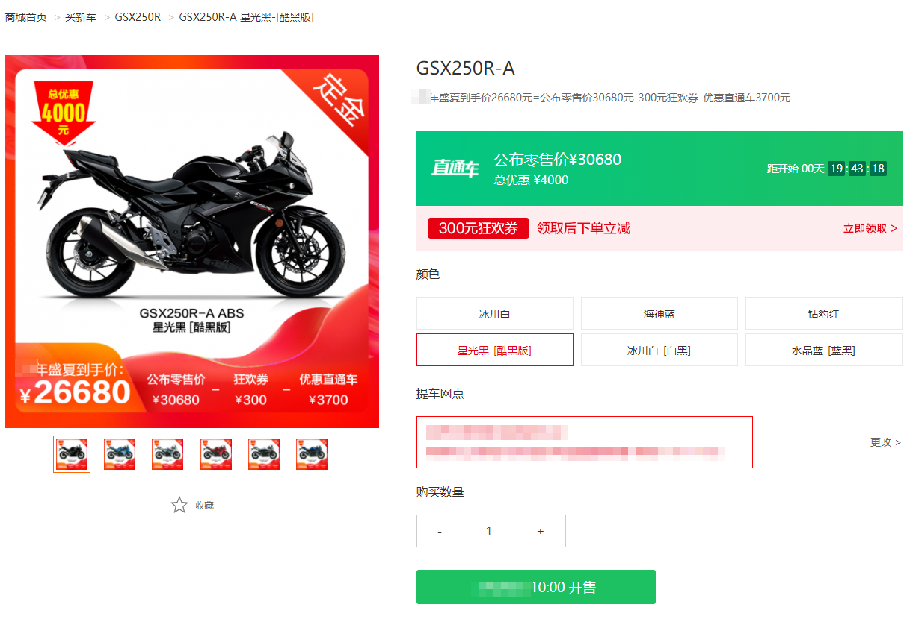
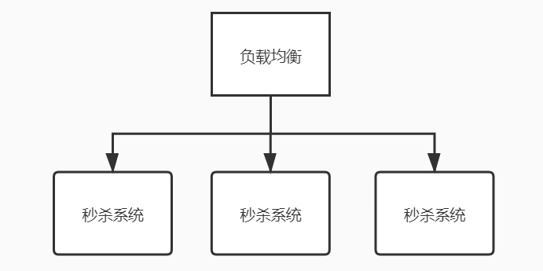
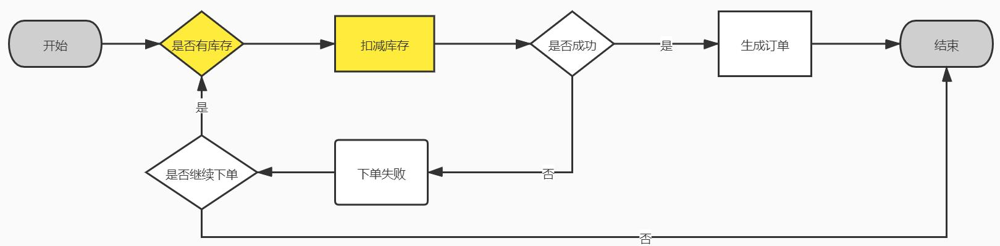
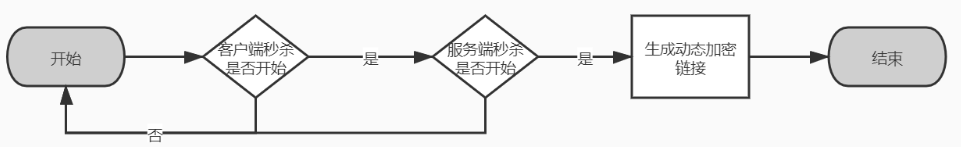

[TOC]

## Seckill-秒杀

>秒杀常常是面试的热门话题，深受广大程序员的热爱，但是你真的把秒杀思考透了吗？

### 何为秒杀？

通常商家为了提供销量，增加收入，会在特定的时间，采用打折、优惠价、低价等方式进行促销。

比如下方的商品，标明了开售时间、价格等重要信息。这时候小伙伴要想了，哇运营傻呀，降价这么多，得少赚多少钱。你要是这么想就太年轻了，运营可不傻，一方面举着降价促销的大旗，一方面在后台设置产品库存为100件，卖完即止。这么一搞，不仅吸引了买家，还不至于自己被白嫖，堪称一箭双雕。

### 秒杀的特性

了解什么是秒杀，我们来分析秒杀具有哪些特性。相信作为读者的你，一定经历过每年的双十一，看着各种“跳楼价”，在那焦急的等待商品开售，时不时的还多戳几下灰色的按钮，生怕错过开售时间，抢不到商品。

那就凭借我们的作为“韭菜”的经验，一起来提取下秒杀的特性：

- 定时开售
- 限定库存

### 秒杀对系统造成的潜在威胁

#### 定时开售

将开卖时间点集中在一起，系统就必须应对高并发的请求，然而高并发中不仅夹杂着普通用户的页面操作请求，还包含着“黄牛”们“无敌”软件发出请求。

#### 限定库存

既然限定库存，那就意味着我们不能超卖。因为库存是公共资源，在保证不能超卖的同时，系统还必须针对库存抢占做好性能优化。

### 应对方案

#### 高并发

##### CDN

为了更好的应对高并发，通常我们会先从用户访问这一步开始说起。前端的页面必然承载着秒杀信息，用户如何更快的访问到页面呢（除了优化代码，因为优化代码是我们必须要做好的一件事）？

就目前来看，**CDN**是个好东西，用户可以从最近的点获取到网页资源，更快的打开页面。不同的用户由于所在地的不同，所访问到的CDN节点也是不同的，这样前端页面资源的请求就被分散在了不同的地域。

##### 负载均衡

再来说说后端，前端有**CDN**加持，后端有啥呢？后端有机器呀，不行咱们怼机器，那怎么怼呢？**负载均衡**，设置一定的策略，分发请求到后端的秒杀系统，以达到均衡分配请求，尽可能的保证整体的吞吐量。其中可以完成负载均衡的中间件有很多，常见的有Nginx、Apache等。

##### 分布式缓存

看起来有了更多的机器，似乎有了信心。但是假设你写的代码烂到一定程度，好长时间才能处理完一个正常的用户的秒杀请求，而你面对的是某宝双十一的访问量，即使租了全亚洲的服务器，也支撑不了你的秒杀系统。

那接下来我们再来分析一下秒杀系统，首先，前端必定有一些数据需要访问后端获的，比如：

- 活动开始-结束时间
- 活动介绍信息（秒杀榜、库存、销量等等）

这些数据咱们总不至于全部从数据库获取吧，数据库那是啥呀，那是磁盘，再牛一些，也只是SSD，速度是有上限的（当然，N年后，可能磁盘也能快的飞起，但是商家就是现在要玩秒杀，你咋办），要不咱们玩点硬核的？把热点数据存放于内存中。

怎么维护好缓存的数据，其实不是一件简单的事情，缓存通常需要考虑**缓存雪崩**，**缓存击穿**，**缓存穿透**等情况，另外如何选择缓存策略也是值得思考的，比如**主动加载**、**被动刷新**，像秒杀的这样的场景，主动加载更加适合。通常在活动开始之前，系统有定时任务会去加载热点数据的缓存，确保在活动开始时，所有热点数据不会落到数据库上。

##### 熔断

###### 算法

好了，秒杀即将开始，作为程序员的我们接到老板通知，必须保证系统高可用。完了，心里凉透了，咋办呢，加机器也没有十足的信心呀。为什么呢？因为我们知道系统的性能上限，然后不知道的是，实际访问量会不会超过这个上限。

核心问题是：已知系统极限，未知访问量，求解如何保证系统不宕机？

答：利用一些优秀的算法，控制系统的访问量，常见的算法有令牌桶算法、漏斗算法。

###### 熔断器

有人说，算法再优秀，那也是需要开发重新造轮子的，毕竟算法不是搬来即用，还需要和业务结合使用。那么是否有开源的框架能干这个事呢？

答案肯定是有的，比如[Sentinel](../HighJava/Distributed/CircuitBreaker/Sentinel.md)、[Hystrix](../HighJava/Distributed/CircuitBreaker/Hystrix.md)等。

##### 服务单一职责

有了熔断，这时候系统访问至少在可控范围内了，接下来要调整的就是系统的性能了，如何尽快的处理一个请求，将是我们的核心目标。

在优化业务性能之前，必须先了解业务流程，见下图： 

可见资源为**库存**，首先库存肯定是要在活动开始之前预先加载到缓存里，那么用户下单只能遇到两种情况：

- 下单失败

  先说说失败的情况，在大量请求访问进来的时候，一定会有大量的并发线程访问库存资源，假设此时库存已经没了，但是单个系统不知道呀，他还是会去请求读取分布式缓存，此时会消耗IO等资源。为了避免这些无用的IO消耗，我们可以在当前系统已知库存没有的情况下，在当前系统本地缓存中，缓存一个标记位，这样下次的请求进来就不用在白白的消耗IO了。

  此时有人肯定要问，万一商家一高兴，在多加点库存怎么办，本地缓存标记位怎么删除？方法有很多，可以单个机器采用日终的方式获取库存的情况，也可以采取单个机器监听库存变化的事件。

- 下单成功

  下单成功，必然涉及**校验及扣减缓存**，这一步尤其重要，我们放在**防超卖**去讲，扣减库存失败，则秒杀失败，反之，则生成订单。

仔细分析一下，我们发现生成订单这一块应该属于订单范畴，按照经验，我们应该有一套订单系统，而秒杀则是单独的一个系统，否则万一秒杀业务真的跪了，那岂不是连生成订单都跪了，整个系统应用宕机，是我们最不想看到的。

所以为了避免核心功能互相影响，我们应该按照合理的方案去拆分系统，比如秒杀系统、订单系统的拆分，就是一个很好的例子，这样的程序设计也符合**服务单一职责**。

##### 消息

上述讲到了，系统拆分，咱们现在手里有秒杀系统、订单系统，那么当用户秒杀成功，秒杀系统和订单系统怎么交互呢？就目前而言，消息或许是一个不错的方案，为什么呢？

消息的特性：

- 异步，完全解耦
- 消除峰值
- 容错
- 可横向扩展

秒杀业务的特性：

- 用户最关心的秒杀结果，即有没有抢到，是否及时生成订单，反倒没那么重要

综上，秒杀成功后，发出秒杀成功消息，订单系统监听秒杀成功消息并且消费，根据秒杀信息生成订单。前端页面，仅仅需要在发起秒杀请求后，异步轮询秒杀结果和下单结果即可。

#### 防超卖

上文基本上贯穿了整个秒杀流程，下面我们来关注下细节，首当其冲的一个问题-超卖。

秒杀流程中和库存有关的有两步骤：

1、校验库存

2、扣减库存

那么超卖是如何产生的呢，假设现在库存是1，有10个线程同时走到了第一步，都发现库存还有，下一步，大家都开始扣减库存。结果可想而知，库存扣减为了负值，超卖就应运而生。那么怎么防止呢？

有以下几种解决方案：

- 对校验库存、扣减库存这两步加（分布式、数据库）锁，保证无其他线程操作

  这种方案，想必大家也能知道有啥缺点，在高并发的情况下，由于锁的粒度太粗，竞争性极高，由于频繁的锁竞争，系统性能会急剧下降。

- 利用中间件Redis的特性，将校验库存、扣减库存写成LUA脚本，两步变成一步

  这么做，避免了加锁带来的性能消耗，而且本身库存数据也需要提前放入缓存中，针对库存的校验及扣减，写在LUA脚本里，在Java仅需要一次调用，即可知道扣减库存的结果，且由于Redis的单进程特性，只要是一步操作，就不会存在线程安全问题。

### 真的万全了嘛

#### 恶意请求

有时候，写个代码，不仅得完成功能，还得防一防同行，常用的手段如：WAF等，在恶意请求到达应用之前，做好拦截。

#### 机器模拟请求

防住了恶意请求，殊不知还有机器请求，这些年头，网上一票难求的场景仍未消去。那怎么防止呢，我们先从黄牛的角度思考下，假设我要想秒杀成功，我肯定会提前分析这个网站，想方设法拿到秒杀的请求，自己组装参数，在活动开始前，就开始铺天盖地的发送请求。好，既然如此，我们就想个法子，不让黄牛提前拿到秒杀链接：

问：为什么需要客户端秒杀开始后，才会去请求服务端秒杀？

答：因为可以尽可能晚的暴露服务端秒杀链接获取接口。

问：为什么服务端还需要校验活动是否开始？

答：因为客户端可以修改系统时间、或者页面倒计时数据

问：为什么要生成动态加密链接？

答：假设商品有10种，ID分别为1-10，如果是明文的链接，比如https://xxx.shop.cn/seckill/1，为第一件商品的秒杀链接，那么稍微有点经验的黄牛，都知道最后一个1是可以枚举的，那么很容易得到其他商品的秒杀链接。

