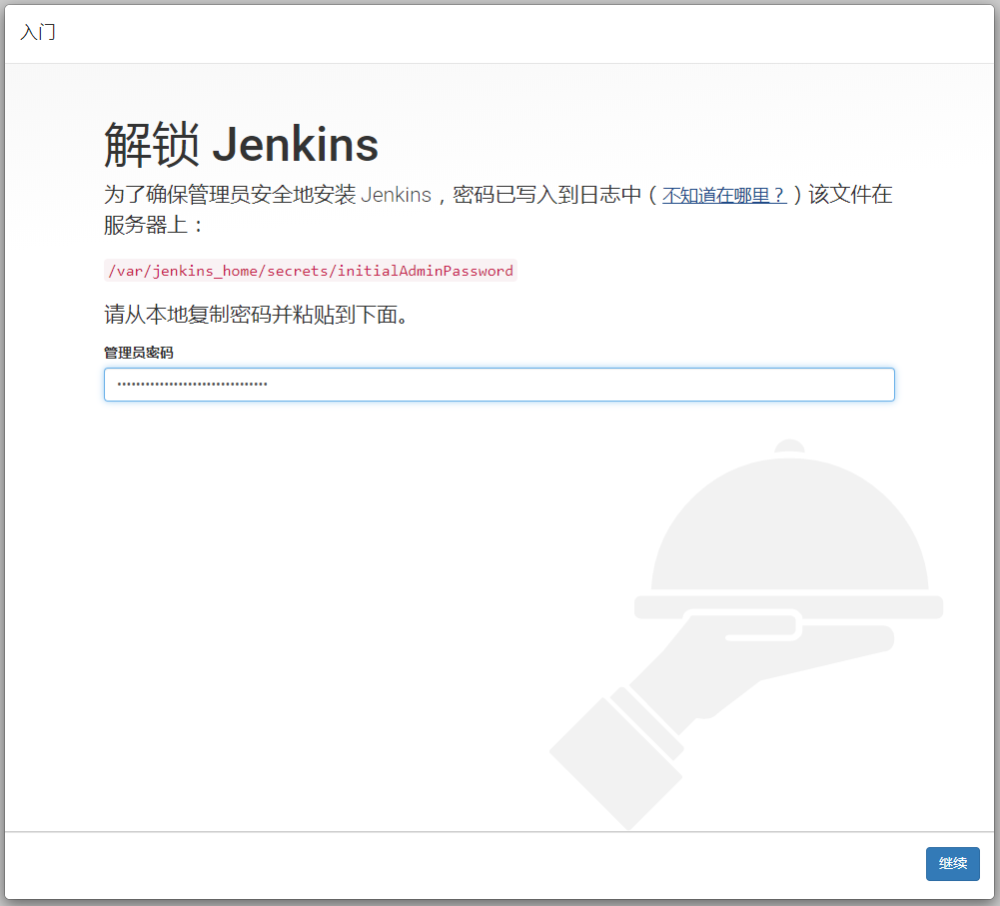
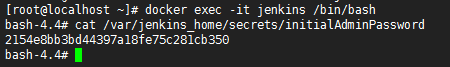
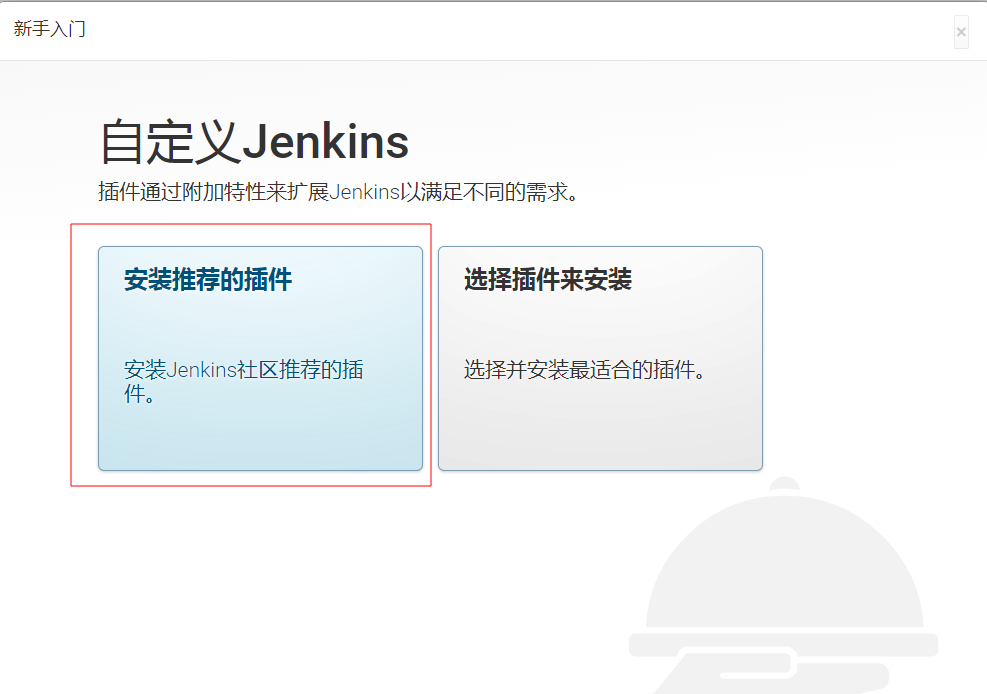

[TOC]


## Docker部署Jenkins单节点

### 1.Docker安装

[点击进入](https://github.com/atsjp/note/tree/master/Docker/Docker.md)

### 2.获取Jenkins镜像 

```shell
docker pull jenkinsci/blueocean
```

### 3.启动Jenkins容器   

```shell
docker run \
  -d \
  --name jenkins \
  -u root \
  -p 9001:8080 -p 50000:50000 \
  -v jenkins-data:/var/jenkins_home \
  -v /var/run/docker.sock:/var/run/docker.sock \
  -v /root/jenkins_home:/root/jenkins_home \
  jenkinsci/blueocean
```
对以上命令，此处大白话解释下（官方有学术的解释>>[飞机票](https://jenkins.io/zh/doc/book/installing/)）：

A、`  -u root \`

此参数不是必选，参数的意思是给当前容器启动设置用户。通常在挂载宿主目录时，由于容器内部的用户和外部的用户是隔离的，存在权限问题，导致挂载所有文件不成功。

B、`-p 9001:8080 -p 50000:50000\  `   

8080是jenkins默认的对外访问端口，而5000端口是当我们在部署多个jenkins实例的时候，可以通过5000端口与主站（这个主站是jenkins集群的主机器）通信。

C、 ` -v jenkins-data:/var/jenkins_home`  

 为了确保我们的Jenkins数据不随着容器的删除而丢失，将容器内部的`/var/jenkins_home`目录以Docker的卷（volume）的形式挂载，这样如果容器被误删了，依旧可以通过此参数，挂载以前配置的数据信息。

D、`  -v /var/run/docker.sock:/var/run/docker.sock \`

Jenkins可以使用宿主的Docker来创建容器。


> 备用命令：
>
> ```shell
> #  --rm 临时启动一个jenkins容器，停止后自动清除
>    docker run \
>    --rm \
> --name jenkins \
> -u root \
>   -p 9001:8080 -p 50000:50000 \
>   -v jenkins-data:/var/jenkins_home \
>   -v /var/run/docker.sock:/var/run/docker.sock \
>   -v /root/jenkins_home:/root/jenkins_home \
>   jenkinsci/blueocean
>   ```

### 4.查看Jenkins

```shell
docker ps | grep jenkins
```

### 5.浏览器访问

localhost:9001/



### 6.获取启动密钥

```shell
docker exec -it jenkins /bin/bash 
cat /var/jenkins_home/secrets/initialAdminPassword
```



### 7.使用

后面就是配置插件的问题了  ，直接按照推荐安装一波即可。如果有失败的也不用慌，可以尝试重试，或者下一步，后续在继续安装（官方的镜像经常安装插件失败，可能和插件源有关）

