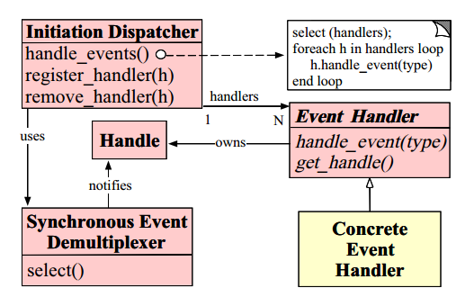
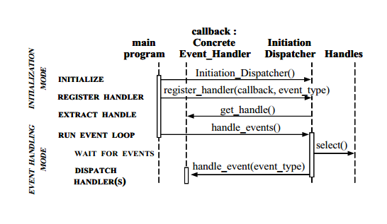
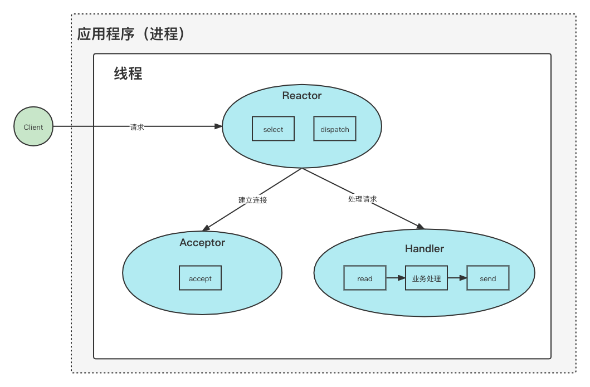
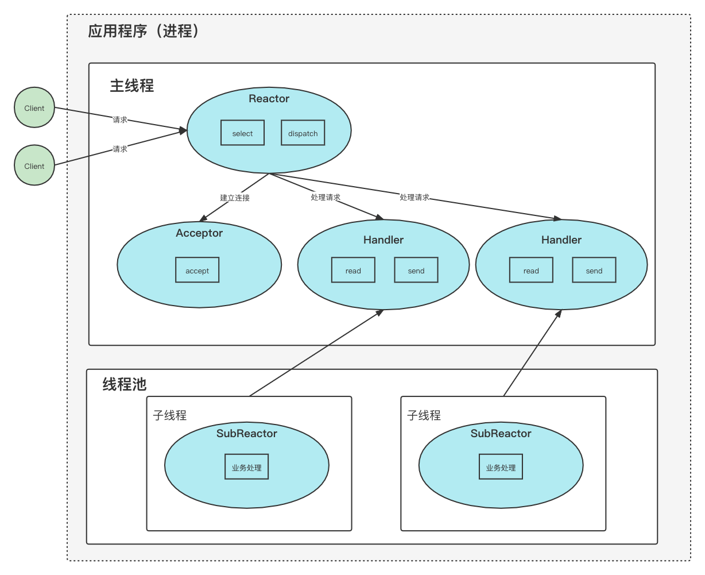

[TOC]

# Reactor模式

## 概念

> 来自于百度百科：
>
> 反应器设计模式(Reactorpattern)是一种为处理服务请求并发提交到一个或者多个服务处理程序的事件设计模式。当请求抵达后，服务处理程序使用解多路分配策略，然后同步地派发这些请求至相关的请求处理程序。

Reactor模式是事件驱动模型，换句话说，内部因外部事件到达而产生的一系列行为。在Reactor模型中，通常由2个角色，一个是Reactor（姑且认为是反应器/分发器），主要负责监听和分发事件，事件类型包含连接事件、读写事件。另一个是Handler（处理器），主要负责事件的处理，如`Read`->业务逻辑->`Write`。当事件/请求到达时，由Reactor负责按照类型进行分发，Handler负责处理事件。

### 类图

该图为Reactor模型，实现Reactor模式需要实现以下几个类：
- Handle(句柄或描述符，在Windows下称为句柄，在Linux下称为描述符，也可以理解为事件)：本质上表示一种资源(比如说文件描述符，或是针对网络编程中的socket描述符)，是由操作系统提供的；该资源用于表示一个个的事件，事件既可以来自于外部，也可以来自于内部；外部事件比如说客户端的连接请求，客户端发送过来的数据等；内部事件比如说操作系统产生的定时事件等。它本质上就是一个文件描述符，Handle是事件产生的发源地。
- Synchronous Event Demultiplexer(同步事件分离器)：它本身是一个系统调用，用于等待事件（Handle）的发生(事件可能是一个，也可能是多个)。调用方在调用它的时候会被阻塞，一直阻塞到同步事件分离器上有事件产生为止。对于Linux来说，同步事件分离器指的就是常用的I/O多路复用机制，比如说select、poll、epoll等。在Java NIO领域中，同步事件分离器对应的组件就是Selector；对应的阻塞方法就是select方法。
- Event Handler(事件处理器)：本身由多个回调方法构成，这些回调方法构成了与应用相关的对于某个事件的反馈机制。在Java NIO领域中并没有提供事件处理器机制让我们调用或去进行回调，是由我们自己编写代码完成的。Netty相比于Java NIO来说，在事件处理器这个角色上进行了一个升级，它为我们开发者提供了大量的回调方法，供我们在特定事件产生时实现相应的回调方法进行业务逻辑的处理，即，ChannelHandler。ChannelHandler中的方法对应的都是一个个事件的回调。
- Concrete Event Handler(具体事件处理器)：是事件处理器的实现。它本身实现了事件处理器所提供的各种回调方法，从而实现了特定于业务的逻辑。它本质上就是我们所编写的一个个的处理器实现。
- Initiation Dispatcher(初始分发器)：实际上就是Reactor角色。它本身定义了一些规范，这些规范用于控制事件的调度方式，同时又提供了应用进行事件处理器的注册、删除等设施。它本身是整个事件处理器的核心所在，Initiation Dispatcher会通过Synchronous Event Demultiplexer来等待事件的发生。一旦事件发生，Initiation Dispatcher首先会分离出每一个事件，然后调用事件处理器，最后调用相关的回调方法来处理这些事件。Netty中ChannelHandler里的一个个回调方法都是由bossGroup或workGroup中的某个EventLoop来调用的。

### 时序图

-  初始化Initiation Dispatcher，然后将若干个Concrete Event Handler注册到Initiation Dispatcher中。当应用向Initiation Dispatcher注册Concrete Event Handler时，会在注册的同时指定感兴趣的事件，即，应用会标识出该事件处理器希望Initiation Dispatcher在某些事件发生时向其发出通知，事件通过Handle来标识，而Concrete Event Handler又持有该Handle。这样，事件-> Handle -> Concrete Event Handler 就关联起来了。
-  Initiation Dispatcher 会要求每个事件处理器向其传递内部的Handle，该Handle向操作系统标识了事件处理器。
-  当所有的Concrete Event Handler都注册完毕后，应用会调用handle_events方法来启动Initiation Dispatcher的事件循环。这时，Initiation Dispatcher会将每个注册的Concrete Event Handler的Handle合并起来，并使用Synchronous Event Demultiplexer(同步事件分离器)同步阻塞的等待事件的发生。比如说，TCP协议层会使用select同步事件分离器操作来等待客户端发送的数据到达连接的socket handler上。再比如，在Java中通过Selector的select()方法来实现这个同步阻塞等待事件发生的操作。在Linux操作系统下，select()的实现中 a)会将已经注册到Initiation Dispatcher的事件调用epollCtl(epfd, opcode, fd, events)注册到linux系统中，这里fd表示Handle，events表示我们所感兴趣的Handle的事件；b)通过调用epollWait方法同步阻塞的等待已经注册的事件的发生。不同事件源上的事件可能同时发生，一旦有事件被触发了，epollWait方法就会返回；c)最后通过发生的事件找到相关联的SelectorKeyImpl对象，并设置其发生的事件为就绪状态，然后将SelectorKeyImpl放入selectedSet中。这样一来我们就可以通过Selector.selectedKeys()方法得到事件就绪的SelectorKeyImpl集合了。
-  当与某个事件源对应的Handle变为ready状态时(比如说，TCP socket变为等待读状态时)，Synchronous Event Demultiplexer就会通知Initiation Dispatcher。 
-  Initiation Dispatcher会触发事件处理器的回调方法，从而响应这个处于ready状态的Handle。当事件发生时，Initiation Dispatcher会将被事件源激活的Handle作为『key』来寻找并分发恰当的事件处理器回调方法。
-  Initiation Dispatcher会回调事件处理器的handle_event(type)回调方法来执行特定于应用的功能(开发者自己所编写的功能)，从而相应这个事件。所发生的事件类型可以作为该方法参数并被该方法内部使用来执行额外的特定于服务的分离与分发

## 模式

在概念中我们已经得知Reactor模式中有2个核心角色：Reactor、Handler，那么如何将这2个核心角色组合在一起使用呢？

根据并发编程的思想，理论上可以有以下组合：

（Tips：单-单进程/线程，多-多进程/线程，具体是进程还是线程，由具体的平台和编程语言决定。）

> 一般来说，C 语言实现的是「单 Reactor 单进程」的方案，因为 C 语编写完的程序，运行后就是一个独立的进程，不需要在进程中再创建线程。
>
> Java 语言实现的是「单 Reactor 单线程」的方案，因为 Java 程序是跑在 Java 虚拟机这个进程上面的，虚拟机中有很多线程，我们写的 Java 程序只是其中的一个线程而已。

- 单Reactor、单Handler
- 单Reactor、多Handler
- 多Reactor、单Handler
- 多Reactor、多Handler

其中，「多Reactor、单Handler」实现方案相比「单Reactor、单Handler」方案，不仅复杂而且也没有性能优势，因此实际中并没有应用。

所以实际使用中有以下组合：

- 单Reactor、单Handler
- 单Reactor、多Handler
- 多Reactor、多Handler

下面就以`Java`为背景，一一介绍一下每种组合。

### 单线程Reactor模式

可以看到线程里有 **Reactor、Acceptor、Handler** 这三个对象：

- Reactor 对象的作用是监听和分发事件；
- Acceptor 对象的作用是获取连接；
- Handler 对象的作用是处理业务；

对象里的 select、accept、read、send 是系统调用函数，dispatch 和 「业务处理」是需要完成的操作，其中 dispatch 是分发事件操作。

流程：

1. 服务器端的Reactor是一个线程对象，该线程会启动事件循环，并使用select（IO 多路复用接口） 监听事件。注册一个Acceptor事件处理器到Reactor中，Acceptor事件处理器所关注的事件是ACCEPT事件，这样Reactor会监听客户端向服务器端发起的连接请求事件(ACCEPT事件)。
2. 客户端向服务器端发起一个连接请求，Reactor监听到了该ACCEPT事件的发生并将该ACCEPT事件派发给相应的Acceptor处理器来进行处理。Acceptor处理器通过accept()方法得到与这个客户端对应的连接(SocketChannel)，然后将该连接所关注的READ事件以及对应的READ事件处理器注册到Reactor中，这样一来Reactor就会监听该连接的READ事件了。或者当你需要向客户端发送数据时，就向Reactor注册该连接的WRITE事件和其处理器。
3. 当Reactor监听到有读或者写事件发生时，将相关的事件派发给对应的Handler进行处理。比如，Handler会通过SocketChannel的read()方法读取数据。
4. 每当处理完所有就绪的感兴趣的I/O事件后，Reactor线程会再次执行select()阻塞等待新的事件就绪并将其分派给对应处理器进行处理。

单线程Reactor模式方案因为全部工作都在同一个进程内完成，所以实现起来比较简单，不需要考虑进程间通信，也不用担心多进程竞争。

但是，这种方案存在 2 个缺点：

- 第一个缺点，因为只有一个进程，**无法充分利用 多核 CPU 的性能**；
- 第二个缺点，Handler 对象在业务处理时，整个进程是无法处理其他连接的事件的，**如果业务处理耗时比较长，那么就造成响应的延迟**；

所以，单 Reactor 单进程的方案**不适用计算机密集型的场景，只适用于业务处理非常快速的场景**。

Redis 是由 C 语言实现的，它采用的正是「单 Reactor 单进程」的方案，因为 Redis 业务处理主要是在内存中完成，操作的速度是很快的，性能瓶颈不在 CPU 上，所以 Redis 对于命令的处理是单进程的方案。

### 使用工作者线程池

与单线程Reactor模式不同的是，添加了一个工作者线程池，并将非I/O操作从Reactor线程中移出转交给工作者线程池来执行。这样能够提高Reactor线程的I/O响应，不至于因为一些耗时的业务逻辑而延迟对后面I/O请求的处理。

使用线程池的优势：

1. 通过重用现有的线程而不是创建新线程，可以在处理多个请求时分摊在线程创建和销毁过程产生的巨大开销。
2. 当请求到达时，工作线程通常已经存在，因此不会由于等待创建线程而延迟任务的执行，从而提高了响应性。
3. 通过适当调整线程池的大小，可以创建足够多的线程以便使处理器保持忙碌状态。同时还可以防止过多线程相互竞争资源而使应用程序耗尽内存或失败。

注意，在上图的改进的版本中，所以的I/O操作依旧由一个Reactor来完成，包括I/O的accept()、read()、write()以及connect()操作。对于一些小容量应用场景，可以使用单线程模型。但是对于高负载、大并发或大数据量的应用场景却不合适，主要原因如下：

1. 一个线程同时处理成百上千的链路，性能上无法支撑，即便NIO线程的CPU负荷达到100%，也无法满足海量消息的读取和发送。
2. 当线程负载过重之后，处理速度将变慢，这会导致大量客户端连接超时，超时之后往往会进行重发，这更加重了NIO线程的负载，最终会导致大量消息积压和处理超时，成为系统的性能瓶颈。

### 多Reactor线程模式

Reactor线程池中的每一Reactor线程都会有自己的事件处理逻辑。MainReactor可以只有一个，但SubReactor一般会有多个。MainReactor线程主要负责接收客户端的连接请求，然后将接收到的SocketChannel传递给SubReactor，由SubReactor来完成和客户端的通信。

流程：

1. 注册一个Acceptor事件处理器到MainReactor中，Acceptor事件处理器所关注的事件是ACCEPT事件，这样MainReactor会监听客户端向服务器端发起的连接请求事件(ACCEPT事件)。启动MainReactor的事件循环。
2. 客户端向服务器端发起一个连接请求，MainReactor监听到了该ACCEPT事件并将该ACCEPT事件派发给Acceptor处理器来进行处理。Acceptor处理器通过accept()方法得到与这个客户端对应的连接(SocketChannel)，然后将这个SocketChannel传递给SubReactor线程池。
3. SubReactor线程池分配一个SubReactor线程给这个SocketChannel，即将SocketChannel关注的READ事件以及对应的READ事件处理器注册到SubReactor线程中。当然你也注册WRITE事件以及WRITE事件处理器到SubReactor线程中以完成I/O写操作。
4. 当有I/O事件就绪时，相关的SubReactor就将事件派发给响应的Handler处理。注意，这里SubReactor线程只负责完成I/O的read()操作，在读取到数据后将业务逻辑的处理放入到线程池中完成，若完成业务逻辑后需要返回数据给客户端，则相关的I/O的write操作还是会被提交回SubReactor线程来完成。

注意，所以的I/O操作(包括，I/O的accept()、read()、write()以及connect()操作)依旧还是在Reactor线程(mainReactor线程 或 subReactor线程)中完成的。Thread Pool(线程池)仅用来处理非I/O操作的逻辑。

多Reactor线程模式将“接受客户端的连接请求”和“与该客户端的通信”分在了两个Reactor线程来完成。MainReactor完成接收客户端连接请求的操作，它不负责与客户端的通信，而是将建立好的连接转交给SubReactor线程来完成与客户端的通信，这样一来就不会因为read()数据量太大而导致后面的客户端连接请求得不到即时处理的情况。并且多Reactor线程模式在海量的客户端并发请求的情况下，还可以通过实现SubReactor线程池来将海量的连接分发给多个SubReactor线程，在多核的操作系统中这能大大提升应用的负载和吞吐量。

# Netty 与 Reactor模式

Netty的线程模式就是一个实现了Reactor模式的经典模式。

- 结构对应：
   NioEventLoop ———— Initiation Dispatcher
   Synchronous EventDemultiplexer ———— Selector
   Evnet Handler ———— ChannelHandler
   ConcreteEventHandler ———— 具体的ChannelHandler的实现
- 模式对应：
   Netty服务端使用了“多Reactor线程模式”
   mainReactor ———— bossGroup(NioEventLoopGroup) 中的某个NioEventLoop
   subReactor ———— workerGroup(NioEventLoopGroup) 中的某个NioEventLoop
   acceptor ———— ServerBootstrapAcceptor
   ThreadPool ———— 用户自定义线程池
- 流程：
   1. 当服务器程序启动时，会配置ChannelPipeline，ChannelPipeline中是一个ChannelHandler链，所有的事件发生时都会触发Channelhandler中的某个方法，这个事件会在ChannelPipeline中的ChannelHandler链里传播。然后，从bossGroup事件循环池中获取一个NioEventLoop来现实服务端程序绑定本地端口的操作，将对应的ServerSocketChannel注册到该NioEventLoop中的Selector上，并注册ACCEPT事件为ServerSocketChannel所感兴趣的事件。
   2. NioEventLoop事件循环启动，此时开始监听客户端的连接请求。
   3. 当有客户端向服务器端发起连接请求时，NioEventLoop的事件循环监听到该ACCEPT事件，Netty底层会接收这个连接，通过accept()方法得到与这个客户端的连接(SocketChannel)，然后触发ChannelRead事件(即，ChannelHandler中的channelRead方法会得到回调)，该事件会在ChannelPipeline中的ChannelHandler链中执行、传播。
   4. ServerBootstrapAcceptor的readChannel方法会该SocketChannel(客户端的连接)注册到workerGroup(NioEventLoopGroup) 中的某个NioEventLoop的Selector上，并注册READ事件为SocketChannel所感兴趣的事件。启动SocketChannel所在NioEventLoop的事件循环，接下来就可以开始客户端和服务器端的通信了。

