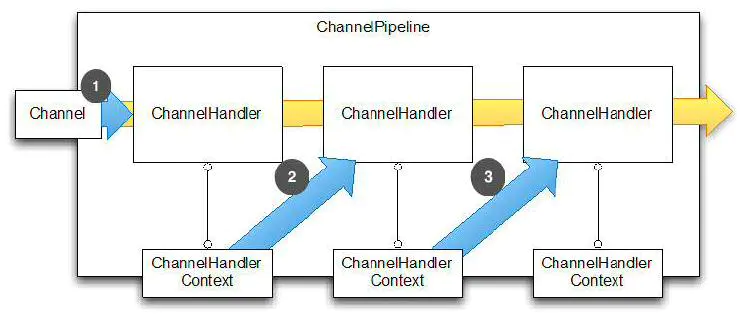

### 什么是Netty？

> Netty 是一个利用 Java 的高级网络的能力，隐藏其背后的复杂性而提供一个易于使用的 API 的客户端/服务器框架。
>  Netty 是一个广泛使用的 Java 网络编程框架（Netty 在 2011 年获得了Duke's Choice Award，见[https://www.java.net/dukeschoice/2011](https://links.jianshu.com/go?to=https%3A%2F%2Fwww.java.net%2Fdukeschoice%2F2011)）。它活跃和成长于用户社区，像大型公司 Facebook 和 Instagram 以及流行 开源项目如 Infinispan, HornetQ, Vert.x, Apache Cassandra 和 Elasticsearch 等，都利用其强大的对于网络抽象的核心代码。

Channel，表示一个连接，可以理解为每一个请求，就是一个Channel

**ChannelHandler**，核心处理业务就在这里，用于处理业务请求

ChannelHandlerContext，用于传输业务数据

ChannelPipeline，用于保存处理过程需要用到的ChannelHandler和ChannelHandlerContext

 