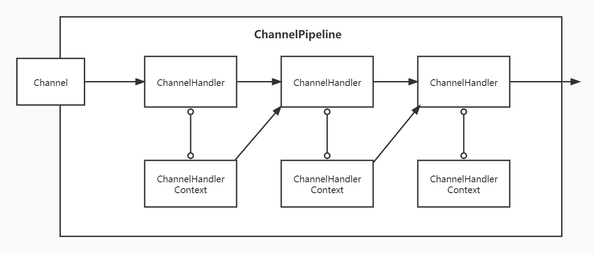
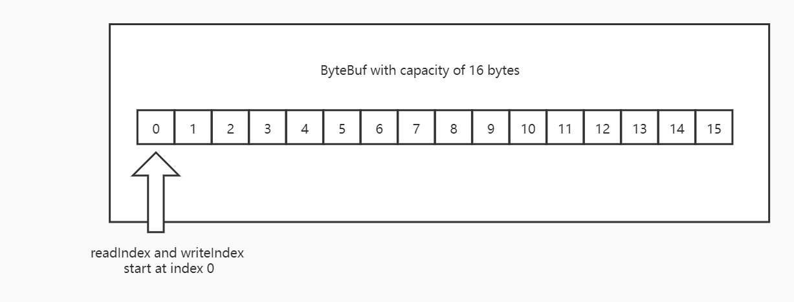

[TOC]

## Netty

题外话：在开始了解Netty之前，请务必完全知晓IO的基本概念，这将助于你更好的学习Netty。

飞机票：[IO](../../../../BaseJava/IO/IO.md)、[NIO](../../../../BaseJava/IO/NIO.md)

### 什么是Netty？

先来看看[官网](https://netty.io)的介绍：

> Netty is *an asynchronous event-driven network application framework*
> for rapid development of maintainable high performance protocol servers & clients.
>
> Netty 是一个异步事件驱动的网络应用程序框架
> 用于快速开发可维护的高性能协议服务器和客户端。

再来看看百度百科：

> Netty是由[JBOSS](https://baike.baidu.com/item/JBOSS)提供的一个[java开源](https://baike.baidu.com/item/java开源/10795649)框架，现为 [Github](https://baike.baidu.com/item/Github/10145341)上的独立项目。Netty提供异步的、[事件驱动](https://baike.baidu.com/item/事件驱动/9597519)的网络应用程序框架和工具，用以快速开发高性能、高可靠性的[网络服务器](https://baike.baidu.com/item/网络服务器/99096)和客户端程序。
>
> 也就是说，Netty 是一个基于NIO的客户、服务器端的编程框架，使用Netty 可以确保你快速和简单的开发出一个网络应用，例如实现了某种协议的客户、[服务端](https://baike.baidu.com/item/服务端/6492316)应用。Netty相当于简化和流线化了网络应用的编程开发过程，例如：基于TCP和UDP的socket服务开发。
>
> “快速”和“简单”并不用产生维护性或性能上的问题。Netty 是一个吸收了多种协议（包括FTP、SMTP、HTTP等各种二进制文本协议）的实现经验，并经过相当精心设计的项目。最终，Netty 成功的找到了一种方式，在保证易于开发的同时还保证了其应用的性能，稳定性和伸缩性

咱们自己总结一下：Netty是一个基于NIO的网络编程框架，他具有异步、以事件为驱动的特性，同时高性能和可扩展。

### 特性

PS：自己总结的再好有官方的解释精准吗？废话少说，直接搬运官方的，咱们做个翻译官。

#### 设计

- Unified API for various transport types - blocking and non-blocking socket

  为多样的传输类型提供统一的API——阻塞和非阻塞的Socket

- Based on a flexible and extensible event model which allows clear separation of concerns

  基于灵活且可扩展的事件模型，允许清晰的关注点分离

- Highly customizable thread model - single thread, one or more thread pools such as SEDA

  高度可定制的线程模型——单线程、一个或多个线程池，如 SEDA

- True connectionless datagram socket support (since 3.1)

  真正的无连接数据报套接字支持（自 3.1 起）

#### 使用简单

- Well-documented Javadoc, user guide and examples

  有据可查的 Javadoc、用户指南和示例

- No additional dependencies, JDK 5 (Netty 3.x) or 6 (Netty 4.x) is enough

  没有额外的依赖，JDK 5 (Netty 3.x) 或 6 (Netty 4.x) 就足够了

  - Note: Some components such as HTTP/2 might have more requirements. Please refer to [the Requirements page](https://netty.io/wiki/requirements.html) for more information.

    注意：某些组件（例如 HTTP/2）可能有更多要求。 请参阅[需求页面](https://netty.io/wiki/requirements.html)了解更多信息。

#### 性能

- Better throughput, lower latency

  更高的吞吐量，更低的延迟

- Less resource consumption

  更少的资源消耗

- Minimized unnecessary memory copy

  最小化不必要的内存复制

#### 安全 

- Complete SSL/TLS and StartTLS support

  完整的 SSL/TLS 和 StartTLS 支持 

#### 社区

- Release early, release often

  发布的更早和更频繁

- The author has been writing similar frameworks since 2003 and he still finds your feed back precious!

  作者自 2003 年以来一直在编写类似的框架，他仍然认为您的反馈很宝贵！

### 系统架构

这是官网的系统架构图：

### 构成部分

#### Channel

Channel是 Java NIO 的一个基本构造。可以看作是传入或传出数据的载体。因此，它可以被打开或关闭，连接或者断开连接。

#### CallBack

CallBack通常被称为回调，提供给另一个方法作为引用，这样后者就可以在某个合适的时间调用前者。

#### Future

Future 提供了另外一种通知应用操作已经完成的方式。这个对象作为一个异步操作结果的占位符,它将在将来的某个时候完成并提供结果。

Netty 的异步编程模型都是建立在 Future 与 Callback 概念之上的。

#### Event 和 Handler

Netty 使用不同的事件来通知我们更改的状态或操作的状态，这使我们能够根据发生的事件触发适当的行为。

### 核心组件

#### Bootstrap相关

Bootstarp（客户端） 和 ServerBootstrap（服务端） 被称为引导类，指对应用程序进行配置，并使他运行起来的过程。

##### Bootstrap

Bootstrap 是客户端的引导类，Bootstrap 在调用 bind()（连接UDP）和 connect()（连接TCP）方法时，会新创建一个 Channel，仅创建一个单独的、没有父 Channel 的 Channel 来实现所有的网络交换。

##### ServerBootstrap

ServerBootstrap 是服务端的引导类，ServerBootstarp 在调用 bind() 方法时会创建一个 ServerChannel 来接受来自客户端的连接，并且该 ServerChannel 管理了多个子 Channel 用于同客户端之间的通信。

#### Channel相关

##### Channel

底层网络传输 API 必须提供给应用 I/O操作的接口，如read()，write()，connenct()，bind()等等。对于我们来说，这是结构几乎总是会成为一个“Socket”。 Netty 中的接口 Channel 定义了与 Socket 丰富交互的操作集：bind、 close、 config、connect、isActive、 isOpen、isWritable、 read、write 等等。 

Netty 提供大量的 Channel 实现来专门使用。这些包括 AbstractChannel，AbstractNioByteChannel，AbstractNioChannel，EmbeddedChannel， LocalServerChannel，NioSocketChannel 等等。

与Channel相关的概念有以下四个：

- ChannelHandler，核心处理业务就在这里，用于处理业务请求。
- ChannelHandlerContext，用于传输业务数据。
- ChannelPipeline，用于保存处理过程需要用到的ChannelHandler和ChannelHandlerContext。

##### ChannelHandler

ChannelHandler 是对 Channel 中数据的处理器，这些处理器可以是系统本身定义好的编解码器，也可以是用户自定义的。这些处理器会被统一添加到一个 ChannelPipeline 的对象中，然后按照添加的顺序对 Channel 中的数据进行依次处理。

##### ChannelPipeline

ChannelPipeline 提供了一个容器给 ChannelHandler 链，并提供了一个API 用于管理沿着链入站和出站事件的流动。每个 Channel 都有自己的ChannelPipeline，当 Channel 创建时自动创建的。

##### ChannelFuture

Netty 中所有的 I/O 操作都是异步的，即操作不会立即得到返回结果，所以 Netty 中定义了一个 ChannelFuture 对象作为这个异步操作的“代言人”，表示异步操作本身。如果想获取到该异步操作的返回值，可以通过该异步操作对象的addListener() 方法为该异步操作添加监听器，为其注册回调：当结果出来后马上调用执行。

##### ByteBuf

- ByteBuf是一个存储字节的容器，最大特点就是**使用方便**，它既有自己的读索引和写索引，方便你对整段字节缓存进行读写，也支持get/set，方便你对其中每一个字节进行读写，他的数据结构如下图所示：

他有三种使用模式：

1. Heap Buffer 堆缓冲区
    堆缓冲区是ByteBuf最常用的模式，他将数据存储在JVM的堆空间。

2. Direct Buffer 直接缓冲区

   直接缓冲区是ByteBuf的另外一种常用模式，他的内存分配都不发生在堆，JDK1.4引入的NIO的ByteBuffer类，允许jvm通过本地方法调用分配内存，这样做有两个好处

   - 通过免去中间交换的内存拷贝，提升IO处理速度；直接缓冲区的内容可以驻留在垃圾回收扫描的堆区以外。
   - DirectBuffer 在 -XX:MaxDirectMemorySize=xxM大小限制下，使用 Heap 之外的内存，GC对此”无能为力”，也就意味着规避了在高负载下频繁的GC过程对应用线程的中断影响。

3. Composite Buffer 复合缓冲区
    复合缓冲区相当于多个不同ByteBuf的视图，这是Netty提供的，Jdk不提供这样的功能。

除此之外，他还提供一大堆Api方便你使用，在这里我就不一一列出了。

##### Codec

Netty中的编码/解码器，通过他你能完成字节与实体Bean的相互转换，从而达到自定义协议的目的。 在Netty里面最有名的就是HttpRequestDecoder和HttpResponseEncoder了。

#### Event相关

##### EventLoop

EventLoop 定义了Netty的核心抽象，用于处理 Channel 的 I/O 操作。在内部，将会为每个Channel分配一个EventLoop，用于处理用户连接请求、对用户请求的处理等所有事件。EventLoop 本身只是一个线程驱动，在其生命周期内只会绑定一个线程，让该线程处理一个 Channel 的所有 IO 事件。

一个 Channel 一旦与一个 EventLoop 相绑定，那么在 Channel 的整个生命周期内是不能改变的。

一个 EventLoop 可以与多个 Channel 绑定。即 Channel 与 EventLoop 的关系是 n:1，而 EventLoop 与线程的关系是 1:1。

#####  EventLoopGroup

EventLoopGroup 是一个 EventLoop 池，包含很多的 EventLoop。

### 为什么

#### 为什么要有Netty

#### Netty为什么封装好

上代码

#### Netty为什么并发高

NIO

#### Netty为什么快

零拷贝

### 对比

#### Netty  & Tomcat

Netty和Tomcat最大的区别就在于通信协议，Tomcat是基于Http协议的，他的实质是一个基于Http协议的Web容器，但是Netty不一样，他能通过编程自定义各种协议，因为Netty能够通过Codec自己来编码/解码字节流，完成类似Redis访问的功能，这就是Netty和Tomcat最大的不同。

有人说Netty的性能就一定比Tomcat性能高，其实不然，Tomcat从6.x开始就支持了NIO模式，并且后续还有APR模式——一种通过JNI调用Apache网络库的模式，相比于旧的BIO模式，并发性能得到了很大提高，特别是APR模式，而Netty是否比Tomcat性能更高，则要取决于Netty程序作者的技术实力了。

