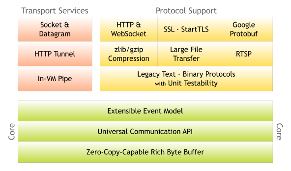

[TOC]

## Netty

题外话：在开始了解Netty之前，请务必完全知晓IO的基本概念，这将助于你更好的学习Netty。

飞机票：[IO](../../../../BaseJava/IO/IO.md)、[NIO](../../../../BaseJava/IO/NIO.md)

### 什么是Netty？

先来看看[官网](https://netty.io)的介绍：

> Netty is *an asynchronous event-driven network application framework*
> for rapid development of maintainable high performance protocol servers & clients.

再来看看百度百科：

> Netty是由[JBOSS](https://baike.baidu.com/item/JBOSS)提供的一个[java开源](https://baike.baidu.com/item/java开源/10795649)框架，现为 [Github](https://baike.baidu.com/item/Github/10145341)上的独立项目。Netty提供异步的、[事件驱动](https://baike.baidu.com/item/事件驱动/9597519)的网络应用程序框架和工具，用以快速开发高性能、高可靠性的[网络服务器](https://baike.baidu.com/item/网络服务器/99096)和客户端程序。
>
> 也就是说，Netty 是一个基于NIO的客户、服务器端的编程框架，使用Netty 可以确保你快速和简单的开发出一个网络应用，例如实现了某种协议的客户、[服务端](https://baike.baidu.com/item/服务端/6492316)应用。Netty相当于简化和流线化了网络应用的编程开发过程，例如：基于TCP和UDP的socket服务开发。
>
> “快速”和“简单”并不用产生维护性或性能上的问题。Netty 是一个吸收了多种协议（包括FTP、SMTP、HTTP等各种二进制文本协议）的实现经验，并经过相当精心设计的项目。最终，Netty 成功的找到了一种方式，在保证易于开发的同时还保证了其应用的性能，稳定性和伸缩性

咱们自己总结一下：Netty是一个基于NIO的网络编程框架，他具有异步、以事件为驱动的特性，同时高性能。

### 特性

PS：自己总结的再好有官方的解释精准吗？废话少说，直接搬运官方的，咱们做个翻译官。

#### 设计

- Unified API for various transport types - blocking and non-blocking socket

  为多样的传输类型提供统一的API——阻塞和非阻塞的Socket

- Based on a flexible and extensible event model which allows clear separation of concerns

  基于灵活且可扩展的事件模型，允许清晰的关注点分离

- Highly customizable thread model - single thread, one or more thread pools such as SEDA

  高度可定制的线程模型——单线程、一个或多个线程池，如 SEDA

- True connectionless datagram socket support (since 3.1)

  真正的无连接数据报套接字支持（自 3.1 起）

#### 使用简单

- Well-documented Javadoc, user guide and examples

  有据可查的 Javadoc、用户指南和示例

- No additional dependencies, JDK 5 (Netty 3.x) or 6 (Netty 4.x) is enough

  没有额外的依赖，JDK 5 (Netty 3.x) 或 6 (Netty 4.x) 就足够了

  - Note: Some components such as HTTP/2 might have more requirements. Please refer to [the Requirements page](https://netty.io/wiki/requirements.html) for more information.

    注意：某些组件（例如 HTTP/2）可能有更多要求。 请参阅[需求页面](https://netty.io/wiki/requirements.html)了解更多信息。

#### 性能

- Better throughput, lower latency

  更高的吞吐量，更低的延迟

- Less resource consumption

  更少的资源消耗

- Minimized unnecessary memory copy

  最小化不必要的内存复制

#### 安全 

- Complete SSL/TLS and StartTLS support

  完整的 SSL/TLS 和 StartTLS 支持 

#### 社区

- Release early, release often

  早发布，经常发布

- The author has been writing similar frameworks since 2003 and he still finds your feed back precious!

  作者自 2003 年以来一直在编写类似的框架，他仍然认为您的反馈很宝贵！

### 系统架构

这是官网的系统架构图：

### 核心组件

#### Channel

Channel是 Java NIO 的一个基本构造。可以看作是传入或传出数据的载体。因此，它可以被打开或关闭，连接或者断开连接。

与channel相关的概念有以下四个，上一张图让你了解Netty里面的Channel。

- ChannelHandler，核心处理业务就在这里，用于处理业务请求。

- ChannelHandlerContext，用于传输业务数据。

- ChannelPipeline，用于保存处理过程需要用到的ChannelHandler和ChannelHandlerContext。

#### EventLoop & EventLoopGroup

EventLoop 定义了Netty的核心抽象，用来处理连接的生命周期中所发生的事件，在内部，将会为每个Channel分配一个EventLoop。

EventLoopGroup 是一个 EventLoop 池，包含很多的 EventLoop。

Netty 为每个 Channel 分配了一个 EventLoop，用于处理用户连接请求、对用户请求的处理等所有事件。EventLoop 本身只是一个线程驱动，在其生命周期内只会绑定一个线程，让该线程处理一个 Channel 的所有 IO 事件。

一个 Channel 一旦与一个 EventLoop 相绑定，那么在 Channel 的整个生命周期内是不能改变的。一个 EventLoop 可以与多个 Channel 绑定。即 Channel 与 EventLoop 的关系是 n:1，而 EventLoop 与线程的关系是 1:1。

#### ServerBootstrap & Bootstrap

Bootstarp 和 ServerBootstrap 被称为引导类，指对应用程序进行配置，并使他运行起来的过程。Netty处理引导的方式是使你的应用程序和网络层相隔离。

Bootstrap 是客户端的引导类，Bootstrap 在调用 bind()（连接UDP）和 connect()（连接TCP）方法时，会新创建一个 Channel，仅创建一个单独的、没有父 Channel 的 Channel 来实现所有的网络交换。

ServerBootstrap 是服务端的引导类，ServerBootstarp 在调用 bind() 方法时会创建一个 ServerChannel 来接受来自客户端的连接，并且该 ServerChannel 管理了多个子 Channel 用于同客户端之间的通信。

#### ChannelHandler & ChannelPipeline

ChannelHandler 是对 Channel 中数据的处理器，这些处理器可以是系统本身定义好的编解码器，也可以是用户自定义的。这些处理器会被统一添加到一个 ChannelPipeline 的对象中，然后按照添加的顺序对 Channel 中的数据进行依次处理。

#### ChannelFuture

Netty 中所有的 I/O 操作都是异步的，即操作不会立即得到返回结果，所以 Netty 中定义了一个 ChannelFuture 对象作为这个异步操作的“代言人”，表示异步操作本身。如果想获取到该异步操作的返回值，可以通过该异步操作对象的addListener() 方法为该异步操作添加监 NIO 网络编程框架 Netty 听器，为其注册回调：当结果出来后马上调用执行。

Netty 的异步编程模型都是建立在 Future 与回调概念之上的。

### 为什么

#### Netty为什么封装好

上代码

#### Netty为什么并发高

NIO

#### Netty为什么快

零拷贝

### 对比

#### Netty  & Tomcat

Netty和Tomcat最大的区别就在于通信协议，Tomcat是基于Http协议的，他的实质是一个基于http协议的web容器，但是Netty不一样，他能通过编程自定义各种协议，因为netty能够通过codec自己来编码/解码字节流，完成类似redis访问的功能，这就是netty和tomcat最大的不同。

有人说netty的性能就一定比tomcat性能高，其实不然，tomcat从6.x开始就支持了nio模式，并且后续还有APR模式——一种通过jni调用apache网络库的模式，相比于旧的bio模式，并发性能得到了很大提高，特别是APR模式，而netty是否比tomcat性能更高，则要取决于netty程序作者的技术实力了。

