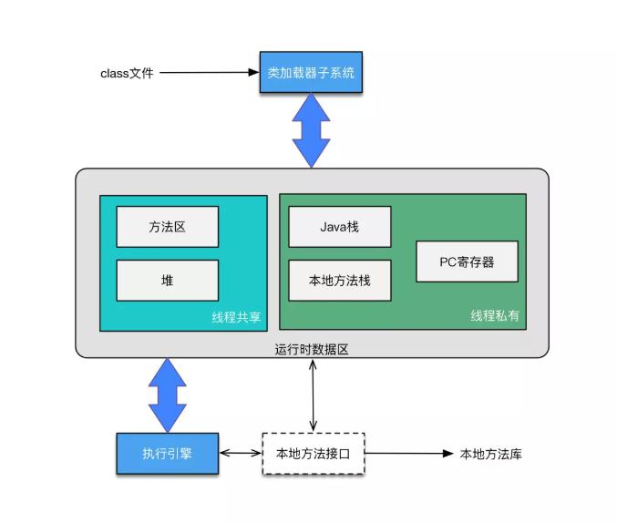

[TOC]

## JVM之运行时数据区

### 一、总览

**线程私有**：
Java虚拟机栈，本地方法栈，程序计数器

**共享**：
Java堆，本地方法区

### 二、各个数据区

#### 1、程序计数器

程序计数器，每个线程在运行时，不可避免CPU动态切换执行不同的线程，那么为了保证下次切换回来时，可以清晰的知道上次程序执行到的位置，便引入了程序计数器，程序计数器保存的是Java字节码的指令地址，如果当前执行的方法是Native方法，那么程序计数器保存的值为空（undefined）。

#### 2、Java虚拟机栈

Java虚拟机栈，主要存放的内容有：局部变量表，操作数栈，动态链接，方法出口。局部变量表存有编译器可知的各种基本数据类型（boolean，byte，char，short，int，float，long，double），对象引用（reference类型，returnAddress类型），另外一点需要大家记住的是，局部变量表在运行期间不会变。

**Tips**：其中基本数据类型，long、double 会占用2个局部变量空间（slot）

#### 3、本地方法栈

本地方法栈，这块区域主要保存是Native方法。
> *<u>何为Native方法?</u>*
> 
> 准确来说，是被Native关键字修饰的方法，这个方法仅仅是一个壳子，没有具体实现，那么由谁来负责具体的实现呢?在我们的Jdk中，存在的Native方法主要是C语言完成，这是因为在与底层机器进行交互是Java自己完成不了的，所以直接将此任务交由底层语言解决。

#### 4、Java堆

Java堆，堆的概念，大家都已熟知，是垃圾回收期主要关注的一块数据区。需要注意的是，堆内存在物理上，他的内存地址可以是不连续的，他所需要的是在逻辑上所有内存都是连续的就可以。

#### 5、本地方法区

本地方法区，主要保存运行时常量池。

#### 6、直接内存

直接内存并不是java虚拟机运行时数据区的一部分，也不是java虚拟机规范中定义的内存区域，但是在java开发中还是会使用到。

当我们进行文件读取的时候，有两种方法，一种使用普通的IO流读取，另一种，使用NIO读取文件，大家都知道后者部分情况下优于前者，那么为何会有如此差异呢?原因就在NIO操作的是直接内存，这块区域是直接从宿主的内存区域开辟出来的，用于文件从磁盘中直接读取到直接内存中，共程序使用。而IO，则不能如此便捷，大家也知道Java本身无法实现与底层硬件的交互，所以会交由其他语言去实现底层的交互，在文件IO的时候，首先文件是从磁盘读取到Native堆，在从Native堆读取到Java堆中，中间会由于数据的内存复制而消耗掉时间，所以IO通常较慢于NIO的方式。

### 二、异常情况

OutOfMemoryError：
- Java堆
- 本地方法区
- Java虚拟机栈（多线程下）
- 本地方法栈（多线程下）

StackOutflowError：
- Java虚拟机栈（单线程下）
- 本地方法栈（单线程下）

无内存溢出或栈出异常：
- 程序计数器

