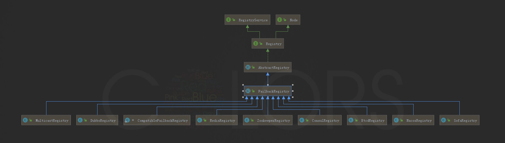
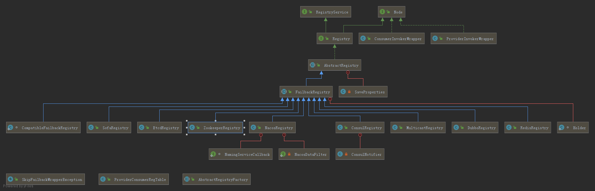

[TOC]

## Dubbo注册中心之Redis

### 原理

##### 数据存储

使用 Redis 的 Key/Map 结构存储数据结构：

- 主 Key 为服务名和类型

- Map 中的 Key 为 URL 地址

- Map 中的 Value 为过期时间，用于判断脏数据，脏数据由监控中心删除 
  

#####  通知
使用 Redis 的 Publish/Subscribe 事件通知数据变更：

- 通过事件的值区分事件类型：register, unregister, subscribe, unsubscribe

- 普通消费者直接订阅指定服务提供者的 Key，只会收到指定服务的 register, unregister 事件

- 监控中心通过 psubscribe 功能订阅 /dubbo/*，会收到所有服务的所有变更事件

  
#####  调用过程

- 服务提供方启动时，向 Key:/dubbo/com.foo.BarService/providers 下，添加当前提供者的地址

- 并向 Channel:/dubbo/com.foo.BarService/providers 发送 register 事件

- 服务消费方启动时，从 Channel:/dubbo/com.foo.BarService/providers 订阅 register 和 unregister 事件

- 并向 Key:/dubbo/com.foo.BarService/providers 下，添加当前消费者的地址

- 服务消费方收到 register 和 unregister 事件后，从 Key:/dubbo/com.foo.BarService/providers 下获取提供者地址列表

- 服务监控中心启动时，从 Channel:/dubbo/* 订阅 register 和 unregister，以及 subscribe和unsubsribe事件

- 服务监控中心收到 register 和 unregister 事件后，从 Key:/dubbo/com.foo.BarService/providers下获取提供者地址列表

- 服务监控中心收到 subscribe 和 unsubsribe 事件后，从 Key:/dubbo/com.foo.BarService/consumers 下获取消费者地址列表

  

#####  配置

RedisRegistry中主要实现了如下接口：

- doRegister(URL url);//向注册中心注册服务
- doUnregister(URL url);//取消服务注册
- doSubscribe(URL url, NotifyListener listener);//向注册中心监听服务
- doUnsubscribe(URL url, NotifyListener listener);//取消监听注册中心服务

