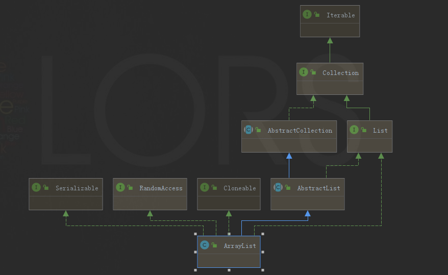
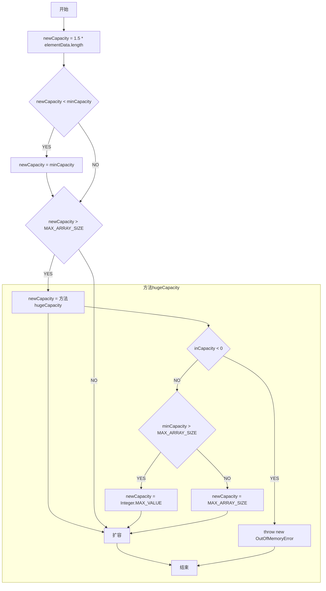

[TOC]


# ArrayList

## 类图



## 数据结构

数组：Object[] elementData

## 原理

### 扩容

**知识了解**

minCapacity：最小扩容量，分析源码不难知道，等于当前数组的size+1。

```java
    public boolean add(E e) {
        ensureCapacityInternal(size + 1);  // Increments modCount!!
        elementData[size++] = e;
        return true;
    }

    private void ensureCapacityInternal(int minCapacity) {
       // ...
    }
```

### 首次扩容

当我们使用ArrayList()无参构造器初始化对象的时候，默认不扩容，将默认的空数组赋值给数组。后续，在新增数据的时候，触发了扩容机制。

其中，扩容的大小取默认容量、最小扩容量的最大值，之后扩容逻辑同非首次扩容。

```java
	private static final int DEFAULT_CAPACITY = 10
	private static final Object[] DEFAULTCAPACITY_EMPTY_ELEMENTDATA = {};

    public ArrayList() {
        // 无参构造器，默认不扩容，指向默认的空数组
        this.elementData = DEFAULTCAPACITY_EMPTY_ELEMENTDATA;
    }
    
    private void ensureCapacityInternal(int minCapacity) {
        // 首次扩容
        if (elementData == DEFAULTCAPACITY_EMPTY_ELEMENTDATA) {
            // 取默认容量和最小扩容量的最大值
            minCapacity = Math.max(DEFAULT_CAPACITY, minCapacity);
        }

        ensureExplicitCapacity(minCapacity);
    }
    
    private void ensureExplicitCapacity(int minCapacity) {
        modCount++;

        // 如果最小扩容量大于当前数组长度，则扩容
        if (minCapacity - elementData.length > 0)
            grow(minCapacity);
    }
```

### 非首次扩容

源码处理流程：

[查看大图](https://mermaid-js.github.io/mermaid-live-editor/#/edit/eyJjb2RlIjoiZ3JhcGggVEJcbiAgICBzdGFydFvlvIDlp4tdIC0tPiBvcGVyYXRpb24xW25ld0NhcGFjaXR5ID0gMS41ICogZWxlbWVudERhdGEubGVuZ3RoXVxuICAgIG9wZXJhdGlvbjEgLS0-IGNvbmRpdGlvbjF7bmV3Q2FwYWNpdHkgPCBtaW5DYXBhY2l0eX1cbiAgICBjb25kaXRpb24xIC0tIFlFUyAtLT4gb3BlcmF0aW9uMltuZXdDYXBhY2l0eSA9IG1pbkNhcGFjaXR5XSBcbiAgICBvcGVyYXRpb24yIC0tPiBjb25kaXRpb24ye25ld0NhcGFjaXR5ID4gTUFYX0FSUkFZX1NJWkV9XG4gICAgY29uZGl0aW9uMSAtLSBOTyAtLT4gY29uZGl0aW9uMlxuICAgIGNvbmRpdGlvbjIgLS0gWUVTIC0tPiBvcGVyYXRpb24zW25ld0NhcGFjaXR5ID0g5pa55rOVaHVnZUNhcGFjaXR5XSBcbiAgICBvcGVyYXRpb24zIC0tPiBvcGVyYXRpb240W-aJqeWuuV0gXG4gICAgY29uZGl0aW9uMiAtLSBOTyAtLT4gb3BlcmF0aW9uNFxuICAgIG9wZXJhdGlvbjQgLS0-IHN0b3Bb57uT5p2fXVxuICAgIHN1YmdyYXBoIOaWueazlWh1Z2VDYXBhY2l0eVxuICAgIG9wZXJhdGlvbjMgLS0-IGNvbmRpdGlvbjN7aW5DYXBhY2l0eSA8IDB9XG4gICAgY29uZGl0aW9uMyAtLSBZRVMgLS0-IG9wZXJhdGlvbjVbdGhyb3cgbmV3IE91dE9mTWVtb3J5RXJyb3JdIFxuICAgIG9wZXJhdGlvbjUgLS0-IHN0b3BcbiAgICBjb25kaXRpb24zIC0tIE5PIC0tPiBjb25kaXRpb240e21pbkNhcGFjaXR5ID4gTUFYX0FSUkFZX1NJWkV9XG4gICAgY29uZGl0aW9uNCAtLSBZRVMgLS0-IG9wZXJhdGlvbjZbbmV3Q2FwYWNpdHkgPSBJbnRlZ2VyLk1BWF9WQUxVRV0gXG4gICAgb3BlcmF0aW9uNiAtLT4gb3BlcmF0aW9uNFxuICAgIGNvbmRpdGlvbjQgLS0gTk8gLS0-IG9wZXJhdGlvbjdbbmV3Q2FwYWNpdHkgPSBNQVhfQVJSQVlfU0laRV0gXG4gICAgb3BlcmF0aW9uNyAtLT4gb3BlcmF0aW9uNFxuICAgIGVuZCIsIm1lcm1haWQiOnsidGhlbWUiOiJkZWZhdWx0In19)



源码分析：

```java
    private void grow(int minCapacity) {
        int oldCapacity = elementData.length;
        // 新的容量 = 老的容量 + 老的容量的一半 = 老容量的1.5倍
        int newCapacity = oldCapacity + (oldCapacity >> 1);
        if (newCapacity - minCapacity < 0)
            // 新的容量 小于 最小扩容量，则把最小扩容量重新赋值新的容量
            newCapacity = minCapacity;
        if (newCapacity - MAX_ARRAY_SIZE > 0)
            // 新的容量 大于 最大扩容量，则进行大容量扩容处理
            newCapacity = hugeCapacity(minCapacity);
        // 开始扩容
        elementData = Arrays.copyOf(elementData, newCapacity);
    }
     
    private static int hugeCapacity(int minCapacity) {
        if (minCapacity < 0) 
            throw new OutOfMemoryError();
        // 如果最小扩容量 大于 最大扩容量，则取Integer.MAX_VALUE，反之取最大扩容量
        return (minCapacity > MAX_ARRAY_SIZE) ?
            Integer.MAX_VALUE :
            MAX_ARRAY_SIZE;
    }
```

## JDK版本区别

1.7和1.8最大的区别就是：1.7是饿汉式创建集合容量，1.8是懒汉式创建集合容量

## 优缺点

### 优点

1、因为是数组，所以根据脚标取数据很快

### 缺点
1、数组的新增、删除操作效率不高，涉及到数组的扩容、复制等操作
2、线程不安全

## 拓展

> 以下代码，均基于jdk1.8

### 如何证明线程不安全？

```java
  @Test
  public void testArrayListUnSafe() throws InterruptedException, BrokenBarrierException {
    int size = 100;
    List<Integer> list = new ArrayList<>();
    ThreadPoolExecutor threadPoolExecutor =
        new ThreadPoolExecutor(
            size,
            size,
            0L,
            TimeUnit.MILLISECONDS,
            new LinkedBlockingQueue<>(),
            r -> new Thread(r, "test"));
    CyclicBarrier cyclicBarrier =
        new CyclicBarrier(
            size + 1,
            () -> {
              System.out.println("gate open");
            });
    for (int i = 0; i < size; i++) {
      threadPoolExecutor.execute(
          () -> {
            try {
              cyclicBarrier.await();
            } catch (InterruptedException | BrokenBarrierException e) {
              e.printStackTrace();
            }
            try {
              for (int j = 0; j < size; j++) {
                list.add(j);
              }
            } catch (Exception e) {
              // 这里可能会有什么异常？
              e.printStackTrace();
            }
            try {
              cyclicBarrier.await();
            } catch (InterruptedException | BrokenBarrierException e) {
              e.printStackTrace();
            }
          });
    }
    cyclicBarrier.await();
    cyclicBarrier.await();
    System.out.println(list.size());
  }
```

在不运行之前，你觉得结果是如何？`list.size()`为10000吗。实际运行结果，每次都是不一样的， 且会出现`ArrayIndexOutOfBoundsException`异常，正是因为`ArrayList`没有保证线程安全，在并发访问时存在线程安全问题。

那么为什么会存在线程安全问题呢？这还得归根到源码里：

```java
    public boolean add(E e) {
		ensureCapacityInternal(size + 1);  // Increments modCount!!
        // size++ 线程不安全
		elementData[size++] = e;
		return true;
	}
```

size++是非原子操作，在并发时，会有线程安全。

>  size++可拆解为size=size+1，细分为：第一步，计算size + 1 ，第二步，把size + 1的结果赋值给size，在执行第二步的时候，可能size的值已经发生了变化。

那么怎么简单解决呢？使用synchronized + volatile即可，当然了还有其他的方式，本篇文章不在赘述，在并发编程相关内容，将会详细研讨。

### 扩容了几次？

看看以下代码，猜猜一共扩容了几次？

```java
  @Test
  public void testGrow() throws NoSuchFieldException, IllegalAccessException {
    List<Integer> list = new ArrayList<>(0);
    list.add(1);
    list.add(2);
    list.add(3);
    list.add(4);
    list.add(5);
    list.add(6);
    list.add(7);
    list.add(8);
    list.add(9);
    list.add(10);
  }
```

为了方便了解到具体扩容了几次，我们使用反射的机制获取ArrayList中的elementData数组一看便知：

```java
  @Test
  public void testGrow() throws NoSuchFieldException, IllegalAccessException {
    List<Integer> list = new ArrayList<>(0);
    Field elementDataField = list.getClass().getDeclaredField("elementData");
    elementDataField.setAccessible(true);
    System.out.println("length:" + ((Object[]) elementDataField.get(list)).length);

    // grow
    list.add(1);
    System.out.println("add 1 after,length:" + ((Object[]) elementDataField.get(list)).length);
    // grow
    list.add(2);
    System.out.println("add 2 after,length:" + ((Object[]) elementDataField.get(list)).length);
    // grow
    list.add(3);
    System.out.println("add 3 after,length:" + ((Object[]) elementDataField.get(list)).length);
    // grow
    list.add(4);
    System.out.println("add 4 after,length:" + ((Object[]) elementDataField.get(list)).length);
    // grow
    list.add(5);
    System.out.println("add 5 after,length:" + ((Object[]) elementDataField.get(list)).length);
    list.add(6);
    System.out.println("add 6 after,length:" + ((Object[]) elementDataField.get(list)).length);
    // grow
    list.add(7);
    System.out.println("add 7 after,length:" + ((Object[]) elementDataField.get(list)).length);
    list.add(8);
    System.out.println("add 8 after,length:" + ((Object[]) elementDataField.get(list)).length);
    list.add(9);
    System.out.println("add 9 after,length:" + ((Object[]) elementDataField.get(list)).length);
    // grow
    list.add(10);
    System.out.println("add 10 after,length:" + ((Object[]) elementDataField.get(list)).length);
  }
```

运行结果：

```text
length:0
add 1 after,length:1
add 2 after,length:2
add 3 after,length:3
add 4 after,length:4
add 5 after,length:6
add 6 after,length:6
add 7 after,length:9
add 8 after,length:9
add 9 after,length:9
add 10 after,length:13
```

结合结果，可见一共扩容了7次，分别是添加1、2、3、4、5、7、10的时候，elementData数组大小变化为：0（new结束）、1、2、3、4、6、9、13。

没猜对？没关系，咱们在稍微变化下题目：

```java
  @Test
  public void testGrow() throws NoSuchFieldException, IllegalAccessException {
    // 换个构造器
    List<Integer> list = new ArrayList<>();
    list.add(1);
    list.add(2);
    list.add(3);
    list.add(4);
    list.add(5);
    list.add(6);
    list.add(7);
    list.add(8);
    list.add(9);
    list.add(10);
  }
```

这次是几次呢？答案：稍后揭晓。


首先我们来回顾下两种情况的不同点——构造器：

```java
    /**
     * Shared empty array instance used for empty instances.
     */
    private static final Object[] EMPTY_ELEMENTDATA = {};

    /**
     * Shared empty array instance used for default sized empty instances. We
     * distinguish this from EMPTY_ELEMENTDATA to know how much to inflate when
     * first element is added.
     */
    private static final Object[] DEFAULTCAPACITY_EMPTY_ELEMENTDATA = {};

	  public ArrayList(int initialCapacity) {
        if (initialCapacity > 0) {
            this.elementData = new Object[initialCapacity];
        } else if (initialCapacity == 0) {
            // new ArrayList<>(0);
            this.elementData = EMPTY_ELEMENTDATA;
        } else {
            throw new IllegalArgumentException("Illegal Capacity: "+
                                               initialCapacity);
        }
    }

    /**
     * Constructs an empty list with an initial capacity of ten.
     */
    public ArrayList() {
        this.elementData = DEFAULTCAPACITY_EMPTY_ELEMENTDATA;
    }
```

很明显针对构造器来讲，区别就是初始赋值不一样，至于为啥不一样，源码解释了：

- EMPTY_ELEMENTDATA：`Shared empty array instance used for empty instances.`

- DEFAULTCAPACITY_EMPTY_ELEMENTDATA：`Shared empty array instance used for default sized empty instances. We
   distinguish this from EMPTY_ELEMENTDATA to know how much to inflate when first element is added.`

我们暂且将这两种情况称为实际空实例（即人为设置size=0）、默认空实例（即使用空造器）。看完了构造器，我们在来回顾下`add`的扩容机制：

```java
    /**
     * Default initial capacity.
     */
    private static final int DEFAULT_CAPACITY = 10;
    
    private static int calculateCapacity(Object[] elementData, int minCapacity) {
        if (elementData == DEFAULTCAPACITY_EMPTY_ELEMENTDATA) {
            // 默认空数组的情况下
            return Math.max(DEFAULT_CAPACITY, minCapacity);
        }
        return minCapacity;
    }

    private void ensureCapacityInternal(int minCapacity) {
        ensureExplicitCapacity(calculateCapacity(elementData, minCapacity));
    }

    public boolean add(E e) {
        ensureCapacityInternal(size + 1);  // Increments modCount!!
        // ...
    }

```

也就是说，针对默认空实例、实际空实例处理是不一样的，默认空实例扩容直接使用默认的大小10，两者后续扩容都按照1.5倍的机制来扩容。


说到这里，第二种的情况，答案也有了：一共扩容了1次，添加1的时候，elementData数组大小变化为：0（new结束）、10。

至于为什么要谈这两道题目，一方便，是为了更好的理解jdk为ArrayList做的优化；另一方面，是避免小伙伴有`new ArrayList<>(0);`的习惯，以为节省了内存，实则可能会产生多次扩容的时间浪费。


