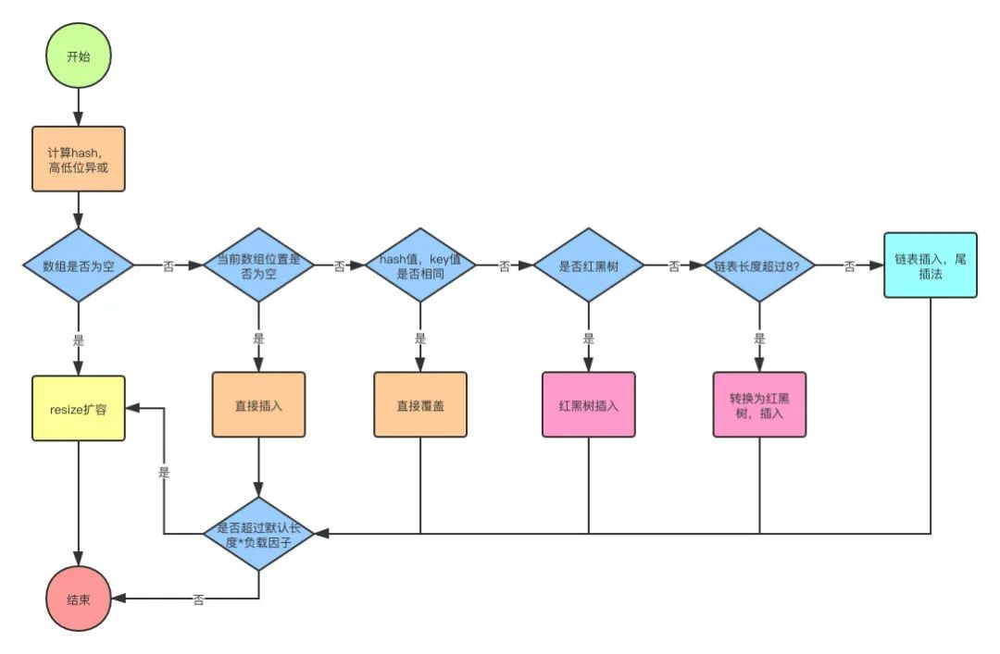

[TOC]


#  HashMap

## 特点

- 基于Map接口；
- 允许Key和Value都允许为null；
- 非同步；
- 不保证顺序和插入时相同；
- 不保证顺序时不变。

## 原理

### Put的流程

```flow
st=>start: start

c1=>condition: table是否未初始化
c2=>condition: table[i]是否为null
c3=>condition: table[i]的hash、Key是否与当前加入节点的hash、key一样
c4=>condition: tablke[i]是否TreeNode类型
c5=>condition: 当前节点是否为null
c6=>condition: 当前链表的节点是否超过TREEIFY_THRESHOLD
c7=>condition: 当前节点的hash、key是否一样
c8=>condition: e是否为Null

o1=>operation: 进行resize
o2=>operation: 根据Hash结果找到table[i]
o3=>operation: newNode放入table[i]
o4=>operation: 将当前值复制给e
o5=>operation: 使用TreeNode方式put节点
o6=>operation: 使用链表方式put节点
o7=>operation: 取链表的第一个节点
o8=>operation: newNode放入p.next
o9=>operation: 对链表进行treeifyBin（即进行链表转树）
o10=>operation: 已找到当前节点等于目标节点，break
o11=>operation: 取链表下一节点
o12=>operation: 替换e的值并返回e的旧值

end=>end: end

st->c1
c1(yes)->o1->o2
c1(no)->o2
o2->c2
c2(yes)->o3
c2(no)->c3
c3(yes)->o4
c3(no)->c4
c4(yes)->o5
c4(no)->o6
o6->o7->c5
c5(yes)->o8->c6(yes)->o9
c5(no)->c7
c7(yes)->o10
c7(no)->o11->c5
o4->c8
o5->c8
o10->c8
o9->c8
c8(yes)->o12

c5->end
```



### Hash如何计算

```java
    static final int hash(Object key) {
        int h;
        // key为null，hash为0，否则，取Object的hashCode，然后取hashCode的高位，与自己异或
        return (key == null) ? 0 : (h = key.hashCode()) ^ (h >>> 16);
    }
```

1、为什么要右移?

   尽可能的防止Hash碰撞，本身具有高随机性的HashCode，在高低位异或一下，一定程度上能增强随机性。

2、为什么要用异或？
   A、效率高

   B、对比效率高的操作还有位与( & )、位或( | )。

​      假设是位与，则0-0=0，0-1=0，1-0=0，1-1=1，可知75%的概率位0，25%概率位1，概率不均。

​      假设是位或，则0-0=0，0-1=1，1-0=1，1-1=1，可知75%的概率位1，25%概率位0，概率不均。

​      假设是异或，则0-0=1，0-1=0，1-0=0，1-1=1，可知50%的概率位1，50%概率位0，概率均等。

### 长度为什么是2<sup>n</sup>

```java
    /**
     * The default initial capacity - MUST be a power of two.
     */
    static final int DEFAULT_INITIAL_CAPACITY = 1 << 4; // aka 16

	  /**
     * The maximum capacity, used if a higher value is implicitly specified
     * by either of the constructors with arguments.
     * MUST be a power of two <= 1<<30.
     */
    static final int MAXIMUM_CAPACITY = 1 << 30;
```

**为了能让 HashMap 存取高效，尽量较少碰撞，也就是要尽量把数据分配均匀。**


看了上面一句话，大家可能并不能理解具体原因，下面就带着大伙根据源码解释下上面的这句话。首先，HashMap内部维护了一个Node数组，每次根据key查询value，都需要计算key的hash，然后在根据hash去计算Node数组的下标获取对应的Node，那么HashMap现在是如何计算下标的呢？

#### 计算高效

Hash值的范围值-2147483648到2147483647，前后加起来大概40亿的映射空间，只要哈希函数映射得比较均匀松散，一般应用是很难出现碰撞的。但问题是一个40亿长度的数组，内存是放不下的。所以这个散列值是不能直接拿来用的。那怎么设计呢？很多人可能想到**取余**（`hash % length`）这个方法，固然可以，但是不高效呀。所以通过翻阅HashMap源码，我们得知了HashMap选择了`(n - 1) & hash`这个计算公式（PS：见下方`getNode`方法），n代表数组长度。

```java
		public V get(Object key) {
        Node<K,V> e;
        return (e = getNode(hash(key), key)) == null ? null : e.value;
    }

    final Node<K,V> getNode(int hash, Object key) {
        Node<K,V>[] tab; Node<K,V> first, e; int n; K k;
        if ((tab = table) != null && (n = tab.length) > 0 &&
            // 此处计算下标的公式为(n - 1) & hash
            (first = tab[(n - 1) & hash]) != null) {
            // 1、检查Hash是否相等 2、检查Object是否相等
            if (first.hash == hash && // always check first node
                ((k = first.key) == key || (key != null && key.equals(k))))
                return first;
            // 检查节点的下一个是否存在
            if ((e = first.next) != null) {
                // 检查节点是否为树
                if (first instanceof TreeNode)
                    return ((TreeNode<K,V>)first).getTreeNode(hash, key);
                do {
                    // 如果是链表，则按顺序遍历，直到找到
                    if (e.hash == hash &&
                        ((k = e.key) == key || (key != null && key.equals(k))))
                        return e;
                } while ((e = e.next) != null);
            }
        }
        return null;
    }
```

等等，大伙此时肯定想问，啊，这个公式虽然简单、优雅，能称得上**计算高效**，但是就能说明HashMap的长度是2<sup>n</sup>了吗？是的，就是他，但是为什么呢，咱们继续往下看。

#### 降低碰撞

大伙都知道，HashMap高不高效，其中一个最重要的因素便是Hash算法要好。作为HashMap的设计者，肯定也知道这一点，所以在设计HashMap的时候，将这一点完全托付给了Hash算法，即相信Hash算法能够设计好。而HashMap计算下标，则以不影响Hash算法结果的目的而设计，故采用了HashMap的长度尽量是2<sup>n</sup>。

对于HashMap计算下标的公式：`(n - 1) & hash`，我们假设一下：

- n是奇数，则n-1为偶数。比如n=5，n-1转为二进制则为100。

- n是偶数，且不是2的幂次方，则n-1为奇数。比如n=6，n-1转为二进制则为101。

- n是偶数，且是2的幂次方，则n-1为奇数。比如n=4，n-1转为二进制则为11，假设n=8呢，n-1转为二进制则为111。

不知道大伙有没有发现规律，只要是2<sup>n</sup>-1，转为二进制，所有位置上均为1，1与任何数的结果都是任何数。哇，巧妙不，没有影响hash值，而且还按照预期要求，保留了自己需要的低位数据。


到此为止，基本上讲清楚了为啥HashMap的长度是2<sup>n</sup>了。

## 源码

### putVal

```java
    public V put(K key, V value) {
        return putVal(hash(key), key, value, false, true);
    }

		/**
     * Implements Map.put and related methods.
     *
     * @param hash hash for key
     * @param key the key
     * @param value the value to put
     * @param onlyIfAbsent if true, don't change existing value
     * @param evict if false, the table is in creation mode.
     * @return previous value, or null if none
     */
    final V putVal(int hash, K key, V value, boolean onlyIfAbsent,
                   boolean evict) {
        Node<K,V>[] tab; Node<K,V> p; int n, i;
        if ((tab = table) == null || (n = tab.length) == 0)
            // 初始化
            n = (tab = resize()).length;
        // Node数组对应的位置Value为null
        if ((p = tab[i = (n - 1) & hash]) == null)
            tab[i] = newNode(hash, key, value, null);
        else {
            // 处理Hash冲突的情况
            Node<K,V> e; K k;
            // 判断对应下标的Node，与新Node的Hash、Key地址、Key的eqauls是否相同
            if (p.hash == hash &&
                ((k = p.key) == key || (key != null && key.equals(k))))
                // 如果相同，则表示新加入的Node已经在HashMap中了，直接返回老Node的引用即可
                e = p;
            // 判断是否是红黑树
            else if (p instanceof TreeNode)
                e = ((TreeNode<K,V>)p).putTreeVal(this, tab, hash, key, value);
            else {
                // 此时一定是链表的结构，顺序遍历，直到遍历到队尾 
                for (int binCount = 0; ; ++binCount) {
                    // 判断是否到了链表队尾
                    if ((e = p.next) == null) {
                        // 直接在队尾插入新的Node
                        p.next = newNode(hash, key, value, null);
                        // 判断当前是否满足转红黑树的条件，TREEIFY_THRESHOLD = 8，binCount表示遍历次数，即链表长度
                        if (binCount >= TREEIFY_THRESHOLD - 1) // -1 for 1st
                            // 转红黑树
                            treeifyBin(tab, hash);
                        break;
                    }
                    // 判断当前遍历到的节点，与新Node的Hash、Key地址、Key的eqauls是否相同
                    if (e.hash == hash &&
                        ((k = e.key) == key || (key != null && key.equals(k))))
                        // 如果相同，则表示新加入的Node已经在HashMap的链表中了，直接返回老Node的引用即可
                        break;
                    // 继续下一节点
                    p = e;
                }
            }
            // 
            if (e != null) { // existing mapping for key
                V oldValue = e.value;
                // 是否要替换老节点Value的情况
                if (!onlyIfAbsent || oldValue == null)
                    e.value = value;
                // 为LinkedHashMap扩展使用，表示新Node的访问
                afterNodeAccess(e);
                return oldValue;
            }
        }
        ++modCount;
        // 当Size大于阀值的时候，进行resize
        if (++size > threshold)
            resize();
        // 为LinkedHashMap扩展使用，表示新Node的插入
        afterNodeInsertion(evict);
        return null;
    }
```

### treeifyBin

```java
    /**
     * The smallest table capacity for which bins may be treeified.
     * (Otherwise the table is resized if too many nodes in a bin.)
     * Should be at least 4 * TREEIFY_THRESHOLD to avoid conflicts
     * between resizing and treeification thresholds.
     *
     * 可对其进行树转化的最小表容量。 
     *（否则，如果 bin 中有太多节点，则调整表的大小。）
     * 应至少为 4 * TREEIFY_THRESHOLD 以避免调整大小和树化阈值之间的冲突。
     */
    static final int MIN_TREEIFY_CAPACITY = 64;

		/**
     * Replaces all linked nodes in bin at index for given hash unless
     * table is too small, in which case resizes instead.
     */
		final void treeifyBin(Node<K,V>[] tab, int hash) {
        int n, index; Node<K,V> e;
        // 判断tab是否未初始化，或者tab的长度小于树化的阀值
        if (tab == null || (n = tab.length) < MIN_TREEIFY_CAPACITY)
            // 调整大小
            resize();
        // 判断下Hash对应下标的数组节点是否存在
        else if ((e = tab[index = (n - 1) & hash]) != null) {
            TreeNode<K,V> hd = null, tl = null;
            do {
                // 普通Node节点转树节点
                TreeNode<K,V> p = replacementTreeNode(e, null);
                if (tl == null)
                    // 根节点记录引用
                    hd = p;
                else {
                    // 当前节点的prev指向前置节点
                    p.prev = tl;
                    // 前置节点的next指向当前节点
                    tl.next = p;
                }
                // tl主要记录上一节点
                tl = p;
            // 继续遍历链表的下一个节点
            } while ((e = e.next) != null);
            // 判断根节点不为空，且将根节点放入数组中
            if ((tab[index] = hd) != null)
                // 树化
                hd.treeify(tab);
        }
    }
```

### TreeNode

```java
    static final class TreeNode<K,V> extends LinkedHashMap.Entry<K,V> {
        TreeNode<K,V> parent;  // red-black tree links
        TreeNode<K,V> left;
        TreeNode<K,V> right;
        TreeNode<K,V> prev;    // needed to unlink next upon deletion
        boolean red;
        TreeNode(int hash, K key, V val, Node<K,V> next) {
            super(hash, key, val, next);
        }

        /**
         * Returns root of tree containing this node.
         */
        final TreeNode<K,V> root() {
            for (TreeNode<K,V> r = this, p;;) {
                if ((p = r.parent) == null)
                    return r;
                r = p;
            }
        }

        /**
         * Ensures that the given root is the first node of its bin.
         */
        static <K,V> void moveRootToFront(Node<K,V>[] tab, TreeNode<K,V> root) {
            int n;
            if (root != null && tab != null && (n = tab.length) > 0) {
                int index = (n - 1) & root.hash;
                TreeNode<K,V> first = (TreeNode<K,V>)tab[index];
                if (root != first) {
                    Node<K,V> rn;
                    tab[index] = root;
                    TreeNode<K,V> rp = root.prev;
                    if ((rn = root.next) != null)
                        ((TreeNode<K,V>)rn).prev = rp;
                    if (rp != null)
                        rp.next = rn;
                    if (first != null)
                        first.prev = root;
                    root.next = first;
                    root.prev = null;
                }
                assert checkInvariants(root);
            }
        }

        /**
         * Finds the node starting at root p with the given hash and key.
         * The kc argument caches comparableClassFor(key) upon first use
         * comparing keys.
         */
        final TreeNode<K,V> find(int h, Object k, Class<?> kc) {
            TreeNode<K,V> p = this;
            do {
                int ph, dir; K pk;
                TreeNode<K,V> pl = p.left, pr = p.right, q;
                if ((ph = p.hash) > h)
                    p = pl;
                else if (ph < h)
                    p = pr;
                else if ((pk = p.key) == k || (k != null && k.equals(pk)))
                    return p;
                else if (pl == null)
                    p = pr;
                else if (pr == null)
                    p = pl;
                else if ((kc != null ||
                          (kc = comparableClassFor(k)) != null) &&
                         (dir = compareComparables(kc, k, pk)) != 0)
                    p = (dir < 0) ? pl : pr;
                else if ((q = pr.find(h, k, kc)) != null)
                    return q;
                else
                    p = pl;
            } while (p != null);
            return null;
        }

        /**
         * Calls find for root node.
         */
        final TreeNode<K,V> getTreeNode(int h, Object k) {
            return ((parent != null) ? root() : this).find(h, k, null);
        }

        /**
         * Tie-breaking utility for ordering insertions when equal
         * hashCodes and non-comparable. We don't require a total
         * order, just a consistent insertion rule to maintain
         * equivalence across rebalancings. Tie-breaking further than
         * necessary simplifies testing a bit.
         */
        static int tieBreakOrder(Object a, Object b) {
            int d;
            if (a == null || b == null ||
                (d = a.getClass().getName().
                 compareTo(b.getClass().getName())) == 0)
                d = (System.identityHashCode(a) <= System.identityHashCode(b) ?
                     -1 : 1);
            return d;
        }

        /**
         * Forms tree of the nodes linked from this node.
         */
        final void treeify(Node<K,V>[] tab) {
            TreeNode<K,V> root = null;
            for (TreeNode<K,V> x = this, next; x != null; x = next) {
                next = (TreeNode<K,V>)x.next;
                x.left = x.right = null;
                if (root == null) {
                    x.parent = null;
                    x.red = false;
                    root = x;
                }
                else {
                    K k = x.key;
                    int h = x.hash;
                    Class<?> kc = null;
                    for (TreeNode<K,V> p = root;;) {
                        int dir, ph;
                        K pk = p.key;
                        if ((ph = p.hash) > h)
                            dir = -1;
                        else if (ph < h)
                            dir = 1;
                        else if ((kc == null &&
                                  (kc = comparableClassFor(k)) == null) ||
                                 (dir = compareComparables(kc, k, pk)) == 0)
                            dir = tieBreakOrder(k, pk);

                        TreeNode<K,V> xp = p;
                        if ((p = (dir <= 0) ? p.left : p.right) == null) {
                            x.parent = xp;
                            if (dir <= 0)
                                xp.left = x;
                            else
                                xp.right = x;
                            root = balanceInsertion(root, x);
                            break;
                        }
                    }
                }
            }
            moveRootToFront(tab, root);
        }

        /**
         * Returns a list of non-TreeNodes replacing those linked from
         * this node.
         */
        final Node<K,V> untreeify(HashMap<K,V> map) {
            Node<K,V> hd = null, tl = null;
            for (Node<K,V> q = this; q != null; q = q.next) {
                Node<K,V> p = map.replacementNode(q, null);
                if (tl == null)
                    hd = p;
                else
                    tl.next = p;
                tl = p;
            }
            return hd;
        }

        /**
         * Tree version of putVal.
         */
        final TreeNode<K,V> putTreeVal(HashMap<K,V> map, Node<K,V>[] tab,
                                       int h, K k, V v) {
            Class<?> kc = null;
            boolean searched = false;
            TreeNode<K,V> root = (parent != null) ? root() : this;
            for (TreeNode<K,V> p = root;;) {
                int dir, ph; K pk;
                if ((ph = p.hash) > h)
                    dir = -1;
                else if (ph < h)
                    dir = 1;
                else if ((pk = p.key) == k || (k != null && k.equals(pk)))
                    return p;
                else if ((kc == null &&
                          (kc = comparableClassFor(k)) == null) ||
                         (dir = compareComparables(kc, k, pk)) == 0) {
                    if (!searched) {
                        TreeNode<K,V> q, ch;
                        searched = true;
                        if (((ch = p.left) != null &&
                             (q = ch.find(h, k, kc)) != null) ||
                            ((ch = p.right) != null &&
                             (q = ch.find(h, k, kc)) != null))
                            return q;
                    }
                    dir = tieBreakOrder(k, pk);
                }

                TreeNode<K,V> xp = p;
                if ((p = (dir <= 0) ? p.left : p.right) == null) {
                    Node<K,V> xpn = xp.next;
                    TreeNode<K,V> x = map.newTreeNode(h, k, v, xpn);
                    if (dir <= 0)
                        xp.left = x;
                    else
                        xp.right = x;
                    xp.next = x;
                    x.parent = x.prev = xp;
                    if (xpn != null)
                        ((TreeNode<K,V>)xpn).prev = x;
                    moveRootToFront(tab, balanceInsertion(root, x));
                    return null;
                }
            }
        }

        /**
         * Removes the given node, that must be present before this call.
         * This is messier than typical red-black deletion code because we
         * cannot swap the contents of an interior node with a leaf
         * successor that is pinned by "next" pointers that are accessible
         * independently during traversal. So instead we swap the tree
         * linkages. If the current tree appears to have too few nodes,
         * the bin is converted back to a plain bin. (The test triggers
         * somewhere between 2 and 6 nodes, depending on tree structure).
         */
        final void removeTreeNode(HashMap<K,V> map, Node<K,V>[] tab,
                                  boolean movable) {
            int n;
            if (tab == null || (n = tab.length) == 0)
                return;
            int index = (n - 1) & hash;
            TreeNode<K,V> first = (TreeNode<K,V>)tab[index], root = first, rl;
            TreeNode<K,V> succ = (TreeNode<K,V>)next, pred = prev;
            if (pred == null)
                tab[index] = first = succ;
            else
                pred.next = succ;
            if (succ != null)
                succ.prev = pred;
            if (first == null)
                return;
            if (root.parent != null)
                root = root.root();
            if (root == null
                || (movable
                    && (root.right == null
                        || (rl = root.left) == null
                        || rl.left == null))) {
                tab[index] = first.untreeify(map);  // too small
                return;
            }
            TreeNode<K,V> p = this, pl = left, pr = right, replacement;
            if (pl != null && pr != null) {
                TreeNode<K,V> s = pr, sl;
                while ((sl = s.left) != null) // find successor
                    s = sl;
                boolean c = s.red; s.red = p.red; p.red = c; // swap colors
                TreeNode<K,V> sr = s.right;
                TreeNode<K,V> pp = p.parent;
                if (s == pr) { // p was s's direct parent
                    p.parent = s;
                    s.right = p;
                }
                else {
                    TreeNode<K,V> sp = s.parent;
                    if ((p.parent = sp) != null) {
                        if (s == sp.left)
                            sp.left = p;
                        else
                            sp.right = p;
                    }
                    if ((s.right = pr) != null)
                        pr.parent = s;
                }
                p.left = null;
                if ((p.right = sr) != null)
                    sr.parent = p;
                if ((s.left = pl) != null)
                    pl.parent = s;
                if ((s.parent = pp) == null)
                    root = s;
                else if (p == pp.left)
                    pp.left = s;
                else
                    pp.right = s;
                if (sr != null)
                    replacement = sr;
                else
                    replacement = p;
            }
            else if (pl != null)
                replacement = pl;
            else if (pr != null)
                replacement = pr;
            else
                replacement = p;
            if (replacement != p) {
                TreeNode<K,V> pp = replacement.parent = p.parent;
                if (pp == null)
                    (root = replacement).red = false;
                else if (p == pp.left)
                    pp.left = replacement;
                else
                    pp.right = replacement;
                p.left = p.right = p.parent = null;
            }

            TreeNode<K,V> r = p.red ? root : balanceDeletion(root, replacement);

            if (replacement == p) {  // detach
                TreeNode<K,V> pp = p.parent;
                p.parent = null;
                if (pp != null) {
                    if (p == pp.left)
                        pp.left = null;
                    else if (p == pp.right)
                        pp.right = null;
                }
            }
            if (movable)
                moveRootToFront(tab, r);
        }

        /**
         * Splits nodes in a tree bin into lower and upper tree bins,
         * or untreeifies if now too small. Called only from resize;
         * see above discussion about split bits and indices.
         *
         * @param map the map
         * @param tab the table for recording bin heads
         * @param index the index of the table being split
         * @param bit the bit of hash to split on
         */
        final void split(HashMap<K,V> map, Node<K,V>[] tab, int index, int bit) {
            TreeNode<K,V> b = this;
            // Relink into lo and hi lists, preserving order
            TreeNode<K,V> loHead = null, loTail = null;
            TreeNode<K,V> hiHead = null, hiTail = null;
            int lc = 0, hc = 0;
            for (TreeNode<K,V> e = b, next; e != null; e = next) {
                next = (TreeNode<K,V>)e.next;
                e.next = null;
                if ((e.hash & bit) == 0) {
                    if ((e.prev = loTail) == null)
                        loHead = e;
                    else
                        loTail.next = e;
                    loTail = e;
                    ++lc;
                }
                else {
                    if ((e.prev = hiTail) == null)
                        hiHead = e;
                    else
                        hiTail.next = e;
                    hiTail = e;
                    ++hc;
                }
            }

            if (loHead != null) {
                if (lc <= UNTREEIFY_THRESHOLD)
                    tab[index] = loHead.untreeify(map);
                else {
                    tab[index] = loHead;
                    if (hiHead != null) // (else is already treeified)
                        loHead.treeify(tab);
                }
            }
            if (hiHead != null) {
                if (hc <= UNTREEIFY_THRESHOLD)
                    tab[index + bit] = hiHead.untreeify(map);
                else {
                    tab[index + bit] = hiHead;
                    if (loHead != null)
                        hiHead.treeify(tab);
                }
            }
        }

        /* ------------------------------------------------------------ */
        // Red-black tree methods, all adapted from CLR

        static <K,V> TreeNode<K,V> rotateLeft(TreeNode<K,V> root,
                                              TreeNode<K,V> p) {
            TreeNode<K,V> r, pp, rl;
            if (p != null && (r = p.right) != null) {
                if ((rl = p.right = r.left) != null)
                    rl.parent = p;
                if ((pp = r.parent = p.parent) == null)
                    (root = r).red = false;
                else if (pp.left == p)
                    pp.left = r;
                else
                    pp.right = r;
                r.left = p;
                p.parent = r;
            }
            return root;
        }

        static <K,V> TreeNode<K,V> rotateRight(TreeNode<K,V> root,
                                               TreeNode<K,V> p) {
            TreeNode<K,V> l, pp, lr;
            if (p != null && (l = p.left) != null) {
                if ((lr = p.left = l.right) != null)
                    lr.parent = p;
                if ((pp = l.parent = p.parent) == null)
                    (root = l).red = false;
                else if (pp.right == p)
                    pp.right = l;
                else
                    pp.left = l;
                l.right = p;
                p.parent = l;
            }
            return root;
        }

        static <K,V> TreeNode<K,V> balanceInsertion(TreeNode<K,V> root,
                                                    TreeNode<K,V> x) {
            x.red = true;
            for (TreeNode<K,V> xp, xpp, xppl, xppr;;) {
                if ((xp = x.parent) == null) {
                    x.red = false;
                    return x;
                }
                else if (!xp.red || (xpp = xp.parent) == null)
                    return root;
                if (xp == (xppl = xpp.left)) {
                    if ((xppr = xpp.right) != null && xppr.red) {
                        xppr.red = false;
                        xp.red = false;
                        xpp.red = true;
                        x = xpp;
                    }
                    else {
                        if (x == xp.right) {
                            root = rotateLeft(root, x = xp);
                            xpp = (xp = x.parent) == null ? null : xp.parent;
                        }
                        if (xp != null) {
                            xp.red = false;
                            if (xpp != null) {
                                xpp.red = true;
                                root = rotateRight(root, xpp);
                            }
                        }
                    }
                }
                else {
                    if (xppl != null && xppl.red) {
                        xppl.red = false;
                        xp.red = false;
                        xpp.red = true;
                        x = xpp;
                    }
                    else {
                        if (x == xp.left) {
                            root = rotateRight(root, x = xp);
                            xpp = (xp = x.parent) == null ? null : xp.parent;
                        }
                        if (xp != null) {
                            xp.red = false;
                            if (xpp != null) {
                                xpp.red = true;
                                root = rotateLeft(root, xpp);
                            }
                        }
                    }
                }
            }
        }

        static <K,V> TreeNode<K,V> balanceDeletion(TreeNode<K,V> root,
                                                   TreeNode<K,V> x) {
            for (TreeNode<K,V> xp, xpl, xpr;;) {
                if (x == null || x == root)
                    return root;
                else if ((xp = x.parent) == null) {
                    x.red = false;
                    return x;
                }
                else if (x.red) {
                    x.red = false;
                    return root;
                }
                else if ((xpl = xp.left) == x) {
                    if ((xpr = xp.right) != null && xpr.red) {
                        xpr.red = false;
                        xp.red = true;
                        root = rotateLeft(root, xp);
                        xpr = (xp = x.parent) == null ? null : xp.right;
                    }
                    if (xpr == null)
                        x = xp;
                    else {
                        TreeNode<K,V> sl = xpr.left, sr = xpr.right;
                        if ((sr == null || !sr.red) &&
                            (sl == null || !sl.red)) {
                            xpr.red = true;
                            x = xp;
                        }
                        else {
                            if (sr == null || !sr.red) {
                                if (sl != null)
                                    sl.red = false;
                                xpr.red = true;
                                root = rotateRight(root, xpr);
                                xpr = (xp = x.parent) == null ?
                                    null : xp.right;
                            }
                            if (xpr != null) {
                                xpr.red = (xp == null) ? false : xp.red;
                                if ((sr = xpr.right) != null)
                                    sr.red = false;
                            }
                            if (xp != null) {
                                xp.red = false;
                                root = rotateLeft(root, xp);
                            }
                            x = root;
                        }
                    }
                }
                else { // symmetric
                    if (xpl != null && xpl.red) {
                        xpl.red = false;
                        xp.red = true;
                        root = rotateRight(root, xp);
                        xpl = (xp = x.parent) == null ? null : xp.left;
                    }
                    if (xpl == null)
                        x = xp;
                    else {
                        TreeNode<K,V> sl = xpl.left, sr = xpl.right;
                        if ((sl == null || !sl.red) &&
                            (sr == null || !sr.red)) {
                            xpl.red = true;
                            x = xp;
                        }
                        else {
                            if (sl == null || !sl.red) {
                                if (sr != null)
                                    sr.red = false;
                                xpl.red = true;
                                root = rotateLeft(root, xpl);
                                xpl = (xp = x.parent) == null ?
                                    null : xp.left;
                            }
                            if (xpl != null) {
                                xpl.red = (xp == null) ? false : xp.red;
                                if ((sl = xpl.left) != null)
                                    sl.red = false;
                            }
                            if (xp != null) {
                                xp.red = false;
                                root = rotateRight(root, xp);
                            }
                            x = root;
                        }
                    }
                }
            }
        }

        /**
         * Recursive invariant check
         */
        static <K,V> boolean checkInvariants(TreeNode<K,V> t) {
            TreeNode<K,V> tp = t.parent, tl = t.left, tr = t.right,
                tb = t.prev, tn = (TreeNode<K,V>)t.next;
            if (tb != null && tb.next != t)
                return false;
            if (tn != null && tn.prev != t)
                return false;
            if (tp != null && t != tp.left && t != tp.right)
                return false;
            if (tl != null && (tl.parent != t || tl.hash > t.hash))
                return false;
            if (tr != null && (tr.parent != t || tr.hash < t.hash))
                return false;
            if (t.red && tl != null && tl.red && tr != null && tr.red)
                return false;
            if (tl != null && !checkInvariants(tl))
                return false;
            if (tr != null && !checkInvariants(tr))
                return false;
            return true;
        }
    }

```


### resize

```java
    /**
     * The default initial capacity - MUST be a power of two.
     */
    static final int DEFAULT_INITIAL_CAPACITY = 1 << 4; // aka 16
    
 		/**
     * The maximum capacity, used if a higher value is implicitly specified
     * by either of the constructors with arguments.
     * MUST be a power of two <= 1<<30.
     * 
     * 即2<sup>30</sup> 
     */
    static final int MAXIMUM_CAPACITY = 1 << 30;
    
    final Node<K,V>[] resize() {
        Node<K,V>[] oldTab = table;
        int oldCap = (oldTab == null) ? 0 : oldTab.length;
        int oldThr = threshold;
        int newCap, newThr = 0;
        if (oldCap > 0) {
            // 判断老容量是否大于MAXIMUM_CAPACITY
            if (oldCap >= MAXIMUM_CAPACITY) {
                // 阀值赋值为Integer.MAX_VALUE
                threshold = Integer.MAX_VALUE;
                return oldTab;
            }
            // 否则，新容量扩大为2倍，在判断新容量是否小于MAXIMUM_CAPACITY且老容量大于等于默认容量
            else if ((newCap = oldCap << 1) < MAXIMUM_CAPACITY &&
                     oldCap >= DEFAULT_INITIAL_CAPACITY)
                // 新阀值扩大为2倍
                newThr = oldThr << 1; // double threshold
        }
        else if (oldThr > 0) // initial capacity was placed in threshold
            // 老容量小于等于0，且老阀值大于0，则新容量等于老阀值
            newCap = oldThr;
        else {               // zero initial threshold signifies using defaults
            // 老容量小于等于0，且老阀值小于等于0，直接进行初始化，新容量为默认容量，新阀值为负载因子*默认容量
            newCap = DEFAULT_INITIAL_CAPACITY;
            newThr = (int)(DEFAULT_LOAD_FACTOR * DEFAULT_INITIAL_CAPACITY);
        }
        // 新阀值如果为0
        if (newThr == 0) {
            // 新阀值等于新容量*负载因子
            float ft = (float)newCap * loadFactor;
            // 新容量、新阀值小于最大容量，则使用新阀值，否则使用Integer.MAX_VALUE
            newThr = (newCap < MAXIMUM_CAPACITY && ft < (float)MAXIMUM_CAPACITY ?
                      (int)ft : Integer.MAX_VALUE);
        }
        threshold = newThr;
        @SuppressWarnings({"rawtypes","unchecked"})
        // 创建新的数组
        Node<K,V>[] newTab = (Node<K,V>[])new Node[newCap];
        table = newTab;
        if (oldTab != null) {
            // 老数组复制到新的数组
            for (int j = 0; j < oldCap; ++j) {
                Node<K,V> e;
                if ((e = oldTab[j]) != null) {
                    // 老数组释放引用
                    oldTab[j] = null;
                    if (e.next == null)
                        // 普通节点，即非链表、非树，直接赋值
                        newTab[e.hash & (newCap - 1)] = e;
                    else if (e instanceof TreeNode)
                        // 树处理
                        ((TreeNode<K,V>)e).split(this, newTab, j, oldCap);
                    else { // preserve order
                        // 链表处理
                        Node<K,V> loHead = null, loTail = null;
                        Node<K,V> hiHead = null, hiTail = null;
                        Node<K,V> next;
                        do {
                            next = e.next;
                            if ((e.hash & oldCap) == 0) {
                                if (loTail == null)
                                    loHead = e;
                                else
                                    loTail.next = e;
                                loTail = e;
                            }
                            else {
                                if (hiTail == null)
                                    hiHead = e;
                                else
                                    hiTail.next = e;
                                hiTail = e;
                            }
                        } while ((e = next) != null);
                        if (loTail != null) {
                            loTail.next = null;
                            newTab[j] = loHead;
                        }
                        if (hiTail != null) {
                            hiTail.next = null;
                            newTab[j + oldCap] = hiHead;
                        }
                    }
                }
            }
        }
        return newTab;
    }
```


