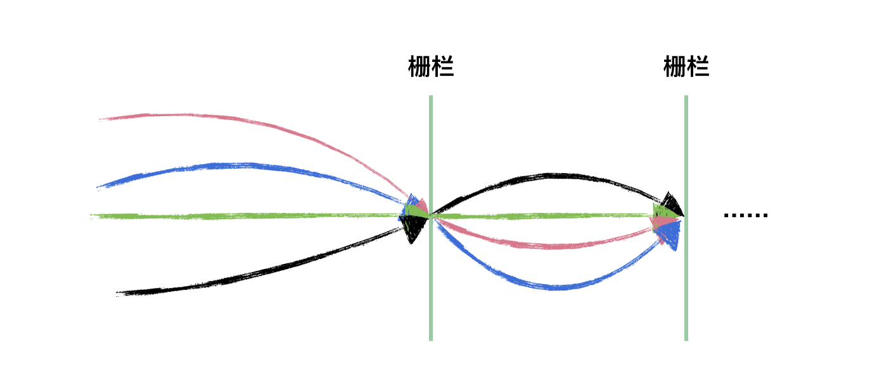

# CyclicBarrier

## 使用



```java
 @Test
  public void test() {
    int threadNum = 5;
    CyclicBarrier barrier =
        new CyclicBarrier(
            threadNum, () -> System.out.println(Thread.currentThread().getName() + " 完成最后任务"));
    for (int i = 0; i < threadNum; i++) {
      int finalI = i;
      new Thread(
              () -> {
                try {
                  System.out.println(finalI + " 到达栅栏 A");
                  barrier.await();
                  System.out.println(finalI + " 冲破栅栏 A");
                  System.out.println(finalI + " 到达栅栏 B");
                  barrier.await();
                  System.out.println(finalI + " 冲破栅栏 B");
                } catch (Exception e) {
                  e.printStackTrace();
                }
              })
          .start();
    }
  }
```

## 原理


有两个构造方法，只有带Runnable参数的构造方法才会在所有线程都到达等待点之后执行Runnable里面的run方法。

```java
CyclicBarrier(int parties) {
    this(parties, null);
}

CyclicBarrier(int parties, Runnable barrierAction) {
    if (parties <= 0) throw new IllegalArgumentException();
    this.parties = parties;
    this.count = parties;
    this.barrierCommand = barrierAction;
}
```

**维护锁状态逻辑**

其底层使用ReentrantLock+Condition进行锁状态的维护

```java
// 维护锁状态
private final ReentrantLock lock = new ReentrantLock();
private final Condition trip = lock.newCondition();
// 线程组数 
private final int parties;
// 所有线程到达等待点后执行的Runnable
private final Runnable barrierCommand;
// 需要等待的线程数量    
private int count;
// 屏障点定义
private static class Generation {
    boolean broken = false;
}
```

具体看看其是如何实现等待逻辑的，线程等待需要调用await方法

```java
public int await() {
        return dowait(false, 0L);
 }
    
public int await(long timeout, TimeUnit unit){
    return dowait(true, unit.toNanos(timeout));
}
```

最终调用的是dowait方法

```java
// 核心等待方法
private int dowait(boolean timed, long nanos) throws InterruptedException, BrokenBarrierException, TimeoutException {
  final ReentrantLock lock = this.lock;
  lock.lock();
  try {
    final Generation g = generation;
    // 检查当前栅栏是否被打翻
    if (g.broken) {
      throw new BrokenBarrierException();
    }
    //检查当前线程是否被中断
    if (Thread.interrupted()) {
      // 如果当前线程被中断会做以下三件事
      // 1.打翻当前栅栏
      // 2.唤醒拦截的所有线程
      // 3.抛出中断异常
      breakBarrier();
      throw new InterruptedException();
    }
    // 每次都将计数器的值减1
    int index = --count;
    // 计数器的值减为0则需唤醒所有线程并转换到下一代
    if (index == 0) {
      boolean ranAction = false;
      try {
        // 唤醒所有线程前先执行指定的任务
        final Runnable command = barrierCommand;
        if (command != null) {
          command.run();
        }
        ranAction = true;
        // 唤醒所有线程并转到下一代
        nextGeneration();
        return 0;
      } finally {
        // 确保在任务未成功执行时能将所有线程唤醒
        if (!ranAction) {
          breakBarrier();
        }
      }
    }
 
    // 如果计数器不为0则执行此循环
    for (;;) {
      try {
        // 根据传入的参数来决定是定时等待还是非定时等待
        if (!timed) {
          trip.await();
        }else if (nanos > 0L) {
          nanos = trip.awaitNanos(nanos);
        }
      } catch (InterruptedException ie) {
        // 若当前线程在等待期间被中断则打翻栅栏唤醒其他线程
        if (g == generation && ! g.broken) {
          breakBarrier();
          throw ie;
        } else {
          // 若在捕获中断异常前已经完成在栅栏上的等待, 则直接调用中断操作
          Thread.currentThread().interrupt();
        }
      }
      // 如果线程因为打翻栅栏操作而被唤醒则抛出异常
      if (g.broken) {
        throw new BrokenBarrierException();
      }
      // 如果线程因为换代操作而被唤醒则返回计数器的值
      if (g != generation) {
        return index;
      }
      // 如果线程因为时间到了而被唤醒则打翻栅栏并抛出异常
      if (timed && nanos <= 0L) {
        breakBarrier();
        throw new TimeoutException();
      }
    }
  } finally {
    lock.unlock();
  }
}
```

可以看到，是通过index字段控制线程等待的，当index不为0的时候，线程统一会进行阻塞，直到index为0的时候，才会唤醒所有线程，这时候所有线程才会继续往下执行。

**重复使用**

这个跟CountdownLatch不一样的是，CountdownLatch是一次性的，而CycliBarrier是可以重复使用的，只需调用一下reset方法。

```java
public void reset() {
    final ReentrantLock lock = this.lock;
    lock.lock();
    try {
        // 破坏当前的屏障点并唤醒所有线程 
        breakBarrier();   
        // 生成下一代
        nextGeneration(); 
    } finally {
        lock.unlock();
    }
}


private void breakBarrier() {
    generation.broken = true;
    // 将等待线程数量重置
    count = parties;
    // 唤醒所有线程 
    trip.signalAll();
}

private void nextGeneration() {
    // 唤醒所有线程
    trip.signalAll();
    // 将等待线程数量重置
    count = parties;
    generation = new Generation();
}
```

