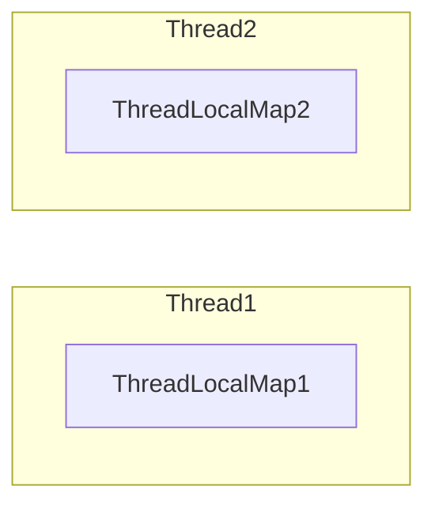
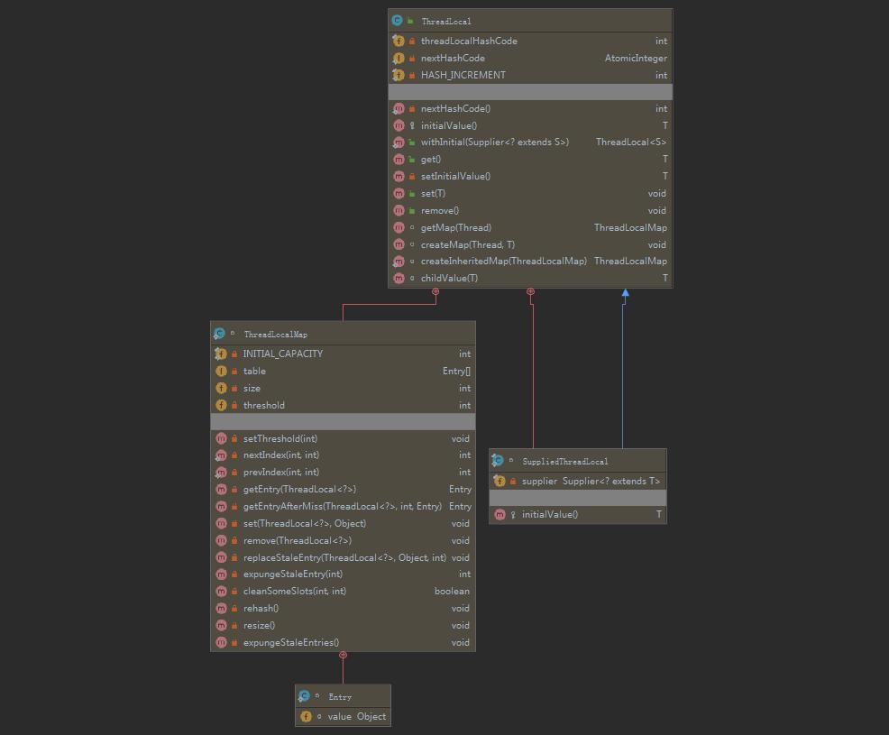
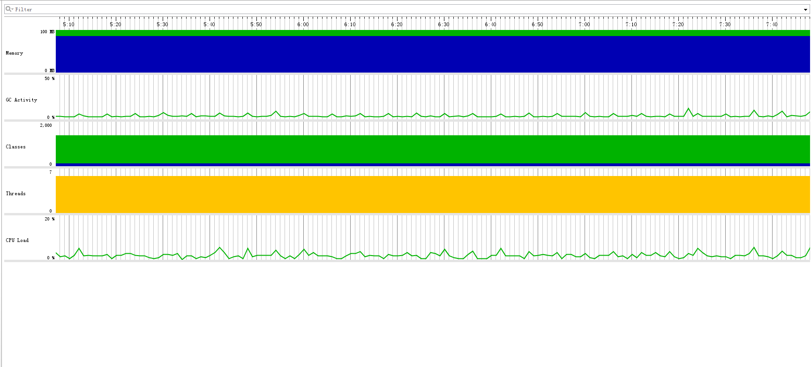
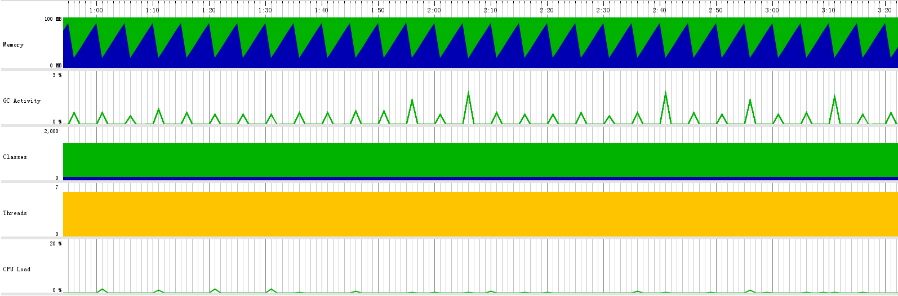
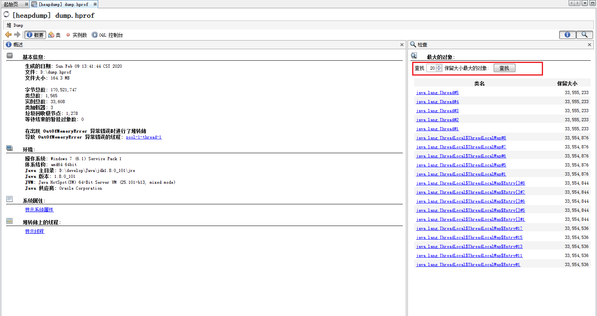
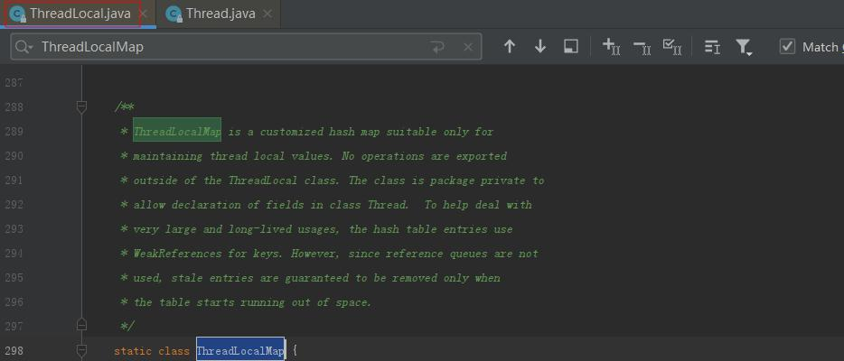

[TOC]


# ThreadLocal

>`ThreadLocal` == 本地线程？额，好像是这么一回事，如果你要这么翻译，我只能说没毛病，谁让你英语这么好呢，但是在你要继续问，这玩意是不是用来解决多线程问题的，我得打断你，老铁，他还真的不是叫做本地线程，在代码体系里，他是用来解决多线程共享变量的线程安全问题的，听不懂？别急，咱们坐下来慢慢谈。

## 介绍

### 概念

引用`JDK`官方原话：

> This class provides thread-local variables. These variables differ from their  normal counterparts in that each thread that accesses one (via its  `get` or `set` method) has its own, independently  initialized copy of the variable. `ThreadLocal` instances are  typically private static fields in classes that wish to associate state with a  thread (e.g., a user ID or Transaction ID). 
>
> 百度翻译：
>
> 这个类提供线程局部变量。这些变量与普通的变量不同，因为每个访问一个变量的线程（通过其“get”或“set”方法）都有自己的、独立初始化的变量副本。`ThreadLocal`实例通常是类中的私有静态字段，希望将状态与线程（例如，用户ID或事务ID）相关联。

大部人喜欢用图文说话，通俗易懂，咱们不妨直接来个图：



看懂上图了吗？人工翻译：每个线程内部含有自己的副本（`ThreadLocalMap`），这样线程间这个副本是隔离的

也就实现了所谓的`local`含义，这样在多线程的情况下，就能确保数据的线程安全。

### 应用场景

1. 多个线程下，可能存在线程安全问题的一些共享变量
2. 多个线程下，需要公用的引用对象（多线程多实例 ，一个线程一个实例，线程间不共享实例）

### 对比

`ThreadLocal`与`Synchronized`对比：

1. `Synchronized`主要是通过线程等待，牺牲时间来解决多线程问题
2. `ThreadLocal`主要是通过每个线程单独一份存储空间，牺牲空间来解决冲突，并且相比于``Synchronized``，`ThreadLocal`具有线程隔离的效果，只有在线程内才能获取到对应的值，线程外则不能访问到想要的值

## 使用

首先看下下面的代码，20个线程去做`count`，大家可以多次执行看看，可以对比下执行结果，看看是不是每次结果都是一样的：

```java
  private ExecutorService executorService =
      new ThreadPoolExecutor(20, 20, 0L, TimeUnit.SECONDS, new LinkedBlockingDeque<>());

  private static Integer num = 0;

  @Test
  public void test1() {
    for (int i = 0; i < 20; i++) {
      executorService.execute(() -> {
        System.out.println(Thread.currentThread() + ",start:" + num);
        for (int j = 0; j < 2; j++) {
          num++;
        }
        System.out.println(Thread.currentThread() + ",end:" + num);
      });
    }
    System.out.println(Thread.currentThread() + ",all:" + num);
  }
```

抽样日志，发现多次执行这段测试类，结果是不一样的，测试代码存在线程安全问题。

```properties
Thread[pool-1-thread-8,5,main],start:6
Thread[pool-1-thread-8,5,main],end:8
Thread[main,5,main],all:8
Thread[pool-1-thread-16,5,main],start:8
Thread[pool-1-thread-16,5,main],end:10
Thread[pool-1-thread-5,5,main],start:10
Thread[pool-1-thread-5,5,main],end:12
```

想必大家都知道发生线程安全问题的根本原因是目标资源存在竞争了，也知道很多解决线程安全问题的方法。既然这篇文章主要介绍`ThreadLocal`，那么，我们就用来他来解决这个问题，而`ThreadLocal`解决线程问题的根本思路就是一个线程一个实例，线程间不共享实例。

下面这段代码，是修改过后的逻辑：

```java
  private ExecutorService executorService =
      new ThreadPoolExecutor(6, 6, 0L, TimeUnit.SECONDS, new LinkedBlockingDeque<>());
   
  private static final ThreadLocal<Integer> threadLocalNum = new ThreadLocal<>();

  @Test
  public void test2() {
    for (int i = 0; i < 20; i++) {
      executorService.execute(() -> {
        threadLocalNum.set(0);
        System.out.println(Thread.currentThread() + ",start:" + threadLocalNum.get());
        for (int j = 0; j < 2; j++) {
          Integer temp = threadLocalNum.get();
          threadLocalNum.set(++temp);
        }
        System.out.println(Thread.currentThread() + ",end:" + threadLocalNum.get());
      });
    }
    System.out.println(Thread.currentThread() + ",all:" + threadLocalNum.get());
  }
```

多执行几次，发现结果没有发生变化，且主线程的值为`null`，证明了不同的线程的内部副本独立性。

```properties
Thread[main,5,main],all:null
Thread[pool-1-thread-5,5,main],start:0
Thread[pool-1-thread-5,5,main],end:2
Thread[pool-1-thread-9,5,main],start:0
Thread[pool-1-thread-9,5,main],end:2
Thread[pool-1-thread-1,5,main],start:0
Thread[pool-1-thread-1,5,main],end:2
```

## 分析

### 实现

类图：



从`ThreadLocal`类图看，它本身是主要设计为一个储存类，对外提供`get()`、`set()`方法，对内存在静态内部类`ThreadLocalMap`，从`ThreadLocalMap`的设计来看，他才是核心的数据结构封装，内部核心实现是一个`Entry`数组，
对外部封装了数据的基本操作方法。

首先我们来看下`ThreadLocal`的`get()`、`set()`，具体实现，以此来分析`ThreadLocal`和`ThreadLocalMap`的关系：

```java
public class ThreadLocal<T> {    
    //...
	public T get() {
        // 当前线程
        Thread t = Thread.currentThread();
        // 从当前线程中取出ThreadLocalMap对象
        ThreadLocalMap map = getMap(t);
        if (map != null) {
            // 以当前的ThreadLocal对象为key,从ThreadLocalMap中获取对应的Entry
            ThreadLocalMap.Entry e = map.getEntry(this);
            if (e != null) {
                @SuppressWarnings("unchecked")
                // 从Entry取出其value
                T result = (T)e.value;
                return result;
            }
        }
        // 如果拿不到ThreadLocalMap或者Entry，则说明未初始化，这个方法负责初始化
        return setInitialValue();
    }

    private T setInitialValue() {
        Object var1 = this.initialValue();
        Thread var2 = Thread.currentThread();
        ThreadLocal.ThreadLocalMap var3 = this.getMap(var2);
        if (var3 != null) {
            // ThreadLocalMap已初始化的情况，直接将初始的var1筛入ThreadLocalMap中
            var3.set(this, var1);
        } else {
            // ThreadLocalMap未初始化的情况，new一个ThreadLocalMap赋值给Thread.threadLocals
            this.createMap(var2, var1);
        }

        return var1;
    }

    void createMap(Thread var1, T var2) {
        var1.threadLocals = new ThreadLocal.ThreadLocalMap(this, var2);
    }

	public void set(T value) {
        Thread t = Thread.currentThread();
        ThreadLocalMap map = getMap(t);
        if (map != null)
            // ThreadLocalMap已初始化的情况，直接set
            map.set(this, value);
        else
            // ThreadLocalMap未初始化的情况，new一个ThreadLocalMap赋值给Thread.threadLocals
            createMap(t, value);
    }

    ThreadLocalMap getMap(Thread t) {
        return t.threadLocals;
    }
    //...
}
```

看了上面的源码，和博主的注释，相信对于上面的内容，大家很好理解，`get()`、`set()`的设计避免了`ThreadLocalMap`、`Thread`的直接暴露，这样对于使用者，无需关心线程和具体存放的实现。

为了研究`ThreadLocalMap`本身是如何维护数据结构的，下面我们接着看`ThreadLocalMap`的实现：

```java
public class ThreadLocal<T> {
         //...
         private final int threadLocalHashCode = nextHashCode();
   
         // 斐波那契散列乘数,它的优点是通过它散列(hash)出来的结果分布会比较均匀，可以很大程度上避免hash冲突
         private static final int HASH_INCREMENT = 0x61c88647;
    
         private static AtomicInteger nextHashCode = new AtomicInteger();
    
         private static int nextHashCode() {
            return nextHashCode.getAndAdd(HASH_INCREMENT);
         }
    
         static class ThreadLocalMap {
      		//...
            private Entry getEntry(ThreadLocal<?> key) {
                // 索引计算，key.threadLocalHashCode与(table.length - 1)位运算
                int i = key.threadLocalHashCode & (table.length - 1);
                Entry e = table[i];
                if (e != null && e.get() == key)
                    return e;
                else
                    return getEntryAfterMiss(key, i, e);
            }
             
            private Entry getEntryAfterMiss(ThreadLocal<?> key, int i, Entry e) {
                Entry[] tab = table;
                int len = tab.length;

                while (e != null) {
                    ThreadLocal<?> k = e.get();
                    if (k == key)
                        return e;
                    if (k == null)
                        // 清除一些无用的值
                        expungeStaleEntry(i);
                    else
                        i = nextIndex(i, len);
                    e = tab[i];
                }
                return null;
            }
             
            private void set(ThreadLocal<?> key, Object value) {
                // We don't use a fast path as with get() because it is at
                // least as common to use set() to create new entries as
                // it is to replace existing ones, in which case, a fast
                // path would fail more often than not.
                Entry[] tab = table;
                int len = tab.length;
                int i = key.threadLocalHashCode & (len-1);

                for (Entry e = tab[i];
                     e != null;
                     e = tab[i = nextIndex(i, len)]) {
                    ThreadLocal<?> k = e.get();

                    if (k == key) {
                        e.value = value;
                        return;
                    }

                    if (k == null) {
                        replaceStaleEntry(key, value, i);
                        return;
                    }
                }

                tab[i] = new Entry(key, value);
                int sz = ++size;
                // 清除一些无用的值
                if (!cleanSomeSlots(i, sz) && sz >= threshold)
                    rehash();
            }

            /**
             * Remove the entry for key.
             */
            private void remove(ThreadLocal<?> key) {
                Entry[] tab = table;
                int len = tab.length;
                int i = key.threadLocalHashCode & (len-1);
                for (Entry e = tab[i];
                     e != null;
                     e = tab[i = nextIndex(i, len)]) {
                    if (e.get() == key) {
                        e.clear();
                        expungeStaleEntry(i);
                        return;
                    }
                }
            }
      		//...
         }
         //...
}
```

上述源码中，可以清晰的见到，`table`的索引是如何计算出来，其中还包括对于`Miss`情况的处理，`Miss`的情况源码中也有详细的逻辑，感兴趣的可以翻开源码继续深究，除了`get`、`set`方法，`ThreadLocalMap`还提供了`remove`方法，在当前线程不用时，可以调用此方法删除。

看完了源码，大致清楚了`ThreadLocal`的实现机制，对于其中的一些细节和疑问，后续篇幅再给大家梳理下。

**`ThreadLocal`的实现机制总结如下：**

`ThreadLocal`本身不做数据结构的实现，只是封装了静态内部类`ThreadLocalMap`、`Thread`的调用逻辑，提供给使用者使用，`ThreadLocalMap`利用`Entry[]`数组实现了对象实例的存储，其中索引的计算利用斐波那契散列乘数来较大程度的避免Hash冲突，`ThreadLocalMap`对外提供了`Entry[]`的数据存储维护方法。

### 回收机制

在上述源码中，可见`ThreadLocalMap`对象实例，实际上是存放在每个`Thread`中的，只是被定义在`ThreadLocal`中。既然是这样的，那么`ThreadLocalMap`的生命周期与`Thread`一样长，在`Thread`被销毁的时候，`ThreadLocalMap`也会随之被回收。

这么看来，好像`ThreadLocalMap`永远也不会发生内存泄露的问题呀？如果这么想，那离下次内存泄露事故不久了，咱们回头在斟酌下生命周期：`ThreadLocalMap`的生命周期与`Thread`一样长。这里你会不会产生一个疑问，如果`Thread`放在线程池里，`ThreadLocalMap`一直往里面`set`值，从不主动调用`remove`，是不是就发生了内存泄露？话不多说，咱们模拟下，看看结果。

```java
  static class LocalVariable {
    private Long[] a = new Long[4 * 1024 * 1024];
  }

  final static ThreadPoolExecutor poolExecutor =
      new ThreadPoolExecutor(5, 5, 1, TimeUnit.MINUTES, new LinkedBlockingQueue<>());

  final static ThreadLocal<LocalVariable> localVariable = new ThreadLocal<LocalVariable>();

  /**
   * jvm参数 -Xms100m -Xmx100m
   *
   * @throws InterruptedException
   */
  @Test
  public void test4() throws InterruptedException {
    for (int i = 0; i < 5000; ++i) {
      poolExecutor.execute(() -> {
        localVariable.set(new LocalVariable());
        System.out.println("use local varaible:" + localVariable.get());
//        localVariable.remove();
      });
      Thread.sleep(1000);
    }
    System.out.println("pool execute over");
  }
```

打印日志：

```java
use local varaible:thread.Test01$LocalVariable@759d4ea7
use local varaible:thread.Test01$LocalVariable@6b5a2f85
use local varaible:thread.Test01$LocalVariable@5171dc8b
use local varaible:thread.Test01$LocalVariable@4a7b8c4f
use local varaible:thread.Test01$LocalVariable@1cfaa313
Exception in thread "pool-1-thread-9" java.lang.OutOfMemoryError: Java heap space
use local varaible:thread.Test01$LocalVariable@492267bb
...
```

`Jprofiler`监控：



从日志看，出现了我们喜欢的字样`OOM`。从`Jprofiler`看，尽管`GC`活动很活跃，但是由于存在大量无法回收的堆内存，导致其一直处于紧张状态。我们再把`localVariable.remove();`的注释去除，跑一段时间试试。

打印日志：

没有发生`OOM`

`Jprofiler`监控：



从`Jprofiler`看，堆内存使用正常，`GC`可以正常回收掉不在需要的内存。

好了，到此我们证明了，`ThreadLocalMap`使用不当，会发生内存泄露。

既然发生了`OOM`，我们不妨则`dump`出堆，看下是不是由于`ThreadLocalMap`使用不当导致，进行反向验证，修改启动参数：

```
-Xms100m -Xmx100m -XX:+HeapDumpOnOutOfMemoryError -XX:HeapDumpPath=/dump.hprof
```

`Dump`文件使用`JDK`自带的`jvisualvm`查看：




 首先我们查出排名前20的最大对象，然后我们发现大小基本差不多，所以我们随便选择了一个 `Thread`，通过对一个实例的分析，最终查到`ThreadLocalMap`大小异常，几乎占满了线程，通过对`ThreadLocalMap`内部结构分析，最终看到了`LocalVariable`这个大对象。

好，我们对以上实验做下简单的总结：

 `ThreadLocalMap`和`Thread`的生命周期一样长，所以不管线程是否重用，我们都应该，在使用完静态变量后，都应该主动加remove掉不需要的内容，以确保不会发生内存泄露问题。

### 误区

1. `ThreadLocalMap`在`ThreadLocal`内？

   首先，这个问题本身有问题，应该拆分为下面两个问题：

   A、`ThreadLocalMap`定义在`ThreadLocal`内？

   B、运行时，`ThreadLocalMap`的实例对象是在`ThreadLocal`实例对象内，还是在`Thread`实例对象内？

   对于问题A，不言而喻，下方源码证明了这一点，`ThreadLocalMap`确实是`ThreadLocal`的静态内部类。

   

   ​                                                               

   对于问题B，同样咱们分析源码，从源码中`get`、`set`中可见，`ThreadLocalMap`都是从`Thread`中获取所得，由此可见证明了：运行时，`ThreadLocalMap`的实例对象是在`Thread`实例对象内

   ```java
    public T get() {
           Thread t = Thread.currentThread();
           ThreadLocalMap map = getMap(t);
           if (map != null) {
               ThreadLocalMap.Entry e = map.getEntry(this);
               if (e != null) {
                   @SuppressWarnings("unchecked")
                   T result = (T)e.value;
                   return result;
               }
           }
           return setInitialValue();
       }
   
   	public void set(T value) {
           Thread t = Thread.currentThread();
           ThreadLocalMap map = getMap(t);
           if (map != null)
               map.set(this, value);
           else
               createMap(t, value);
       }
   
       ThreadLocalMap getMap(Thread t) {
           return t.threadLocals;
       }
   ```
   
   

2. `ThreadLocalMap`的索引及`table`，能否有一个较好的总结？

- 对于某一`ThreadLocal`来讲，他的索引值`i`是确定的，在不同线程之间访问时访问的是不同的`table`数组的同一位置即都为`table[i]`，只不过这个不同线程之间的`table`是独立的。

- 对于同一线程的不同`ThreadLocal`来讲，这些`ThreadLocal`实例共享一个`table`数组，然后每个`ThreadLocal`实例在`table`中的索引`i`是不同的。 


# InheritableThreadLocal

> https://www.cnblogs.com/hama1993/p/10400265.html

# TransmittableThreadLocal

> 阿里提供：
>
> https://github.com/alibaba/transmittable-thread-local


