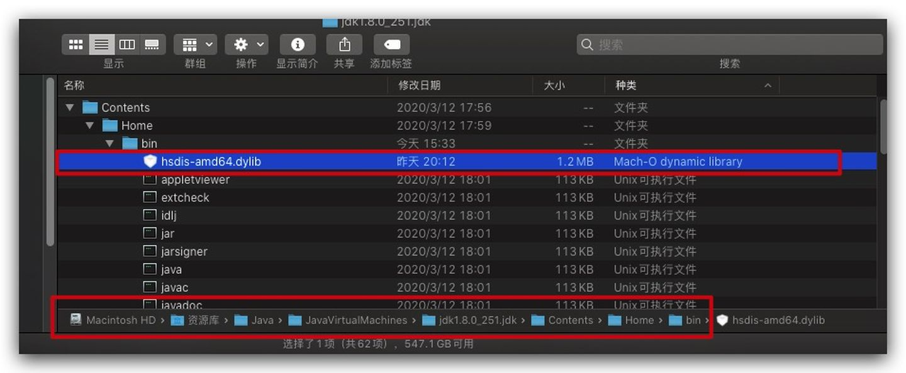
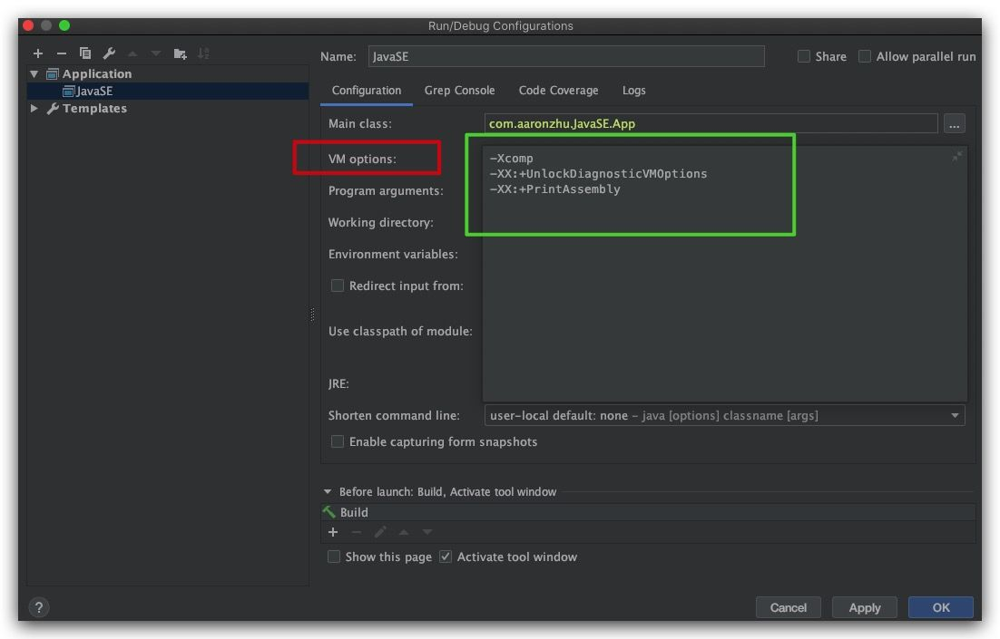
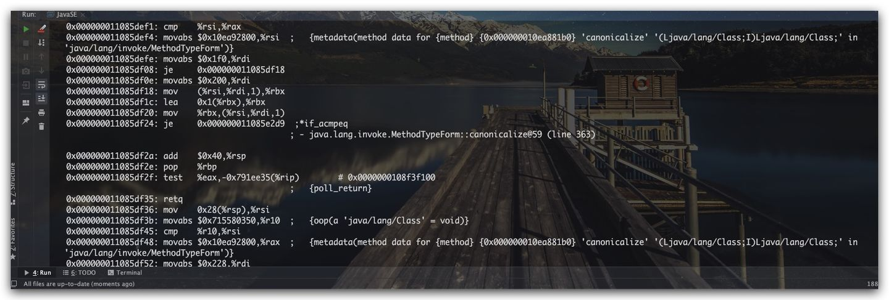
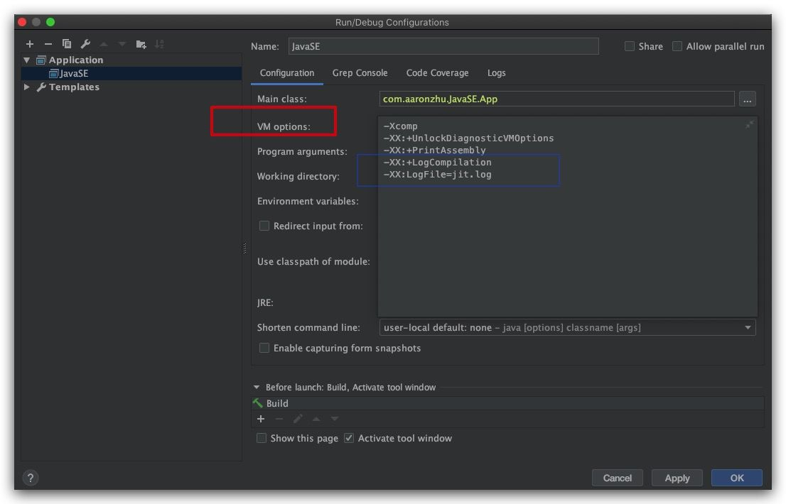
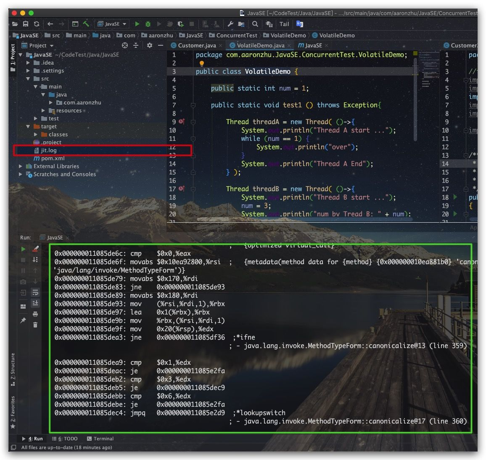
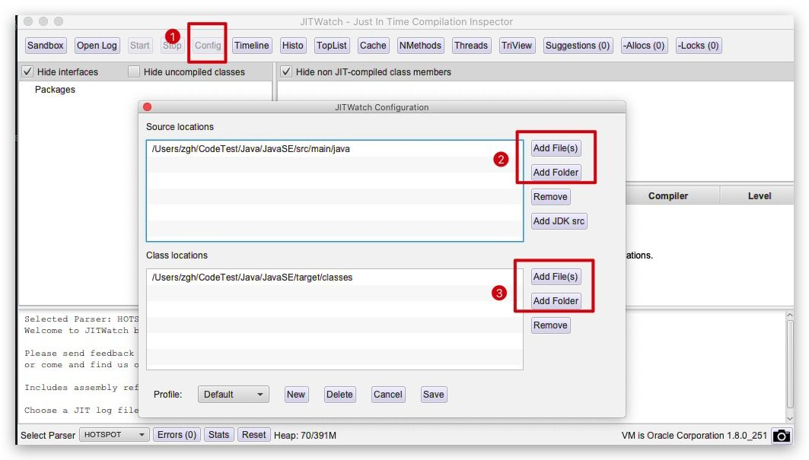
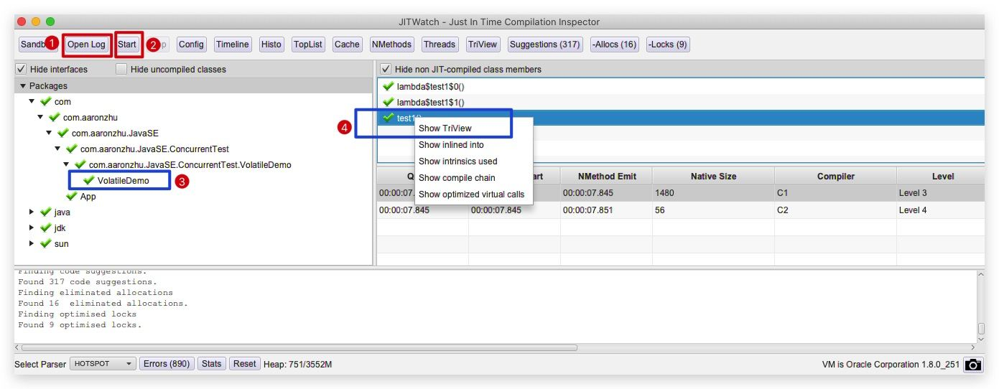
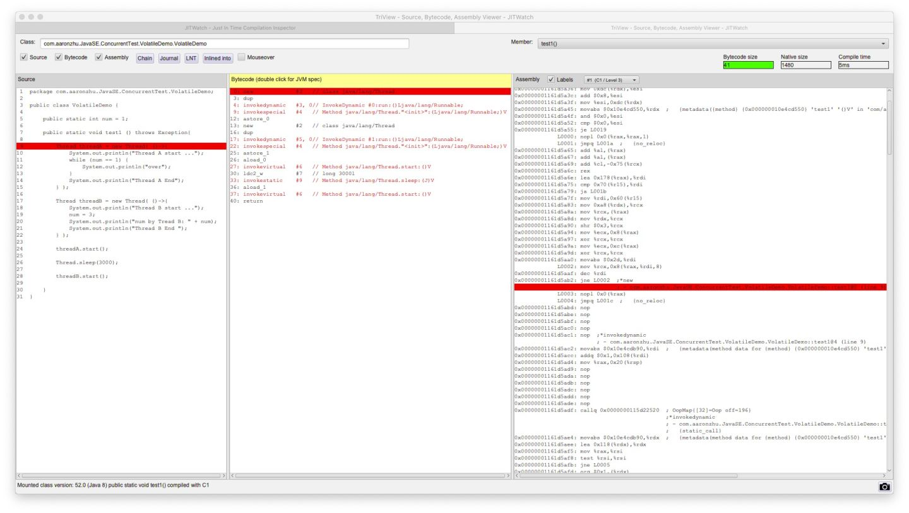

# Javap


# HSDIS：生成代码反汇编

> 已编译文件：[hsdis-amd64.dll](https://github.com/atzhangsan/file_loaded)
>
> 手动编译
>
> win： https://dropzone.nfshost.com/hsdis
>
> Linux：https://github.com/liuzhengyang/hsdis


> 大多数情况下，通过诸如javap等反编译工具来查看源码的字节码已经能够满足我们的日常需求，但是不排除在有些特定场景下，我们需要通过反汇编来查看相应的汇编指令。本文我们就来介绍两个很好用的工具——HSDIS、JITWatch
>
> ## **HSDIS**
>
> HSDIS(HotSpot disassembler)，一个Sun官方推荐的HotSpot虚拟机JIT编译代码的反汇编插件，其实际上就是一个动态库。这里我们直接从网上下载与我们系统对应的编译后文件，然后直接将其放置到JDK的bin目录下即可
>
> 
>
> 然后在IDE中配置相关VM Option虚拟机参数
>
> 
>
> 这里对用到的相关VM Option作解释说明
>
> **-Xcomp** : 让JVM以编译模式执行代码，即JVM会在第一次运行时即将所有字节码编译为本地代码
> **-XX:+UnlockDiagnosticVMOptions** : 解锁诊断功能
> **-XX:+PrintAssembly** : 输出反汇编后的汇编指令
>
> 当我们在IDE运行代码后，即可看到直接输出的汇编代码了
>
> 
>
> ## **JITWatch**
>
> 虽然通过HSDIS我们已经可以通过输出打印来查看汇编，但是这样显然不够方便。特别是在大项目中，终端输出会非常多。幸运的是 **[JITWatch](https://link.zhihu.com/?target=https%3A//github.com/AdoptOpenJDK/jitwatch)** ——JIT编译日志分析工具解决了这个痛点
>
> ## **编译**
>
> 我们首先需要将JITWatch clone到本地
>
> ```bash
> git clone git@github.com:AdoptOpenJDK/jitwatch.git
> ```
>
> 然后通过Maven进行编译
>
> ```bash
> mvn clean compile -DskipTests=true
> ```
>
> 编译成功后，就可通过其中的脚本启动
>
> ```text
> sh launchUI.sh
> ```
>
> ## **JITWatch的可视化分析**
>
> 为了能让JITWatch可视化的分析编译日志，我们还需要继续添加相关VM Option虚拟机参数来让反汇编后的汇编指令写到指定日志文件中
>
> ```text
> -Xcomp
> -XX:+UnlockDiagnosticVMOptions
> -XX:+PrintAssembly
> -XX:+LogCompilation
> -XX:LogFile=jit.log
> ```
>
> 
>
> 这样IDE运行后，汇编代码不仅打印输出到终端，还会生成我们下面所需的日志文件
>
> 
>
> 现在，我们就可以通过JITWatch来进行可视化分析了
>
> 首先点击 **Config** 按钮来设置Java源码文件、Class字节码文件所在路径
>
> 
>
> 然后点击 **Open Log** 来导入我们刚刚生成的日志文件，然后点击 **Start** 即可。现在我们可以从左侧选择我们需要分析的类，然后在右侧列出的方法上右击并选择 **Show TriView** 即可进行分析
>
> 
>
> 从下面可以看到，JITWatch可以同时显示源码、字节码、汇编，大大方便了我们的分析工作
>
> 
>
> 


