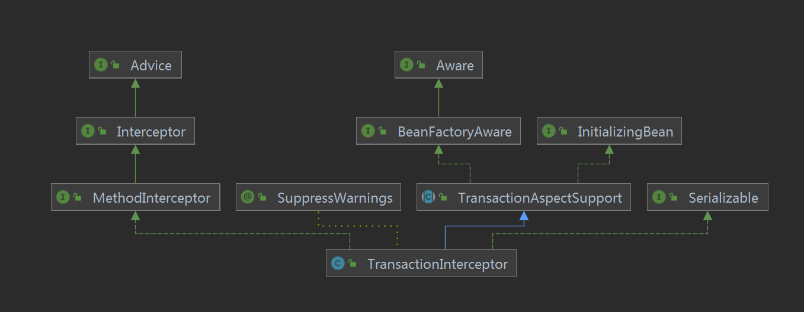
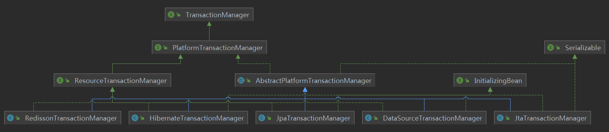
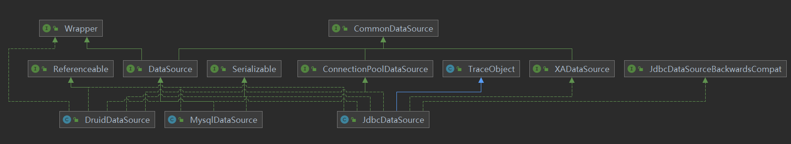

[TOC]


## Transactional

### 简介

见[Spring事务](../../../../BaseJava/Spring/Spring事务.md)

### 源码分析

大家都知道Spring的事务是基于AOP完成的，那么我们就从这个AOP说起。

假设一个例子：

类A：

```java
// 省去Bean管理
public class A {
    
    @Transactional
    public void test(){
    }
    
}
```

调用类：

```java
// 省去Bean管理
public class B {
 
    private A a;
    
    public void test(){
    	a.test();
    }

}
```

那么此时调用`a.test()`，会被代理一层，其中a是代理类，代理类很长，但是目的是代理方法，我们只要关注被代理的方法即可，即：test()。

下面为代理类（[代理类如何获得？](../../Jdk/Class.md)）：

```java
import java.lang.reflect.Method;
import org.aopalliance.aop.Advice;
import org.springframework.aop.Advisor;
import org.springframework.aop.SpringProxy;
import org.springframework.aop.TargetClassAware;
import org.springframework.aop.TargetSource;
import org.springframework.aop.framework.Advised;
import org.springframework.aop.framework.AopConfigException;
import org.springframework.cglib.core.ReflectUtils;
import org.springframework.cglib.core.Signature;
import org.springframework.cglib.proxy.Callback;
import org.springframework.cglib.proxy.Dispatcher;
import org.springframework.cglib.proxy.Factory;
import org.springframework.cglib.proxy.MethodInterceptor;
import org.springframework.cglib.proxy.MethodProxy;
import org.springframework.cglib.proxy.NoOp;

public class A$$EnhancerBySpringCGLIB$$21771092 extends A implements SpringProxy, Advised, Factory {
    private boolean CGLIB$BOUND;
    public static Object CGLIB$FACTORY_DATA;
    private static final ThreadLocal CGLIB$THREAD_CALLBACKS;
    private static final Callback[] CGLIB$STATIC_CALLBACKS;
    private MethodInterceptor CGLIB$CALLBACK_0;
    private MethodInterceptor CGLIB$CALLBACK_1;
    private NoOp CGLIB$CALLBACK_2;
    private Dispatcher CGLIB$CALLBACK_3;
    private Dispatcher CGLIB$CALLBACK_4;
    private MethodInterceptor CGLIB$CALLBACK_5;
    private MethodInterceptor CGLIB$CALLBACK_6;
    private static Object CGLIB$CALLBACK_FILTER;
    private static final Method CGLIB$test$0$Method;
    private static final MethodProxy CGLIB$test$0$Proxy;
    private static final Object[] CGLIB$emptyArgs;
    private static final Method CGLIB$equals$1$Method;
    private static final MethodProxy CGLIB$equals$1$Proxy;
    private static final Method CGLIB$toString$2$Method;
    private static final MethodProxy CGLIB$toString$2$Proxy;
    private static final Method CGLIB$hashCode$3$Method;
    private static final MethodProxy CGLIB$hashCode$3$Proxy;
    private static final Method CGLIB$clone$4$Method;
    private static final MethodProxy CGLIB$clone$4$Proxy;

    public A$$EnhancerBySpringCGLIB$$21771092() {
        CGLIB$BIND_CALLBACKS(this);
    }

    static {
        CGLIB$STATICHOOK29();
    }

    public final boolean equals(Object var1) {
        MethodInterceptor var10000 = this.CGLIB$CALLBACK_5;
        if (var10000 == null) {
            CGLIB$BIND_CALLBACKS(this);
            var10000 = this.CGLIB$CALLBACK_5;
        }

        if (var10000 != null) {
            Object var2 = var10000.intercept(this, CGLIB$equals$1$Method, new Object[]{var1}, CGLIB$equals$1$Proxy);
            return var2 == null ? false : (Boolean)var2;
        } else {
            return super.equals(var1);
        }
    }

    public final String toString() {
        MethodInterceptor var10000 = this.CGLIB$CALLBACK_0;
        if (var10000 == null) {
            CGLIB$BIND_CALLBACKS(this);
            var10000 = this.CGLIB$CALLBACK_0;
        }

        return var10000 != null ? (String)var10000.intercept(this, CGLIB$toString$2$Method, CGLIB$emptyArgs, CGLIB$toString$2$Proxy) : super.toString();
    }

    public final int hashCode() {
        MethodInterceptor var10000 = this.CGLIB$CALLBACK_6;
        if (var10000 == null) {
            CGLIB$BIND_CALLBACKS(this);
            var10000 = this.CGLIB$CALLBACK_6;
        }

        if (var10000 != null) {
            Object var1 = var10000.intercept(this, CGLIB$hashCode$3$Method, CGLIB$emptyArgs, CGLIB$hashCode$3$Proxy);
            return var1 == null ? 0 : ((Number)var1).intValue();
        } else {
            return super.hashCode();
        }
    }

    protected final Object clone() throws CloneNotSupportedException {
        MethodInterceptor var10000 = this.CGLIB$CALLBACK_0;
        if (var10000 == null) {
            CGLIB$BIND_CALLBACKS(this);
            var10000 = this.CGLIB$CALLBACK_0;
        }

        return var10000 != null ? var10000.intercept(this, CGLIB$clone$4$Method, CGLIB$emptyArgs, CGLIB$clone$4$Proxy) : super.clone();
    }

    public final int indexOf(Advice var1) {
        Dispatcher var10000 = this.CGLIB$CALLBACK_4;
        if (var10000 == null) {
            CGLIB$BIND_CALLBACKS(this);
            var10000 = this.CGLIB$CALLBACK_4;
        }

        return ((Advised)var10000.loadObject()).indexOf(var1);
    }

    public final int indexOf(Advisor var1) {
        Dispatcher var10000 = this.CGLIB$CALLBACK_4;
        if (var10000 == null) {
            CGLIB$BIND_CALLBACKS(this);
            var10000 = this.CGLIB$CALLBACK_4;
        }

        return ((Advised)var10000.loadObject()).indexOf(var1);
    }

    public Object newInstance(Callback var1) {
        throw new IllegalStateException("More than one callback object required");
    }

    public Object newInstance(Class[] var1, Object[] var2, Callback[] var3) {
        CGLIB$SET_THREAD_CALLBACKS(var3);
        A$$EnhancerBySpringCGLIB$$21771092 var10000 = new A$$EnhancerBySpringCGLIB$$21771092;
        switch(var1.length) {
        case 0:
            var10000.<init>();
            CGLIB$SET_THREAD_CALLBACKS((Callback[])null);
            return var10000;
        default:
            throw new IllegalArgumentException("Constructor not found");
        }
    }

    public Object newInstance(Callback[] var1) {
        CGLIB$SET_THREAD_CALLBACKS(var1);
        A$$EnhancerBySpringCGLIB$$21771092 var10000 = new A$$EnhancerBySpringCGLIB$$21771092();
        CGLIB$SET_THREAD_CALLBACKS((Callback[])null);
        return var10000;
    }

    public final boolean isFrozen() {
        Dispatcher var10000 = this.CGLIB$CALLBACK_4;
        if (var10000 == null) {
            CGLIB$BIND_CALLBACKS(this);
            var10000 = this.CGLIB$CALLBACK_4;
        }

        return ((Advised)var10000.loadObject()).isFrozen();
    }

    // 被代理的目标方法
    public final void test() {
        // 获取MethodInterceptor
        MethodInterceptor var10000 = this.CGLIB$CALLBACK_0;
        if (var10000 == null) {
            // 获取MethodInterceptor
            CGLIB$BIND_CALLBACKS(this);
            var10000 = this.CGLIB$CALLBACK_0;
        }

        // 此时的实现是org.springframework.aop.framework.CglibAopProxy.DynamicAdvisedInterceptor
        if (var10000 != null) {
            // 调用intercept
            var10000.intercept(this, CGLIB$test$0$Method, CGLIB$emptyArgs, CGLIB$test$0$Proxy);
        } else {
            super.test();
        }
    }

    public static MethodProxy CGLIB$findMethodProxy(Signature var0) {
        String var10000 = var0.toString();
        switch(var10000.hashCode()) {
        case -1422510685:
            if (var10000.equals("test()V")) {
                return CGLIB$test$0$Proxy;
            }
            break;
        case -508378822:
            if (var10000.equals("clone()Ljava/lang/Object;")) {
                return CGLIB$clone$4$Proxy;
            }
            break;
        case 1826985398:
            if (var10000.equals("equals(Ljava/lang/Object;)Z")) {
                return CGLIB$equals$1$Proxy;
            }
            break;
        case 1913648695:
            if (var10000.equals("toString()Ljava/lang/String;")) {
                return CGLIB$toString$2$Proxy;
            }
            break;
        case 1984935277:
            if (var10000.equals("hashCode()I")) {
                return CGLIB$hashCode$3$Proxy;
            }
        }

        return null;
    }

    private static final void CGLIB$BIND_CALLBACKS(Object var0) {
        A$$EnhancerBySpringCGLIB$$21771092 var1 = (A$$EnhancerBySpringCGLIB$$21771092)var0;
        if (!var1.CGLIB$BOUND) {
            var1.CGLIB$BOUND = true;
            Object var10000 = CGLIB$THREAD_CALLBACKS.get();
            if (var10000 == null) {
                var10000 = CGLIB$STATIC_CALLBACKS;
                if (var10000 == null) {
                    return;
                }
            }

            Callback[] var10001 = (Callback[])var10000;
            var1.CGLIB$CALLBACK_6 = (MethodInterceptor)((Callback[])var10000)[6];
            var1.CGLIB$CALLBACK_5 = (MethodInterceptor)var10001[5];
            var1.CGLIB$CALLBACK_4 = (Dispatcher)var10001[4];
            var1.CGLIB$CALLBACK_3 = (Dispatcher)var10001[3];
            var1.CGLIB$CALLBACK_2 = (NoOp)var10001[2];
            var1.CGLIB$CALLBACK_1 = (MethodInterceptor)var10001[1];
            var1.CGLIB$CALLBACK_0 = (MethodInterceptor)var10001[0];
        }

    }

    public static void CGLIB$SET_THREAD_CALLBACKS(Callback[] var0) {
        CGLIB$THREAD_CALLBACKS.set(var0);
    }

    public static void CGLIB$SET_STATIC_CALLBACKS(Callback[] var0) {
        CGLIB$STATIC_CALLBACKS = var0;
    }

    public void setCallback(int var1, Callback var2) {
        switch(var1) {
        case 0:
            this.CGLIB$CALLBACK_0 = (MethodInterceptor)var2;
            break;
        case 1:
            this.CGLIB$CALLBACK_1 = (MethodInterceptor)var2;
            break;
        case 2:
            this.CGLIB$CALLBACK_2 = (NoOp)var2;
            break;
        case 3:
            this.CGLIB$CALLBACK_3 = (Dispatcher)var2;
            break;
        case 4:
            this.CGLIB$CALLBACK_4 = (Dispatcher)var2;
            break;
        case 5:
            this.CGLIB$CALLBACK_5 = (MethodInterceptor)var2;
            break;
        case 6:
            this.CGLIB$CALLBACK_6 = (MethodInterceptor)var2;
        }

    }

    public void setCallbacks(Callback[] var1) {
        this.CGLIB$CALLBACK_0 = (MethodInterceptor)var1[0];
        this.CGLIB$CALLBACK_1 = (MethodInterceptor)var1[1];
        this.CGLIB$CALLBACK_2 = (NoOp)var1[2];
        this.CGLIB$CALLBACK_3 = (Dispatcher)var1[3];
        this.CGLIB$CALLBACK_4 = (Dispatcher)var1[4];
        this.CGLIB$CALLBACK_5 = (MethodInterceptor)var1[5];
        this.CGLIB$CALLBACK_6 = (MethodInterceptor)var1[6];
    }

    public Callback getCallback(int var1) {
        CGLIB$BIND_CALLBACKS(this);
        Object var10000;
        switch(var1) {
        case 0:
            var10000 = this.CGLIB$CALLBACK_0;
            break;
        case 1:
            var10000 = this.CGLIB$CALLBACK_1;
            break;
        case 2:
            var10000 = this.CGLIB$CALLBACK_2;
            break;
        case 3:
            var10000 = this.CGLIB$CALLBACK_3;
            break;
        case 4:
            var10000 = this.CGLIB$CALLBACK_4;
            break;
        case 5:
            var10000 = this.CGLIB$CALLBACK_5;
            break;
        case 6:
            var10000 = this.CGLIB$CALLBACK_6;
            break;
        default:
            var10000 = null;
        }

        return (Callback)var10000;
    }

    public Callback[] getCallbacks() {
        CGLIB$BIND_CALLBACKS(this);
        return new Callback[]{this.CGLIB$CALLBACK_0, this.CGLIB$CALLBACK_1, this.CGLIB$CALLBACK_2, this.CGLIB$CALLBACK_3, this.CGLIB$CALLBACK_4, this.CGLIB$CALLBACK_5, this.CGLIB$CALLBACK_6};
    }

    public final boolean isExposeProxy() {
        Dispatcher var10000 = this.CGLIB$CALLBACK_4;
        if (var10000 == null) {
            CGLIB$BIND_CALLBACKS(this);
            var10000 = this.CGLIB$CALLBACK_4;
        }

        return ((Advised)var10000.loadObject()).isExposeProxy();
    }

    public final TargetSource getTargetSource() {
        Dispatcher var10000 = this.CGLIB$CALLBACK_4;
        if (var10000 == null) {
            CGLIB$BIND_CALLBACKS(this);
            var10000 = this.CGLIB$CALLBACK_4;
        }

        return ((Advised)var10000.loadObject()).getTargetSource();
    }

    public final Class getTargetClass() {
        Dispatcher var10000 = this.CGLIB$CALLBACK_4;
        if (var10000 == null) {
            CGLIB$BIND_CALLBACKS(this);
            var10000 = this.CGLIB$CALLBACK_4;
        }

        return ((TargetClassAware)var10000.loadObject()).getTargetClass();
    }

    public final Advisor[] getAdvisors() {
        Dispatcher var10000 = this.CGLIB$CALLBACK_4;
        if (var10000 == null) {
            CGLIB$BIND_CALLBACKS(this);
            var10000 = this.CGLIB$CALLBACK_4;
        }

        return ((Advised)var10000.loadObject()).getAdvisors();
    }

    public final void setExposeProxy(boolean var1) {
        Dispatcher var10000 = this.CGLIB$CALLBACK_4;
        if (var10000 == null) {
            CGLIB$BIND_CALLBACKS(this);
            var10000 = this.CGLIB$CALLBACK_4;
        }

        ((Advised)var10000.loadObject()).setExposeProxy(var1);
    }

    public final void setPreFiltered(boolean var1) {
        Dispatcher var10000 = this.CGLIB$CALLBACK_4;
        if (var10000 == null) {
            CGLIB$BIND_CALLBACKS(this);
            var10000 = this.CGLIB$CALLBACK_4;
        }

        ((Advised)var10000.loadObject()).setPreFiltered(var1);
    }

    public final void setTargetSource(TargetSource var1) {
        Dispatcher var10000 = this.CGLIB$CALLBACK_4;
        if (var10000 == null) {
            CGLIB$BIND_CALLBACKS(this);
            var10000 = this.CGLIB$CALLBACK_4;
        }

        ((Advised)var10000.loadObject()).setTargetSource(var1);
    }

    public final boolean isPreFiltered() {
        Dispatcher var10000 = this.CGLIB$CALLBACK_4;
        if (var10000 == null) {
            CGLIB$BIND_CALLBACKS(this);
            var10000 = this.CGLIB$CALLBACK_4;
        }

        return ((Advised)var10000.loadObject()).isPreFiltered();
    }

    public final void addAdvisor(Advisor var1) throws AopConfigException {
        Dispatcher var10000 = this.CGLIB$CALLBACK_4;
        if (var10000 == null) {
            CGLIB$BIND_CALLBACKS(this);
            var10000 = this.CGLIB$CALLBACK_4;
        }

        ((Advised)var10000.loadObject()).addAdvisor(var1);
    }

    public final void addAdvisor(int var1, Advisor var2) throws AopConfigException {
        Dispatcher var10000 = this.CGLIB$CALLBACK_4;
        if (var10000 == null) {
            CGLIB$BIND_CALLBACKS(this);
            var10000 = this.CGLIB$CALLBACK_4;
        }

        ((Advised)var10000.loadObject()).addAdvisor(var1, var2);
    }

    public final boolean replaceAdvisor(Advisor var1, Advisor var2) throws AopConfigException {
        Dispatcher var10000 = this.CGLIB$CALLBACK_4;
        if (var10000 == null) {
            CGLIB$BIND_CALLBACKS(this);
            var10000 = this.CGLIB$CALLBACK_4;
        }

        return ((Advised)var10000.loadObject()).replaceAdvisor(var1, var2);
    }

    public final boolean removeAdvisor(Advisor var1) {
        Dispatcher var10000 = this.CGLIB$CALLBACK_4;
        if (var10000 == null) {
            CGLIB$BIND_CALLBACKS(this);
            var10000 = this.CGLIB$CALLBACK_4;
        }

        return ((Advised)var10000.loadObject()).removeAdvisor(var1);
    }

    public final void removeAdvisor(int var1) throws AopConfigException {
        Dispatcher var10000 = this.CGLIB$CALLBACK_4;
        if (var10000 == null) {
            CGLIB$BIND_CALLBACKS(this);
            var10000 = this.CGLIB$CALLBACK_4;
        }

        ((Advised)var10000.loadObject()).removeAdvisor(var1);
    }

    public final void addAdvice(Advice var1) throws AopConfigException {
        Dispatcher var10000 = this.CGLIB$CALLBACK_4;
        if (var10000 == null) {
            CGLIB$BIND_CALLBACKS(this);
            var10000 = this.CGLIB$CALLBACK_4;
        }

        ((Advised)var10000.loadObject()).addAdvice(var1);
    }

    public final void addAdvice(int var1, Advice var2) throws AopConfigException {
        Dispatcher var10000 = this.CGLIB$CALLBACK_4;
        if (var10000 == null) {
            CGLIB$BIND_CALLBACKS(this);
            var10000 = this.CGLIB$CALLBACK_4;
        }

        ((Advised)var10000.loadObject()).addAdvice(var1, var2);
    }

    public final boolean removeAdvice(Advice var1) {
        Dispatcher var10000 = this.CGLIB$CALLBACK_4;
        if (var10000 == null) {
            CGLIB$BIND_CALLBACKS(this);
            var10000 = this.CGLIB$CALLBACK_4;
        }

        return ((Advised)var10000.loadObject()).removeAdvice(var1);
    }

    public final Class[] getProxiedInterfaces() {
        Dispatcher var10000 = this.CGLIB$CALLBACK_4;
        if (var10000 == null) {
            CGLIB$BIND_CALLBACKS(this);
            var10000 = this.CGLIB$CALLBACK_4;
        }

        return ((Advised)var10000.loadObject()).getProxiedInterfaces();
    }

    public final boolean isInterfaceProxied(Class var1) {
        Dispatcher var10000 = this.CGLIB$CALLBACK_4;
        if (var10000 == null) {
            CGLIB$BIND_CALLBACKS(this);
            var10000 = this.CGLIB$CALLBACK_4;
        }

        return ((Advised)var10000.loadObject()).isInterfaceProxied(var1);
    }

    public final boolean isProxyTargetClass() {
        Dispatcher var10000 = this.CGLIB$CALLBACK_4;
        if (var10000 == null) {
            CGLIB$BIND_CALLBACKS(this);
            var10000 = this.CGLIB$CALLBACK_4;
        }

        return ((Advised)var10000.loadObject()).isProxyTargetClass();
    }

    public final String toProxyConfigString() {
        Dispatcher var10000 = this.CGLIB$CALLBACK_4;
        if (var10000 == null) {
            CGLIB$BIND_CALLBACKS(this);
            var10000 = this.CGLIB$CALLBACK_4;
        }

        return ((Advised)var10000.loadObject()).toProxyConfigString();
    }

    static void CGLIB$STATICHOOK29() {
        CGLIB$THREAD_CALLBACKS = new ThreadLocal();
        CGLIB$emptyArgs = new Object[0];
        Class var0 = Class.forName("cn.xyz.god.wealth.A$$EnhancerBySpringCGLIB$$21771092");
        Class var1;
        Method[] var10000 = ReflectUtils.findMethods(new String[]{"equals", "(Ljava/lang/Object;)Z", "toString", "()Ljava/lang/String;", "hashCode", "()I", "clone", "()Ljava/lang/Object;"}, (var1 = Class.forName("java.lang.Object")).getDeclaredMethods());
        CGLIB$equals$1$Method = var10000[0];
        CGLIB$equals$1$Proxy = MethodProxy.create(var1, var0, "(Ljava/lang/Object;)Z", "equals", "CGLIB$equals$1");
        CGLIB$toString$2$Method = var10000[1];
        CGLIB$toString$2$Proxy = MethodProxy.create(var1, var0, "()Ljava/lang/String;", "toString", "CGLIB$toString$2");
        CGLIB$hashCode$3$Method = var10000[2];
        CGLIB$hashCode$3$Proxy = MethodProxy.create(var1, var0, "()I", "hashCode", "CGLIB$hashCode$3");
        CGLIB$clone$4$Method = var10000[3];
        CGLIB$clone$4$Proxy = MethodProxy.create(var1, var0, "()Ljava/lang/Object;", "clone", "CGLIB$clone$4");
        CGLIB$test$0$Method = ReflectUtils.findMethods(new String[]{"test", "()V"}, (var1 = Class.forName("cn.xyz.god.wealth.A")).getDeclaredMethods())[0];
        CGLIB$test$0$Proxy = MethodProxy.create(var1, var0, "()V", "test", "CGLIB$test$0");
    }

    final void CGLIB$test$0() {
        super.test();
    }

    final boolean CGLIB$equals$1(Object var1) {
        return super.equals(var1);
    }

    final String CGLIB$toString$2() {
        return super.toString();
    }

    final int CGLIB$hashCode$3() {
        return super.hashCode();
    }

    final Object CGLIB$clone$4() throws CloneNotSupportedException {
        return super.clone();
    }
}
```

通过上述代理类，我们得知了：代理类主要目的是为了执行`org.springframework.aop.framework.CglibAopProxy.DynamicAdvisedInterceptor#intercept`方法，那么接下来我们直接从这个方法往下看：

```java
/**
 * General purpose AOP callback. Used when the target is dynamic or when the
 * proxy is not frozen.
 */
private static class DynamicAdvisedInterceptor implements MethodInterceptor, Serializable {

   private final AdvisedSupport advised;

   public DynamicAdvisedInterceptor(AdvisedSupport advised) {
      this.advised = advised;
   }

   @Override
   @Nullable
   public Object intercept(Object proxy, Method method, Object[] args, MethodProxy methodProxy) throws Throwable {
      Object oldProxy = null;
      boolean setProxyContext = false;
      Object target = null;
      TargetSource targetSource = this.advised.getTargetSource();
      try {
         if (this.advised.exposeProxy) {
            // Make invocation available if necessary.
            oldProxy = AopContext.setCurrentProxy(proxy);
            setProxyContext = true;
         }
         // Get as late as possible to minimize the time we "own" the target, in case it comes from a pool...
         target = targetSource.getTarget();
         Class<?> targetClass = (target != null ? target.getClass() : null);
         // 获取目标方法的拦截链
         List<Object> chain = this.advised.getInterceptorsAndDynamicInterceptionAdvice(method, targetClass);
         Object retVal;
         // Check whether we only have one InvokerInterceptor: that is,
         // no real advice, but just reflective invocation of the target.
         if (chain.isEmpty() && Modifier.isPublic(method.getModifiers())) {
            // We can skip creating a MethodInvocation: just invoke the target directly.
            // Note that the final invoker must be an InvokerInterceptor, so we know
            // it does nothing but a reflective operation on the target, and no hot
            // swapping or fancy proxying.
            Object[] argsToUse = AopProxyUtils.adaptArgumentsIfNecessary(method, args);
            retVal = methodProxy.invoke(target, argsToUse);
         }
         else {
            // We need to create a method invocation...
            // 创建一个方法调用器，并且调用
            retVal = new CglibMethodInvocation(proxy, target, method, args, targetClass, chain, methodProxy).proceed();
         }
         retVal = processReturnType(proxy, target, method, retVal);
         return retVal;
      }
      finally {
         if (target != null && !targetSource.isStatic()) {
            targetSource.releaseTarget(target);
         }
         if (setProxyContext) {
            // Restore old proxy.
            AopContext.setCurrentProxy(oldProxy);
         }
      }
   }

   // ...省略不重要的方法，下文同此，不在说明
}
```


 从代理类开始，整理下调用链路：

```sequence
A$$EnhancerBySpringCGLIB$$21771092->DynamicAdvisedInterceptor: intercept
DynamicAdvisedInterceptor->CglibMethodInvocation: proceed
CglibMethodInvocation->TransactionInterceptor: invoke
```

最终调用`org.springframework.transaction.interceptor.TransactionInterceptor#invoke`，看到这里终于开始有事务的影子了，我们继续往下看：

```java
	@Override
	@Nullable
	public Object invoke(MethodInvocation invocation) throws Throwable {
		// Work out the target class: may be {@code null}.
		// The TransactionAttributeSource should be passed the target class
		// as well as the method, which may be from an interface.
		Class<?> targetClass = (invocation.getThis() != null ? AopUtils.getTargetClass(invocation.getThis()) : null);

		// Adapt to TransactionAspectSupport's invokeWithinTransaction...
		return invokeWithinTransaction(invocation.getMethod(), targetClass, invocation::proceed);
	}
```

这边的代码大家一看就懂，无非就是获取目标Class对象，然后继续调用`invokeWithinTransaction`，在继续往下看之前，我们先看下类图：



TransactionAspectSupport：实现了Spring事务基础架构，为任何后续的实现提供了基础。

TransactionInterceptor继承TransactionAspectSupport，而`invokeWithinTransaction`是TransactionAspectSupport的方法。下面，我们继续分析`invokeWithinTransaction`方法：（这个方法有点长，我将大致的代码思路备注在源码中）

```java
/**
 * General delegate for around-advice-based subclasses, delegating to several other template
 * methods on this class. Able to handle {@link CallbackPreferringPlatformTransactionManager}
 * as well as regular {@link PlatformTransactionManager} implementations.
 * @param method the Method being invoked
 * @param targetClass the target class that we're invoking the method on
 * @param invocation the callback to use for proceeding with the target invocation
 * @return the return value of the method, if any
 * @throws Throwable propagated from the target invocation
 */
@Nullable
protected Object invokeWithinTransaction(Method method, @Nullable Class<?> targetClass,
      final InvocationCallback invocation) throws Throwable {

   // If the transaction attribute is null, the method is non-transactional.
   TransactionAttributeSource tas = getTransactionAttributeSource();
   final TransactionAttribute txAttr = (tas != null ? tas.getTransactionAttribute(method, targetClass) : null);
   // 根据txAttr决定使用的TransactionManager
   final TransactionManager tm = determineTransactionManager(txAttr);

   if (this.reactiveAdapterRegistry != null && tm instanceof ReactiveTransactionManager) {
      ReactiveTransactionSupport txSupport = this.transactionSupportCache.computeIfAbsent(method, key -> {
         if (KotlinDetector.isKotlinType(method.getDeclaringClass()) && KotlinDelegate.isSuspend(method)) {
            throw new TransactionUsageException(
                  "Unsupported annotated transaction on suspending function detected: " + method +
                  ". Use TransactionalOperator.transactional extensions instead.");
         }
         ReactiveAdapter adapter = this.reactiveAdapterRegistry.getAdapter(method.getReturnType());
         if (adapter == null) {
            throw new IllegalStateException("Cannot apply reactive transaction to non-reactive return type: " +
                  method.getReturnType());
         }
         return new ReactiveTransactionSupport(adapter);
      });
      return txSupport.invokeWithinTransaction(
            method, targetClass, invocation, txAttr, (ReactiveTransactionManager) tm);
   }

   // 将TransactionManager转化为PlatformTransactionManager
   PlatformTransactionManager ptm = asPlatformTransactionManager(tm);
    // 切点方法名
   final String joinpointIdentification = methodIdentification(method, targetClass, txAttr);

   if (txAttr == null || !(ptm instanceof CallbackPreferringPlatformTransactionManager)) {
      // Standard transaction demarcation with getTransaction and commit/rollback calls.
      // 如果有必要，则开启事务（底层创建事务）
      TransactionInfo txInfo = createTransactionIfNecessary(ptm, txAttr, joinpointIdentification);

      Object retVal;
      try {
         // This is an around advice: Invoke the next interceptor in the chain.
         // This will normally result in a target object being invoked.
         // 调用调用链中下一个interceptor：此时我们的事务方法也在此处链中被执行
         retVal = invocation.proceedWithInvocation();
      }
      catch (Throwable ex) {
         // target invocation exception
         // 抛异常时，完成事务
         completeTransactionAfterThrowing(txInfo, ex);
         throw ex;
      }
      finally {
         // 清除事务信息（底层使用ThreadLocal记录的事务信息）
         cleanupTransactionInfo(txInfo);
      }

      if (vavrPresent && VavrDelegate.isVavrTry(retVal)) {
         // Set rollback-only in case of Vavr failure matching our rollback rules...
         TransactionStatus status = txInfo.getTransactionStatus();
         if (status != null && txAttr != null) {
            retVal = VavrDelegate.evaluateTryFailure(retVal, txAttr, status);
         }
      }
      // 提交事务
      commitTransactionAfterReturning(txInfo);
      return retVal;
   }

   else {
      final ThrowableHolder throwableHolder = new ThrowableHolder();

      // It's a CallbackPreferringPlatformTransactionManager: pass a TransactionCallback in.
      try {
         Object result = ((CallbackPreferringPlatformTransactionManager) ptm).execute(txAttr, status -> {
            // 准备txInfo
            TransactionInfo txInfo = prepareTransactionInfo(ptm, txAttr, joinpointIdentification, status);
            try {
               // 调用调用链中下一个interceptor：此时我们的事务方法也在此处链中被执行
               Object retVal = invocation.proceedWithInvocation();
               if (vavrPresent && VavrDelegate.isVavrTry(retVal)) {
                  // Set rollback-only in case of Vavr failure matching our rollback rules...
                  retVal = VavrDelegate.evaluateTryFailure(retVal, txAttr, status);
               }
               return retVal;
            }
            catch (Throwable ex) {
               if (txAttr.rollbackOn(ex)) {
                  // A RuntimeException: will lead to a rollback.
                  if (ex instanceof RuntimeException) {
                     throw (RuntimeException) ex;
                  }
                  else {
                     throw new ThrowableHolderException(ex);
                  }
               }
               else {
                  // A normal return value: will lead to a commit.
                  throwableHolder.throwable = ex;
                  return null;
               }
            }
            finally {
               // 清除事务信息（底层使用ThreadLocal记录的事务信息）
               cleanupTransactionInfo(txInfo);
            }
         });

         // Check result state: It might indicate a Throwable to rethrow.
         if (throwableHolder.throwable != null) {
            throw throwableHolder.throwable;
         }
         return result;
      }
      catch (ThrowableHolderException ex) {
         throw ex.getCause();
      }
      catch (TransactionSystemException ex2) {
         if (throwableHolder.throwable != null) {
            logger.error("Application exception overridden by commit exception", throwableHolder.throwable);
            ex2.initApplicationException(throwableHolder.throwable);
         }
         throw ex2;
      }
      catch (Throwable ex2) {
         if (throwableHolder.throwable != null) {
            logger.error("Application exception overridden by commit exception", throwableHolder.throwable);
         }
         throw ex2;
      }
   }
}
```

看完了上述的这个方法，对整个事务的流程也有个大致了解，无非就是那套：

````java
// 以下为伪代码

// 开启事务
begin transaction
    
try{
   // 业务操作
   do business   
} catch(E e){  
   // 异常后回滚 
   rollback
       
   throw e;
}

// 提交事务
commit
````

此时，我们有以下几个疑问：

- 事务是数据库实现的，开启事务还得依赖数据库，那么操作数据库开启事务的代码在哪里？
- 数据库有很多种，如何区分的呢？

带着问题我们先看**开启事务**这部分的源码：

```java
// Standard transaction demarcation with getTransaction and commit/rollback calls.
TransactionInfo txInfo = createTransactionIfNecessary(ptm, txAttr, joinpointIdentification);
```

从上述入口开始，为了更清晰的展示事务的核心逻辑，将不在展示调用链中的每一步的代码实现，我们用代码调用链画出源码逻辑：

**Tips：** 数据库连接池选用Druid实现

```sequence
TransactionAspectSupport->TransactionAspectSupport: createTransactionIfNecessary
TransactionAspectSupport->DataSourceTransactionManager: getTransaction
DataSourceTransactionManager->DataSourceTransactionManager: doGetTransaction
DataSourceTransactionManager->DataSourceTransactionManager: startTransaction
DataSourceTransactionManager->DataSourceTransactionManager: newTransactionStatus
DataSourceTransactionManager->DataSourceTransactionManager: doBegin
DataSourceTransactionManager->DruidDataSource: getConnection
DataSourceTransactionManager->DataSourceTransactionObject: setConnectionHolder
DataSourceTransactionManager->DataSourceTransactionObject: setReadOnly(definition.isReadOnly())
DataSourceTransactionManager->DataSourceTransactionObject: ...
DataSourceTransactionManager->DataSourceTransactionManager: prepareSynchronization

TransactionAspectSupport->TransactionAspectSupport: prepareTransactionInfo
```

上图中主要展示了TransactionAspectSupport、DataSourceTransactionManager、DruidDataSource、DataSourceTransactionObject这4个类：

- TransactionAspectSupport

  主要实现了事务的Aop逻辑，不涉及事务实现的细节

- DataSourceTransactionManager

  继承了AbstractPlatformTransactionManager，实现了接口PlatformTransactionManager，主要封装了事务实现细节，但与数据库的连接等操作，依赖于接口DataSource的实现。

  - AbstractPlatformTransactionManager

    源码介绍：Abstract base class that implements Spring's standard transaction workflow, serving as basis for concrete platform transaction managers 

    翻译：实现Spring的标准事务工作流的抽象基类，用作具体平台事务管理器的基础

  - PlatformTransactionManager

    源码介绍：This is the central interface in Spring's transaction infrastructure. Applications can use this directly, but it is not primarily meant as API: Typically, applications will work with either TransactionTemplate or declarative transaction demarcation through AOP.

    翻译：这是Spring事务基础架构中的中央接口。应用程序可以直接使用它，但是它并不是主要用于API：通常，应用程序可以通过Transaction模板或通过AOP进行声明式事务划分来使用。

  当然，Spring中肯定不会仅仅有DataSourceTransactionManager这一个实现，她还有HibernateTransactionManager、JpaTransactionManager等等实现，我们大致看下类图，至于各自实现的细节，不在本篇文章中描述：

  

- DataSourceTransactionObject

  为DataSourceTransactionManager的静态内部类，被DataSourceTransactionManager所使用，为了保存Connection并操作其方法。

- DruidDataSource

  Druid数据源，继承了DruidAbstractDataSource，实现了接口DataSource，封装了和数据库的交互逻辑。

  同样，DataSource的实现有很多，我们挑几个常见的，看下类图：

  

其中与数据库交互的方法为DataSourceTransactionManager的doBegin：

```java
/**
 * This implementation sets the isolation level but ignores the timeout.
 */
@Override
protected void doBegin(Object transaction, TransactionDefinition definition) {
   DataSourceTransactionObject txObject = (DataSourceTransactionObject) transaction;
   Connection con = null;

   try {
      if (!txObject.hasConnectionHolder() ||
            txObject.getConnectionHolder().isSynchronizedWithTransaction()) {
         // 获取数据库连接
         Connection newCon = obtainDataSource().getConnection();
         if (logger.isDebugEnabled()) {
            logger.debug("Acquired Connection [" + newCon + "] for JDBC transaction");
         }
         // 维护ConnectionHolder
         txObject.setConnectionHolder(new ConnectionHolder(newCon), true);
      }

      txObject.getConnectionHolder().setSynchronizedWithTransaction(true);
      con = txObject.getConnectionHolder().getConnection();

      // 设置事务隔离级别
      Integer previousIsolationLevel = DataSourceUtils.prepareConnectionForTransaction(con, definition);
      txObject.setPreviousIsolationLevel(previousIsolationLevel);
      // 设置事务是否只读
      txObject.setReadOnly(definition.isReadOnly());

      // Switch to manual commit if necessary. This is very expensive in some JDBC drivers,
      // so we don't want to do it unnecessarily (for example if we've explicitly
      // configured the connection pool to set it already).
      // 自动提交
      if (con.getAutoCommit()) {
         txObject.setMustRestoreAutoCommit(true);
         if (logger.isDebugEnabled()) {
            logger.debug("Switching JDBC Connection [" + con + "] to manual commit");
         }
         con.setAutoCommit(false);
      }

      prepareTransactionalConnection(con, definition);
      txObject.getConnectionHolder().setTransactionActive(true);

      // 设置超时时间
      int timeout = determineTimeout(definition);
      if (timeout != TransactionDefinition.TIMEOUT_DEFAULT) {
         txObject.getConnectionHolder().setTimeoutInSeconds(timeout);
      }

      // Bind the connection holder to the thread.
      if (txObject.isNewConnectionHolder()) {
         TransactionSynchronizationManager.bindResource(obtainDataSource(), txObject.getConnectionHolder());
      }
   }

   catch (Throwable ex) {
      if (txObject.isNewConnectionHolder()) {
         DataSourceUtils.releaseConnection(con, obtainDataSource());
         txObject.setConnectionHolder(null, false);
      }
      throw new CannotCreateTransactionException("Could not open JDBC Connection for transaction", ex);
   }
}
```

 到这里，回顾下我们的问题，看看是不是都得到了解答。

> 此时，我们有以下几个疑问：
>
> - 事务是数据库实现的，开启事务还得依赖数据库，那么操作数据库开启事务的代码在哪里？
> - 数据库有很多种，如何区分的呢？

- 事务是数据库实现的，开启事务还得依赖数据库，那么操作数据库开启事务的代码在哪里？

  答案：接口PlatformTransactionManager的抽象实现AbstractPlatformTransactionManager，主要封装了事务的工作流，其中开启事务的核心入口`doBegin`为抽象方法，交由子类实现。以常见的DataSourceTransactionManager为例，`doBegin`方法中依赖了DataSource接口的实现，通过DataSource.getConnection()获取数据库连接Connection对象，并做一系列的数据库事务开启操作。

- 数据库有很多种，如何区分的呢？

  答案：Spring将事务的实现做了抽象。针对事务的工作流，提供了灵活的接口和抽象类，比如：接口PlatformTransactionManager、抽象基类AbstractPlatformTransactionManager，通过实现、继承来完成不同数据库的差异性。针对数据库的交互细节，提供了接口DataSource的定义，不同的数据源都可以进行自己的实现，来完成数据源的实现。

到此，你是不是对Spring事务的实现有所了解了呢？
