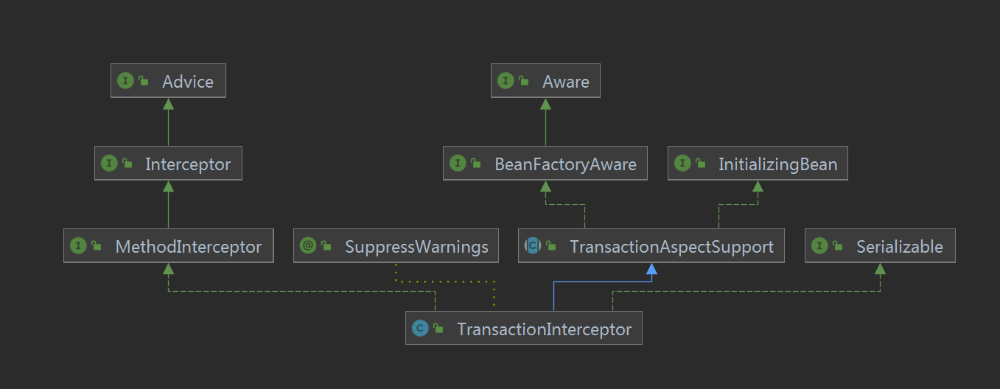
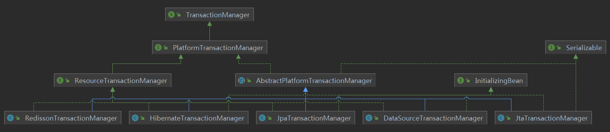

[TOC]


## Transactional

### 简介

飞机票：[Spring事务](../../BaseJava/Spring/Collection/Spring事务.md)

### 源码

大家都知道Spring的事务是基于AOP完成的，那么我们就从这个AOP说起。

例如：

```java
// 省去Bean管理
public class A {
    
    @Transactional
    public void test(){
    }
    
}
```

假设我们运行以下代码：

```java
// 省去Bean管理
public class B {
 
    private A a;
    
    public void test(){
    	a.test();
    }

}
```

那么此时调用`a.test()`，会被代理一层，假设代理类为：

```java

```

最终调用`org.springframework.transaction.interceptor.TransactionInterceptor#invoke`，看到这里终于开始有事务的影子了，我们继续往下看：

```java
	@Override
	@Nullable
	public Object invoke(MethodInvocation invocation) throws Throwable {
		// Work out the target class: may be {@code null}.
		// The TransactionAttributeSource should be passed the target class
		// as well as the method, which may be from an interface.
		Class<?> targetClass = (invocation.getThis() != null ? AopUtils.getTargetClass(invocation.getThis()) : null);

		// Adapt to TransactionAspectSupport's invokeWithinTransaction...
		return invokeWithinTransaction(invocation.getMethod(), targetClass, invocation::proceed);
	}
```

这边的代码大家一看就懂，无非就是获取目标Class对象，然后继续调用`invokeWithinTransaction`，在继续往下看之前，我们先看下类图：



TransactionInterceptor继承TransactionAspectSupport，而`invokeWithinTransaction`是TransactionAspectSupport的方法。下面，我们继续分析`invokeWithinTransaction`方法：（这个方法有点长，我将大致的代码思路备注在源码中）

```java
/**
 * General delegate for around-advice-based subclasses, delegating to several other template
 * methods on this class. Able to handle {@link CallbackPreferringPlatformTransactionManager}
 * as well as regular {@link PlatformTransactionManager} implementations.
 * @param method the Method being invoked
 * @param targetClass the target class that we're invoking the method on
 * @param invocation the callback to use for proceeding with the target invocation
 * @return the return value of the method, if any
 * @throws Throwable propagated from the target invocation
 */
@Nullable
protected Object invokeWithinTransaction(Method method, @Nullable Class<?> targetClass,
      final InvocationCallback invocation) throws Throwable {

   // If the transaction attribute is null, the method is non-transactional.
   TransactionAttributeSource tas = getTransactionAttributeSource();
   final TransactionAttribute txAttr = (tas != null ? tas.getTransactionAttribute(method, targetClass) : null);
   // 根据txAttr决定使用的TransactionManager
   final TransactionManager tm = determineTransactionManager(txAttr);

   if (this.reactiveAdapterRegistry != null && tm instanceof ReactiveTransactionManager) {
      ReactiveTransactionSupport txSupport = this.transactionSupportCache.computeIfAbsent(method, key -> {
         if (KotlinDetector.isKotlinType(method.getDeclaringClass()) && KotlinDelegate.isSuspend(method)) {
            throw new TransactionUsageException(
                  "Unsupported annotated transaction on suspending function detected: " + method +
                  ". Use TransactionalOperator.transactional extensions instead.");
         }
         ReactiveAdapter adapter = this.reactiveAdapterRegistry.getAdapter(method.getReturnType());
         if (adapter == null) {
            throw new IllegalStateException("Cannot apply reactive transaction to non-reactive return type: " +
                  method.getReturnType());
         }
         return new ReactiveTransactionSupport(adapter);
      });
      return txSupport.invokeWithinTransaction(
            method, targetClass, invocation, txAttr, (ReactiveTransactionManager) tm);
   }

   // 将TransactionManager转化为PlatformTransactionManager
   PlatformTransactionManager ptm = asPlatformTransactionManager(tm);
    // 切点方法名
   final String joinpointIdentification = methodIdentification(method, targetClass, txAttr);

   if (txAttr == null || !(ptm instanceof CallbackPreferringPlatformTransactionManager)) {
      // Standard transaction demarcation with getTransaction and commit/rollback calls.
      // 如果有必要，则开启事务（底层创建事务）
      TransactionInfo txInfo = createTransactionIfNecessary(ptm, txAttr, joinpointIdentification);

      Object retVal;
      try {
         // This is an around advice: Invoke the next interceptor in the chain.
         // This will normally result in a target object being invoked.
         // 调用调用链中下一个interceptor：此时我们的事务方法也在此处链中被执行
         retVal = invocation.proceedWithInvocation();
      }
      catch (Throwable ex) {
         // target invocation exception
         // 抛异常时，完成事务
         completeTransactionAfterThrowing(txInfo, ex);
         throw ex;
      }
      finally {
         // 清除事务信息（底层使用ThreadLocal记录的事务信息）
         cleanupTransactionInfo(txInfo);
      }

      if (vavrPresent && VavrDelegate.isVavrTry(retVal)) {
         // Set rollback-only in case of Vavr failure matching our rollback rules...
         TransactionStatus status = txInfo.getTransactionStatus();
         if (status != null && txAttr != null) {
            retVal = VavrDelegate.evaluateTryFailure(retVal, txAttr, status);
         }
      }
      // 提交事务
      commitTransactionAfterReturning(txInfo);
      return retVal;
   }

   else {
      final ThrowableHolder throwableHolder = new ThrowableHolder();

      // It's a CallbackPreferringPlatformTransactionManager: pass a TransactionCallback in.
      try {
         Object result = ((CallbackPreferringPlatformTransactionManager) ptm).execute(txAttr, status -> {
            // 准备txInfo
            TransactionInfo txInfo = prepareTransactionInfo(ptm, txAttr, joinpointIdentification, status);
            try {
               // 调用调用链中下一个interceptor：此时我们的事务方法也在此处链中被执行
               Object retVal = invocation.proceedWithInvocation();
               if (vavrPresent && VavrDelegate.isVavrTry(retVal)) {
                  // Set rollback-only in case of Vavr failure matching our rollback rules...
                  retVal = VavrDelegate.evaluateTryFailure(retVal, txAttr, status);
               }
               return retVal;
            }
            catch (Throwable ex) {
               if (txAttr.rollbackOn(ex)) {
                  // A RuntimeException: will lead to a rollback.
                  if (ex instanceof RuntimeException) {
                     throw (RuntimeException) ex;
                  }
                  else {
                     throw new ThrowableHolderException(ex);
                  }
               }
               else {
                  // A normal return value: will lead to a commit.
                  throwableHolder.throwable = ex;
                  return null;
               }
            }
            finally {
               // 清除事务信息（底层使用ThreadLocal记录的事务信息）
               cleanupTransactionInfo(txInfo);
            }
         });

         // Check result state: It might indicate a Throwable to rethrow.
         if (throwableHolder.throwable != null) {
            throw throwableHolder.throwable;
         }
         return result;
      }
      catch (ThrowableHolderException ex) {
         throw ex.getCause();
      }
      catch (TransactionSystemException ex2) {
         if (throwableHolder.throwable != null) {
            logger.error("Application exception overridden by commit exception", throwableHolder.throwable);
            ex2.initApplicationException(throwableHolder.throwable);
         }
         throw ex2;
      }
      catch (Throwable ex2) {
         if (throwableHolder.throwable != null) {
            logger.error("Application exception overridden by commit exception", throwableHolder.throwable);
         }
         throw ex2;
      }
   }
}
```

看完了上述的这个方法，对整个事务的流程也有个大致了解，无非就是那套：

````java
// 以下为伪代码

// 开启事务
begin transaction
    
try{
   // 业务操作
   do business   
} catch(E e){  
   // 异常后回滚 
   rollback
       
   throw e;
}

// 提交事务
commit
````

此时，我们有以下几个疑问：

- 事务是数据库实现的，开启事务还得依赖数据库，那么操作数据库开启事务的代码在哪里？
- 数据库有很多种，如何区分的呢？

带着问题我们先看**开启事务**这部分的源码：

```java
// Standard transaction demarcation with getTransaction and commit/rollback calls.
TransactionInfo txInfo = createTransactionIfNecessary(ptm, txAttr, joinpointIdentification);
```

从上述入口开始，为了更清晰的展示事务的核心逻辑，将不在展示调用链中的每一步的代码实现，我们用代码调用链画出源码逻辑：

**Tips：** 数据库连接池选用Druid实现

```sequence
TransactionAspectSupport->TransactionAspectSupport: createTransactionIfNecessary
TransactionAspectSupport->DataSourceTransactionManager: getTransaction
DataSourceTransactionManager->DataSourceTransactionManager: doGetTransaction
DataSourceTransactionManager->DataSourceTransactionManager: startTransaction
DataSourceTransactionManager->DataSourceTransactionManager: newTransactionStatus
DataSourceTransactionManager->DataSourceTransactionManager: doBegin
DataSourceTransactionManager->DruidDataSource: getConnection
DataSourceTransactionManager->DataSourceTransactionObject: setConnectionHolder
DataSourceTransactionManager->DataSourceTransactionObject: setReadOnly(definition.isReadOnly())
DataSourceTransactionManager->DataSourceTransactionObject: ...
DataSourceTransactionManager->DataSourceTransactionManager: prepareSynchronization

TransactionAspectSupport->TransactionAspectSupport: prepareTransactionInfo
```

上图中主要展示了TransactionAspectSupport、DataSourceTransactionManager、DataSource、DataSourceTransactionObject这4个类：

- TransactionAspectSupport

  主要实现了事务的Aop逻辑，不涉及事务实现的细节

- DataSourceTransactionManager

  继承了AbstractPlatformTransactionManager，实现了接口PlatformTransactionManager，主要封装了事务实现细节，但与数据库的连接等操作，依赖于接口DataSource的实现。

  - AbstractPlatformTransactionManager

    源码介绍：Abstract base class that implements Spring's standard transaction workflow, serving as basis for concrete platform transaction managers 

    翻译：实现Spring的标准事务工作流的抽象基类，用作具体平台事务管理器的基础

  - PlatformTransactionManager

    源码介绍：This is the central interface in Spring's transaction infrastructure. Applications can use this directly, but it is not primarily meant as API: Typically, applications will work with either TransactionTemplate or declarative transaction demarcation through AOP.

    翻译：这是Spring事务基础架构中的中央接口。应用程序可以直接使用它，但是它并不是主要用于API：通常，应用程序可以通过Transaction模板或通过AOP进行声明式事务划分来使用。

  当然，Spring中肯定不会仅仅有DataSourceTransactionManager这一个实现，她还有HibernateTransactionManager、JpaTransactionManager等等实现，我们大致看下类图，至于各自实现的细节，不在本篇文章中描述：

  

- DataSourceTransactionObject

  为DataSourceTransactionManager的静态内部类，被DataSourceTransactionManager所使用，为了保存Connection并操作其方法。

- DataSource

  数据源，

 


AbstractAutoProxyCreator

