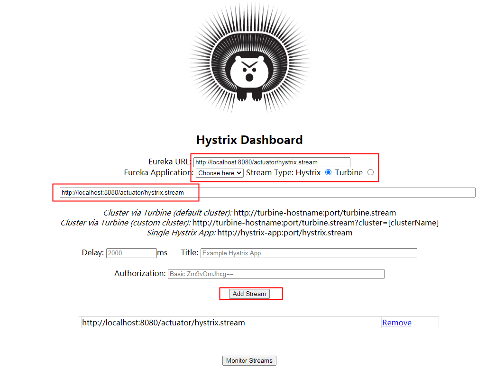
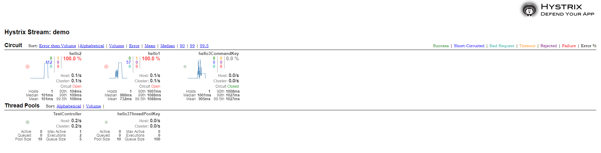

[TOC]


## Hystrix

> 一切始于官方，[官方Wiki](https://github.com/Netflix/Hystrix/wiki)。

### 一、介绍

​	在分布式环境中，不可避免的一些很多服务依赖关系将会失败。Hystrix可以帮助你通过添加延迟宽容和容错逻辑来控制这些分布式服务之间的交互。Hystrix通过孤立点之间的访问服务，停止级联故障，并提供后备选项，所有这些改善您的系统的整体弹性。

### 二、使用

#### 1、开始

第一步，引入依赖

```xml
<?xml version="1.0" encoding="UTF-8"?>
<project xmlns="http://maven.apache.org/POM/4.0.0" xmlns:xsi="http://www.w3.org/2001/XMLSchema-instance"
         xsi:schemaLocation="http://maven.apache.org/POM/4.0.0 https://maven.apache.org/xsd/maven-4.0.0.xsd">
    <modelVersion>4.0.0</modelVersion>

    <groupId>com.example</groupId>
    <artifactId>demo</artifactId>
    <version>0.0.1-SNAPSHOT</version>

    <name>demo</name>
    <description>Demo project for Spring Boot</description>

    <properties>
        <java.version>1.8</java.version>
        <!-- 版本对应 官方文档：http://spring.io/projects/spring-cloud -->
        <spring-boot.version>2.3.9.RELEASE</spring-boot.version>
        <spring-cloud.version>Hoxton.SR10</spring-cloud.version>
    </properties>

    <dependencyManagement>
        <dependencies>
            <dependency>
                <groupId>org.springframework.cloud</groupId>
                <artifactId>spring-cloud-dependencies</artifactId>
                <version>${spring-cloud.version}</version>
                <type>pom</type>
                <scope>import</scope>
            </dependency>
            <dependency>
                <groupId>org.springframework.boot</groupId>
                <artifactId>spring-boot-dependencies</artifactId>
                <version>${spring-boot.version}</version>
                <type>pom</type>
                <scope>import</scope>
            </dependency>
        </dependencies>
    </dependencyManagement>

    <dependencies>
        <!-- 引入web方便调接口测试  -->
        <dependency>
            <groupId>org.springframework.boot</groupId>
            <artifactId>spring-boot-starter-web</artifactId>
        </dependency>
        <!-- hystrix本体 -->
        <dependency>
            <groupId>org.springframework.cloud</groupId>
            <artifactId>spring-cloud-starter-netflix-hystrix</artifactId>
        </dependency>
    </dependencies>

    <build>
        <plugins>
            <plugin>
                <groupId>org.springframework.boot</groupId>
                <artifactId>spring-boot-maven-plugin</artifactId>
            </plugin>
        </plugins>
    </build>

</project>
```

第二步，启动类加上注解`@EnableCircuitBreaker`

```java
import org.springframework.boot.SpringApplication;
import org.springframework.boot.autoconfigure.SpringBootApplication;
import org.springframework.cloud.client.circuitbreaker.EnableCircuitBreaker;

@SpringBootApplication
@EnableCircuitBreaker
public class DemoApplication {

  public static void main(String[] args) {
    SpringApplication.run(DemoApplication.class, args);
  }

}
```

最后，测试入口

```java
import com.netflix.hystrix.contrib.javanica.annotation.HystrixCommand;
import org.springframework.web.bind.annotation.GetMapping;
import org.springframework.web.bind.annotation.RestController;

@RestController
public class TestController {

  @GetMapping("/hello")
  @HystrixCommand(fallbackMethod = "defaultHello")
  public Object hello() {
    // 模拟业务操作耗时
    int random = (int) ((Math.random() * (2000 - 50)) + 50);
    System.out.println(random);
    try {
      TimeUnit.MILLISECONDS.sleep(random);
    } catch (InterruptedException e) {
      e.printStackTrace();
    }
    return "suc";
  }

  public Object defaultHello() {
    return "limit";
  }

}
```

启动应用后，浏览器访问：http://localhost:8080/hello，此时随机秒后返回`suc`，如果不停的访问，还会有几率返回`limit`，验证了熔断的存在，到此第一个`hello word`完成。


上述Demo演示了熔断，那么你可能要问，熔断的条件是什么？

那是因为Hystrix有一个配置：

**execution.isolation.thread.timeoutInMilliseconds**

设置调用者等待命令执行的超时限制，超过此时间，HystrixCommand被标记为TIMEOUT，并执行回退逻辑。

默认值：1000（毫秒）

默认属性：hystrix.command.default.execution.isolation.thread.timeoutInMilliseconds

实例属性：hystrix.command.*HystrixCommandKey*.execution.isolation.thread.timeoutInMilliseconds

实例默认的设置：HystrixCommandProperties.Setter().withExecutionTimeoutInMilliseconds(int value)

 


知道了原因，那我们就来试下效果：

```java
  @GetMapping("/hello2")
  @HystrixCommand(fallbackMethod = "defaultHello2", commandProperties = {
      @HystrixProperty(name = "execution.isolation.thread.timeoutInMilliseconds", value = "100")})
  public Object hello2(Integer time) {
    // 模拟业务操作耗时
    try {
      TimeUnit.MILLISECONDS.sleep(time);
    } catch (InterruptedException e) {
      e.printStackTrace();
    }
    return "suc";
  }

  public Object defaultHello2(Integer time) {
    return "limit2";
  }
```

启动项目后，访问：http://localhost:8080/hello2?time=100，并且尝试给time不同的值，去验证上述配置的作用。

#### 2、配置

当然，Hystrix还有很多相关配置，飞机票：[官方入口](https://github.com/Netflix/Hystrix/wiki/Configuration)

> 配置类
>
> threadPoolProperties->com.netflix.hystrix.config.HystrixThreadPoolConfiguration
>
> commandProperties->com.netflix.hystrix.HystrixCommandProperties

以下为官方的简版中文翻译（持续更新）：


Hystrix属性的4中优先级

1. 内置全局默认值（Global default from code）

如果下面3种都没有设置，默认是使用此种，后面用“默认值”代指这种。

2. 动态全局默认属性（Dynamic global default property）

可以通过属性配置来更改全局默认值，后面用“默认属性”代指这种。

3. 内置实例默认值（Instance default from code）

在代码中，设置的属性值，后面用“实例默认”来代指这种。

4. 动态配置实例属性（Dynamic instance property）

可以针对特定的实例，动态配置属性值，来代替前面三种，后面用“实例属性”来代指这种。

优先级：1 < 2 < 3 < 4


命令属性
执行
execution.isolation.strategy

设置HystrixCommand.run()的隔离策略，有两种选项：

THREAD —— 在固定大小线程池中，以单独线程执行，并发请求数受限于线程池大小。

SEMAPHORE —— 在调用线程中执行，通过信号量来限制并发量。

默认值：THREAD（ExecutionIsolationStrategy.THREAD）

可选值：THREAD，SEMAPHORE

默认属性：hystrix.command.default.execution.isolation.strategy

实例属性：

hystrix.command.HystrixCommandKey.execution.isolation.strategy

实例默认的设置：

// to use thread isolation

HystrixCommandProperties.Setter()

.withExecutionIsolationStrategy(ExecutionIsolationStrategy.THREAD)

// to use semaphore isolation

HystrixCommandProperties.Setter().withExecutionIsolationStrategy(ExecutionIsolationStrategy.SEMAPHORE)


execution.isolation.thread.timeoutInMilliseconds

设置调用者等待命令执行的超时限制，超过此时间，HystrixCommand被标记为TIMEOUT，并执行回退逻辑。

注意：超时会作用在HystrixCommand.queue()，即使调用者没有调用get()去获得Future对象。

默认值：1000（毫秒）

默认属性：hystrix.command.default.execution.isolation.thread.timeoutInMilliseconds

实例属性：hystrix.command.HystrixCommandKey.execution.isolation.thread.timeoutInMilliseconds

实例默认的设置：HystrixCommandProperties.Setter().withExecutionTimeoutInMilliseconds(int value)


execution.timeout.enabled

设置HystrixCommand.run()的执行是否有超时限制。

默认值：true

默认属性：hystrix.command.default.execution.timeout.enabled

实例属性：hystrix.command.HystrixCommandKey.execution.timeout.enabled

实例默认的设置：

HystrixCommandProperties.Setter().withExecutionTimeoutEnabled(boolean value)


execution.isolation.thread.interruptOnTimeout

设置HystrixCommand.run()的执行是否在超时发生时被中断。

默认值：true

默认属性：hystrix.command.default.execution.isolation.thread.interruptOnTimeout

实例属性：hystrix.command.HystrixCommandKey.execution.isolation.thread.interruptOnTimeout

实例默认的设置：

HystrixCommandProperties.Setter().withExecutionIsolationThreadInterruptOnTimeout(boolean value)


execution.isolation.thread.interruptOnCancel

设置HystrixCommand.run()的执行但取消动作发生时候可以响应中断。

默认值：false

默认属性：hystrix.command.default.execution.isolation.thread.interruptOnCancel

实例属性：hystrix.command.HystrixCommandKey.execution.isolation.thread.interruptOnCancel

实例默认的设置：

HystrixCommandProperties.Setter().withExecutionIsolationThreadInterruptOnCancel(boolean value)


execution.isolation.semaphore.maxConcurrentRequests

设置当使用ExecutionIsolationStrategy.SEMAPHORE时，HystrixCommand.run()方法允许的最大请求数。如果达到最大并发数时，后续请求会被拒绝。

信号量应该是容器（比如Tomcat）线程池一小部分，不能等于或者略小于容器线程池大小，否则起不到保护作用。

默认值：10

默认属性：hystrix.command.default.execution.isolation.semaphore.maxConcurrentRequests

实例属性：hystrix.command.HystrixCommandKey.execution.isolation.semaphore.maxConcurrentRequests

实例默认的设置：

HystrixCommandProperties.Setter().withExecutionIsolationSemaphoreMaxConcurrentRequests(int value)


回退
下面的属性控制HystrixCommand.getFallback()执行。这些属性对ExecutionIsolationStrategy.THREAD和ExecutionIsolationStrategy.SEMAPHORE都有效。

fallback.isolation.semaphore.maxConcurrentRequests

设置调用线程产生的HystrixCommand.getFallback()方法的允许最大请求数目。

如果达到最大并发数目，后续请求将会被拒绝，如果没有实现回退，则抛出异常。

默认值：10

默认属性：hystrix.command.default.fallback.isolation.semaphore.maxConcurrentRequests

实例属性：hystrix.command.HystrixCommandKey.fallback.isolation.semaphore.maxConcurrentRequests

实例默认：

HystrixCommandProperties.Setter().withFallbackIsolationSemaphoreMaxConcurrentRequests(int value)


fallback.enabled

该属性决定当故障或者拒绝发生时，一个调用将会去尝试HystrixCommand.getFallback()。

默认值：true

默认属性：hystrix.command.default.fallback.enabled

实例属性：hystrix.command.HystrixCommandKey.fallback.enabled

实例默认的设置：HystrixCommandProperties.Setter().withFallbackEnabled(boolean value)


断路器（Circuit Breaker）
circuitBreaker.enabled

设置断路器是否起作用。

默认值：true

默认属性：hystrix.command.default.circuitBreaker.enabled

实例属性：hystrix.command.HystrixCommandKey.circuitBreaker.enabled

实例默认的设置：HystrixCommandProperties.Setter().withCircuitBreakerEnabled(boolean value)


circuitBreaker.requestVolumeThreshold

设置在一个滚动窗口中，打开断路器的最少请求数。

比如：如果值是20，在一个窗口内（比如10秒），收到19个请求，即使这19个请求都失败了，断路器也不会打开。

默认值：20

默认属性：hystrix.command.default.circuitBreaker.requestVolumeThreshold

实例属性：hystrix.command.HystrixCommandKey.circuitBreaker.requestVolumeThreshold

实例默认的设置：HystrixCommandProperties.Setter().withCircuitBreakerRequestVolumeThreshold(int value)


circuitBreaker.sleepWindowInMilliseconds

设置在回路被打开，拒绝请求到再次尝试请求并决定回路是否继续打开的时间。

默认值：5000（毫秒）

默认属性：hystrix.command.default.circuitBreaker.sleepWindowInMilliseconds

实例属性：hystrix.command.HystrixCommandKey.circuitBreaker.sleepWindowInMilliseconds

实例默认的设置：

HystrixCommandProperties.Setter().withCircuitBreakerSleepWindowInMilliseconds(int value)


circuitBreaker.errorThresholdPercentage

设置打开回路并启动回退逻辑的错误比率。

默认值：50

默认属性：hystrix.command.default.circuitBreaker.errorThresholdPercentage

实例属性：hystrix.command.HystrixCommandKey.circuitBreaker.errorThresholdPercentage

实例默认的设置：HystrixCommandProperties.Setter().withCircuitBreakerErrorThresholdPercentage(int value)


circuitBreaker.forceOpen

如果该属性设置为true，强制断路器进入打开状态，将会拒绝所有的请求。

该属性优先级比circuitBreaker.forceClosed高。

默认值：false

默认属性：hystrix.command.default.circuitBreaker.forceOpen

实例属性：hystrix.command.HystrixCommandKey.circuitBreaker.forceOpen

实例默认的设置：HystrixCommandProperties.Setter().withCircuitBreakerForceOpen(boolean value)


circuitBreaker.forceClosed

如果该属性设置为true，强制断路器进入关闭状态，将会允许所有的请求，无视错误率。

默认值：false

默认属性：hystrix.command.default.circuitBreaker.forceClosed

实例属性：hystrix.command.HystrixCommandKey.circuitBreaker.forceClosed

实例默认的设置：HystrixCommandProperties.Setter().withCircuitBreakerForceClosed(boolean value)


请求上下文
requestCache.enabled

设置HystrixCommand.getCacheKey()是否启用，由HystrixRequestCache通过请求缓存提供去重复数据功能。

默认值：true

默认属性：hystrix.command.default.requestCache.enabled

实例属性：hystrix.command.HystrixCommandKey.requestCache.enabled

实例默认的设置：HystrixCommandProperties.Setter().withRequestCacheEnabled(boolean value)


requestLog.enabled

设置HystrixCommand执行和事件是否要记录日志到HystrixRequestLog。

默认值：true

默认属性：hystrix.command.default.requestLog.enabled

实例属性：hystrix.command.HystrixCommandKey.requestLog.enabled

实例默认的设置：HystrixCommandProperties.Setter().withRequestLogEnabled(boolean value)


压缩器属性
下面的属性可以控制HystrixCollapser行为。

maxRequestsInBatch

设置触发批处理执行之前，在批处理中允许的最大请求数。

默认值：Integer.MAX_VALUE

默认属性：hystrix.collapser.default.maxRequestsInBatch

实例属性：hystrix.collapser.HystrixCollapserKey.maxRequestsInBatch

实例默认的设置：HystrixCollapserProperties.Setter().withMaxRequestsInBatch(int value)


timerDelayInMilliseconds

设置批处理创建到执行之间的毫秒数。

默认值：10

默认属性：hystrix.collapser.default.timerDelayInMilliseconds

实例属性：hystrix.collapser.HystrixCollapserKey.timerDelayInMilliseconds

实例默认的设置：HystrixCollapserProperties.Setter().withTimerDelayInMilliseconds(int value)


requestCache.enabled

设置请求缓存是否对HystrixCollapser.execute()和HystrixCollapser.queue()的调用起作用。

默认值：true

默认属性：hystrix.collapser.default.requestCache.enabled

实例属性：hystrix.collapser.HystrixCollapserKey.requestCache.enabled

实例默认的设置：HystrixCollapserProperties.Setter().withRequestCacheEnabled(boolean value)


线程池属性
coreSize

设置核心线程池大小。

默认值：10

默认属性：hystrix.threadpool.default.coreSize

实例属性：hystrix.threadpool.HystrixThreadPoolKey.coreSize

实例默认的设置：HystrixThreadPoolProperties.Setter().withCoreSize(int value)


maximumSize

1.5.9新增属性，设置线程池最大值。这个是在不开始拒绝HystrixCommand的情况下支持的最大并发数。这个属性起作用的前提是设置了allowMaximumSizeToDrivergeFromCoreSize。1.5.9之前，核心线程池大小和最大线程池大小总是相同的。


maxQueueSize

设置BlockingQueue最大的队列值。

如果设置为-1，那么使用SynchronousQueue，否则正数将会使用LinkedBlockingQueue。

如果需要去除这些限制，允许队列动态变化，可以参考queueSizeRejectionThreshold属性。

修改SynchronousQueue和LinkedBlockingQueue需要重启。

默认值：-1

默认属性：hystrix.threadpool.default.maxQueueSize

实例属性：hystrix.threadpool.HystrixThreadPoolKey.maxQueueSize

实例默认的设置：HystrixThreadPoolProperties.Setter().withMaxQueueSize(int value)


queueSizeRejectionThreshold

设置队列拒绝的阈值——一个人为设置的拒绝访问的最大队列值，即使maxQueueSize还没有达到。

当将一个线程放入队列等待执行时，HystrixCommand使用该属性。

注意：如果maxQueueSize设置为-1，该属性不可用。

默认值：5

默认属性：hystrix.threadpool.default.queueSizeRejectionThreshold

实例属性：hystrix.threadpool.HystrixThreadPoolKey.queueSizeRejectionThreshold

实例默认的设置：HystrixThreadPoolProperties.Setter().withQueueSizeRejectionThreshold(int value)


keepAliveTimeMinutes

设置存活时间，单位分钟。如果coreSize小于maximumSize，那么该属性控制一个线程从实用完成到被释放的时间。

默认值：1

默认属性：hystrix.threadpool.default.keepAliveTimeMinutes

实例属性：hystrix.threadpool.HystrixThreadPoolKey.keepAliveTimeMinutes

实例默认的设置：HystrixThreadPoolProperties.Setter().withKeepAliveTimeMinutes(int value)


allowMaximumSizeToDivergeFromCoreSize

在1.5.9中新增的属性。该属性允许maximumSize起作用。属性值可以等于或者大于coreSize值，设置coreSize小于maximumSize的线程池能够支持maximumSize的并发数，但是会将不活跃的线程返回到系统中去。（详见KeepAliveTimeMinutes）

默认值：false

默认属性：hystrix.threadpool.default.allowMaximumSizeToDivergeFromCoreSize

实例属性：hystrix.threadpool.HystrixThreadPoolKey.allowMaximumSizeToDivergeFromCoreSize

实例默认的设置：HystrixThreadPoolProperties.Setter().withAllowMaximumSizeToDivergeFromCoreSize(boolean value)


metrics.rollingStats.timeInMilliseconds

设置统计的滚动窗口的时间段大小。该属性是线程池保持指标时间长短。

默认值：10000（毫秒）

默认属性：hystrix.threadpool.default.metrics.rollingStats.timeInMilliseconds

实例属性：hystrix.threadpool.HystrixThreadPoolKey.metrics.rollingStats.timeInMilliseconds

实例默认的设置：HystrixThreadPoolProperties.Setter().withMetricsRollingStatisticalWindowInMilliseconds(int value)


metrics.rollingStats.numBuckets

设置滚动的统计窗口被分成的桶（bucket）的数目。

注意：”metrics.rollingStats.timeInMilliseconds % metrics.rollingStats.numBuckets == 0"必须为true，否则会抛出异常。

默认值：10

可能的值：任何能被metrics.rollingStats.timeInMilliseconds整除的值。

默认属性：hystrix.threadpool.default.metrics.rollingStats.numBuckets

实例属性：hystrix.threadpool.HystrixThreadPoolProperties.metrics.rollingStats.numBuckets

实例默认的设置：HystrixThreadPoolProperties.Setter().withMetricsRollingStatisticalWindowBuckets(int value)


#### 3、监控

##### 搭建业务应用

Hystrix官方还提供了看板监控，用于实时监控应用的指标数据。下面，将演示如何使用。

第一步，修改pom.xml

```xml
<?xml version="1.0" encoding="UTF-8"?>
<project xmlns="http://maven.apache.org/POM/4.0.0" xmlns:xsi="http://www.w3.org/2001/XMLSchema-instance"
         xsi:schemaLocation="http://maven.apache.org/POM/4.0.0 https://maven.apache.org/xsd/maven-4.0.0.xsd">
    <modelVersion>4.0.0</modelVersion>

    <groupId>com.example</groupId>
    <artifactId>demo</artifactId>
    <version>0.0.1-SNAPSHOT</version>

    <name>demo</name>
    <description>Demo project for Spring Boot</description>

    <properties>
        <java.version>1.8</java.version>
        <!-- 版本对应 官方文档：http://spring.io/projects/spring-cloud -->
        <spring-boot.version>2.3.9.RELEASE</spring-boot.version>
        <spring-cloud.version>Hoxton.SR10</spring-cloud.version>
    </properties>

    <dependencyManagement>
        <dependencies>
            <dependency>
                <groupId>org.springframework.cloud</groupId>
                <artifactId>spring-cloud-dependencies</artifactId>
                <version>${spring-cloud.version}</version>
                <type>pom</type>
                <scope>import</scope>
            </dependency>
            <dependency>
                <groupId>org.springframework.boot</groupId>
                <artifactId>spring-boot-dependencies</artifactId>
                <version>${spring-boot.version}</version>
                <type>pom</type>
                <scope>import</scope>
            </dependency>
        </dependencies>
    </dependencyManagement>

    <dependencies>
        <!-- 引入web方便调接口测试  -->
        <dependency>
            <groupId>org.springframework.boot</groupId>
            <artifactId>spring-boot-starter-web</artifactId>
        </dependency>
        <!-- 引入健康检查，便于使用hystrix-dashboard  -->
        <dependency>
            <groupId>org.springframework.boot</groupId>
            <artifactId>spring-boot-starter-actuator</artifactId>
        </dependency>
        <!-- hystrix本体 -->
        <dependency>
            <groupId>org.springframework.cloud</groupId>
            <artifactId>spring-cloud-starter-netflix-hystrix</artifactId>
        </dependency>
    </dependencies>

    <build>
        <plugins>
            <plugin>
                <groupId>org.springframework.boot</groupId>
                <artifactId>spring-boot-maven-plugin</artifactId>
            </plugin>
        </plugins>
    </build>

</project>
```

第二步，配置application.yml

```yaml
server:
  port: 8080

# 以下打开健康检查
management:
  endpoints:
    web:
      exposure:
        include: "*"
```

第三步，配置启动类

```java
import org.springframework.boot.SpringApplication;
import org.springframework.boot.autoconfigure.SpringBootApplication;
import org.springframework.cloud.client.circuitbreaker.EnableCircuitBreaker;

@SpringBootApplication
@EnableCircuitBreaker
public class DemoApplication {

  public static void main(String[] args) {
    SpringApplication.run(DemoApplication.class, args);
  }

}
```

第四步，测试入口

```java
import com.netflix.hystrix.contrib.javanica.annotation.HystrixCommand;
import com.netflix.hystrix.contrib.javanica.annotation.HystrixProperty;
import org.springframework.web.bind.annotation.GetMapping;
import org.springframework.web.bind.annotation.RestController;

import java.util.concurrent.TimeUnit;

@RestController
public class TestController {

  @GetMapping("/hello3")
  @HystrixCommand(groupKey = "hello3GroupKey", commandKey = "hello3CommandKey",
      threadPoolKey = "hello3ThreadPoolKey", fallbackMethod = "defaultHello3",
      commandProperties = {@HystrixProperty(
          name = "execution.isolation.thread.timeoutInMilliseconds", value = "1000")},
      threadPoolProperties = {@HystrixProperty(name = "coreSize", value = "10"),
          @HystrixProperty(name = "maxQueueSize", value = "1000"),
          @HystrixProperty(name = "queueSizeRejectionThreshold", value = "100")},
      defaultFallback = "defaultHello3")
  public Object hello3() {
    // 模拟业务操作耗时
    int random = (int) ((Math.random() * (2000 - 50)) + 50);
    System.out.println(random);
    try {
      TimeUnit.MILLISECONDS.sleep(random);
    } catch (InterruptedException e) {
      e.printStackTrace();
    }
    return "suc";
  }

  public Object defaultHello3() {
    return "limit2";
  }

}
```

启动项目，访问http://localhost:8080/hello3，有返回值，即表示接口成功，在访问http://localhost:8080/actuator/hystrix.stream，表示监控数据暴露成功。

> 小提示：监控数据都是需要先访问下被监控的接口，才会产生数据，所以在访问监控接口前，务必调用一下被监控的接口，后面的看板也是同样的道理。

##### 搭建看板

官方提供了很多种运行看板的方法，为了方便，本文档选择从源码直接运行看板，其余方式可以去官方地址自行获取，飞机票：[官方看板项目地址](https://github.com/kennedyoliveira/standalone-hystrix-dashboard)。

源码运行脚本如下：

```shell
git clone https://github.com/kennedyoliveira/standalone-hystrix-dashboard.git
cd standalone-hystrix-dashboard
./gradlew runDashboard
```

启动好后，访问http://localhost:7979/hystrix-dashboard/，出现如图，则成功。

 

下面开始配置监控数据获取，如下图红框配置即可：



配置成功后点击Monitor Streams，看到类似下图的界面，即可：



那么，看板的每个数据的含义是什么呢？飞机票：[官方看板Wiki](https://github.com/Netflix-Skunkworks/hystrix-dashboard/wiki)

##### 集群监控

结合Turbine完成。