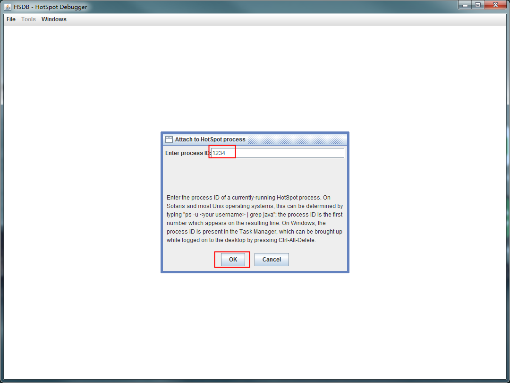

## Class文件

### 获取

### 编写代码输出

待续...

### 运行中获取

如题：如何获取运行状态的Class文件？

常见的，Spring的Aop，在运行时会产生代理Class对象，做源码分析，必定会考虑反编译一下Class文件，至于反编译有很多方法（如何反编译Class?[飞机票]()），本次不在叙述。

那么，如何获取运行状态的Class文件呢，Jdk官方提供了一个工具：sa-jdi.jar，官方称之为HSDB(HotSpot Debugger)。

一般这个文件在Jdk安装目录下的：\lib 可以找得到。

#### sa-jdi

##### 如何运行

```cmd
java -cp sa-jdi.jar sun.jvm.hotspot.HSDB
```

##### 如何使用

执行运行命令，有如下界面，选中File>Attach to HotSpot Process...


之后，在弹框中输入运行应用的Pid（Pid可以利用jps命令获取，通常是jps -l）：



连接成功后，页面如下：


下面开始查询Class，选择Tools>Class Browser：


待Class Brower窗口出现后，在搜索入口填写类的相关信息，进行搜索，为了更加准确，我们输入类的全路径：


很明显，带CGLIB的为我们要的代理类，不带的为原Class对象。

最后，选择Create .class for all classes导出所有Classes。看到下图中的.class created for xxxxx即表示成功了。


那么文件在哪里呢，还记得在哪个目录下执行的启动命令吗，文件即在当前目录下，全路径中每个目录都会生成对应的路径，我们按照类路径找下去即可获得。

