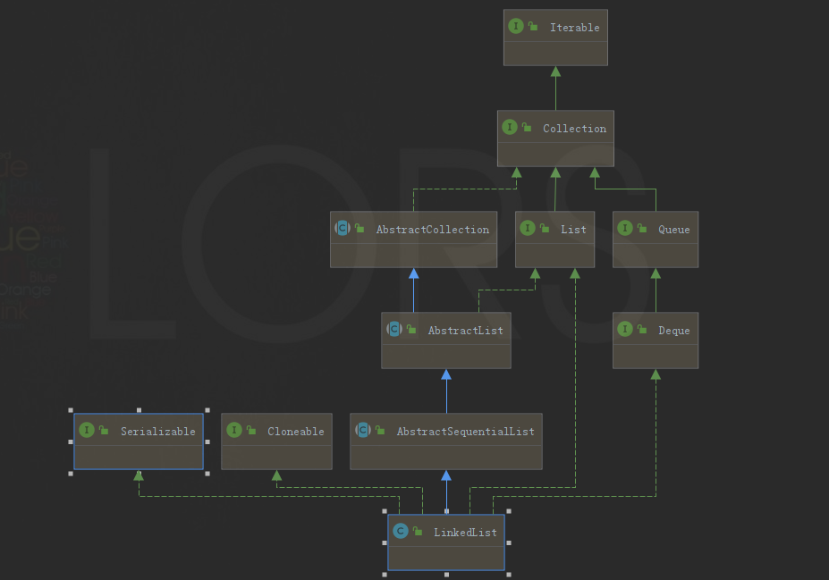

[TOC]


## LinkedList

### 关系图



### 数据结构

采用双向链表实现，具有头插、尾插。

```java
Node<E> first;
Node<E> last;
```

LinkedList还实现了Deque（双端队列），所以还具备poll()、pop()、peek()、push()等常用方法。

**Deque：双端队列是限定插入和删除操作在表的两端进行的线性表，是一种具有队列和栈的性质的数据结构。**

### 使用

1、modCount和expectedModCount有什么作用？

modCount和expectedModCount是用于表示修改次数的，其中modCount表示集合的修改次数，这其中包括了调用集合本身的add方法等修改方法时进行的修改和调用集合迭代器的修改方法进行的修改，而expectedModCount则是表示迭代器对集合进行修改的次数。

设置expectedModCount的目的就是要保证在使用迭代器期间，LinkedList对象的修改只能通过迭代器且只能这一个迭代器进行，一旦发现两者值不一样，则可以快速失败，避免后续继续执行造成不可预估的影响。

根据此特性，还会引发一些探讨，飞机票：[Java源码分析之List遍历中删除元素1](https://github.com/ATSJP/note/blob/master/SourceAnalysis/jdk/Collection/Java源码分析之List遍历中删除元素.md) [Java源码分析之List遍历中删除元素2](Java源码分析之List遍历中删除元素.md)

### 优缺点

 优点：
 1、新增、删除操作很快，直接改变节点的指向即可。

 缺点：
 1、查找很慢，只能从头节点或者尾节点开始遍历查询。
 2、线程不安全


