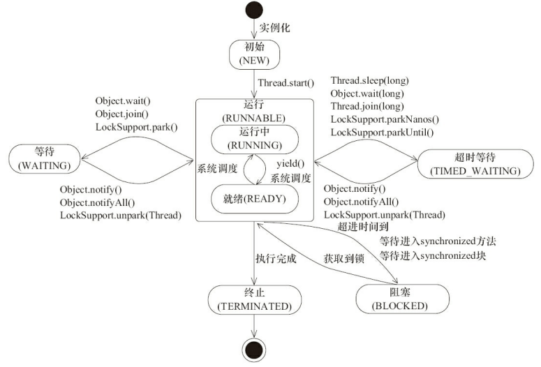

[TOC]


# 线程

## 线程状态

线程有6种状态：NEW、RUNNABLE、BLOCKED、WAITING、TIME_WAITING、TERMINATED

- NEW：初始状态、线程被构建，但是还没有调用start()方法。
- RUNNABLE：运行状态，Java 线程将操作系统中的就绪和运行两种状态笼统地称作“运行中“。
- BLOCKED：阻塞状态，表示线程阻塞于锁。
- WAITING：等待状态，表示线程进入等待状态，进入该状态表示当前线程需要等待其他线程做出一些特定动作（通知或中断）。
- TIME_WAITING：超时等待状态，该状态不同于WAITNG，它是可以在指定的时间自行返回的。
- TERMINATED：终止状态，表示当前线程已经执行完毕。

线程在生命周期中并不是固定处于某一个状态而是随着代码的执行在不同状态之间切换。Java 线程状态变迁如下图所示（图源《Java 并发编程艺术》4.1.4 节）：



> 备注：原图中 wait 到 runnable 状态的转换中，`join`实际上是`Thread`类的方法，但这里写成了`Object`。

> 补充知识：
>
> 
>
> 线程池有5种状态：RUNNING，SHUTDOWN，STOP，TIDYING，TERMINATED。
>
> - RUNNING：线程池处于运行状态，可以接受任务，执行任务，创建线程默认就是这个状态了。
> - SHUTDOWN：调用showdown()函数，不会接受新任务，但是会慢慢处理完堆积的任务。
> - STOP：调用showdownnow()函数，不会接受新任务，不处理已有的任务，会中断现有的任务。
> - TIDYING：当线程池状态为showdown或者stop，任务数量为0，就会变为tidying。这个时候会调用钩子函数terminated（）。
> - TERMINATED：terminated()执行完成。
>
> 在线程池中，用了一个原子类来记录线程池的信息，用了int的高3位表示状态，后面的29位表示线程池中线程的个数。
>
> ```java
>     private final AtomicInteger ctl = new AtomicInteger(ctlOf(RUNNING, 0));
> ```

## 终止线程

### 方法

#### Stop

使用退出标志，说线程正常退出，但是stop函数停止线程过于暴力，它会立即停止线程，不给任何资源释放的余地。

#### 中断

##### 什么是中断？

Java提供的一种用于停止线程的机制——中断。
- 中断只是一种协作机制，Java没有给中断增加任何语法，中断的过程完全需要程序员自己实现。若要中断一个线程，你需要手动调用该线程的interrupted方法，该方法也仅仅是将线程对象的中断标识设成true；接着你需要自己写代码不断地检测当前线程的标识位；如果为true，表示别的线程要求这条线程中断，此时究竟该做什么需要你自己写代码实现。
- 每个线程对象中都有一个标识，用于表示线程是否被中断；该标识位为true表示中断，为false表示未中断；
- 通过调用线程对象的interrupt方法将该线程的标识位设为true；可以在别的线程中调用，也可以在自己的线程中调用。

##### 中断的相关方法

- public void interrupt() 
  将调用者线程的中断状态设为true。
- public boolean isInterrupted() 
  判断调用者线程的中断状态。
- public static boolean interrupted 
  只能通过Thread.interrupted()调用。 
  它会做两步操作：
  - 返回**当前线程**的中断状态；
  - 将当前线程的中断状态设为false；

##### 如何使用中断？

要使用中断，首先需要在可能会发生中断的线程中不断监听中断状态，一旦发生中断，就执行相应的中断处理代码。 
当需要中断线程时，调用该线程对象的interrupt函数即可。

1. 设置中断监听

```java
Thread t1 = new Thread( new Runnable(){
    public void run(){
        // 若未发生中断，就正常执行任务
        while(!Thread.currentThread.isInterrupted()){
            // 正常任务代码……
        }

        // 中断的处理代码……
        doSomething();
    }
} ).start();
```

正常的任务代码被封装在while循环中，每次执行完一遍任务代码就检查一下中断状态；一旦发生中断，则跳过while循环，直接执行后面的中断处理代码。

2. 触发中断

```java
t1.interrupt();
```

上述代码执行后会将t1对象的中断状态设为true，此时t1线程的正常任务代码执行完成后，进入下一次while循环前Thread.currentThread.isInterrupted()的结果为true，此时退出循环，执行循环后面的中断处理代码。

##### 如何处理中断？

上文都在介绍如何获取中断状态，那么当我们捕获到中断状态后，究竟如何处理呢？

- Java类库中提供的一些可能会发生阻塞的方法都会抛InterruptedException异常，如：BlockingQueue#put、BlockingQueue#take、Object#wait、Thread#sleep。
- 当你在某一条线程中调用这些方法时，这个方法可能会被阻塞很长时间，你可以在别的线程中调用当前线程对象的interrupt方法触发这些函数抛出InterruptedException异常。
- 当一个函数抛出InterruptedException异常时，表示这个方法阻塞的时间太久了，别人不想等它执行结束了。
- 当你的捕获到一个InterruptedException异常后，亦可以处理它，或者向上抛出。
- 抛出时要注意：当你捕获到InterruptedException异常后，当前线程的中断状态已经被修改为false(表示线程未被中断)；此时你若能够处理中断，则不用理会该值；但如果你继续向上抛InterruptedException异常，你需要再次调用interrupt方法，将当前线程的中断状态设为true。
- **注意**：绝对不能“吞掉中断”！即捕获了InterruptedException而不作任何处理。这样违背了中断机制的规则，别人想让你线程中断，然而你自己不处理，也不将中断请求告诉调用者，调用者一直以为没有中断请求。

# 线程池

## Java中的线程池是如何实现的？

- 线程中线程被抽象为静态内部类Worker，是基于AQS实现的存放在HashSet中；
- 要被执行的线程存放在BlockingQueue中；
- 基本思想就是从workQueue中取出要执行的任务，放在worker中处理；

## 执行 execute()方法和 submit()方法的区别是什么呢？

如果提交任务的时候使用了submit，则返回的feature里会存有异常信息，但是如果数execute则会打印出异常栈。但是不会给其他线程造成影响。之后线程池会删除该线程，会新增加一个worker。

## 拒绝策略

- `ThreadPoolExecutor.AbortPolicy`：抛出 `RejectedExecutionException`来拒绝新任务的处理。
- `ThreadPoolExecutor.CallerRunsPolicy`： 调用执行自己的线程运行任务，也就是直接在调用`execute`方法的线程中运行(`run`)被拒绝的任务，如果执行程序已关闭，则会丢弃该任务。因此这种策略会降低对于新任务提交速度，影响程序的整体性能。如果您的应用程序可以承受此延迟并且你要求任何一个任务请求都要被执行的话，你可以选择这个策略。
- `ThreadPoolExecutor.DiscardPolicy`： 不处理新任务，直接丢弃掉。
- `ThreadPoolExecutor.DiscardOldestPolicy`： 此策略将丢弃最早的未处理的任务请求。

## Executors

### newSingleThreadExecutor（单线程的线程池）

- 阻塞队列是LinkedBlockingQueue
- 适用于串行执行任务的场景，一个任务一个任务地执行

### newFixedThreadPool （固定数目线程的线程池）

- 阻塞队列为无界队列LinkedBlockingQueue
- 适用于处理CPU密集型的任务，适用执行长期的任务

### newCachedThreadPool（可缓存线程的线程池）

- 阻塞队列是SynchronousQueue
- 适用于并发执行大量短期的小任务

### newScheduledThreadPool（定时及周期执行的线程池）

- 阻塞队列是DelayedWorkQueue
- 周期性执行任务的场景，需要限制线程数量的场景

> Executors 返回线程池对象的弊端如下：
>
> - **FixedThreadPool 和 SingleThreadExecutor** ： 允许请求的队列长度为 Integer.MAX_VALUE ，可能堆积大量的请求，从而导致 OOM。
> - **CachedThreadPool 和 ScheduledThreadPool** ： 允许创建的线程数量为 Integer.MAX_VALUE ，可能会创建大量线程，从而导致 OOM。

## 线程池原理

- 提交一个任务，线程池里存活的核心线程数小于corePoolSize时，线程池会创建一个核心线程去处理提交的任务
- 如果线程池核心线程数已满，即线程数已经等于corePoolSize，一个新提交的任务，会被放进任务队列workQueue排队等待执行。
- 当线程池里面存活的线程数已经等于corePoolSize了，并且任务队列workQueue也满，判断线程数是否达到maximumPoolSize，即最大线程数是否已满，如果没到达，创建非核心线程执行提交的任务。
- 如果当前的线程数达到了maximumPoolSize，还有新的任务过来的话，直接采用拒绝策略处理。

