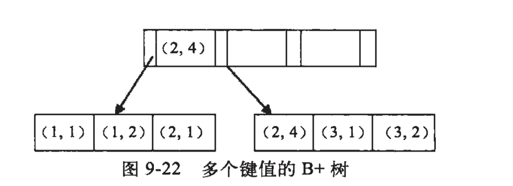

# 存储引擎

## Myiasm

Myiasm是mysql默认的存储引擎，不支持数据库事务，行级锁，外键；底层采用B+树实现；插入更新需锁表，效率低，查询速度快，Myisam使用的是非聚集索引。

### 非聚集索引

- 非聚簇索引的叶节点仍然是索引节点，并保留一个数据地址指向对应数据块
- 非聚集索引在存储记录是逻辑上的连续
- 非聚集索引不适合用在排序的场合，非聚集索引叶节点是保留了一个指向数据的指针，索引本身当然是排序的，但是数据并未排序，数据查询的时候需要消耗额外更多的I/O，所以较慢

> 下图于网络中摘抄：
>
> 

## Innodb

> 官方介绍：https://dev.mysql.com/doc/refman/8.0/en/innodb-introduction.html

| Feature                                                      | Support                                                      |
| :----------------------------------------------------------- | :----------------------------------------------------------- |
| **B-tree indexes**                                           | Yes                                                          |
| **Backup/point-in-time recovery** (Implemented in the server, rather than in the storage engine.) | Yes                                                          |
| **Cluster database support**                                 | No                                                           |
| **Clustered indexes**                                        | Yes                                                          |
| **Compressed data**                                          | Yes                                                          |
| **Data caches**                                              | Yes                                                          |
| **Encrypted data**                                           | Yes (Implemented in the server via encryption functions; In MySQL 5.7 and later, data-at-rest encryption is supported.) |
| **Foreign key support**                                      | Yes                                                          |
| **Full-text search indexes**                                 | Yes (Support for FULLTEXT indexes is available in MySQL 5.6 and later.) |
| **Geospatial data type support**                             | Yes                                                          |
| **Geospatial indexing support**                              | Yes (Support for geospatial indexing is available in MySQL 5.7 and later.) |
| **Hash indexes**                                             | No (InnoDB utilizes hash indexes internally for its Adaptive Hash Index feature.) |
| **Index caches**                                             | Yes                                                          |
| **Locking granularity**                                      | Row                                                          |
| **MVCC**                                                     | Yes                                                          |
| **Replication support** (Implemented in the server, rather than in the storage engine.) | Yes                                                          |
| **Storage limits**                                           | 64TB                                                         |
| **T-tree indexes**                                           | No                                                           |
| **Transactions**                                             | Yes                                                          |
| **Update statistics for data dictionary**                    | Yes                                                          |

Innodb支持事务，锁的力度支持表锁、行级锁；底层为B+树实现，适合处理多重并发更新操作，普通select都是快照读（MVCC的功劳），快照读不加锁。InnoDb使用的是聚集索引等等。

### 聚集索引

- 聚集索引就是以主键创建的索引

- 每个表只能有一个聚集索引，因为一个表中的记录只能以一种物理顺序存放，实际的数据页只能按照一颗 B+ 树进行排序

- 表记录的排列顺序和与索引的排列顺序一致

- 聚集索引存储记录是物理上连续存在

- 聚集索引主键的插入速度要比非聚集索引主键的插入速度慢很多

- 聚集索引适合排序，因为聚集索引叶节点本身就是索引和数据按相同顺序放置在一起，索引序即是数据序，数据序即是索引序，所以很快

- 更新聚集索引列的代价很高，因为会强制Innodb将每个被更新的行移动到新的位置

**使用聚集索引查询为什么查询速度会变快？**

使用聚簇索引找到包含第一个值的行后，便可以确保包含后续索引值的行在物理相邻

**建立聚集索引有什么需要注意的地方吗？**

在聚簇索引中不要包含经常修改的列，因为码值修改后，数据行必须移动到新的位置，索引此时会重排，会造成很大的资源浪费

**InnoDB 表对主键生成策略是什么样的？**

优先使用用户自定义主键作为主键，如果没有，则自动先检查表中是否有唯一索引且不允许存在null值的字段，如果没有，则InnoDB会为表默认添加一个名为row_id隐藏列作为主键，数据类型大小为6Byte。

### MVCC

> 官方介绍：https://dev.mysql.com/doc/refman/8.0/en/innodb-multi-versioning.html

https://blog.csdn.net/SnailMann/article/details/94724197

https://blog.csdn.net/chen77716/article/details/6742128

# 索引

## 索引类型

### 主键索引

### 二级索引（辅助索引）

### 联合索引

**最左匹配原则**

如联合索引a + b，通常在索引树中存储如下：

可以很清楚的看到a是由有序的，而b只是局部有序，即在a确定的情况下，b是有序的。假设我们的查询条件是a = 1 and b = 2，那么a、b都能走上索引，因为在知道a的情况下，b是有序的，所以可以用上索引，当查询条件是a > 1 and b = 2时，a可以用上索引，而b不行，因为a是范围查询，当a是范围查找是，b是无序的，因为a值不相等。

## 索引数据结构

### B+树 & Hash表

**BTree 索引与 Hash 索引有什么区别？**

- BTree索引可能需要多次运用折半查找来找到对应的数据块 
- HASH索引是通过HASH函数，计算出HASH值，在表中找出对应的数据 
- 大量不同数据等值精确查询，HASH索引效率通常比B+TREE高
- HASH索引不支持模糊查询、范围查询和联合索引中的最左匹配规则，而这些Btree索引都支持

### B树

## 创建索引的注意事项

**1.选择合适的字段创建索引：**

- **不为 NULL 的字段** ：索引字段的数据应该尽量不为 NULL，因为对于数据为 NULL 的字段，数据库较难优化。如果字段频繁被查询，但又避免不了为 NULL，建议使用 0,1,true,false 这样语义较为清晰的短值或短字符作为替代。
- **被频繁查询的字段** ：我们创建索引的字段应该是查询操作非常频繁的字段。
- **被作为条件查询的字段** ：被作为 WHERE 条件查询的字段，应该被考虑建立索引。
- **频繁需要排序的字段** ：索引已经排序，这样查询可以利用索引的排序，加快排序查询时间。
- **被经常频繁用于连接的字段** ：经常用于连接的字段可能是一些外键列，对于外键列并不一定要建立外键，只是说该列涉及到表与表的关系。对于频繁被连接查询的字段，可以考虑建立索引，提高多表连接查询的效率。

**2.被频繁更新的字段应该慎重建立索引。**

虽然索引能带来查询上的效率，但是维护索引的成本也是不小的。 如果一个字段不被经常查询，反而被经常修改，那么就更不应该在这种字段上建立索引了。

**3.尽可能的考虑建立联合索引而不是单列索引。**

因为索引是需要占用磁盘空间的，可以简单理解为每个索引都对应着一颗 B+树。如果一个表的字段过多，索引过多，那么当这个表的数据达到一个体量后，索引占用的空间也是很多的，且修改索引时，耗费的时间也是较多的。如果是联合索引，多个字段在一个索引上，那么将会节约很大磁盘空间，且修改数据的操作效率也会提升。

**4.注意避免冗余索引** 。

冗余索引指的是索引的功能相同，能够命中索引(a, b)就肯定能命中索引(a) ，那么索引(a)就是冗余索引。如（name,city ）和（name ）这两个索引就是冗余索引，能够命中前者的查询肯定是能够命中后者的 在大多数情况下，都应该尽量扩展已有的索引而不是创建新索引。

**5.考虑在字符串类型的字段上使用前缀索引代替普通索引。**

前缀索引仅限于字符串类型，较普通索引会占用更小的空间，所以可以考虑使用前缀索引带替普通索引。

## 索引的底层实现是B+树，为何不采用红黑树，B树?

- B+Tree非叶子节点只存储键值信息，降低B+Tree的高度，所有叶子节点之间都有一个链指针，数据记录都存放在叶子节点中

- 红黑树这种结构，h明显要深的多，效率明显比B-Tree差很多

- B+树也存在劣势，由于键会重复出现，因此会占用更多的空间。但是与带来的性能优势相比，空间劣势往往可以接受，因此B+树的在数据库中的使用比B树更加广泛

## 索引失效条件

- 条件是or，如果还想让or条件生效，给or每个字段加个索引

- like开头%

- 如果列类型是字符串，那一定要在条件中将数据使用引号引用起来，否则不会使用索引

- where中索引列使用了函数或有运算
- ...