[TOC]


##  执行计划

> 参考[官方文档](https://dev.mysql.com/doc/refman/5.7/en/explain-output.html)

### 介绍

项目开发中，性能是我们比较关注的问题，特别是数据库的性能；作为一个开发，经常和SQL语句打交道，想要写出合格的SQL语句，我们需要了解SQL语句在数据库中是如何扫描表、如何使用索引的。

MySQL提供[**explain/desc**](https://dev.mysql.com/doc/refman/5.7/en/execution-plan-information.html)命令输出执行计划，我们通过执行计划优化SQL语句。

### 参数说明

下面我们以MySQL5.7为例了解一下执行计划，先预先准备好表及数据：

```sql
CREATE TABLE `father` (
  `id` int(11) NOT NULL AUTO_INCREMENT COMMENT '主键',
  `name` varchar(50) NOT NULL COMMENT 'name',
  `age` int(3) NOT NULL DEFAULT '0' COMMENT 'age',
  `remark` varchar(50) DEFAULT NULL COMMENT 'remark',
  PRIMARY KEY (`id`) USING BTREE,
  KEY `idx_father_01` (`name`) USING BTREE,
  KEY `idx_father_02` (`age`) USING BTREE
) ENGINE=InnoDB DEFAULT CHARSET=utf8 ROW_FORMAT=DYNAMIC COMMENT='father';

CREATE TABLE `son` (
  `id` int(11) NOT NULL AUTO_INCREMENT COMMENT '主键',
  `name` varchar(50) NOT NULL COMMENT 'name',
  `age` int(3) NOT NULL DEFAULT '0' COMMENT 'age',
  `remark` varchar(50) DEFAULT NULL COMMENT 'remark',
  `father_id` int(11) DEFAULT NULL COMMENT 'father_id',
  PRIMARY KEY (`id`) USING BTREE,
  KEY `idx_son_01` (`name`) USING BTREE,
  KEY `idx_son_02` (`age`) USING BTREE,
  KEY `idx_son_03` (`father_id`) USING BTREE
) ENGINE=InnoDB DEFAULT CHARSET=utf8 ROW_FORMAT=DYNAMIC COMMENT='son';

-- 插入几个自定义值
INSERT INTO father (name, age, remark) VALUES
	 ('laowang', 30, '备注1'),
	 ('laoli', 30, null);
INSERT INTO son (name, age, father_id, remark) VALUES
	 ('xiaowang', 10, 1, '备注1'),
	 ('dawang', 10, 1, null),
	 ('xiaoli', 10, 2, null);
	 
-- 插入随机值
delimiter $$
create procedure pre()
begin
declare i int;
set i=0;
while i<5000 do
    INSERT INTO father (name, age, remark) values (substring(MD5(RAND()),1,5), FLOOR(RAND()*100+1), substring(MD5(RAND()),1,5));
    INSERT INTO son (name, age, remark) values (substring(MD5(RAND()),1,5), FLOOR(RAND()*100+1), substring(MD5(RAND()),1,5));
set i=i+1;
end while;
end
$$

-- 还原delimiter
delimiter ;

-- 执行上述函数
call pre();

-- 删除上述函数
drop procedure pre;
```

以下面的查询SQL为例：

```sql
explain select * from father
```

我们利用免费工具[DBeaver](https://dbeaver.io/)执行一下，将会得到以下结果：


接着，我们看下每个字段的说明：

| 字段名        | 含义                         | 说明                                                         |
| ------------- | ---------------------------- | ------------------------------------------------------------ |
| id            | 表格查询的顺序编号。         | 降序查看，id相同的从上到下查查看。id可以为null ，当table为( union ,m,n )类型的时候，id为null，这个时候，id的顺序为 m跟n的后面。 |
| select_type   | 查询的方式                   | 下文详细说明。                                               |
| table         | 表格名称                     | 表名，别名，( union m,n ）。                                 |
| partitions    | 分区名称                     | 查询使用到表分区的分区名。                                   |
| type          | 表连接的类型                 | 下文详细说明。                                               |
| possible_keys | 可能使用到的索引             | 这里的索引只是可能会有到，实际不一定会用到。                 |
| key           | 使用到的索引                 | 实际使用的索引。                                             |
| key_len       | 使用到索引的长度             | 比如多列索引，只用到最左的一列，那么使用到索引的长度则为该列的长度，故该值不一定等于 key 列索引的长度。 |
| ref           | 谓词的关联信息               | 当 join type 为 const、eq_ref 或者 ref 时，谓词的关联信息。可能为 ：null（非 const \ eq_ref \ ref join type 时）、const（常量）、关联的谓词列名。 |
| rows          | 扫描的行数                   | 该表格扫描到的行数。这里注意在mysql里边是嵌套链接，所以，需要把所有rows相乘就会得到查询数据行关联的次数 |
| filtered      | 实际显示行数占扫描rows的比例 | 实际显示的行数 = rows * filtered / 100                       |
| extra         | 特性使用                     | 下文详细说明。                                               |

#### ID

该语句所在的层级，如果ID相同从上到下执行，如果ID不同，则ID越大的越先执行，其作用类似于执行计划中缩进。

#### Select_Type

1. **SIMPLE**，简单查询方式，不使用UNION跟子查询；

2. **PRIMARY**，该表格位于最外层开始查询，通常会跟其他查询方式组合；

3. **UNION**，UNION 第一个SELECT 为PRIMARY，第二个及之后的所有SELECT 为 UNION SELECT TYPE；

4. **UNION RESULT**，每个结果集的取出来后，会做合并操作，这个操作就是 UNION RESULT；

   ```sql
   explain select id as f_id, name as f_name, age as f_age from father union select id as s_id, name as s_name, age as s_age from son 
   ```

   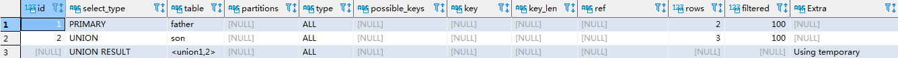

5. **DEPENDENT UNION**，子查询中的UNION操作，从UNION 第二个及之后的所有SELECT语句的SELECT TYPE为 DEPENDENT UNION，这个一般跟DEPENDENT SUBQUERY一起结合应用，子查询中UNION 的第一个为DEPENDENT SUBQUERY；

   ```sql
   explain select * from father where name in (select name from son where id < 2 union select name from father where id != 2)
   ```

   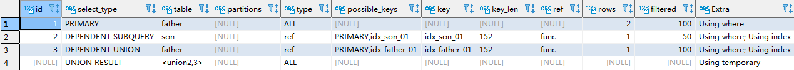

6. **DEPENDENT SUBQUERY**，子查询中内层的第一个SELECT，依赖于外部查询的结果集；

   ```sql
   explain select f.*, (select count(1) from son s where s.father_id = f.id ) as son_num from father f 
   ```

   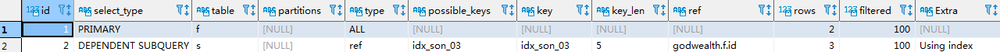

7. **SUBQUERY**，子查询内层查询的第一个SELECT，结果不依赖于外部查询结果集（不会被数据库引擎改写的情况）；

   ```sql
   explain select f.* from father f where f.age = (select min(age) from son)
   ```

   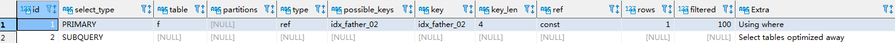

   下面这个SQL被存储引擎改写了，变成了两个表做Join

   ```sql
   explain select f.* from father f where f.age in (select age from son)
   ```

   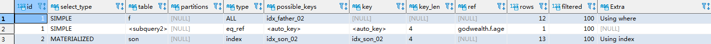

8. **DERIVED**(派生/衍生表的SELECT, FROM子句的子查询)

   ```sql
   explain select * from (select f.id as father_id from father f union select s.id as son_id from son s) temp
   ```

   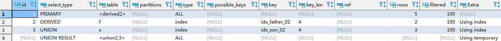

9. **MATERIALIZED**，子查询物化，表出现在非相关子查询中 并且需要进行物化时会出现MATERIALIZED关键词；

   ```sql
   explain select f.* from father f where f.age in (select age from son)
   ```

   

10. **UNCACHEABLE SUBQUERY**，结果集无法缓存的子查询，需要逐次查询；

    ```sql
    explain select * from father where id = (select id from son where id = @@sql_log_bin)
    ```

    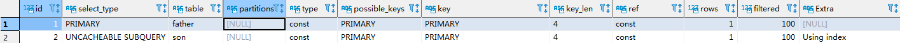

11. **UNCACHEABLE UNION**，表示子查询不可被物化 需要逐次运行。

    ```sql
    explain select f.* from father f where exists (select 1 from son s where s.father_id = f.id union select 1 from dual)
    ```

    

#### Partitions

#### Type

**性能排序**：

null->system->const->eq_ref->ref->fulltext->ref_or_null->index_merge->unique_subquery->index_subquery->range->index->all

1. **null**，不访问任何一个表格

   ```sql
   explain select now();
   ```

   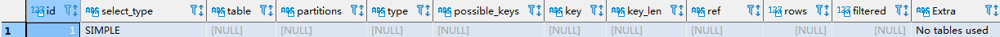

2. **system**，表中只有一条数据，相当于系统表； 这个类型是特殊的 `const` 类型。

3. **const**，主键或者唯一索引的常量查询，表格最多只有1行记录符合查询。

   ```sql
   explain select * from father where id = 1;
   ```

   

4. **eq_ref**，唯一索引扫描，对于每个索引键，表中只有一条记录与之对应；常用于主键或唯一索引扫描。

   ```sql
   explain select * from son s join father f on s.id = f.id;
   ```

   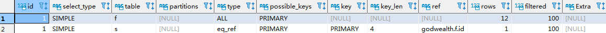

5. **ref**，索引非唯一性扫描

   ```sql
   explain select * from father f where f.age = 1;
   ```

   

6. **fulltext**，查询的过程中，使用到了 fulltext 索引（fulltext index在innodb引擎中，只有5.6版本之后的支持）

   ```sql
   ALTER TABLE father ADD FULLTEXT(name);
   explain select * from father where match(name) AGAINST('xiaowang');
   ```

   

7. **ref_or_null**，跟ref查询类似，在ref的查询基础上，不过会加多一个null值的条件查询

   ```sql
   explain select s.father_id from son s where s.father_id = 1 or s.father_id is null;
   ```

   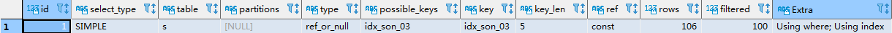

8. **index merge**，当条件谓词使用到多个索引的最左边列并且谓词之间的连接为or的情况下，会使用到 索引联合查询

   ```sql
   explain select * from father f where f.age = 1 or f.name = 'laowang';
   ```

   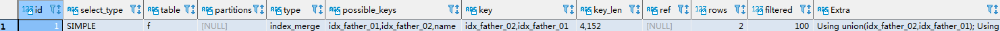

9. **unique subquery**，eq_ref的一个分支，查询主键的子查询

   ```sql
   value IN (SELECT primary_key FROM single_table WHERE some_expr)
   ```

10. **index subquery**，ref的一个分支，查询非聚集索引的子查询

    ```sql
    value IN (SELECT key_column FROM single_table WHERE some_expr)
    ```

11. **range**，当谓词使用到索引范围查询的时候：=、<>、>、>=、<、<=、IS NULL、BETWEEN、IN、<=> (这是个表达式：左边可以推出右边,右边也可推出左边)

    ```sql
    explain select * from father f where f.age between 1 and 10;
    ```

    

12. **index**，使用到索引，但是不是索引查找，而是对索引树做一个扫描，即使是索引扫描，大多数情况下也是比全表扫描性能要好的，因为索引树上的键值只有索引列键值+主键，而全表扫描则是在 聚集索引树（主键+所有列）上进行扫描，索引树相比之下要廋得多跟小得多了。

    ```sql
    explain select age from father;
    ```

    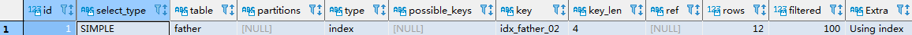

13. **all**，全表扫描，性能比较差。

    ```sql
    explain select * from father;
    ```

    

    关于 index跟all，这里再举一个例子说明下
    - 下图中，表格father有3个索引：主键、idx_father_01、idx_father_02，这三个索引树的内容分别为：主键id+所有列、name+主键id、age+主键id，依次，当扫描主键id查询的时候，这三个索引都能够提供主键id列，那么哪个性能比较好呢？索引树最小的，扫描次数最少的则为最优，根据索引数内容可得大小：ix_age < ix_name < pk，故执行计划会选择 ix_age。

      ```sql
      explain select id from father ;
      ```

      

#### Ref

  当 join type 为 eq_ref 或者 ref 时，谓词的关联信息。可能为 ：null（非 eq_ref、ref join type时）、const（常量）、关联的谓词列名。

#### Extra

- `Child of '*`table`*' pushed join@1`

  

- `const row not found` 

  

- `Deleting all rows`

  

- `Distinct`

  

- `FirstMatch(*`tbl_name`*)`

  

- `Full scan on NULL key` 

  

- `Impossible HAVING` 

  

- `Impossible WHERE`

  

- `Impossible WHERE noticed after reading const tables`

  

- `LooseScan(*`m`*..*`n`*)` 

  

- `No matching min/max row` 

  

- `no matching row in const table`

  

- `No matching rows after partition pruning`

  

- `No tables used` 

  

- `Not exists` 

  

- `Plan isn't ready yet`

  

- `Range checked for each record (index map: *`N`*)`

  

- `Scanned *`N`* databases` 

  

- `Select tables optimized away` 

  

- `Skip_open_table`, `Open_frm_only`, `Open_full_table`

  

- `Start temporary`, `End temporary` 

  

- `unique row not found` 

  

- `Using filesort`，当MySQL查询不适合使用索引来优化排序时，将使用文件排序。文件排序可以理解为MySQL在内存中为查询结果建立一个临时表，并在该表中排序。如果结果集太大无法完全保存在内存中，则系统将在磁盘上创建并排序临时文件。这就是所谓的“Using  filesort”（使用文件排序）。

通常，MySQL会尽可能避免使用文件排序，因为它需要对磁盘进行I/O操作，这可能会使查询变得缓慢。因此，您应该努力优化您的查询，以确保MySQL可以使用索引来排序数据而不必使用文件排序。

  ```sql
  explain select remark from son order by remark;
  ```

  

- `Using index`，使用到索引

  索引覆盖，也就是不止要使用到索引，而且没有回表查询，举个例子说明

  ```sql
  explain select * from father where age= 2;
  ```

  

  ```sql
  explain select id, age from father where age= 2;
  ```

  

  这两个查询中，条件都是一样，但是第一个返回的是所有列，而索引idx_father_02上仅包含主键列跟索引键值，故需要再根据主键的值去PK树上找到对应的列，这个操作称为回表，所以第一个查询中extra没有USING INDEX，而第二个查询有。

- `Using index condition`

  

- `Using index for group-by` 

  

- `Using join buffer (Block Nested Loop)`, `Using join buffer (Batched Key Access)`

  

- `Using MRR`，使用到索引内部排序

  

- `Using sort_union(...)`, `Using union(...)`, `Using intersect(...)`

  

- `Using temporary`，使用到临时表

  使用到临时表，表数量较少的情况下，临时表使用缓存，但是比较大的时候，则会磁盘存储，这种情况下，性能将会急剧下降

  ```sql
  explain select distinct remark from son;
  ```

  


- `Using where`，使用到where条件

  根据where条件，先取出数据，再跟其他表格关联查询

- `Using where with pushed condition` 

  

- `Zero limit`，谓词不成立

  ```sql
  explain select * from son limit 0 ;
  ```
  
  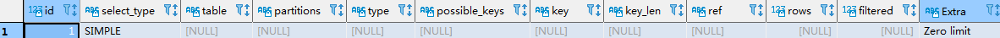


