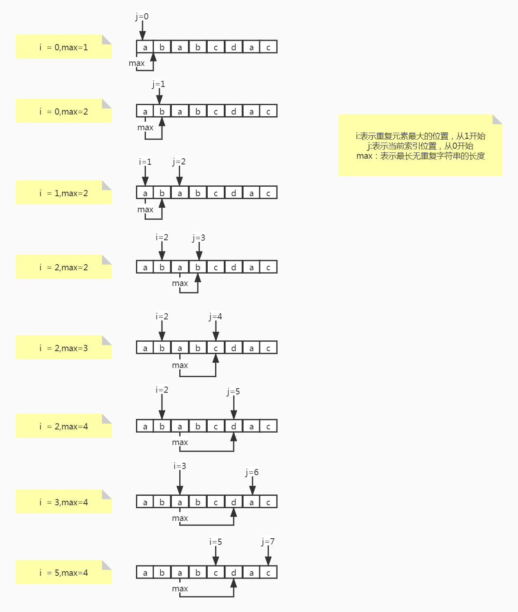
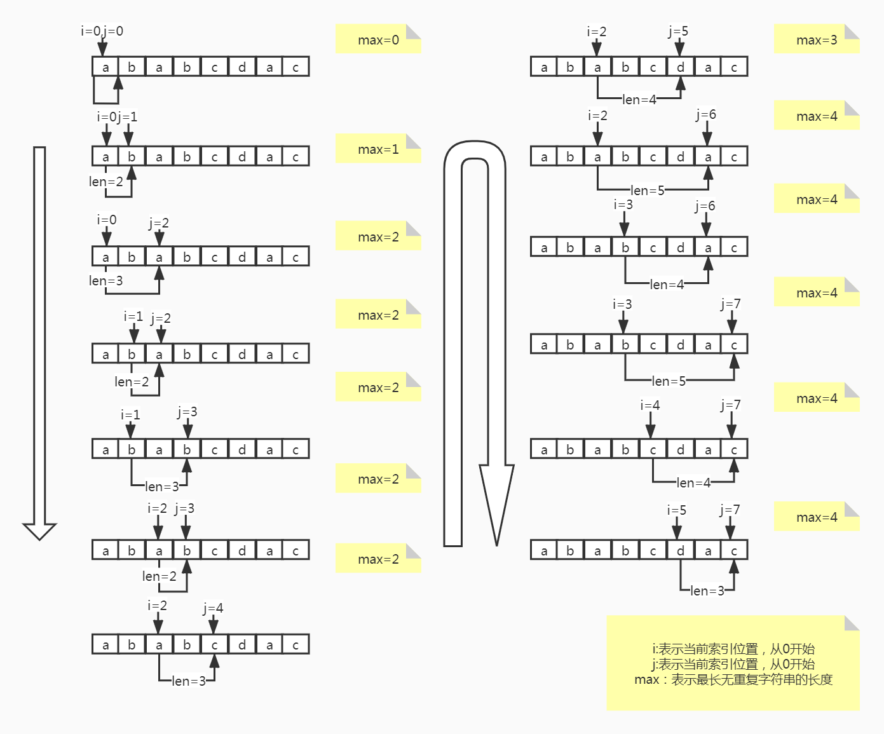

## 练习题第三题

> ASCII ((American Standard Code for Information Interchange): 美国信息交换标准代码）是基于[拉丁字母](https://baike.baidu.com/item/拉丁字母/1936851)的一套电脑[编码](https://baike.baidu.com/item/编码/80092)系统，主要用于显示现代[英语](https://baike.baidu.com/item/英语/109997)和其他[西欧](https://baike.baidu.com/item/西欧/3028649)语言。它是最通用的[信息交换](https://baike.baidu.com/item/信息交换/716328)标准，并等同于[国际](https://baike.baidu.com/item/国际/766689)标准ISO/IEC 646。ASCII第一次以规范标准的类型发表是在1967年，最后一次更新则是在1986年，到目前为止共定义了128个字符
> 

### 问题

给定一个字符串，请你找出其中不含有重复字符的 最长子串 的长度。

示例 1:

输入: "abcabcbb"
输出: 3 
解释: 因为无重复字符的最长子串是 "abc"，所以其长度为 3。
示例 2:

输入: "bbbbb"
输出: 1
解释: 因为无重复字符的最长子串是 "b"，所以其长度为 1。
示例 3:

输入: "pwwkew"
输出: 3
解释: 因为无重复字符的最长子串是 "wke"，所以其长度为 3。
请注意，你的答案必须是 子串 的长度，"pwke" 是一个子序列，不是子串。

### 解决

```java
import org.junit.Test;

import java.util.Arrays;

/**
 * Question3
 *
 * @author shijianpeng
 */
public class Question3 {

	/**
	 * 给定一个字符串，请你找出其中不含有重复字符的 最长子串 的长度。
	 *
	 * 示例 1:
	 *
	 * 输入: "abcabcbb" 输出: 3 解释: 因为无重复字符的最长子串是 "abc"，所以其长度为 3。
	 * 
	 * 示例 2:
	 *
	 * 输入: "bbbbb" 输出: 1 解释: 因为无重复字符的最长子串是 "b"，所以其长度为 1。
	 * 
	 * 示例 3:
	 *
	 * 输入: "pwwkew" 输出: 3 解释: 因为无重复字符的最长子串是 "wke"，所以其长度为 3。   请注意，你的答案必须是 子串 的长度，"pwke" 是一个子序列，不是子串。
	 */
	public static int lengthOfLongestSubstring(String s) {
		int n = s.length(), maxLength = 0;
		int[] index = new int[128];
		for (int j = 0, i = 0; j < n; j++) {
			// 取当前元素上一次的位置，与上一个记录点比，取大值
			i = Math.max(index[s.charAt(j)], i);
			// 计算最长，j表示当前索引指针位置，i表示重复元素最大的位置，
			maxLength = Math.max(maxLength, j - i + 1);
			// 记录当前元素出现的位置
			index[s.charAt(j)] = j + 1;
		}
		return maxLength;
	}

	@Test
	public void test() {
		int i = lengthOfLongestSubstring("ababcdac");
		System.out.println(i);
	}

}

```

### 解析

​	思路：

​	因为ASCII的存在，必定所有字符都对应着ASCII，而ASCII有128个，故我们需要一个长度为128位的数组来记录对应字符的最大位置，这样每次遍历一个元素，检查并记录重复元素的最大位置，再计算当前子串的长度，比较并记录，循环结束后，得到最长子串。

​	运行过程如下图：



### 拓展

- 滑动窗口

  实际上，看到题目的一瞬间，滑动窗口应该是首先蹦出来的想法。

  解决方案：

  ```java
  public static int lengthOfLongestSubstring(String s) {
      // 第三种 滑动窗口
      int n = s.length();
      Set<Character> set = new HashSet<>();
      int ans = 0, i = 0, j = 0;
      while (i < n && j < n) {
          if (!set.contains(s.charAt(j))) {
              set.add(s.charAt(j++));
              ans = Math.max(ans, j - i);
          } else {
              set.remove(s.charAt(i++));
          }
      }
      return ans;
  }
  ```

  思路：

  ​	利用i和j表示滑动窗口的头和尾部，2个交叉前进，每次遍历都对比长度记录下最长的长度。

  运行过程：

  ​		

- ...


