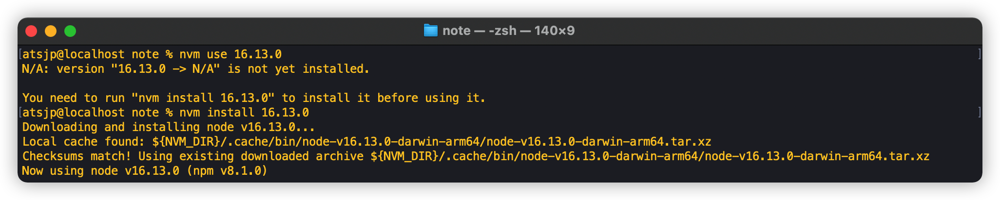

# 踏上Mac之路

> 时间：2021.10.30
>
> 系统：Monterey
>
> 版本：12
>
> 说明：
>
> -   说在最前面，所有配置均涉及到路径，各自可以直接选择和博主放在一个地方，也可以自己改地方，全文采用`${your_path}`代替大家选择的根路径，涉及到根路径的地方，博主会上方写上博主的地址。

## 基本操作

### 快捷键

[Apple官方](https://support.apple.com/zh-cn/HT201236)，官方快捷键介绍挺详细的了，一开始可以先看一遍，留个印象，不然都不知道Apple到底有多少快捷方式，反正我是惊呆了，再看看Windows，哎，算了算了。

### 终端

#### 打开App

大家知道，Mac的Finder用起来对于Windows重度使用者，太难受了，找个系统文件，门都没有（当然了，还有有其他方式直达目标文件的，比如桌面下使用command+shift+g，不过这个又不是Finder的功能）。Finder的无奈，导致大部分时间宁可使用终端，但是呢终端找到了目标，又想用某些软件打开，怎么办呢？

解决方案：

第一种：使用命令`open ${path}`，这样一个Path路径的Finder窗口就打开了，最后再去用软件打开，显然此方法不够优雅。

第二种：使用命令`${app_path} ${file_path}`，哦豁，举个例子，`/Applications/Sublime\ Text.app/Contents/SharedSupport/bin/subl settings.xml`，这样就可以使用Sublime
Text打开settings.xml文件啦，但是每次这么用，这路径也太长了吧。咋办呢？详情见Unix#Alias使用。

## Jdk

不用说啦，支持M1的Jdk版本也就zulu
jdk了吧，[Zulu](https://www.azul.com/downloads/?package=jdk)


### 环境变量

环境变量文件配置在 \~/.zprofile 即可，最后别忘了`source ~/.zprofile`。

> 有一件事大家得知道，环境变量文件不是所有Mac系统都是一样的，环境变量文件名称取决于Shell，何为Shell，这里就不赘述了，大家自行百度。常见的Shell有：bash、zsh、oh-my-zsh。通常他们的环境变量文件如下：
>
>   Shell       环境变量文件
>   ----------- ---------------
>   bash        .bash_profile
>   Zsh         .zprofile
>   Oh-my-zsh   .zshrc

``` properties
# Java
# ${your_path} = /Library/Java/JavaVirtualMachines
export JAVA_HOME=${your_path}/zulu_jdk8/zulu-8.jdk/Contents/Home
export PATH=$JAVA_HOME/bin:$PATH
export CLASSPATH=.
```

懒人脚本：

``` shell
echo "\n# Java" >> ~/.zprofile
# ${your_path} = /Library/Java/JavaVirtualMachines
echo "export JAVA_HOME=${your_path}/zulu_jdk8/zulu-8.jdk/Contents/Home" >> ~/.zprofile
echo "export PATH=\$JAVA_HOME/bin:\$PATH" >> ~/.zprofile
echo "export CLASSPATH=." >> ~/.zprofile

source ~/.zprofile
```

### 验证

以下命令全部输出OK，即可

``` shell
java -version
javac
java
```

## Maven

去哪里下载？官方入口直接下载：https://maven.apache.org/download.cgi


### 环境变量

目前环境变量文件配置在 \~/.zprofile
即可，最后别忘了`source ~/.zprofile`。

``` properties
# Maven
# ${your_path} = /Library
export MAVEN_HOME=${your_path}/Maven
export PATH=$MAVEN_HOME/bin:$PATH
```

懒人脚本：

``` shell
echo "\n# Maven" >> ~/.zprofile
# ${your_path} = /Library
echo "export MAVEN_HOME=${your_path}/Maven" >> ~/.zprofile
echo "export PATH=\$MAVEN_HOME/bin:\$PATH" >> ~/.zprofile

source ~/.zprofile
```

### 验证

以下命令全部输出OK，即可

``` shell
mvn -v
```

### 附件

#### Settings.xml

``` xml
<?xml version="1.0" encoding="UTF-8"?>
<settings xmlns="http://maven.apache.org/SETTINGS/1.0.0"
          xmlns:xsi="http://www.w3.org/2001/XMLSchema-instance"
          xsi:schemaLocation="http://maven.apache.org/SETTINGS/1.0.0 http://maven.apache.org/xsd/settings-1.0.0.xsd">

    <localRepository>cd</localRepository>

    <pluginGroups>
    </pluginGroups>

    <proxies>
    </proxies>

    <servers>
    </servers>

    <mirrors>

        <mirror>
          <id>aliyunmaven</id>
          <mirrorOf>*</mirrorOf>
          <name>阿里云公共仓库</name>
          <url>https://maven.aliyun.com/repository/public</url>
        </mirror>

        <mirror>
          <id>central</id>
          <mirrorOf>central</mirrorOf>
          <name>Maven Repository</name>
          <url>https://repo1.maven.org/maven2/</url>
        </mirror>

    </mirrors>

    <profiles>
    </profiles>

</settings>
```

## Git

Mac M1 最新系统自带Git，版本还不低，我就不重复装了。

## Docker

Mac上安装Docker方式各式各样，这边仅仅介绍一下Docker官网介绍的方式：https://docs.docker.com/desktop/mac/install/。


下载下来是个dmg文件，直接无脑安装即可。

### 如何启动

正常打开应用即可，应用会启动DockerEngie，然后就可以直接在终端或应用里进行操作了。但是显然没有Linux下的`service或systemctl`来的快，所以Mac上还有一个工具可以等效他们------`launchctl`，可以配置Docker的注册表，然后直接使用`launchctl`打开Docker，网上大多有教程，我这里不在赘述，至少目前对于我打开个应用的时间还是有的，实在不行，设置开机就启动Docker。

## IDE

### Idea

选择了Idea社区版本，为啥呢，因为大部分情况够用，但是如果你选择安装旗舰版，Windows上的Idea激活方式，仍然适合Mac。我说的就是那个使用无限重制试用时间的插件。

### Sublime Text

用过的都说好用，至少我觉得超级好看。[Macwk](https://www.macwk.com/soft/sublime-text)上有现成的破解版，据说挺干净的（不会偷偷摸摸干坏事），但是这傻货的安装包，Mac不认，非得给安装包开启一堆权限才可以。最终我选择临时安装了[Sublime
Text](https://www.sublimetext.com/)官方版，先用着吧，后面在想法子破解。哦，最后的最后，Windows上之前都是利用修改16进制代码改的，我试过了，Mac的16进制代码不同于Windows，网上暂时也没有大神指出来怎么搞，我就不瞎折腾了。

放个官方的图，让你感受一下


## Unix

再来看看一些硬核的吧

### Brew

通常基于Linux的Ubuntu、Centos都有自带的软件安装神奇，分别是apt-get、yum，然而Mac没有辜负你的期望，她系统不自带。此时，Brew出现了，她很开心的胜任了这份工作。怎么安装？[官方](https://brew.sh/)

### Vim

#### Theme

##### 下载安装

``` bash
git clone https://github.com/tomasr/molokai.git
mkdir -p ~/.vim/colors
mv molokai/colors/molokai.vim ~/.vim/colors/
cp /usr/share/vim/vimrc ~/.vimrc
vim ~/.vimrc
```

##### 配置

将下面几行添加到\~/.vimrc配置文件中即可

``` bash
set nu
syntax enable
set background=dark
colorscheme molokai
```

##### 效果


### ITerm2

还没折腾，看看别人的效果吧（大致就是Oh-My-Zsh主题+字体+各种配色方案，本人讲究大道至简，搞点配色方案护护眼得了，排查BUG的时候，你还有心情看这玩意？）：


### Osx Terminal

##### Theme

打开偏好设置，即可在描述文件中配置不同的配色方案。


我们可以选择自己配置，也可以选择别人的方案，下面安利一个项目：[iTerm2-Color-Schemes](https://github.com/mbadolato/iTerm2-Color-Schemes)，下载好项目后，在项目路径下/terminal/存在大量的配置方法，其中文件为\*.terminal的文件，我们可以直接在Mac下打开，就可以预览（另外，在打开的同时，偏好设置中的描述文件已经有了你打开过的配色方案，惊不惊喜），然后挑选一款适合自己的，在偏好设置-描述文件中设置为默认即可。

### Alias

别名，顾名思义，就是给一个Name重新起个名字，那这玩意就是起个名字吗？当然不是，这玩意配合其他功能一起玩会非常Happy

#### 终端

1.  如何在终端快速使用XXApp打开XX文件

    举个例子：

     App：Sublime Text

     文件： settings.xml

    正常使用：

    ``` shell
    /Applications/Sublime\ Text.app/Contents/SharedSupport/bin/subl settings.xml 
    ```

    别名使用：

    在\~/.zprofile文件中加入下面的别名定义，然后`source ~/.zprofile`。

    ``` properties
    alias sublime="/Applications/Sublime\ Text.app/Contents/SharedSupport/bin/subl"
    ```

    配置完成之后，我们使用以下命令直接打开：

    ``` shell
    sublime settings.xml
    ```

## NodeJs

Tips：说在最前面，由于M1架构的特殊性，所以常规去NodeJs官网找包，手动安装的方式，比较麻烦，因为你必须要找到正确的Arm架构的包，不然就得转义，然而所有转义都是有代价的，会有一定的性能损耗，各位看官看看怎么选择？A、直装Arm架构的包 B、官网x86转义


由于NodeJs版本的更新换代十分的快速，有些老项目必须使用低版本的Node，这样本地需要不停的切换不同版本的NodeJs，麻烦且容易错误，故Nvm出现了，所以我们首选Nvm来管理NodeJs。

### Nvm

#### 安装

Mac上Brew是个好东西，所以直接用Brew来上手安装，避免遇到包不对的情况，还得转义，下面动手开干。

打开终端，执行`	brew install nvm`: 


#### 环境变量

如果得到以上图中的执行结果，基本上是大功告成了，下面按照Brew的提示，继续完成环境变量配置：

第一步：`mkdir ~/.nvm`

第二步：`mkdir ~/.zshrc`

第三步：

```shell
  export NVM_DIR="$HOME/.nvm"
  [ -s "/opt/homebrew/opt/nvm/nvm.sh" ] && . "/opt/homebrew/opt/nvm/nvm.sh"  # This loads nvm
  [ -s "/opt/homebrew/opt/nvm/etc/bash_completion.d/nvm" ] && . "/opt/homebrew/opt/nvm/etc/bash_completion.d/nvm"  # This loads nvm bash_completion
```

第四步：`source ~/.zshrc`

#### 验证


### NodeJs

#### 安装

执行命令：`nvm install node`，默认安装最新的版本，更改`Node`为版本号既可以指定版本：`nvm install 16.13.0`



#### 验证


