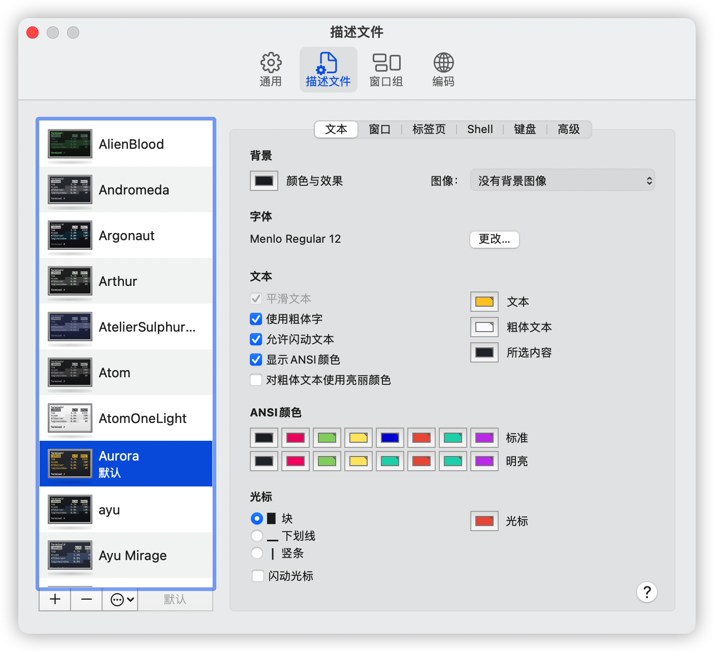

## 踏上Mac之路

> 时间：2021.10.30
>
> 说明：
>
> - 说在最前面，所有配置均涉及到路径，各自可以直接选择和博主放在一个地方，也可以自己改地方，全文采用`${your_path}`代替大家选择的根路径，涉及到根路径的地方，博主会上方写上博主的地址。

### Jdk

不用说啦，支持M1的Jdk版本也就zulu jdk了吧，[Zulu](https://www.azul.com/downloads/?package=jdk)，


#### 环境变量

目前环境变量文件配置在 ~/.zprofile 即可，最后别忘了`source ~/.zprofile`。

```properties
# Java
# ${your_path} = /Library/Java/JavaVirtualMachines
export JAVA_HOME=${your_path}/zulu_jdk8/zulu-8.jdk/Contents/Home
export PATH=$JAVA_HOME/bin:$PATH
export CLASSPATH=.
```

懒人脚本：

````shell
echo "\n# Java" >> ~/.zprofile
# ${your_path} = /Library/Java/JavaVirtualMachines
echo "export JAVA_HOME=${your_path}/zulu_jdk8/zulu-8.jdk/Contents/Home" >> ~/.zprofile
echo "export PATH=\$JAVA_HOME/bin:\$PATH" >> ~/.zprofile
echo "export CLASSPATH=." >> ~/.zprofile

source ~/.zprofile
````

#### 验证

以下命令全部输出OK，即可

```shell
java -version
java
java
```

### Maven

去哪里下载？官方入口直接下载：https://maven.apache.org/download.cgi


#### 环境变量

目前环境变量文件配置在 ~/.zprofile 即可，最后别忘了`source ~/.zprofile`。

```properties
# Maven
# ${your_path} = /Library
export MAVEN_HOME=${your_path}/Maven
export PATH=$MAVEN_HOME/bin:$PATH
```

懒人脚本：

````shell
echo "\n# Maven" >> ~/.zprofile
# ${your_path} = /Library
echo "export MAVEN_HOME=${your_path}/Maven" >> ~/.zprofile
echo "export PATH=\$MAVEN_HOME/bin:\$PATH" >> ~/.zprofile

source ~/.zprofile
````

#### 验证

以下命令全部输出OK，即可

```shell
mvn -v
```

#### 附件

##### Settings.xml

```xml
<?xml version="1.0" encoding="UTF-8"?>
<settings xmlns="http://maven.apache.org/SETTINGS/1.0.0"
          xmlns:xsi="http://www.w3.org/2001/XMLSchema-instance"
          xsi:schemaLocation="http://maven.apache.org/SETTINGS/1.0.0 http://maven.apache.org/xsd/settings-1.0.0.xsd">

    <localRepository>cd</localRepository>

    <pluginGroups>
    </pluginGroups>

    <proxies>
    </proxies>

    <servers>
    </servers>

    <mirrors>

        <mirror>
          <id>aliyunmaven</id>
          <mirrorOf>*</mirrorOf>
          <name>阿里云公共仓库</name>
          <url>https://maven.aliyun.com/repository/public</url>
        </mirror>

        <mirror>
          <id>central</id>
          <mirrorOf>central</mirrorOf>
          <name>Maven Repository</name>
          <url>https://repo1.maven.org/maven2/</url>
        </mirror>

    </mirrors>

    <profiles>
    </profiles>

</settings>
```

### Git

Mac M1 最新系统自带Git，版本还不低，我就不重复装了。

### IED

#### Idea

选择了Idea社区版本，为啥呢，因为大部分情况够用，但是如果你选择安装旗舰版，Windows上的Idea激活方式，仍然适合Mac。我说的就是那个使用无限重制试用时间的插件。

#### Sublime Text

用过的都说好用，至少我觉得超级好看。[Macwk](https://www.macwk.com/soft/sublime-text)上有现成的破解版，据说挺干净的（不会偷偷摸摸干坏事），但是这傻货的安装包，Mac不认，非得给安装包开启一堆权限才可以。最终我选择临时安装了[Sublime Text](https://www.sublimetext.com/)官方版，先用着吧，后面在想法子破解。哦，最后的最后，Windows上之前都是利用修改16进制代码改的，我试过了，Mac的16进制代码不同于Windows，网上暂时也没有大神指出来怎么搞，我就不瞎折腾了。

放个官方的图，让你感受一下


### Unix

再来看看Terminal吧

#### Vim

##### Theme

###### 下载安装

```bash
git clone https://github.com/tomasr/molokai.git
mkdir -p ~/.vim/colors
mv molokai/colors/molokai.vim ~/.vim/colors/
cp /usr/share/vim/vimrc ~/.vimrc
vim ~/.vimrc
```

###### 配置

将下面几行添加到~/.vimrc配置文件中即可

```bash
set nu
syntax enable
set background=dark
colorscheme molokai
```

###### 效果


#### Item2

还没折腾，看看别人的效果吧：


#### Osx Terminal

###### Theme

打开偏好设置，即可在描述文件中配置不同的配色方案。

[

我们可以选择自己配置，也可以选择别人的方案，下面安利一个项目：[iTerm2-Color-Schemes](https://github.com/mbadolato/iTerm2-Color-Schemes)，下载好项目后，在项目路径下/terminal/存在大量的配置方法，其中文件为 *.terminal 的文件，我们可以直接在Mac下打开，就可以预览（另外，在打开的同时，偏好设置中的描述文件已经有了你打开过的配色方案，惊不惊喜），然后挑选一款适合自己的，在偏好设置-描述文件中设置为默认即可。


