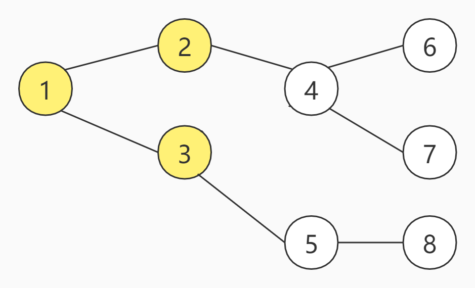
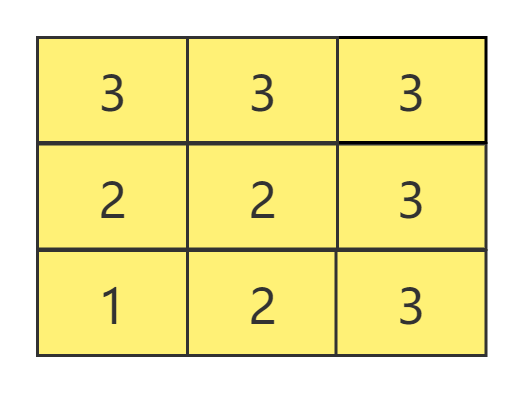
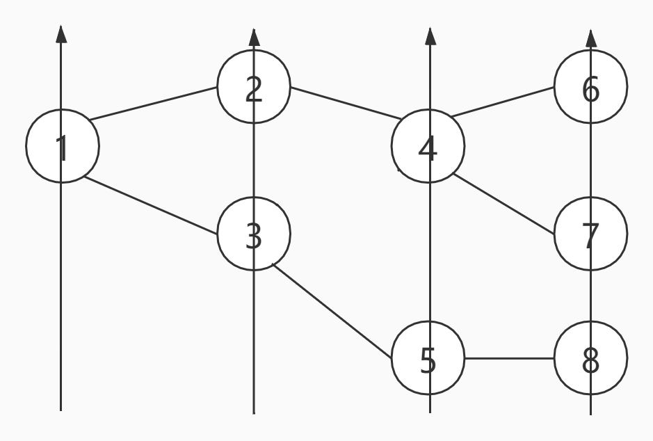

## BFS

### 何为BFS

BFS（Breath First Search）广度优先搜索。

> 百度百科：
>
> 宽度优先搜索算法（又称广度优先搜索）是最简便的图的搜索算法之一，这一算法也是很多重要的图的算法的原型。其别名又叫BFS，属于一种盲目搜寻法，目的是系统地展开并检查图中的所有节点，以找寻结果。换句话说，它并不考虑结果的可能位置，彻底地搜索整张图，直到找到结果为止。

为了更好的理解BFS，来看一张图：


上图一共有8个节点，假设，现在从编号为1的节点开始，那么的BFS的访问顺序如下：

<center>
    
    <br>
    <div style="color:orange; border-bottom: 1px solid #d9d9d9;
    display: inline-block;
    color: #999;
    padding: 2px;">第一步</div>
</center>

<center>
    
    <br>
    <div style="color:orange; border-bottom: 1px solid #d9d9d9;
    display: inline-block;
    color: #999;
    padding: 2px;">第二步</div>
</center>

<center>
    
    <br>
    <div style="color:orange; border-bottom: 1px solid #d9d9d9;
    display: inline-block;
    color: #999;
    padding: 2px;">第三步</div>
</center>

<center>
    
    <br>
    <div style="color:orange; border-bottom: 1px solid #d9d9d9;
    display: inline-block;
    color: #999;
    padding: 2px;">第四步</div>
</center>

可以看出，BFS的特点是每次所有可访问的节点都继续往下访问一个节点，即广度优先。假设把上述节点的方式改为九宫格呢，BFS又是如何访问的呢？

<center>
    
    <br>
    <div style="color:orange; border-bottom: 1px solid #d9d9d9;
    display: inline-block;
    color: #999;
    padding: 2px;">第一步</div>
</center>

<center>
    
    <br>
    <div style="color:orange; border-bottom: 1px solid #d9d9d9;
    display: inline-block;
    color: #999;
    padding: 2px;">第二步</div>
</center>

<center>
    
    <br>
    <div style="color:orange; border-bottom: 1px solid #d9d9d9;
    display: inline-block;
    color: #999;
    padding: 2px;">第三步</div>
</center>

和图一样，每次所有已经访问过小方格都继续访问其相邻的小方格，直接所有方格都访问过为止。

### 应用

那么BFS到底会在哪些情景下，发挥他的作用呢？以树为例，可以按照BFS的方式，遍历树的所有节点；以九宫格为例，可以按照BFS的方式，寻找最短路径。

当然生活中，我们的场景不会直接给我们一个树、九宫格等，这些特定的数据结构是需要我们根据业务场景，抽象出来的数据结构。

生活中，我们常用到各种导航软件，假如从北京导航到莫斯科，中间我们可能会经过内蒙古、新疆等，下面我们尝试抽象，最小粒度为City，将每一个City都想象成一个节点，我们要完成的任务就是，从A到B中，寻找到可达的路径，提供给用户选择。这不就可以使用BFS的方式完成寻找吗。当然了，实际上，导航的算法绝不止这么简单，但是一定会用到BFS的思想，比如常见的导航/路劲规划算法有：A-Star、Dijkstra等。

### 实战

#### 树的遍历

树的定义：

```java
public class TreeNode {
    int val;
    TreeNode left;
    TreeNode right;

    TreeNode() {
    }

    TreeNode(int val) {
        this.val = val;
    }

    TreeNode(int val, TreeNode left, TreeNode right) {
        this.val = val;
        this.left = left;
        this.right = right;
    }
}
```

遍历顺序（从左到右）：



代码：

```java
public static void levelOrder(TreeNode tree) {
    if (tree == null)
        return;
    // 队列
    Queue<TreeNode> list = new LinkedList<>();
    // 相当于把数据加入到队列尾部
    list.add(tree);
    while (!list.isEmpty()) {
        // poll方法相当于移除队列头部的元素
        TreeNode node = list.poll();
        System.out.println(node.val);
        if (node.left != null)
            list.add(node.left);
        if (node.right != null)
            list.add(node.right);
    }
}
```

递归的写法：

```java
public static void levelOrder(TreeNode tree) {
    int depth = depth(tree);
    for (int level = 0; level < depth; level++) {
        printLevel(tree, level);
    }
}

private static int depth(TreeNode tree) {
    if (tree == null)
        return 0;
    int leftDepth = depth(tree.left);
    int rightDepth = depth(tree.right);
    return Math.max(leftDepth, rightDepth) + 1;
}


private static void printLevel(TreeNode tree, int level) {
    if (tree == null)
        return;
    if (level == 0) {
        System.out.print(" " + tree.val);
    } else {
        printLevel(tree.left, level - 1);
        printLevel(tree.right, level - 1);
    }
}

```

**如果想把遍历的结果存放到list中，我们还可以这样写**

```java
public static List<List<Integer>> levelOrder(TreeNode tree) {
    if (tree == null)
        return null;
    List<List<Integer>> list = new ArrayList<>();
    bfs(tree, 0, list);
    return list;
}

private static void bfs(TreeNode tree, int level, List<List<Integer>> list) {
    if (tree == null)
        return;
    if (level >= list.size()) {
        List<Integer> subList = new ArrayList<>();
        subList.add(tree.val);
        list.add(subList);
    } else {
        list.get(level).add(tree.val);
    }
    bfs(tree.left, level + 1, list);
    bfs(tree.right, level + 1, list);
}
```

### 双向 BFS 优化

参照：https://labuladong.github.io/algo/1/5/


## DFS

### 何为DFS

DFS（Deep First Search）深度优先搜索。

> 百度百科：
>
> 深度优先搜索是一种在开发爬虫早期使用较多的方法。它的目的是要达到被搜索结构的叶结点(即那些不包含任何[超链](https://baike.baidu.com/item/超链/3947966)的[HTML文件](https://baike.baidu.com/item/HTML文件)) 。在一个HTML文件中，当一个[超链](https://baike.baidu.com/item/超链/3947966)被选择后，被链接的HTML文件将执行深度优先搜索，即在搜索其余的超链结果之前必须先完整地搜索单独的一条链。深度优先搜索沿着HTML文件上的[超链](https://baike.baidu.com/item/超链/3947966)走到不能再深入为止，然后返回到某一个HTML文件，再继续选择该HTML文件中的其他超链。当不再有其他[超链](https://baike.baidu.com/item/超链/3947966)可选择时，说明搜索已经结束。

单从百度百科的解释来看，我们还很难彻底理解DFS，来吧，继续上图：


上图一共有8个节点，假设，现在从编号为1的节点开始，我们的目的是为了找到7号节点，那么的DFS的访问顺序如下：


首先肯定是从1号节点开始，下一步，DFS开始选择，可以选择2或者3任一节点，作为下一步，我们暂且选择2号节点


下一步仅能选择4号节点，因为没有其他可达节点可选


此时，4号节点的可达节点，有6、7号节点可选，我们选择6号节点


到达6号节点之后，发现无任何可达节点可选，我们选择**回溯**，回到4号节点，发现还有7号节点可选


最终，通过DFS，成功找到了终点7号节点。

下面我们做一个总结：

**深度优先，则是以深度为准则，先一条路走到底，直到达到目标。这里称之为递归下去。**但是往往一条路会遇到走不通的情况，则需要**回溯到上一个节点，重新选择其他的节点**。那么，你会发现**深度优先搜索的步骤分为：1.递归下去 2.回溯上来。**

### 实战

#### 树的遍历

树的定义：

```java
public class TreeNode {
    int val;
    TreeNode left;
    TreeNode right;

    TreeNode() {
    }

    TreeNode(int val) {
        this.val = val;
    }

    TreeNode(int val, TreeNode left, TreeNode right) {
        this.val = val;
        this.left = left;
        this.right = right;
    }
}
```

遍历顺序：


代码如下：

```java
public void dfs(TreeNode root) {
    Stack<TreeNode> stack = new Stack<>();
    stack.add(root);
    while (!stack.empty()) {
        TreeNode node = stack.pop();
        System.out.println(node.val);
        if (node.right != null) {
            stack.push(node.right);
        }
        if (node.left != null) {
            stack.push(node.left);
        }
    }
}
```

递归的写法：

```java
public void dfs(TreeNode root) {
    if (root == null)
        return;
    System.out.println(root.val);
    treeDFS(root.left);
    treeDFS(root.right);
}
```


## 对比

DFS（深度优先搜索）和BFS（广度优先搜索），都是图形搜索算法。

### 数据结构

BFS通常使用**队列**这种数据结构，而DFS通常是使用**栈**这种数据结构。（注意一下通常，也就是说BFS不是不可以使用栈去做，只是不常用）

### 空间复杂度

BFS由于使用队列，一个节点会在队列中在保存一份，属于典型的空间换时间的做法，空间复杂度大于DFS。

### 最短路径

BFS找到的路径一定是最短的。因为每次遍历的深度增加一次，队列中所有的节点都向下访问一次，保证了所有路径都在齐头并进，这保证了第一次到达终点的时候，步数是最少的。

DFS则是一条路径走到底，不行了，在回溯回去，换一条路尝试，这样虽然可以找到终点，但是因为仅仅是找到了一条路径到达终点，无法确保此路径是最短路径。

扩展：有人会说，DFS找到一条路径，记录下来，在寻找其他路径，最终对比一下，不就可以找到最短路径了吗。是的，这样逻辑上没问题，但是你想，为了找到最短路径，DFS需要探索完整棵树，而BFS借助队列齐头并进，在到达终点后，不用在将树的剩余节点探索完，这样效率肯定高了不少。


