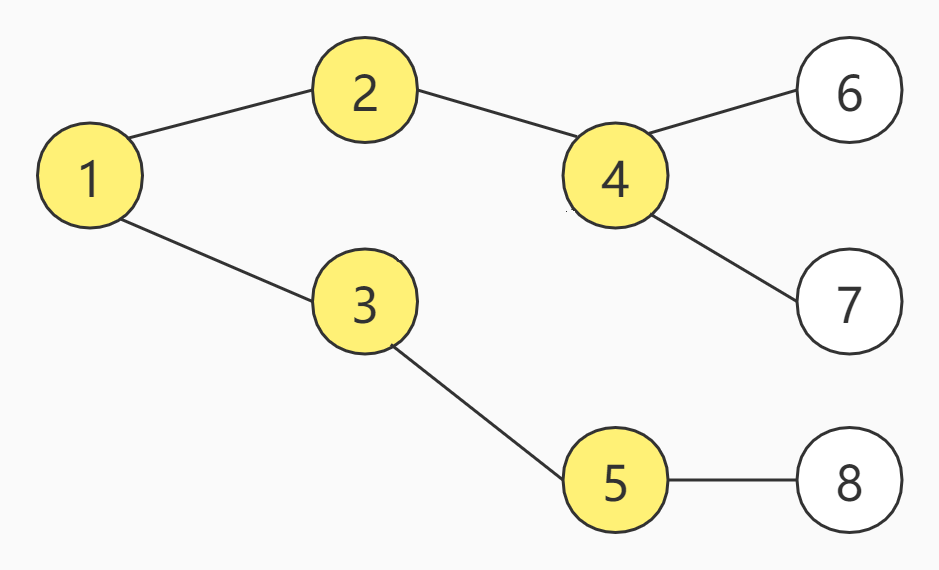

## BFS

### 何为BFS

BFS（Breath First Search）广度优先搜索。

> 百度百科：
>
> 宽度优先搜索算法（又称广度优先搜索）是最简便的图的搜索算法之一，这一算法也是很多重要的图的算法的原型。其别名又叫BFS，属于一种盲目搜寻法，目的是系统地展开并检查图中的所有节点，以找寻结果。换句话说，它并不考虑结果的可能位置，彻底地搜索整张图，直到找到结果为止。

为了更好的理解BFS，来看一张图：


上图一共有8个节点，假设，现在从编号为1的节点开始，那么的BFS的访问顺序如下：

<center>
    
    <br>
    <div style="color:orange; border-bottom: 1px solid #d9d9d9;
    display: inline-block;
    color: #999;
    padding: 2px;">第一步</div>
</center>

<center>
    
    <br>
    <div style="color:orange; border-bottom: 1px solid #d9d9d9;
    display: inline-block;
    color: #999;
    padding: 2px;">第二步</div>
</center>

<center>
    
    <br>
    <div style="color:orange; border-bottom: 1px solid #d9d9d9;
    display: inline-block;
    color: #999;
    padding: 2px;">第三步</div>
</center>

<center>
    
    <br>
    <div style="color:orange; border-bottom: 1px solid #d9d9d9;
    display: inline-block;
    color: #999;
    padding: 2px;">第四步</div>
</center>

可以看出，BFS的特点是每次所有可访问的节点都继续往下访问一个节点，即广度优先。假设把上述节点的方式改为九宫格呢，BFS又是如何访问的呢？

<center>
    
    <br>
    <div style="color:orange; border-bottom: 1px solid #d9d9d9;
    display: inline-block;
    color: #999;
    padding: 2px;">第一步</div>
</center>

<center>
    
    <br>
    <div style="color:orange; border-bottom: 1px solid #d9d9d9;
    display: inline-block;
    color: #999;
    padding: 2px;">第二步</div>
</center>

<center>
    
    <br>
    <div style="color:orange; border-bottom: 1px solid #d9d9d9;
    display: inline-block;
    color: #999;
    padding: 2px;">第三步</div>
</center>

和图一样，每次所有已经访问过小方格都继续访问其相邻的小方格，直接所有方格都访问过为止。

### BFS应用

那么BFS到底会在哪些情景下，发挥他的作用呢？以树为例，可以按照BFS的方式，遍历树的所有节点；以九宫格为例，可以按照BFS的方式，寻找最短路径。

当然生活中，我们的场景不会直接给我们一个树、九宫格等，这些特定的数据结构是需要我们根据业务场景，抽象出来的数据结构。

生活中，我们常用到各种导航软件，假如从北京导航到莫斯科，中间我们可能会经过内蒙古、新疆等，下面我们尝试抽象，最小粒度为City，将每一个City都想象成一个节点，我们要完成的任务就是，从A到B中，寻找到可达的路径，提供给用户选择。这不就可以使用BFS的方式完成寻找吗。当然了，实际上，导航的算法绝不止这么简单，但是一定会用到BFS的思想，比如常见的导航/路劲规划算法有：A-Star、Dijkstra等。

### BFS实战

#### 树的遍历

树的定义：

```java
public class TreeNode {
    int val;
    TreeNode left;
    TreeNode right;

    TreeNode() {
    }

    TreeNode(int val) {
        this.val = val;
    }

    TreeNode(int val, TreeNode left, TreeNode right) {
        this.val = val;
        this.left = left;
        this.right = right;
    }
}
```

遍历顺序（从左到右）：


代码：

```java
public static void levelOrder(TreeNode tree) {
    if (tree == null)
        return;
    // 链表，这里我们可以把它看做队列
    LinkedList<TreeNode> list = new LinkedList<>();
    // 相当于把数据加入到队列尾部
    list.add(tree);
    while (!list.isEmpty()) {
        // poll方法相当于移除队列头部的元素
        TreeNode node = list.poll();
        System.out.println(node.val);
        if (node.left != null)
            list.add(node.left);
        if (node.right != null)
            list.add(node.right);
    }
}
```

递归的写法：

```java
public static void levelOrder(TreeNode tree) {
    int depth = depth(tree);
    for (int level = 0; level < depth; level++) {
        printLevel(tree, level);
    }
}

private static int depth(TreeNode tree) {
    if (tree == null)
        return 0;
    int leftDepth = depth(tree.left);
    int rightDepth = depth(tree.right);
    return Math.max(leftDepth, rightDepth) + 1;
}


private static void printLevel(TreeNode tree, int level) {
    if (tree == null)
        return;
    if (level == 0) {
        System.out.print(" " + tree.val);
    } else {
        printLevel(tree.left, level - 1);
        printLevel(tree.right, level - 1);
    }
}
```

**如果想把遍历的结果存放到list中，我们还可以这样写**

```java
public static List<List<Integer>> levelOrder(TreeNode tree) {
    if (tree == null)
        return null;
    List<List<Integer>> list = new ArrayList<>();
    bfs(tree, 0, list);
    return list;
}

private static void bfs(TreeNode tree, int level, List<List<Integer>> list) {
    if (tree == null)
        return;
    if (level >= list.size()) {
        List<Integer> subList = new ArrayList<>();
        subList.add(tree.val);
        list.add(subList);
    } else {
        list.get(level).add(tree.val);
    }
    bfs(tree.left, level + 1, list);
    bfs(tree.right, level + 1, list);
}
```

##### 