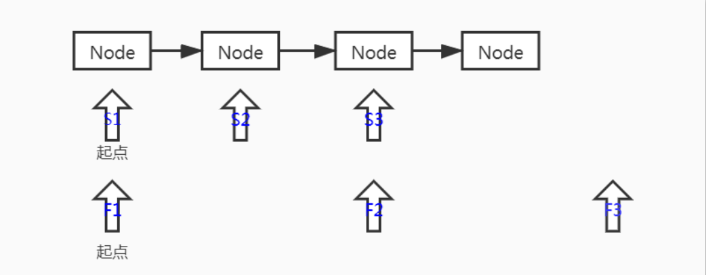
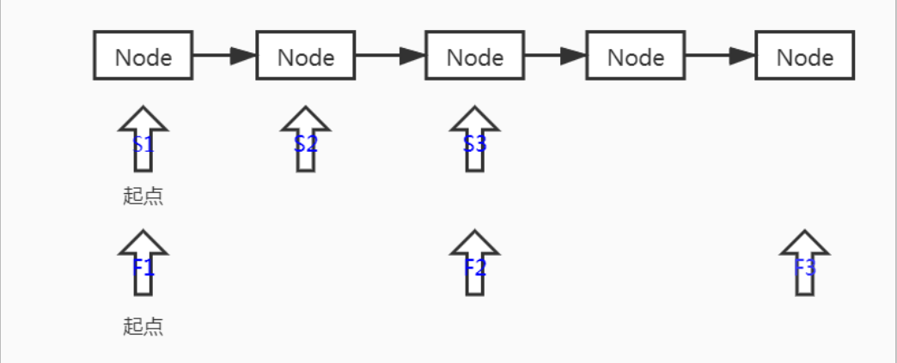
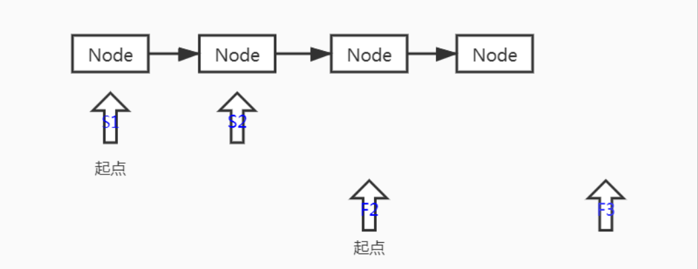
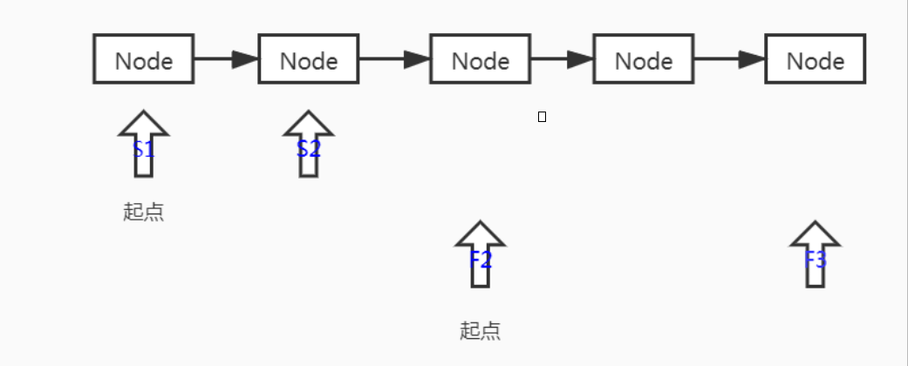

## Fast & Slow（快慢指针）

快慢指针中的快慢指的是移动的步长，即每次向前移动速度的快慢。例如可以让快指针每次沿链表向前移动2，慢指针每次向前移动1次。

### 快慢指针的应用

以下为基础代码

```java
  // 基础代码
  public static class SingleLinkedList {
    private Node head = null;

    class Node {
      private Node next;
      private Double data;

      public Node(Double data) {
        this.data = data;
      }
    }

    public void addNode(Double data) {
      if (head == null) {
        head = new Node(data);
        return;
      }
      Node temp = head;
      while (temp.next != null) {
        temp = temp.next;
      }
      temp.next = new Node(data);
    }

    public void makeLoop() {
      if (head == null) {
        return;
      }
      Node temp = head;
      while (temp.next != null) {
        temp = temp.next;
      }
      temp.next = head;
    }

  }
```

#### 判断单链表是否为循环链表

原理：由于快指针比慢指针总是快，所以如果单链表无循环，则快指针先跑到尾部，如果单链表有循环，则快指针总会追上慢指针。

```java
    public boolean hasLoop() {
      Node fast = head, slow = head;
      while (fast != null && fast.next != null) {
        fast = fast.next.next;
        slow = slow.next;
        if (slow.equals(fast)) {
          return true;
        }
      }
      return false;
    }
```

#### 在有序链表中寻找中位数

原理：利用快慢指针的特性，设定慢指针步长为2，慢指针步长为1，这样，当快指针走到尾部的时候，慢指针正好走到中部。此处需要注意的是，单链表长度的奇偶情况。
> 在讲下面之前，我们约定一个指针判断结束的条件：
>
> 当快指针指向的当前对象为`Null`或者快指针指向的当前对象的`Next`对象为`Null`时，则判定遍历结束。
>
> 即`fast = null || fast.next = null ` 时，`break`。

**下面我们以图来分析下两种情况：**

**第一种情况**，同时从`Head`节点起步。从下图来看，不妨可以看出来：如果链表长度为偶数(n)，快指针最后指向`Null`(n+1)，慢指针指向(n/2+1)，反之，如果链表的长度为奇数(n)，快指针最终指向最后一个节点(n)，慢指针指向(n/2+1)（PS：5 / 2 = 2，都当成Java整型处理）。





**第二种情况**，慢指针从`Head`节点起步，快指针从第三个节点起步，即快指针提前一步出发。从下图来看，不妨可以看出来：如果链表长度为偶数(n)，快指针最后指向`Null`(n+1)，慢指针指向(n/2)，反之，如果链表的长度为奇数(n)，快指针最终指向最后一个节点(n)，慢指针指向(n/2)（PS：5 / 2 = 2，都当成Java整型处理）。





看了上面两种情况，不难发现以下结果：

第一种情况：偶数时，快指针走完，慢指针指向了下中位数，如果需要计算中位数（补充小学知识：一般偶数长度数组时，认为中位数等于中间2位数字的平均值，奇数长度数组时，认为中位数等于中间那个数字），则需要通过获取慢指针指向节点的上一个节点，通过两者的值来计算最终的中位数。奇数时，快指针走完，慢指针恰好指向最中间的一位数字，这就是中位数。

第二种情况：偶数时，快指针走完，慢指针指向勒上中位数，如果需要计算中位数，则需要通过获取慢指针指向节点的下一个节点，通过两者的值来计算最终的中位数。奇数时，快指针走完，慢指针指向中位数的上一个节点，需要通过慢指针指向节点获取下一个节点，这就是中位数。

对比：

个人看法：本质上两者的时间复杂度都是一样的O(n)，唯一区别的时，针对奇偶的处理有所区别。

**代码实现：**

第一种情况：

```java
    public Double findMiddle1() {
      if (head == null) {
        return null;
      }
      if (head.next == null) {
        return head.data;
      }
      Node preNode = head, slow = head, fast = head;
      while (fast != null && fast.next != null) {
        preNode = slow;
        slow = slow.next;
        fast = fast.next.next;
      }
      if (fast == null) {
        return (preNode.data + slow.data) / 2;
      }
      return slow.data;
    }
```

第二种情况：

```java
    public Double findMiddle2() {
      if (head == null) {
        return null;
      }
      if (head.next == null) {
        return head.data;
      }
      Node slow = head, fast = head.next.next;
      while (fast != null && fast.next != null) {
        slow = slow.next;
        fast = fast.next.next;
      }
      if (fast == null) {
        return (slow.data + slow.next.data) / 2;
      }
      return slow.next.data;
    }
```

**附件**

测试代码：

```java
  public static void main(String args[]) {
    SingleLinkedList singleLinkedList = new SingleLinkedList();
    singleLinkedList.addNode(1.0);
    singleLinkedList.addNode(2.0);
    singleLinkedList.addNode(3.0);
    singleLinkedList.addNode(4.0);
    singleLinkedList.addNode(5.0);
    System.out.println("findMiddle1:" + singleLinkedList.findMiddle1());
    System.out.println("findMiddle2:" + singleLinkedList.findMiddle2());
    System.out.println("hasLoop:" + singleLinkedList.hasLoop());
    singleLinkedList.makeLoop();
    System.out.println("hasLoop:" + singleLinkedList.hasLoop());
  }
```

