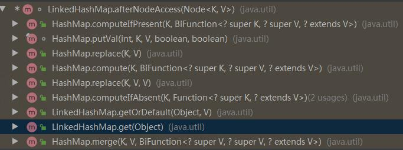

[TOC]


## LRU

LRU是Least Recently Used的缩写，即最近最少使用，是一种常用的页面置换算法，选择最近最久未使用的页面予以淘汰。该算法赋予每个[页面](https://baike.baidu.com/item/页面/5544813)一个访问字段，用来记录一个页面自上次被访问以来所经历的时间 t，当须淘汰一个页面时，选择现有页面中其 t 值最大的，即最近最少使用的页面予以淘汰。

### 原理
如图


1. 新数据插入到链表头部；
2. 每当缓存命中（即缓存数据被访问），则将数据移到链表头部；
3. 当链表满的时候，将链表尾部的数据丢弃。

### 实现

在进行实现前，以栈为例，整理下要实现的2个特性：

- 最新被访问的元素要移动到栈顶
- 当新插入一个元素后，栈的长度不够用了，需要移除栈底的元素（即最近最少使用的元素）

#### 实现一

实现一利用LinkedHashMap的特性，重写removeEldestEntry就可以完成LRU算法，先看代码：

```java
import java.util.LinkedHashMap;
import java.util.Map;

/**
 * 
 * @author shijianpeng
 */
public class LRU<K, V> {

  private static final float hashLoadFactory = 0.75f;
  private LinkedHashMap<K, V> map;
  private int cacheSize;

  public LRU(int cacheSize) {
    this.cacheSize = cacheSize;
    int capacity = (int) Math.ceil(cacheSize / hashLoadFactory) + 1;
    map = new LinkedHashMap<K, V>(capacity, hashLoadFactory, true) {
      private static final long serialVersionUID = 1;

      @Override
      protected boolean removeEldestEntry(Map.Entry eldest) {
        return size() > LRU.this.cacheSize;
      }

    };
  }

  public synchronized V get(K key) {
    return map.get(key);
  }

  public synchronized void put(K key, V value) {
    map.put(key, value);
  }

  public void print() {
    for (Map.Entry<K, V> entry : map.entrySet()) {
      System.out.print(entry.getValue() + "--");
    }
    System.out.println();

  }

  public static void main(String args[]) {
    LRU<String, String> ss = new LRU(5);

    ss.put("1", "3");
    ss.put("2", "4");
    ss.put("3", "6");
    ss.put("4", "1");
    ss.put("5", "5");

    ss.print();
    System.out.println("---------------");
    ss.get("1");
    ss.print();
    System.out.println("---------------");
    ss.put("7", "10");
    ss.print();
  }

}
```

下面来看为什么，首先看实现代码我们重写了removeEldestEntry方法，那么就来看官方的JavaDoc，此方法的作用：

```java
    /**
     * Returns <tt>true</tt> if this map should remove its eldest entry.
     * This method is invoked by <tt>put</tt> and <tt>putAll</tt> after
     * inserting a new entry into the map.  It provides the implementor
     * with the opportunity to remove the eldest entry each time a new one
     * is added.  This is useful if the map represents a cache: it allows
     * the map to reduce memory consumption by deleting stale entries.
     *
     * <p>Sample use: this override will allow the map to grow up to 100
     * entries and then delete the eldest entry each time a new entry is
     * added, maintaining a steady state of 100 entries.
     * <pre>
     *     private static final int MAX_ENTRIES = 100;
     *
     *     protected boolean removeEldestEntry(Map.Entry eldest) {
     *        return size() &gt; MAX_ENTRIES;
     *     }
     * </pre>
     *
     * <p>This method typically does not modify the map in any way,
     * instead allowing the map to modify itself as directed by its
     * return value.  It <i>is</i> permitted for this method to modify
     * the map directly, but if it does so, it <i>must</i> return
     * <tt>false</tt> (indicating that the map should not attempt any
     * further modification).  The effects of returning <tt>true</tt>
     * after modifying the map from within this method are unspecified.
     *
     * <p>This implementation merely returns <tt>false</tt> (so that this
     * map acts like a normal map - the eldest element is never removed).
     *
     * @param    eldest The least recently inserted entry in the map, or if
     *           this is an access-ordered map, the least recently accessed
     *           entry.  This is the entry that will be removed it this
     *           method returns <tt>true</tt>.  If the map was empty prior
     *           to the <tt>put</tt> or <tt>putAll</tt> invocation resulting
     *           in this invocation, this will be the entry that was just
     *           inserted; in other words, if the map contains a single
     *           entry, the eldest entry is also the newest.
     * @return   <tt>true</tt> if the eldest entry should be removed
     *           from the map; <tt>false</tt> if it should be retained.
     */
    protected boolean removeEldestEntry(Map.Entry<K,V> eldest) {
        return false;
    }
```

JavaDoc大致翻译如下：

```
如果这个Map应该删除最老的entry则需要返回true。
这个方法在插入一个新的entry到map里之后被put和putAll调用。
它提供了实现者，每次有新entry被添加时都有机会删除最老的条目。
如果map表示缓存，这很有用：它允许通过删除过时项来减少内存消耗。
 
简单使用：
此重写将会允许map增大到100个entry，然后每次增加新的entry将会删除最老的entry，保持100个entry的状态。
 
此方法通常不以任何方式修改映射，相反允许映射在其返回值的指引下进行自我修改。使用此方法直接修改映射是允许的，但是如果它执行了此操作，则一定返回false（表示该映射不应进行任何进一步的修改）。在此方法中修改映射后是否返回true是不确定的。

此实现仅返回 false（这样，此映射的行为将类似于正常映射，即永远不能移除最旧的元素）。
```

简单一点来说：

**removeEldestEntry返回true表示需要移除最老的元素，返回false，则表示不需要移除最老的元素。**

通过方法调用我们发现removeEldestEntry被afterNodeInsertion调用，afterNodeInsertion又被新加元素的方法调用。

```java
    void afterNodeInsertion(boolean evict) { // possibly remove eldest
        LinkedHashMap.Entry<K,V> first;
        if (evict && (first = head) != null && removeEldestEntry(first)) {
            K key = first.key;
            removeNode(hash(key), key, null, false, true);
        }
    }
```

到这里为止，已经知道了LRU中的移除最近未使用的元素是如何被实现的：在每次增加新的元素添加进map中，添加元素完成后，将会根据removeEldestEntry方法的返回值判断是否需要移除最老的元素（当然不仅仅只判断removeEldestEntry的返回值，removeEldestEntry的返回值仅仅是一个必要的条件）。

其次我们再看具体实现的部分：

```java
	new LinkedHashMap<K, V>(capacity, hashLoadFactory, true) {
      private static final long serialVersionUID = 1;

      @Override
      protected boolean removeEldestEntry(Map.Entry eldest) {
        return size() > LRU.this.cacheSize;
      }

    };
```

除了重写removeEldestEntry方法外，还指定了initialCapacity、loadFactor、accessOrder，通过查阅JavaDoc，得到以下释义：

- initialCapacity 初始容量
- loadFactor 加载因子
- accessOrder  排序方式，对于访问顺序，为 `true`；对于插入顺序，则为 `false`

 前两个都可以理解，后面排序方式到底是什么意思呢？下面看2个小例子：

```java
  @Test
  public void fun1() {
    LinkedHashMap<String, String> accessOrderTrue = new LinkedHashMap<>(16, 0.75f, false);
    accessOrderTrue.put("1", "1");
    accessOrderTrue.put("2", "2");
    accessOrderTrue.put("3", "3");
    accessOrderTrue.put("4", "4");
    System.out.println("accessOrderTrue:" + accessOrderTrue);
    accessOrderTrue.get("2");
    System.out.println("accessOrderTrue:" + accessOrderTrue);
    accessOrderTrue.get("3");
    System.out.println("accessOrderTrue:" + accessOrderTrue);
    accessOrderTrue.put("5", "5");
    System.out.println("accessOrderTrue:" + accessOrderTrue);
  }


  @Test
  public void fun2() {
    LinkedHashMap<String, String> accessOrderTrue = new LinkedHashMap<>(16, 0.75f, true);
    accessOrderTrue.put("1", "1");
    accessOrderTrue.put("2", "2");
    accessOrderTrue.put("3", "3");
    accessOrderTrue.put("4", "4");
    System.out.println("accessOrderTrue:" + accessOrderTrue);
    accessOrderTrue.get("2");
    System.out.println("accessOrderTrue:" + accessOrderTrue);
    accessOrderTrue.get("3");
    System.out.println("accessOrderTrue:" + accessOrderTrue);
    accessOrderTrue.put("5", "5");
    System.out.println("accessOrderTrue:" + accessOrderTrue);
  }
```

运行结果：

```text
// fun1打印如下
accessOrderTrue:{1=1, 2=2, 3=3, 4=4}
accessOrderTrue:{1=1, 2=2, 3=3, 4=4}
accessOrderTrue:{1=1, 2=2, 3=3, 4=4}
accessOrderTrue:{1=1, 2=2, 3=3, 4=4, 5=5}

// fun2打印如下
accessOrderTrue:{1=1, 2=2, 3=3, 4=4}
accessOrderTrue:{1=1, 3=3, 4=4, 2=2}
accessOrderTrue:{1=1, 4=4, 2=2, 3=3}
accessOrderTrue:{1=1, 4=4, 2=2, 3=3, 5=5}
```
从运行结果看，当accessOrder为false的时候，元素的位置仅仅根据插入顺序，不会随着访问而改变；当accessOrder为true的时候，元素的位置在被访问过后，将会被移动到队尾。

那么看懂了表象，下面再来剖析LinkedHashMap如何完成这个实现的，同样透过源码，我们来看实现：

```java
   void afterNodeAccess(Node<K,V> e) { // move node to last
        LinkedHashMap.Entry<K,V> last;
        if (accessOrder && (last = tail) != e) {
            LinkedHashMap.Entry<K,V> p =
                (LinkedHashMap.Entry<K,V>)e, b = p.before, a = p.after;
            p.after = null;
            if (b == null)
                head = a;
            else
                b.after = a;
            if (a != null)
                a.before = b;
            else
                last = b;
            if (last == null)
                head = p;
            else {
                p.before = last;
                last.after = p;
            }
            tail = p;
            ++modCount;
        }
    }
```

上述代码完成了如何将当前元素移动到队尾的任务，很显然accessOrder决定着是否要做这个操作，那么调用方有哪些呢？



从上图，看出最常用LinkedHashMap.get()等方法都会触发此方法。

**小结**

当accessOrder为true时，则会把访问过的元素放在链表后面，放置顺序是访问的顺序。
当accessOrder为false时，则按插入顺序来遍历。

看到这里，另外一个特性：最新被访问的元素要移动到栈顶。

就是这样实现的。

### 拓展

- 是否还有可优化空间？
  
  1、过期策略
  
  ​     传统的过期策略，是以固定的长度，通过对元素的排序，来剔除最近最久未使用的元素。
  
  ​     接触Redis之后，也可以利用Redis的过期时间来实现元素的剔除。
  
  