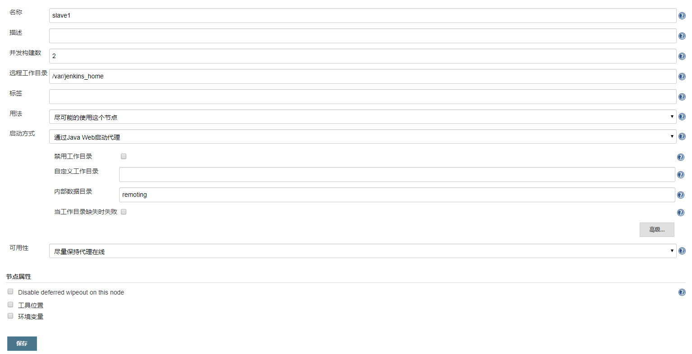
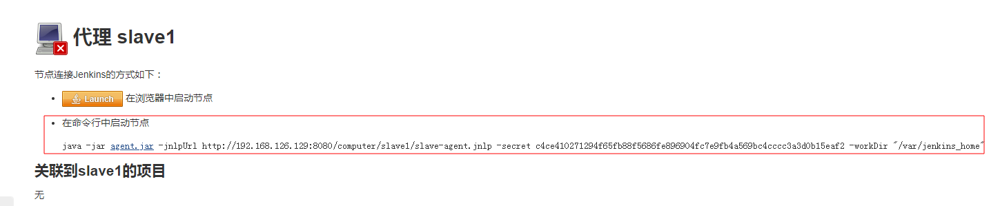
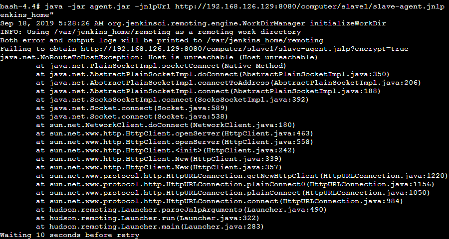

[TOC]

------

## docker部署jenkins集群

docker部署集群的方式有很多种，本篇文章会给大家带来以下几种部署方式：
1、jenkins原生态集群
2、docker hub一些封装好的集群镜像
...

### 1、jenkins原生态集群

>  docker原生态集群通信是依赖于5000
>  官方解释：如果您在其他机器上设置了一个或多个基于JNLP的Jenkins代理程序，而这些代理程>  序又与 jenkinsci/blueocean 容器交互（充当“主”Jenkins服务器，或者简称为“Jenkins主”）， 则这>  是必需的。默认情况下，基于JNLP的Jenkins代理通过TCP端口50000与Jenkins主站进行通信。

```shell
# master
docker run \
  -d \
  --name jenkins_master \
  -u root \
  -p 8080:8080 -p 50000:50000 \
  -v jenkins_master-data:/var/jenkins_home \
  -v /var/run/docker.sock:/var/run/docker.sock \
  -v /root/jenkins_master_home:/root/jenkins_home \
  jenkinsci/blueocean

# slave
docker run \
  -d \
  --name jenkins_slave1 \
  -u root \
  -p 9003:8080 -p 50003:50000 \
  -v jenkins_slave1-data:/var/jenkins_home \
  -v /var/run/docker.sock:/var/run/docker.sock \
  -v /root/jenkins_slave1_home:/root/jenkins_home \
  jenkinsci/blueocean

# slave
docker run \
  -d \
  --name jenkins_slave2 \
  -u root \
  -p 9004:8080 -p 50004:50000 \
  -v jenkins_slave2-data:/var/jenkins_home \
  -v /var/run/docker.sock:/var/run/docker.sock \
  -v /root/jenkins_slave2_home:/root/jenkins_home \
  jenkinsci/blueocean
```

启动好master以后进行如下配置：



配置保存成功后，jenkins提示我们还需执行如下命令才能够使得slave节点与master建立链接：



我们选择第二种方式，JavaWeb代理方式，将Agent.jar下载后，上传到slave1节点的任意位置，执行命令：

```shell
java -jar agent.jar -jnlpUrl http://192.168.126.129:8080/computer/slave1/slave-agent.jnlp -secret c4ce410271294f65fb88f5686fe896904fc7e9fb4a569bc4cccc3a3d0b15eaf2 -workDir "/var/jenkins_home"
```

如果想在后台运行此命令，则我们稍微改造下(其中log.file记录了启动运行日志)：

```shell
nohup java -jar agent.jar -jnlpUrl http://192.168.126.129:8080/computer/slave1/slave-agent.jnlp -secret c4ce410271294f65fb88f5686fe896904fc7e9fb4a569bc4cccc3a3d0b15eaf2 -workDir  "/var/jenkins_home" > log.file 2>&1 &
```

如果执行以上命令，出现以下错误，则将IP地址替换成master的docker分配的IP即可。



执行完之后，刷新master页面，查看slave的连通状态。

### 2、集群镜像

DockerHub不乏一些动手能力较强的大佬，为我们提供一些开箱即用的镜像，下面的镜像来源就是其中一位大佬提供的Jenkins集群镜像，不过目前此镜像的Jenkins版本较低。

```
docker run -d --name jenkins -p 8080:8080 -p 50000:50000 andretadeu/jenkins-swarm

docker run -d --name jenkins-slave-01 --link jenkins:jenkins andretadeu/jenkins-swarm-slave
```


