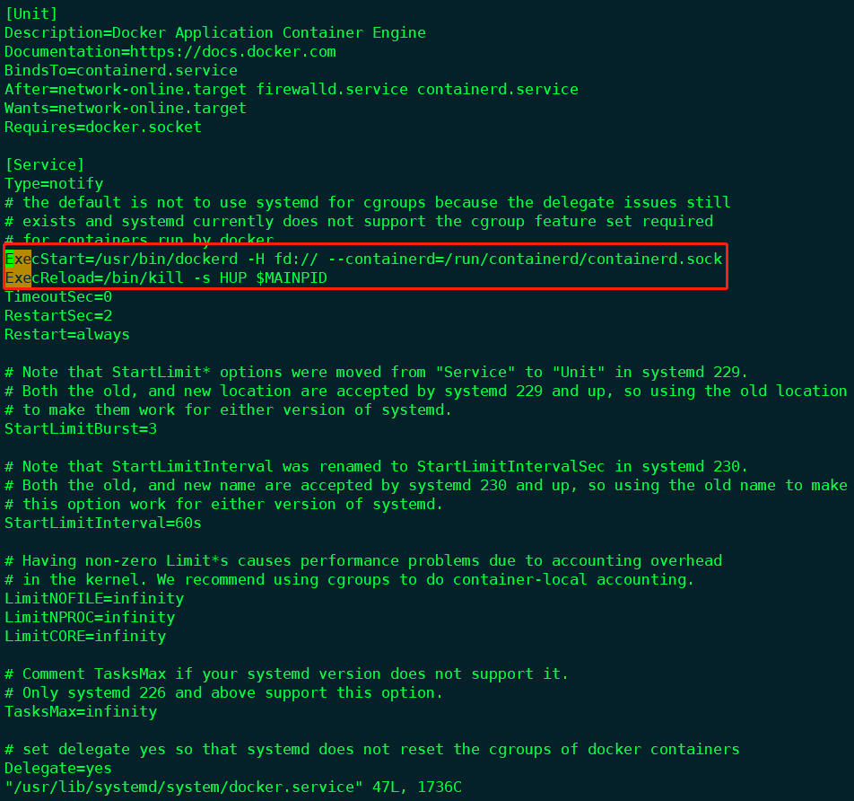
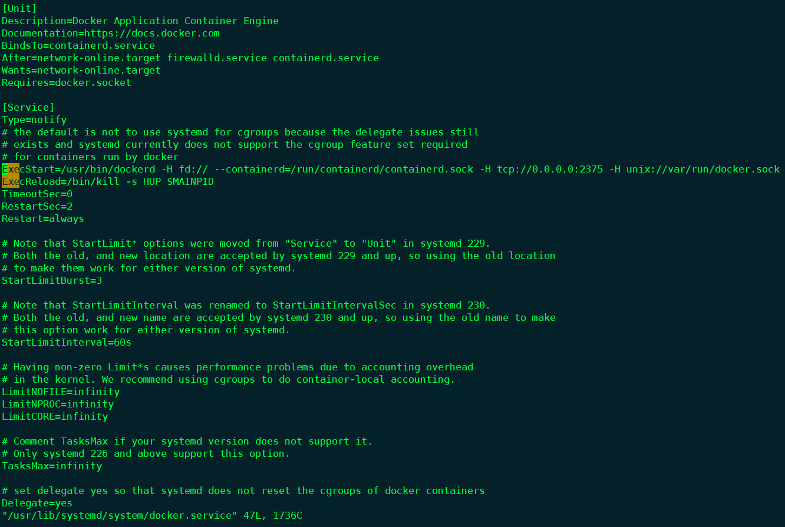
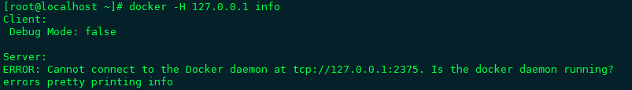
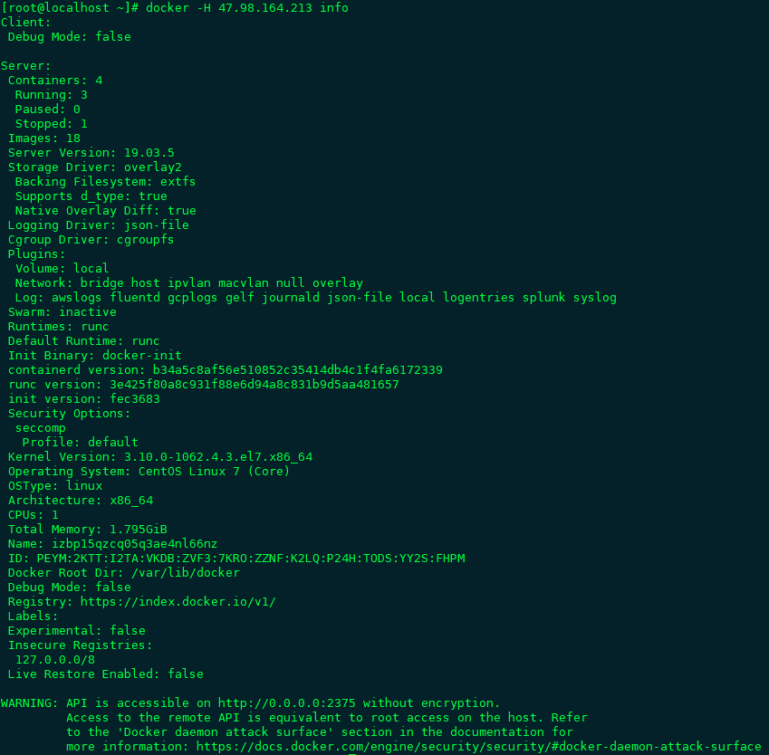
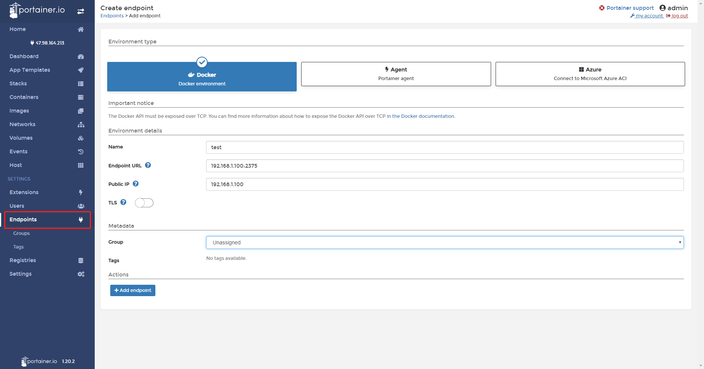

# Docker-cluster


## 一、原始Docker环境

### 1、通过Docker自身暴露端口，结合DockerUI搞定

第一步，配置Docker对外暴露

```shell
vim /usr/lib/systemd/system/docker.service
```

打开后，找到如下的2行



我们在`ExecStart`参数后，加上以下内容：


```properties
-H tcp://0.0.0.0:2375 -H unix://var/run/docker.sock 
```

最终结果如下：



第二步，我们重启Docker

```shell
systemctl daemon-reload
systemctl restart docker
```

好了，确认`Docker`启动正常后，我们验证下是否可以。

```shell
docker -H 127.0.0.1 info
```

如果看到以下内容，则表示失败（当然各位注意：如果在别的`Docker`机器验证，记得把`2375`端口对外暴露哦）:



如下，则成功：



成功之后，我们利用`Portainer`来做集群管理：

配置信息，各位填上自己的Docker机器IP地址即可，其中TLS是安全方面的设置，如机器暴露在公网，则可以查阅该方面的配置，此处不再涉及。



## 二、Docker-swarm


