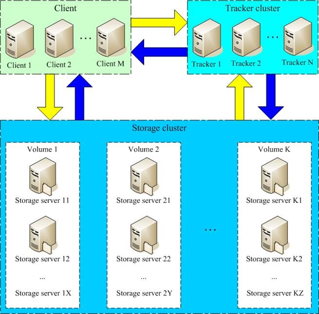

# 常见分布式文件存储对比

<table>
<thead>
<tr>
<th style="text-align: center;">文件系统</th>
<th style="text-align: center;">TFS</th>
<th style="text-align: center;">FastDFS</th>
<th style="text-align: center;">MogileFS</th>
<th style="text-align: center;">MooseFS</th>
<th style="text-align: center;">GlusterFS</th>
<th>Ceph</th>
</tr>
</thead>
<tbody>
<tr>
<td style="text-align: center;">开发语言</td>
<td style="text-align: center;">C++</td>
<td style="text-align: center;">C</td>
<td style="text-align: center;">Perl</td>
<td style="text-align: center;">C</td>
<td style="text-align: center;">C</td>
<td>C++</td>
</tr>
<tr>
<td style="text-align: center;">开源协议</td>
<td style="text-align: center;">GPL V2</td>
<td style="text-align: center;">GPL V3</td>
<td style="text-align: center;">GPL</td>
<td style="text-align: center;">GPL V3</td>
<td style="text-align: center;">GPL V3</td>
<td>LGPL</td>
</tr>
<tr>
<td style="text-align: center;">数据存储方式</td>
<td style="text-align: center;">块</td>
<td style="text-align: center;">文件/Trunk</td>
<td style="text-align: center;">文件</td>
<td style="text-align: center;">块</td>
<td style="text-align: center;">文件/块</td>
<td>对象/文件/块</td>
</tr>
<tr>
<td style="text-align: center;">集群节点通信协议</td>
<td style="text-align: center;">私有协议（TCP）</td>
<td style="text-align: center;">私有协议（TCP）</td>
<td style="text-align: center;">HTTP</td>
<td style="text-align: center;">私有协议（TCP）</td>
<td style="text-align: center;">私有协议（TCP）/ RDAM(远程直接访问内存)</td>
<td>私有协议（TCP）</td>
</tr>
<tr>
<td style="text-align: center;">专用元数据存储点</td>
<td style="text-align: center;">占用NS</td>
<td style="text-align: center;">无</td>
<td style="text-align: center;">占用DB</td>
<td style="text-align: center;">占用MFS</td>
<td style="text-align: center;">无</td>
<td>占用MDS</td>
</tr>
<tr>
<td style="text-align: center;">在线扩容</td>
<td style="text-align: center;">支持</td>
<td style="text-align: center;">支持</td>
<td style="text-align: center;">支持</td>
<td style="text-align: center;">支持</td>
<td style="text-align: center;">支持</td>
<td>支持</td>
</tr>
<tr>
<td style="text-align: center;">冗余备份</td>
<td style="text-align: center;">支持</td>
<td style="text-align: center;">支持</td>
<td style="text-align: center;">-</td>
<td style="text-align: center;">支持</td>
<td style="text-align: center;">支持</td>
<td>支持</td>
</tr>
<tr>
<td style="text-align: center;">单点故障</td>
<td style="text-align: center;">存在</td>
<td style="text-align: center;">不存在</td>
<td style="text-align: center;">存在</td>
<td style="text-align: center;">存在</td>
<td style="text-align: center;">不存在</td>
<td>存在</td>
</tr>
<tr>
<td style="text-align: center;">跨集群同步</td>
<td style="text-align: center;">支持</td>
<td style="text-align: center;">部分支持</td>
<td style="text-align: center;">-</td>
<td style="text-align: center;">-</td>
<td style="text-align: center;">支持</td>
<td>不适用</td>
</tr>
<tr>
<td style="text-align: center;">易用性</td>
<td style="text-align: center;">安装复杂，官方文档少</td>
<td style="text-align: center;">安装简单，社区相对活跃</td>
<td style="text-align: center;">-</td>
<td style="text-align: center;">安装简单，官方文档多</td>
<td style="text-align: center;">安装简单，官方文档专业化</td>
<td>安装简单，官方文档专业化</td>
</tr>
<tr>
<td style="text-align: center;">适用场景</td>
<td style="text-align: center;">跨集群的小文件</td>
<td style="text-align: center;">单集群的中小文件</td>
<td style="text-align: center;">-</td>
<td style="text-align: center;">单集群的大中文件</td>
<td style="text-align: center;">跨集群云存储</td>
<td>单集群的大中小文件</td>
</tr>
</tbody>
</table>

# FastDFS简介

推荐文章：https://www.imooc.com/article/details/id/66990

- FastDFS是一个轻量级的开源分布式文件系统

- FastDFS主要解决了大容量的文件存储和高并发访问的问题，文件存取时实现了负载均衡

- FastDFS实现了软件方式的RAID，可以使用廉价的IDE硬盘进行存储

- 支持存储服务器在线扩容

- 支持相同内容的文件只保存一份，节约磁盘空间

- FastDFS特别适合大中型网站使用，用来存储资源文件（如：图片、文档、音频、视频等等）

- FastDFS是一个开源的轻量级分布式文件系统，由跟踪服务器（tracker server）、存储服务器（storage server）和客户端（client）三个部分组成，主要解决了海量数据存储问题，特别适合以中小文件（建议范围：4KB < file_size <500MB）为载体的在线服务。

## 系统架构图

