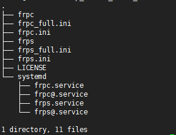

# Frp从入门到放弃

> 国际惯例： [Github](https://github.com/fatedier/frp)

## 一、介绍

官方架构图：


由此图可见，`Frp`主要存在两个概念：`frpc`、`frps`，这两个概念我们必须清楚，否则在配置过程中，很容易搞反。

`frps`：即`frp-server`，表示`frp`的服务端，配置在有公网IP的机器上。

`frpc`：即`frp-client`，表示`frp`的客户端，配置在我们的内网机器上。

## 二、使用

### A、快速开始

下载整体包到服务器上(版本自由选择，博主是`centos64`位，使用的是`frp_0.29.0_linux_amd64.tar.gz`)：[GithubRelease](https://github.com/fatedier/frp/releases)

下载完，解压缩的事无需再提，下图为解压后的目录结构（不同的版本可能稍有不同）。



下面我们先来配置服务端：

修改`frps.ini`:

```ini
# frps.ini
[common]
# Frp通信端口
bind_port = 7000
# 当前服务端对外暴露的http端口，用于域名或IP直接访问
vhost_http_port = 8080
```

启动服务端：

```shell
# 控制台直接启动
./frps -c ./frps.ini
```

接下来，开始配置客户端：

```ini
# frpc.ini
[common]
# 你的公网服务器的IP
server_addr = x.x.x.x
# Frp服务端通信端口
server_port = 7000

# 此处web命名随意
[web]
type = http
# 此端口是客户端本地的网站暴露端口
local_port = 80
# 此域名解析指向公网服务器
custom_domains = www.yourdomain.com
```

启动客户端：

```shell
./frpc -c ./frpc.ini
```

测试，打开浏览器访问`http://www.yourdomain.com:8080`

到此`frp`基本使用已经结束，对于不同的业务要求，仅仅是配置不一样而已。

## 三、常用

### A、内网端口直接映射到外网端口

服务端配置：

```ini
[common]
bind_port = 7000
```

客户端配置：

```ini
[common]
server_addr = x.x.x.x
server_port = 7000

[tcp1]
type = tcp
local_ip = 127.0.0.1
local_port = 9000
remote_port = 9000
```

配置完成后，访问外网的IP：9000 将会直接映射到内网的 9000 端口

## 四、坑


