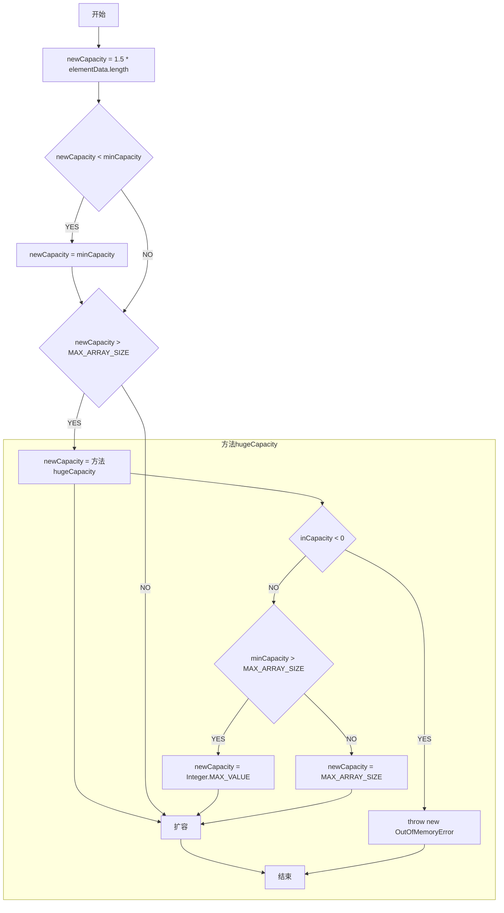

## ArraysList

### 数据结构

数组：Object[] elementData

### 扩容

**知识了解：**

minCapacity：最小扩容量，分析源码不难知道，等于当前数组的size+1。

```java
    public boolean add(E e) {
        ensureCapacityInternal(size + 1);  // Increments modCount!!
        elementData[size++] = e;
        return true;
    }

    private void ensureCapacityInternal(int minCapacity) {
       // ...
    }
```

#### 首次扩容

当我们使用ArrayList()无参构造器初始化对象的时候，默认不扩容，将默认的空数组赋值给数组。后续，在新增数据的时候，触发了扩容机制。

其中，扩容的大小取默认容量、最小扩容量的最大值，之后扩容逻辑同非首次扩容。

```java
	private static final int DEFAULT_CAPACITY = 10
	private static final Object[] DEFAULTCAPACITY_EMPTY_ELEMENTDATA = {};

    public ArrayList() {
        // 无参构造器，默认不扩容，指向默认的空数组
        this.elementData = DEFAULTCAPACITY_EMPTY_ELEMENTDATA;
    }
    
    private void ensureCapacityInternal(int minCapacity) {
        // 首次扩容
        if (elementData == DEFAULTCAPACITY_EMPTY_ELEMENTDATA) {
            // 取默认容量和最小扩容量的最大值
            minCapacity = Math.max(DEFAULT_CAPACITY, minCapacity);
        }

        ensureExplicitCapacity(minCapacity);
    }
    
    private void ensureExplicitCapacity(int minCapacity) {
        modCount++;

        // 如果最小扩容量大于当前数组长度，则扩容
        if (minCapacity - elementData.length > 0)
            grow(minCapacity);
    }
```

#### 非首次扩容



```flow
st=>start: start
c1=>condition: newCapacity < minCapacity
c2=>condition: newCapacity > MAX_ARRAY_SIZE
c3=>condition: minCapacity < 0
c4=>condition: minCapacity > MAX_ARRAY_SIZE

o1=>operation: oldCapacity = elementData.length
o2=>operation: newCapacity = oldCapacity + (oldCapacity >> 1)
o3=>operation: newCapacity = minCapacity
o4=>operation: newCapacity = hugeCapacity(minCapacity)
o5=>operation: throw new OutOfMemoryError()
o6=>operation: newCapacity = Integer.MAX_VALUE
o7=>operation: newCapacity = MAX_ARRAY_SIZE
o8=>operation: 扩容

end=>end: end

st->o1->o2->c1
c1(yes)->o3->c2
c1(no)->c2

c2(yes)->o4->c3
c2(no)->o8->end

c3(yes)->o5->end
c3(no)->c4

c4(yes)->o6->o8->end
c4(no)->o7->o8->end
```


```java
    private void grow(int minCapacity) {
        int oldCapacity = elementData.length;
        // 新的容量 = 老的容量 + 老的容量的一半 = 老容量的1.5倍
        int newCapacity = oldCapacity + (oldCapacity >> 1);
        if (newCapacity - minCapacity < 0)
            // 新的容量 小于 最小扩容量，则把最小扩容量重新赋值新的容量
            newCapacity = minCapacity;
        if (newCapacity - MAX_ARRAY_SIZE > 0)
            // 新的容量 大于 最大扩容量，则进行大容量扩容处理
            newCapacity = hugeCapacity(minCapacity);
        // 开始扩容
        elementData = Arrays.copyOf(elementData, newCapacity);
    }
     
    private static int hugeCapacity(int minCapacity) {
        if (minCapacity < 0) 
            throw new OutOfMemoryError();
        // 如果最小扩容量 大于 最大扩容量，则取Integer.MAX_VALUE，反之取最大扩容量
        return (minCapacity > MAX_ARRAY_SIZE) ?
            Integer.MAX_VALUE :
            MAX_ARRAY_SIZE;
    }

```

### 使用

1.7和1.8最大的区别就是：1.7是饿汉式创建集合容量，1.8是懒汉式创建集合容量

### 优缺点

优点：

1、因为是数组，所以根据脚标取数据很快

缺点：
1、数组的新增、删除操作效率不高，涉及到数组的扩容、复制等操作
2、线程不安全


