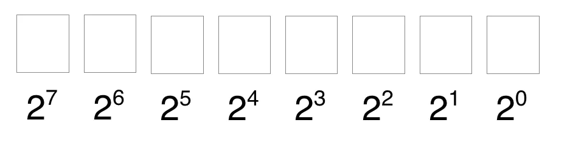

## BitSet

在分析原理之前，我们先抛出个概念，如下图，第一行我们用来写二进制数，第二行则是对应二进制数为1的十进制数，刚好我们发现，自然数0，1，2...n，均存在对应的一个独立位置的二进制数。那么为了更好表示自然数存在，我们在其对应的二进制数位置上用1标识存在，反之0则不存在。

例如：针对数组[0，2，3]，我们用二进制数1101表示，即3，2，0存在，1不存在。



### 原理

Java的BitSet使用一个Long（一共64位）的数组中的每一位（bit）是否为`1`来表示当前Index的数存在不。但是BitSet又是如何实现的呢？其实只需要理解其中的两个方法：

- set
- get

就能够理解BitSet的实现原理是什么了。

#### set

先看源代码：

```java
public void set(int bitIndex) {
    if (bitIndex < 0)
        throw new IndexOutOfBoundsException("bitIndex < 0: " + bitIndex);
    int wordIndex = wordIndex(bitIndex);
    expandTo(wordIndex);

    words[wordIndex] |= (1L << bitIndex); // Restores invariants

    checkInvariants();
}

private static int wordIndex(int bitIndex) {
    return bitIndex >> ADDRESS_BITS_PER_WORD;
}
```

这里`ADDRESS_BITS_PER_WORD`的值是6，那么最先想到的问题就是：**为什么是6呢？而不是其他值呢？**

答案其实很简单，还记得在最开始提到的：BitSet里使用一个Long数组里的每一位来存放当前Index是否有数存在。

因为在Java里Long类型是64位，所以一个Long可以存储64个数，而要计算给定的参数`bitIndex`应该放在数组（在BitSet里存在类型为`long[]`的`word`的实例变量里）的哪个Long里，只需要计算：`bitIndex / 64`即可，这里正是使用`>>`来代替除法（因为位运算要比除法效率高），而64正好是2的6次幂，所以`ADDRESS_BITS_PER_WORD`的值是6。

通过`wordIndex`函数就能计算出参数`bitIndex`应该存放在`words`数组里的哪一个Long里。

##### expandTo

```cpp
private void expandTo(int wordIndex) {
    int wordsRequired = wordIndex+1;
    if (wordsInUse < wordsRequired) {
        ensureCapacity(wordsRequired);
        wordsInUse = wordsRequired;
    }
}
```

从上面已经知道在BitSet里是通过一个Long数组（`words`）来存放数据的，这里的`expandTo`方法就是用来判断`words`数组的长度是否大于当前所计算出来的`wordIndex`（简单的说，就是能不能存的下），如果超过当前`words`数组的长度（记录在实例变量`wordsInUse`里），也即是存不下，则新加一个long数到`words`里(ensureCapacity(wordsRequired)所实现的。)。

##### Restores invariants

```cpp
words[wordIndex] |= (1L << bitIndex); // Restores invariants
```

这一行代码可以说是BitSet的精髓了，先不说什么意思，我们先看看下面代码的输出：

```css
System.out.println(1<<0);
System.out.println(1<<1);
System.out.println(1<<2);
System.out.println(1<<3);
System.out.println(1<<4);
System.out.println(1<<5);
System.out.println(1<<6);
System.out.println(1<<7);
```

输出是：

```undefined
1
2
4
8
16
32
64
128
```

这个输出看出规律没有？就是2的次幂，但是还是不太好理解，我们用下面的输出，效果会更好：

```css
System.out.println(Integer.toBinaryString(1<<0));
System.out.println(Integer.toBinaryString(1<<1));
System.out.println(Integer.toBinaryString(1<<2));
System.out.println(Integer.toBinaryString(1<<3));
System.out.println(Integer.toBinaryString(1<<4));
System.out.println(Integer.toBinaryString(1<<5));
System.out.println(Integer.toBinaryString(1<<6));
System.out.println(Integer.toBinaryString(1<<7));
```

输出是：

```undefined
1
10
100
1000
10000
100000
1000000
10000000
```

从而发现，上面所有的输出力，`1` 所在的位置，正好是第1，2，3，4，5，6，7，8（Java数组的Index从0开始）位。而BitSet正是通过这种方式，将所给的`bitIndex`所对应的位设置成1，表示这个数已经存在了。这也解释了`(1L << bitIndex)`的意思（注意：因为BitSet是使用的Long，所以要使用1L来进行位移）。

搞懂了`(1L << bitIndex)`，剩下的就是用或运算`|`来将当前算出来的和以前的值进行合并了`words[wordIndex] |= (1L << bitIndex);`。

剩下的`checkInvariants`就没什么好解释的了。

#### get

搞懂了`set`方法，那么`get`方法也就好懂了，整体意思就是算出来所给定的`bitIndex`所对应的位数是否为`1`即可。先看看代码：

```java
public boolean get(int bitIndex) {
    if (bitIndex < 0)
        throw new IndexOutOfBoundsException("bitIndex < 0: " + bitIndex);

    checkInvariants();

    int wordIndex = wordIndex(bitIndex);
    return (wordIndex < wordsInUse)
        && ((words[wordIndex] & (1L << bitIndex)) != 0);
}
```

计算`wordIndex`在上面set方法里已经说明了，就不再细述。这个方法里，最重要的就只有：`words[wordIndex] & (1L << bitIndex)`。这里`(1L << bitIndex)`也已经做过说明，就是算出一个数，只有`bitIndex`位上为1，其他都为0，然后再和`words[wordIndex]`做`&`计算，如果`words[wordIndex]`数的`bitIndex`位是`0`，则结果就是`0`，以此来判断参数`bitIndex`存在不。


#### 实战演练：[机票](../../../Arithmetic/FindMissNum.md)