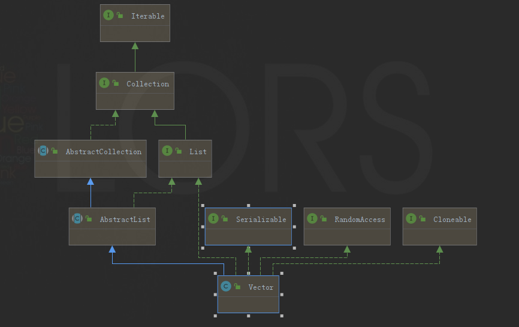

## Vector

### 关系图

### 数据结构

数组：Object[] elementData

### 原理

1、如果保证线程安全的？

答：使用`synchronized`关键字。

### 优缺点

优点：

1、线程安全

2、因为是数组，所以根据脚标取数据很快

缺点：

1、底层也是数组，删除操作效率不高，涉及到数组的扩容、复制等操作

2、因为线程安全是通过`synchronized`关键字控制的，所以具有`synchronized`的优缺点

​     飞机票：[Synchronized](Synchronized.md)