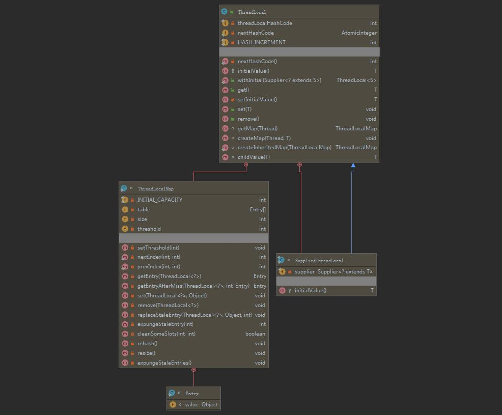

## ThreadLocal

>

### 介绍

#### 概念

引用`JDK`官方原话：

> This class provides thread-local variables. These variables differ from their  normal counterparts in that each thread that accesses one (via its  `get` or `set` method) has its own, independently  initialized copy of the variable. `ThreadLocal` instances are  typically private static fields in classes that wish to associate state with a  thread (e.g., a user ID or Transaction ID). 
>
> 百度翻译：
>
> 这个类提供线程局部变量。这些变量与普通的变量不同，因为每个访问一个变量的线程（通过其“get”或“set”方法）都有自己的、独立初始化的变量副本。`ThreadLocal`实例通常是类中的私有静态字段，希望将状态与线程（例如，用户ID或事务ID）相关联。

大部人喜欢用图文说话，通俗易懂，咱们不妨直接来个图：


看懂上图了吗？人工翻译：每个线程内部含有自己的副本（`ThreadLocalMap`），这样线程间这个副本是隔离的

也就实现了所谓的`local`含义。

#### 应用场景

  `Tip`： 不了解其作用或者实现原理，直接谈应用场景实际上是毫无意义的，各位可以先去了解其实现原理，在回过头来检查博主说的应用场景是不是合理。

1. 多个线程下，需要公用的引用对象（多线程多实例 ，线程和实例一一对应，不共享）

   

   

### 分析

#### 实现

类图：



`ThreadLocal`中含有2个静态内部类，其中`ThreadLocalMap`则为线程储存实例的数据封装类，`ThreadLocalMap`中具体实现是使用数组`table`来存储具体的实例对象，既然数据结构为数组，那么一定会有索引如何来计算的问题，翻开源码：

```java
public class ThreadLocal<T> {
         //...
         private final int threadLocalHashCode = nextHashCode();
   
         // 斐波那契散列乘数,它的优点是通过它散列(hash)出来的结果分布会比较均匀，可以很大程度上避免hash冲突
         private static final int HASH_INCREMENT = 0x61c88647;
    
         private static AtomicInteger nextHashCode = new AtomicInteger();
    
         private static int nextHashCode() {
            return nextHashCode.getAndAdd(HASH_INCREMENT);
         }
    
		public T get() {
            Thread t = Thread.currentThread();
            ThreadLocalMap map = getMap(t);
            if (map != null) {
                // 此处调用了ThreadLocalMap.getEntry方法,入参是当前对象的引用
                ThreadLocalMap.Entry e = map.getEntry(this);
                if (e != null) {
                    @SuppressWarnings("unchecked")
                    T result = (T)e.value;
                    return result;
                }
            }
            return setInitialValue();
        }
    
        private Entry getEntry(ThreadLocal<?> key) {
            // 索引的计算
            int i = key.threadLocalHashCode & (table.length - 1);
            Entry e = table[i];
            if (e != null && e.get() == key)
                return e;
            else
                return getEntryAfterMiss(key, i, e);
        }
    
       //...
}
```

上述源码中，可以清晰的见到，`table`的索引是如何计算出来，其中还包括对于`Miss`情况的处理，`Miss`的情况源码中也有详细的逻辑，感兴趣的可以翻开源码继续深究，


#### 回收机制


#### 误区

1. `ThreadLocalMap`在`ThreadLocal`内？

   首先，这个问题本身有问题，应该拆分为下面两个问题：

   A、`ThreadLocalMap`定义在`ThreadLocal`内？

   B、运行时，`ThreadLocalMap`的实例对象是在`ThreadLocal`实例对象内，还是在`Thread`实例对象内？

   

   对于问题A，不言而喻，源码A1证明了这一点，`ThreadLocalMap`确实是`ThreadLocal`的静态内部类。

   

   ​                                                                                 <span style="margin-left: 45%">源码A1</span>

   对于问题B，同样咱们分析源码A2，从源码中`get`、`set`中可见，`ThreadLocalMap`都是从`Thread`中获取所得，由此可见证明了：运行时，`ThreadLocalMap`的实例对象是在`Thread`实例对象内

   ```java
       public T get() {
           Thread t = Thread.currentThread();
           ThreadLocalMap map = getMap(t);
           if (map != null) {
               ThreadLocalMap.Entry e = map.getEntry(this);
               if (e != null) {
                   @SuppressWarnings("unchecked")
                   T result = (T)e.value;
                   return result;
               }
           }
           return setInitialValue();
       }
   
   	public void set(T value) {
           Thread t = Thread.currentThread();
           ThreadLocalMap map = getMap(t);
           if (map != null)
               map.set(this, value);
           else
               createMap(t, value);
       }
   
       ThreadLocalMap getMap(Thread t) {
           return t.threadLocals;
       }
   ```

   <span style="margin-left: 45%">源码A2</span>

   

2. 


