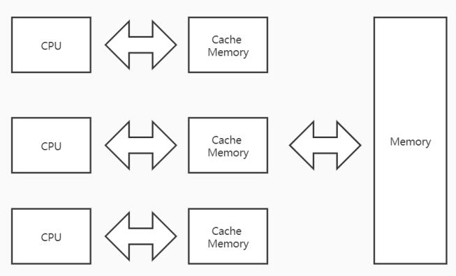

## Volatile

### 前言

先看两个方法， 不同的地方在于volatile的修饰：

```java
  private static boolean isSimpleOver = false;
  private static volatile boolean isVolatileOver = false;

  public static void simpleDemo() throws InterruptedException {
    new Thread(() -> {
      while (!isSimpleOver) {
      }
    }).start();
    TimeUnit.SECONDS.sleep(2);
    isSimpleOver = true;
    System.out.println("isSimpleOver:" + isSimpleOver);
  }

  public static void volatileDemo() throws InterruptedException {
    new Thread(() -> {
      while (!isVolatileOver) {
      }
    }).start();
    TimeUnit.SECONDS.sleep(2);
    isVolatileOver = true;
    System.out.println("isVolatileOver:" + isVolatileOver);
  }
```

对于simpleDemo方法，判断变量isSimpleOver无volatile修饰，2秒后打印以下语句，主线程无法停止：

```text
isSimpleOver:true
```

对于volatileDemo方法，判断变量isVolatileOver有volatile修饰，2秒后打印以下语句，主线程停止：

```text
isVolatileOver:true
```

那这是为什么呢？带着这个疑问，继续往下看。

### 介绍

　Java语言提供了一种稍弱的同步机制，即volatile变量，用来确保将变量的更新操作通知到其他线程。当把变量声明为volatile类型后，编译器与运行时都会注意到这个变量是共享的，因此不会将该变量上的操作与其他内存操作一起重排序。volatile变量不会被缓存在寄存器或者对其他处理器不可见的地方，因此在读取volatile类型的变量时总会返回最新写入的值。

简单来说：线程在试图读取一个volatile变量时，会从主内存区中读取最新的值。

#### 具体作用

- 保证变量的内存可见性

  内存可见性是指当一个线程修改了某个变量的值，新值对于其他线程来说是可以立即得知的。

- 禁止指令重排序

  为了提高性能，在遵守一定的规则下（即不管怎么重排序，单线程下程序的执行结果不能被改变。编译器，Runtime 和处理器都必须遵守）的情况下，编译器和处理器常常会对指令做重排序。
  
  
  
  **补充**：
  
  volatile 只能保证对单次读/写的原子性。例如：i++ 这种操作不能保证原子性，因为i++可拆解为i=i+1，细分为：第一步，计算i + 1 ，第二步，把i+1的结果赋值给i，在执行第二步的时候，可能i的值已经发生了变化。

### 原理

#### 保证变量的内存可见性

##### 为什么

首先，为什么会有内存可见性问题？计算机中CPU和内存是大家所熟知的东西，CPU的速度远大于内存，所以为了提供CPU的利用率，引入了高速缓存。高速缓存的速度通常在CPU和内存之间，弥补着互相的缺点。

如下图，对于每一个CPU，在工作的时候，会将运算时所需要的数据从内存中复制一份到高速缓存中，后续的运算操作仅仅与高速缓存交互，当CPU运算完毕的时候，再将高速缓存的值写回内存中。这样虽然提高了CPU的效率，但是在CPU运算过程中，从内存复制过来的数据可能已经发生了变化，不再是原本复制时候的值，即数据一致性问题，所以我们将此问题归类为内存可见性问题。



补充：

我们在来看下这个问题：i++ 这种操作不能保证原子性。第一步，CPU将i的值从内存中复制一份到高速缓存中，然后计算i+1并赋值给i，最后将i的值写回内存中。当存在多个CPU进行操作的时候，由于每个CPU都要复制i的值到自己的高速缓存中，这样复制的过来的值，可能在计算的时候，i已经被其他CPU重新写完值，但是CPU并不知道，依然使用自己的高速缓存里的值进行运算，那么最终运行的结果一定是错误的。

##### 如何保证内存可见性

###### JAVA转汇编

代码：

```java

```

Java转汇编：

```vb

```

从汇编的结果来看，被Volatile修复的变量在被写操作时，将会多处Lock前缀的指令，Lock指令主要时锁住总线，对于Lock指令有以下作用：

> 总线：

1. 将当前处理器缓存行的数据写回系统内存；
2. 这个写回内存的操作会使得其他CPU里缓存了该内存地址的数据无效

针对第二点，在多处理器下，为了保证各个处理器的缓存是一致的，就会实现**缓存一致性**协议，**每个处理器通过嗅探在总线上传播的数据来检查自己缓存的值是不是过期**了（CPU 总线嗅探机制），当处理器发现自己缓存行对应的内存地址被修改，就会将当前处理器的缓存行设置成无效状态，当处理器对这个数据进行修改操作的时候，会重新从系统内存中把数据读到处理器缓存里，所以以上作用又可以得出以下结论：

1. Lock前缀的指令会引起处理器缓存写回内存；
2. 一个处理器的缓存回写到内存会导致其他处理器的缓存失效；
3. 当处理器发现本地缓存失效后，就会从内存中重读该变量数据，即可以获取当前最新值。

###### Volatile与happens-before


###### Volatile内存语义


### 拓展

#### happens-before原则

**Java内存模型具备一些先天的“有序性”**，即不需要通过任何手段就能够得到保证的有序性，这个通常也称为 **happens-before 原则**。如果两个操作的执行次序无法从happens-before原则推导出来，那么它们就不能保证它们的有序性，虚拟机可以随意地对它们进行重排序。

- **程序次序规则**：一个线程内，按照代码顺序，书写在前面的操作先行发生于书写在后面的操作
- **锁定规则**：一个unLock操作先行发生于后面对同一个锁额lock操作
- **volatile变量规则**：对一个变量的写操作先行发生于后面对这个变量的读操作
- **传递规则**：如果操作A先行发生于操作B，而操作B又先行发生于操作C，则可以得出操作A先行发生于操作C
- 线程启动规则：Thread对象的start()方法先行发生于此线程的每个一个动作
- 线程中断规则：对线程interrupt()方法的调用先行发生于被中断线程的代码检测到中断事件的发生
- 线程终结规则：线程中所有的操作都先行发生于线程的终止检测，我们可以通过Thread.join()方法结束、Thread.isAlive()的返回值手段检测到线程已经终止执行
- 对象终结规则：一个对象的初始化完成先行发生于他的finalize()方法的开始

